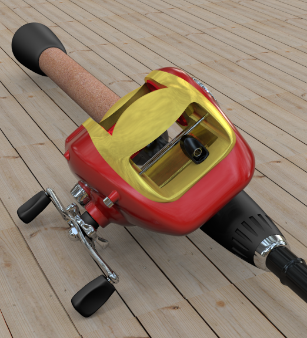

<!-- TODO: Make sure to update this page and get working in the guides section of the documentation. -->

# {{page.title}}
このチュートリアルでは、nXtを使って標準的なRhinoのモデルをレンダリングする方法を紹介します。チュートリアルではnXtを使った下のレンダリングの基本ステップをカバーします。

1. モデルを開く
1. マテリアルを作成する
1. マテリアルを編集する
1. 地平面を追加する

最初のステップはチュートリアルファイルをダウンロードして解凍することです。zipファイルをダウンロードするには、[Fishing Reel.zip](files/nxt5%20fishing.zip)のリンクをクリックしてください。中のファイルをお使いのコンピュータの覚えやすい場所にある専用のフォルダに解凍してください。RhinoでFishing Reel.3dmファイルを開きます。レンダリングドロップダウンメニューでFlamingo nXtが現在のレンダラであることを確認してください。

## 現在のレンダリングエンジンを確認する
{: #check-current}
Rhinoには複数のレンダリングエンジンがインストールされていることがあります。Flamingo nXt 5が現在のレンダリングエンジンであることを確認するには、レンダリングプルダウン > 現在のレンダラでFlamingo nXt 5が選択されているかを確かめてください。Flamingo nXt 5にチェックマークが付いていれば、それが現在のレンダリングエンジンです。

## レンダリングエンジン
{: #render_controls}
{: .float-img-right} まずモデルをレンダリングしてみます。レンダリングボタンをクリックしてください。右側のようなイメージが表示されます。nXtの動作はFlamingoの以前のバージョンと異なります。新規モデルにはデフォルトのHDRI光源が設定されています。新規モデルはすべてのオブジェクトにデフォルトの白のマテリアルを使用します。レンダリングを行うと、最初は影が非常にシャープで直線的です。しかし、パスを重ねるにつれ、影はブレンドされて柔らかみを帯びて行きます。同じく各レンダリングパスで向上していく他の多くの効果もあります。

それぞれのパスで向上される効果には次のものが含まれます。

* 照明（有効な場合、グローバルイルミネーションなど）
* ソフトシャドウ
* 反射（不鮮明な)
* 屈折
* アンチエイリアシング
* 被写界深度

このように、nXtのレンダリングには「終り」がなく、レンダリングをいつ停止するのかを決定するだけになります。レンダリングを続けてイメージをより良くすることも、変更や保存のために好きな時にいつでも停止することもできます。レンダリングは次のようにいろいろな方法で停止することができます。
{: .clear-img}

* 現在のパスの最後でレンダリングを停止したい場合は、レイトレースを停止ボタンをクリックします。
* すぐにレンダリングを停止したい場合は、レイトレースを停止ボタンをダブルクリックします。
* すぐにレンダリングを停止して、レンダリングウィンドを閉じるには、レンダリングウィンドウの右上にある「X」ボタンをクリックします。

## ライブラリからマテリアルを割り当てる
{: #materials}
基本的な照明はnXtで設定されているので、適切なマテリアルを作成するのが通常レンダリングをセットアップするのに最初に一番必要なこととなります。マテリアルはそれぞれのモデルに直接格納されます。一式のマテリアルを作成するには、新規マテリアルを簡単に作成できることを補助するマテリアルテンプレートを用いることができます。

  1. RhinoのFlamingo nXtドロップダウンメニューからFlamingo nXtのコントロールパネルを開きます。
  1. 既存のマテリアルを割り当てるために、コントロールパネルのライブラリタブを開きます。
  1. マテリアルはフォルダで組織化されています。Flamingoマテリアルフォルダを開きます。
  
  1. Flamingoマテリアル > 金属フォルダを開きます。
  {: .wide-img}
  1. クロムマテリアルを「Handle」および「Metal Parts」レイヤにドラッグアンドドロップします。
  1. 結果をレンダリングします。「Handle」と「Metal Parts」レイヤのパーツがクロム仕上げでレンダリングされます。
  
  1. 残りのマテリアルを以下のレイヤに次のように割り当ててください。

 | ライブラリ | マテリアル | レイヤ |
 |:-------|:------|:------|
 | 船舶 | ブラックラバー | Bushing & Washer |
 | 船舶 | ブラックラバー | Grips |
 | 船舶 | ブラックラバー | Rod Grips |
 | カーペイント | カーペイント レッド | External Body |
 | 金属 > ゴールド | ゴールド サテン-プレイン | Internal Body |
 | 金属 > アルミニウム- アルマイト | アルミニウム - アルマイト レッド | Spool |
 | プラスチック > ブラック & ホワイト > スムーズ | プラスチック ブラック - スムーズ | Rod |
 | プラスチック > ブラック & ホワイト > スムーズ | プラスチック ブラック - スムーズ | Rod Handle |
 | プラスチック > ブラック & ホワイト > スムーズ | プラスチック ブラック - スムーズ | Wire Guide |
{: .grided-table}

##### レンダリングして結果を見ます:
 

## 新規マテリアルを作成する
{: #new-material}
ライブラリにないマテリアルが必要になる時もあります。例えば、釣り竿のハンドル部分（グリップ） にコルクのマテリアルを用いたい場合などです。この場合、新規マテリアルを作成する必要があります。コルクマテリアルを作成するために、新規のテクスチャマテリアルタイプを作成します。

 1. マテリアルタブを表示します。
 1. マテリアルリストの一番下までスクロールします。
 1. 新規マテリアルボタン（+）を選択します。
  
 1. 新規Flamingo テクスチャマテリアルを選択します。
 1. テクスチャを選択する画面になります。
 1. チュートリアルファイルを解凍したディレクトリを開き、Cork.jpgを選択して「開く」をクリックします。
 1. これは簡易マテリアルです。ビットマップのサイズが重要になることがよくあります。サイズを変更するには、ビットマップの名前をクリックします。

 1. タイルサイズの幅を100に調整します。

 1. 名前フィールドで、「コルク」とタイプし、「OK」をクリックします。

 1. コルクマテリアルが作成できたら、それを「Cork Handle」レイヤにドラッグして割り当てます。

## 地平面をオンにする
{: #groundplane}
地平面を追加すると、オブジェクトをシーンに設置することができます。

1. 地平面パネルを開きます。地平面タブが表示されていない場合、タブが表示されている部分を右クリックして「地平面」を選択します。
1. 「オン」をクリックして、地平面をアクティブにします。ここでは、デフォルトの地平面高さを使用します。
1. 地平面に割り当てる新規マテリアルを作成します。マテリアルリストの一番下の+アイコンをクリックします。

1. 新規Flamingo テクスチャマテリアルを選択します。
1. テクスチャを選択する画面になります。
1. チュートリアルファイルを解凍したディレクトリを開き、Deckwood.jpgを選択して「開く」をクリックします。
1. これは簡易マテリアルです。ビットマップのサイズが重要になることがよくあります。サイズを変更するには、ビットマップの名前をクリックします。
1. タイルサイズの幅を125に調整します。
1. 名前フィールドで、「床」とタイプし、「OK」をクリックします。
1. レンダリングの結果は次のようになります。

## レンダリングイメージを調整する
{: #image-adjust}
レンダリングの後にレンダリングイメージを調整すると、Flamingoを最大限に活用できます。調整はリアルタイムでイメージを保存前に行えます。多くの場合、少しの焼き込みと明るさを追加するとよい結果になります。

1. レンダリングウィンドウで、Flamingoタブを表示します。
1. 停止アイコンをクリックして、レンダリングが停止されている状態にしてください。
1. 「イメージの調整」で、焼き込みを0.1に変更します。
1. 「イメージの調整」で、明るさを0.1に変更します。

1. 結果は次のようになります。

*白がより明るく（焼き込み）、イメージ全体のも明るく（明るさ）なりました。焼き込みは、よりダイナミックなイメージを作るのに特に効果的です。*

これでチュートリアルは終わりです。お役に立てたことを願っています。
