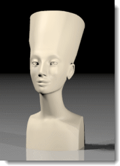

---
---
<!-- TODO: Make sure to update this page and get working in the guides section of the documentation. -->

# スタジオ照明の基礎
{: #studio-lighting-bascis}
スタジオ照明は、写真館での照明のようなセットアップが求められます。照明をよりよく演出するには、光源を使用してシーンを照らすとよいでしょう。

スタジオでのセッティングの照明の際は、印象的な照明を用いることが重要です。コントラストをはっきりさせると、印象的な照明が行えます。つまり、暗いところは明るいところと同様に重要であるということです。印象的な照明には、暗いところと明るいところを作り出すため、いくつかのライトを配置することが必要です。
スタジオ照明の最も基本的なセットアップでは、キーライト（1）、フィルライト（2）、そしてバックライト（3）を使用します。これがスタジオで物や人物を単独で撮影する時に最もよく使われるライトの当て方です。3点照明を使えば初めからよい結果が得られます。後に独特の効果を出すための基本にもなります。スポットライトは方向とホットスポットをコントロールでき、シーンに印象的な効果を与えることができるので便利です。

## カメラの角度
{: #cameraangle}
照明の設定は常に被写体に対するカメラの角度で決まります。カメラの角度を決めることから照明のセットアップを始めていくとよいでしょう。**Camera**または**NamedView**コマンドを使用して、カメラの位置と角度を調整するとよいでしょう。これは、ライトの配置を決めるのに役に立ちます。

## 3つのライトを使った基本的な照明
{: basic-three-light-setup}
基本的なスタジオ照明は、キーライト、フィルライト、そしてバックライトの3つのライトを使用します。

### キーライト
{: #keylight}
キーライトはシーンの主光源です。キーライトでムードが決定される上、方向を与え、立体感と質感を表現し、一番暗い影を作ります。照明の対象にもよりますが、キーライトは普通、オブジェクトの斜め上30度から45度に配置されます。
キーライトがカメラに近くなるにつれて、立体感と質感の効果が弱まります。キーライトはたいていレンズより高い位置にあり、下方に影を投げかけます。キーライトを横へ移動するにつれて、オブジェクトの3次元性が高まります。一般的な人物写真を撮影するセットアップでは、キーライトは対象とカメラの間45度のところに配置され、影を下へ投げかけるようにしますが、対象となる人物の目が影にならない高さに配置されます。
キーライトがソフトなライトであれば、フィルは少しでよく、必要ない場合もあります。小さいスタジオ設定の基本的な照明法の1つでもあります。
キーライトで投げかけられる影は、対象上で見ることができます。顔のイメージで目立つのは鼻が落とす強い影です。

### フィルライト
{: #filllight}
フィルライトはレンズのすぐ上に、キーライトの反対側に置きます。フィルライトの目的は、近くのオブジェクトから反射して来る光を模倣することでコントラストをやわらげ、影の詳細を強調することです。低コントラストの効果を出したい場合、キーライトとフィルライトを同じ強度にしますが、キーライトの方がフィルライトよりより明るくハードであることが普通です。フィルライトはシーンでの補助光源です。このライトがシーンに新たな暗い影を作らないようにするのが大切です。
イメージでは、キーライトのみで作られたイメージと比べて、鼻の左側の影とあごの左側の影が明るくてソフトであることが分かりま す。

### バックライト
{: #backlight}
バックライトの効果は控えめですが、シーンの中のオブジェクトの輪郭を際立たせ、背景から浮き上がらせることで奥行きを感じさせます。バックライトはたいていオブジェクトの後方の上の方に、カメラの方に向けて配置されます。
バックライトの効果は、照らしているサーフェス の反射率にある程度左右されます。
イメージでは、肩の上のライトが対象物を背景から切り離して見せます。バックライトはまた、影を柔らかくし、オブジェクトが置かれているサーフェスを明るくします。

## 光の性質
{: #lightquality}
イメージは、正確な影やハイライト、反射によって作成できますが、適切な照明がなければ、イメージ作成の目的が達成できません。何を実現したいのかをはっきりさせてから照明をセットアップするとよいでしょう。イメージは、はっきり、生き生きと、シンプルであるときれいに見えます。ガラス製品のハイライトや物の影が多すぎるとシーンが必要以上に複雑になり、注目させたいところが目立たなくなってしまうことがあります。
次のいくつか考慮する性質にあげられます:

>シーンのコントラストレンジ
>シーンの奥行き（3次元性）
>オブジェクトと背景との区別
>ハードライトとソフトライト
>ライトの色（暖色か寒色か）

### コントラストレンジ
{: #contrastrange}
コントラストレンジは与えられたシーンの中で、詳細が見える一番明るいところと一番暗いところの差を意味します。人間の目はフィルムよりより幅の広いコントラストレンジを処理でき、コントラストが極端なところでも詳細が見える ように局所的に補正することができます。日当たりのよい日に撮られたスナップ写真を見れば分かるでしょう。
普通、写真ではハイライトがある側は明るすぎ、影のある側が暗すぎますが、目で見る時は明るいところと暗いところの両方で詳細がよく見えているはずです。コントラストレンジの幅は、フィルムには収めきれません。コンピュータが表示できる色の数に制限があるので、レンダリングされたイメージにも同じ問題が見られます。

低いコントラストのイメージは、ハイライトされた、または影の部分で詳細が隠されることを防ぎます。

### 3次元性
{: #three-dimensional}
2次元の空間で3次元を表現するには、奥行きがあるかのような目の錯覚を起こさせなければなりません。横から照らされた不透明なオブジェクトは、明るいハイライトのある側とそれより暗い影のある側があるため、奥行きが示唆されます。3つの側面が見えるボックスの場合、各側面の値が違うと立体感が強くなります。実世界でのライティングでは光は上から来ることが多いので、一番明るいのはたいてい上の平面です。

### 背景との区別をはっきりさせる
{: #separation}
製品がページから飛び出るようにするには、3次元性と、最大に使用されたコントラストレンジの他に、背景との区別をはっきりさせることも忘れてはなりません。つまり、対象の輪郭を背景より目立って明るくするか、暗くすることが必要です。区別がつかなければ、対象のオブジェクトは背景に溶け込んでしまいます。
イメージでは、オブジェクトの上のハイライトはオブジェクトを背景と区別させる役割を果たします。
対象オブジェクトの影は、場合によっては区別をいっそうはっきりさせますが、背景にオブジェクトが溶け込んでしまう感じを作り出すこともあります。バックライトの使用は、対象のオブジェクトの輪郭に明るいエッジを作ることで、区別をはっきりさせるのに役に立ちます。

### ハードライトとソフトライト
{: #hard-soft}
ハード（直射光）とソフト（拡散光）で光の性質を区別することがあります。
ハードライトは、はっきりしたエッジを持つくっきりとした影を投げかけます。

拡散光はソフトで、時には見分けがつかない影を投げかげます。
拡散光はソフトな影が生じるので、ハードな光より拡散光の方が魅力的なイメージを作り出すことが多いでしょう。ライトが大きくなり、対象のオブジェクトに近くなるにつれて、ソフトになります。大きいソフトライトは窓からの光を模倣することができます。

拡散照明は、艶のある黒いオブジェクトの形をはっきりさせる広いハイライトを作るので、黒っぽいプラスティックのオブジェクトに最適です。

スタジオのセッティングの照明の際は、印象的で高コントラストな照明を使用することが重要です。つまり、暗いところは明るいところと同様に重要であるということです。印象的な照明には、暗いところと明るいところを作り出すため、いくつかのライトを配置することが必要です。
レンダリングのための照明テクニックは写真撮影のための照明テクニックと大体同じなので、写真撮影のための照明の本を参考にするとよいでしょう。
Flamingo nXtはモデルの照明をすぐに始められるように前もって設定された[照明スキーム](lighting-tab.html#lighting-presets)を用意しています。[詳細タブ](lighting-advanced-tab.html)の設定は、それぞれの照明方法に合わせて最適化されています。
