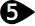

#  {{page.title}}
{: #environment-tab}
環境はレンダリングの背景に表示されるだけではなく、モデルを取り囲む無限の球をコントロールします。シーンのオブジェクトは、環境を反射、そして屈折させます。この環境の球は、背景効果のための参照サーフェスであり、選択できるオブジェクトではありません。

環境は、反射や背景の目に見える部分に影響します。シーンの照明に影響する効果については、[空](sun-and-sky.html)のヘルプトピックを参照してください。

Flamingoには、*[デフォルトFlamingo環境](environment.html)*と呼ばれる特別な環境が用意されています。この環境は、現在の[照明プリセット](lighting-tab.html)に同期されます。[照明プリセット](lighting-tab.html)を使用することで、照明と環境が適切なシーンのデフォルトに設定されます。

{:  #panel_map height="600px" style="float: right"}

##### コマンドの位置
 1. 環境タブ
 1. レンダリングツールツールバー >  環境エディタ
 1. メニュー > レンダリングプルダウン > 環境エディタ
 1. コマンド > EnvironmentEditor

環境エディタパネルは、個別のセクションに分かれています。環境のタイプに応じて、詳細設定パネルは異なることがあります。

色やテクスチャは色見本からドラッグして、どのような他の色見本、またはマテリアルエディタ、[テクスチャパレット](texturepalette.html)、または[環境エディタ](environmenteditor.html)にもドロップすることができます。
環境パネル

 1. [背景のタイプ](#type)
 1. [設定バー](#settings)
 1. [環境のリスト](#environment_list)
 1. [ウィンドウ区切り線](#divider)
 1. [環境のプロパティセクション](#properties)
 1. [名前](#name)
 1. [環境のプロパティパネル](#panels)

## [背景のタイプ](#panel_map) 
{: #type style="clear: both;"}
モデルの背景のタイプを選択します。「[環境](#flamingo-environment)」はすべてを含んだレンダリング環境で、Flamingoのデフォルト設定です。他の3つの設定は、古い形式の背景の定義方法で、「環境」に比べて非常にシンプルな設定コントロールが表示されます。詳細については、[Rhinocerosのシンプルな背景](http://docs.mcneel.com/rhino/5/help/ja-jp/commands/environmenteditor.htm#Basic_settings)のトピックを参照してください。

残りのこのヘルプトピックは、環境のタイプについて説明します。

## [設定バー](#panel_map) 
{: #settings}
このバーを使用して、環境のリストを順番に表示します。

####  戻る矢印
現在の環境または以前に選択された環境に戻ります。例えば、反射または屈折の層のある環境です。反射または屈折の詳細設定から親環境に戻るのにこの矢印を使用してください。

####   進む矢印
以前に選択された環境から戻ります。例えば、反射または屈折の層のある環境です。反射または屈折の詳細設定から親環境に進むのにこの矢印を使用してください。

####  現在選択されている環境名
現在の環境名と編集レベルを表示します。例えば、反射または屈折レベルがある場合、「>」が表示されます。現在の環境を確認できる場所です。

####  ツールメニュー
[ツールメニュー](#tools_menu)を表示します。環境に関するコマンド、設定、ユーティリティの包括的なメニューです。

####  ヘルプ

## [環境リスト](#panel_map) 
{: #environment_list}
ここにはモデルに含まれるすべての環境が表示されます。1つの環境が現在の環境として選択されます。現在の環境はレンダリングに使用されます。現在の環境には、黄色の枠が表示されます。

リストを使って次のことが行えます。

* 環境をクリックして、現在の環境に設定できます。選択されると、環境のプロパティが下のパネルに表示されます。詳細については、[環境のプロパティ](#properties)を参照してください。
* リストを上下にスクロールして、モデルのすべての環境を見ることができます。
* 新規環境追加ボタン  を使用して、リストの一番最後に新規環境を追加することができます。
* サムネイルを右クリックすると、環境のコンテクストメニューを表示することができます。
* 何も表示されていない部分を右クリックすると、新規環境のコンテクストメニューを表示することができます。

###   新規環境を追加ボタン
{: #add_environment}
追加アイコンは、環境リストを一番下までスクロールしたところに表示されます。

環境のレンダリングコンテクスト[ライブラリ](libraries.html)を開きます。
ライブラリの環境は、モデルの環境を作成するためのテンプレートしての役割をします。

### 環境のコンテクストメニュー
{: environment_context}
このメニューは、環境リストを右クリックすると表示されます。このメニューに表示される多くのオプションの詳細については、[ツールメニュー](#tools_menu)を参照してください。

### 新規環境のコンテクストメニュー
{: new_envrionment_context}
このメニューは、環境リストの何も表示されていない部分を右クリックすると表示されます。

####  新規環境を作成
新規Flamingo環境を作成します。

####  環境をファイルからインポート...
このコマンドは、以前にエクスポートした環境を選択するのに使用します。

####  ペースト
クリップボードの内容に基づいて新規環境を作成します。

####  インスタンスとしてペースト
クリップボードの内容に基づいて、インスタンシングによって元の環境にリンクされている新規環境を作成します。

####  グリッド
プレビューをサムネイルのグリッドとして表示します。

####  一覧
プレビューをサムネイルの一覧として表示します。

####  ツリー
プレビューをツリー表示します。（ネストを表示します。）

####  水平レイアウト
プレビューをコントロールの左側に表示します。

####  プレビューペインを表示
現在選択されているサムネイルのプレビューのプロパティを表示します。プレビューの形状、サイズ、背景、回転動作を設定します。

####  フロート
サイズ変更できるウィンドウにプレビューイメージをフロートします。

#### サムネイル

#####  小
サムネイルを一番小さいサイズで表示します。

#####  中
サムネイルを一番中ぐらいのサイズで表示します。

#####  大
サムネイルを一番大きいサイズで表示します。

#####  ラベルを表示
グリッドモードの際にサムネイル名のラベルを表示します。
ラベルはリストモードでは常に表示されます。

#####  単位を表示
モデル単位でサイズを表示します。

#####  プレビューを自動更新
設定を変更するとすべてのプレビューを自動的に更新します。

#####  すべてのプレビューを更新
プレビューを自動更新がオフの場合に、プレビューを手動で更新します。

## [ウィンドウ区切り線](#panel_map) 
{: #divider}
区切り線をドラッグして環境のプロパティのセクションの長さに対する環境リストの長さを変更します。

## [環境のプロパティセクション](#panel_map) 
{: #properties}

### [環境名](#panel_map) 
{: #name}
環境の名前です。環境名は、環境をライブラリにエクスポートする際にファイル名としても保存されます。 **メモ:** 環境はRhinoのモデルに保存されます。それぞれの環境は異なるRhinoのモデルで同じ名前を持つことができます。

### [環境パネル](l#panel_map) 
{: #panels}
環境のプロパティセクションには、多くの環境指示パネルが表示されます。グレーのタイトルバーをクリックすると、環境パネルを折りたたんで内容を隠すことができます。タイトルバーを再度クリックすると、内容が表示されます。

環境パネルは、環境のタイプによって、そして現在のアクティブな環境レベルによって異なります。それぞれの環境パネルの詳細については、[Flamingoの環境](environment.html)を参照してください。

## ツールメニュー 
{: #tools_menu}
これらの設定は、サムネイルプレビューやサムネイル背景の右クリックコンテクストメニューにも表示されます。

####  現在の環境として設定
ターゲットの環境を現在の環境に設定します。現在の環境は、次回のレンダリングで使用されます。

####  新規環境を作成
新規Flamingo環境を作成します。
<!-- This comes from the page http://docs.mcneel.com/rhino/5/help/en-us/popup_moreinformation/materialthumbnail_contextmenu.htm -->
これらの設定は、サムネイルプレビューやサムネイル背景の右クリックコンテクストメニューにも表示されます。

####  環境をファイルからインポート
保存されているRhinoの.renvファイルから環境をインポートします。

####  ファイルに保存
環境をRhinoの.renvファイルに保存します。

####  タイプを変更
環境を異なるタイプに変更します。

####  タイプを変更 (類似の設定をコピー)
環境を異なるタイプに変更します。
デフォルトの動作は、[レンダリングのオプション](http://docs.mcneel.com/rhino/5/help/ja-jp/options/rendering.htm) >  [コンテンツのタイプが変更された際に類似の設定をコピー](http://docs.mcneel.com/rhino/5/help/ja-jp/options/rendering.htm#Copy_similar_settings_when_content_type_is_changed)ボックスの現在の状態に依存します。チェックマークが付いている場合、古いコンテンツからの互換性のある設定が新しいコンテンツにコピーされます。

####  デフォルトにリセット
すべての環境の設定をデフォルトの指定色の背景（黒）、反射背景を空、屈折背景を表示背景にします。

####  コピー
選択された環境をWindowsのクリップボードコピーします。その後、クリップボードの内容をエディタにペーストして新規環境を作成したり、直接フォルダにペーストして[ライブラリ](libraries.html)ファイルを作成することができます。

####  ペースト
クリップボードの内容に基づいて新規環境を作成します。

####  インスタンスとしてペースト
クリップボードの内容に基づいて、インスタンシングによって元の環境にリンクされている新規環境を作成します。

####  削除
選択された環境を削除します。

####  名前を変更...
選択された環境の名前を変更します。

####  複製
選択された環境を同じ設定でコピーし、新規環境を作成します。

####  インスタンシングを取り除く
[インスタンスされた](#paste-as-instance)環境間の接続を取り除きます。



####  コンテンツフィルタ
[コンテンツフィルタ](content_filters.html)ダイアログボックスを開きます。

####  プロパティ
[プレビューのプロパティ](previewproperties.html)ダイアログボックスを開きます。
