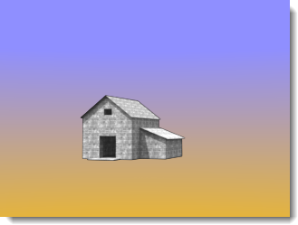
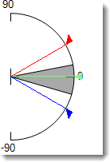
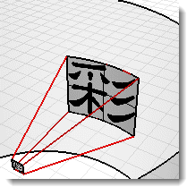

#  {{page.title}}
[Rhinoには多くのタイプの環境](http://docs.mcneel.com/rhino/5/help/en-us/commands/environmenteditor.htm)があります。このトピックでは、Flamingo環境タイプについて説明します。

環境は、背景や反射の目に見える部分に影響します。シーンの照明に影響する効果については、[空](sun-and-sky-tabs.html)のヘルプトピックを参照してください。

Flamingoには、**デフォルトFlamingo環境**と呼ばれる特別な環境が用意されています。この環境は、現在の[照明プリセット](lighting-tab.html)に同期されます。[照明プリセット](lighting-tab.html)を使用することで、照明と環境が適切なシーンのデフォルトに設定されます。

Flamingoの環境のすべてのプロパティグループは次のとおりです。

> [名前](#name)
> [Flamingo環境](#environment)
> [背景色](#color-backgrounds)
> [高度な背景設定](#advanced-background-reflected-sky)

## 環境名
{: #name}
Rhinoのモデルにある環境の名前です。環境はRhinoのモデルに格納されます。これは、ライブラリや異なるモデルの同じ名前は現在のモデルの環境の編集によって影響されないということを意味します。他のモデルの環境を使用する場合、その環境はまず[ライブラリ](libraries.html)にエクスポートする必要があります。環境名は、それをエクスポートする際のファイル名にも使用されます。

## Flamingo環境
{: #environment}
レンダリングには、3つの主な環境効果があります。

>表示背景
>[反射背景](#advanced-background-reflected-sky)
>[屈折背景](#advanced-background-refracted-sky)

表示背景は、シーンの基本背景色です。表示背景は、一般のプロパティパネルで設定します。[反射](#advanced-background-reflected-sky)および[屈折](#advanced-background-refracted-sky)背景は、異なる設定ができ、高度な背景設定のセクションに表示されます。

#### 強度
{: #background-intensity}
背景の相対的な明るさを調整します。強度の値は、背景の色を乗算し、結果を照明値にするために使用されます。色の範囲はチャンネル毎に0 - 255です。強度は、これらの値を乗算します。これは、背景がレンダリングされたモデルに比べて非常に暗い場合に、重要になります。

#### 背景のタイプ
{: #background-type}
レンダリングイメージの背景を埋める色のスキームを指定します。背景は次のタイプから選択することができます。

> [空](#environment-sky)
> [色（単色）またはグラデーション色](#color-backgrounds)
> [画像](#environment-image)
> [HDRまたは平面HDR画像](#hdr-background)

## 空背景
{: #environment-sky}
環境の空は、[照明](lighting-tab.html)タブの太陽と空の設定を使用します。これはレンダリングで空を表示するためのレンダリングのデフォルト設定です。

*自動（左）、HDR画像と太陽（右）*

## 色背景
{: #color-backgrounds}
背景色のコントロールは常に存在します。色が画像、HDRi、または空背景で隠されていたとしても色背景は常に存在します。

#### 指定色
{: #solid-color}
1つの色で背景に色を付けます。

*指定色背景*
指定色の編集の詳細については、下の[色のコントロール](#enviroment-sky-color-controls)を参照してください。

#### 2色グラデーション
{: #two-color-gradient}
2および3色グラデーション背景は、パースビューのみに適用されます。選択した2つの色の間で背景色を補間します。

*2色グラデーション背景: 青と黄色*
2色グラデーションの編集の詳細については、下の[色のコントロール](#enviroment-sky-color-controls)を参照してください。

#### 3色グラデーション
{: #three-color-gradient}
選択した3つの色の間で背景色を補間します。

*3色グラデーション背景: 青、白、黄色*
3色グラデーションの編集の詳細については、下の[色のコントロール](#enviroment-sky-color-controls)を参照してください。

### 色のコントロール
{: #enviroment-sky-color-controls}
使用できるコントロールの数は、現在選択されている色背景のタイプによって変わることがあります。グラデーション背景は、最大で3色のカラーセレクタ（上、中、下）が表示されます。



#### 色を入れ替え
グラデーションの色の上と下を入れ替える場合に、このボタンを使用します。

#### グラデーションマッピングのコントロール
{: #gradient-mapping}
グラデーション色背景の色は、環境の球体にマッピングする必要があります。これを行うのに、グラデーションマッパーを使用します。グラデーションマッピングコントロールは、2または3色グラデーションが選択された時のみアクティブになります。グラデーションはパースビューのみにマッピングされます。

#### ビューからの角度
{: #angle-from-views}
ビューからの角度にチェックマークが付いていると、現在の色グラデーションは現在のレンダリングされたパースビューと同期化します。一番上の色はビューの一番上にマッピングされ、一番下の色はビューの一番下にマッピングされます。その他の色は、一番上と下の間で均等に配分されます。

#### ビュー高度マッパー
{: #colorrange}
現在のビューポートが遠近法投影の場合、上と下の色、ビューに対してのグラデーションの範囲を指定することができます。

{: style="float: left; padding-right: 25px;padding-bottom: 15px;padding-top:15px;"}

* コントロールは、断面図での環境を表示します。90度の印はZが上の座標です。0座標は水平の地平面を表します。-90度の印はZが下の座標です。
* グレーの視野を表す円錐形は、現在のパースビューの1つ前の座標を表示します。
* 赤の矢印は、一番上の色の位置を表します。この角度、そしてその上は一番上の色が表示されます。
* 緑の両方向矢印は、一番上と下の間のグラデーションブレンドの中央を表します。3色グラデーションの場合、これは中央の色の位置も表します。
* 青い矢印は、一番下の色の位置を表します。この角度より下は一番下の色のみが表示されます。

####  ビューから角度を取得ボタン
このボタンを使用すると、グラデーションマッピングコントロールが現在のパースビュー座標にリセットされます。

#### 上/中/下角度
現在のグラデーションの上、中、下の色の計測値です。ビュー高度マッパーの赤、緑、青の矢印の位置に対応します。

## 画像背景
{: #environment-image}

画像が背景に投影されます。これは多くの場合、既存のコンテクストにモデルを配置したり、窓に景色を設定するのに使用されます。画像には写真や芸術作品のスキャン、ペイントプログラムで作成した画像などが使用できます。最良の結果を得るには、高解像度のイメージを背景画像として使用するとよいでしょう。また、自然の焦点整合と空気遠近法を擬似するために、シャープな画像をぼかしたりあせた色にしたりするとよいでしょう。背景画像は平面、円柱、または球状投影でシーンの背景にマッピングできます。

*背景として設定された平面画像*

### 画像ファイル
{: #image-properties}
背景画像を設定するには、*(なし - クリックして割り当て)*と表示されている大きなボタンをクリックし、ビットマップを選択します。異なる画像を割り当てるには、ボタンサムネイル画像をクリックします。

### 投影
{: #backgroud-image-projection}
ドロップダウンコントロールを使用して、3つの画像投影方法から1つを選択します。

>[平面](#planar)
>[円柱](#cylindrical)
>[球](#spherical)

それぞれの投影方法には、異なる画像配置コントロールが表示されます。

### 平面投影
{: #planar}
画像を現在のビューの平らな背景に投影します。平面投影座標は常に現在のビューに相対です。

#### ビューからの角度
ビューからの角度チェックボックスにチェックマークを付けると、常に画像が現在のビューと同期化します。画像は現在のビューに合うように引き伸ばされます。

#### 画像配置コントロール
配置コントロールを使用すると、画像を現在のビューに対して配置することができます。ビューポートの形が濃いグレーの長方形として表示されます。ピンクの長方形をドラッグするか、数値コントロールを使用してビューに対して背景画像を移動したり、サイズ変更したりします。

*現在のビューポート領域 (1)、画像サイズと形状 (2)*

#### Xスケール / Yスケール
背景画像のサイズをビューの幅と高さの0 - 1.0のスケールで指定します。例えば、1.0はビューサイズの100%、0.5はビューの幅の50%などです。

#### Xオフセット / Yオフセット
背景画像のビューポートの左下の角からのオフセットをビューの幅と高さの0 - 1.0のスケールで指定します。例えば、0.25はビューサイズの25%のオフセット、0.5はビューの幅の50%などです。

#### 画像配置コントロール
配置コントロールを使用すると、画像を現在のビューに対して配置することができます。ビューポートの形が濃いグレーの長方形として表示されます。ピンクの長方形をドラッグするか、数値コントロールを使用してビューに対して背景画像を移動したり、サイズ変更したりします。

*現在のビューポート領域 (1)、画像サイズと形状 (2)*

#### Xスケール / Yスケール
背景画像のサイズをビューの幅と高さの0 - 1.0のスケールで指定します。例えば、1.0はビューサイズの100%、0.5はビューの幅の50%などです。

#### Xオフセット / Yオフセット
背景画像のビューポートの左下の角からのオフセットをビューの幅と高さの0 - 1.0のスケールで指定します。例えば、0.25はビューサイズの25%のオフセット、0.5はビューの幅の50%などです。

### 円柱投影
{: #cylindrical}
円柱投影は、モデルを囲む仮想的な円柱に画像をマッピングします。この投影法では真の円柱状の画像が最適ですが、写真から作成された標準のパノラマも効果的に使えます。

画像マップのサイズと位置は高さと幅の角度で設定します。画像の位置とサイズをグラフィカルツールとマウスを用いて設定してください。現在視野に入る領域（視野を表す円錐形）が角度グラフィックコントロールにライトグレーの領域として表示されます。

#### ビューからの角度
ビューからの角度チェックボックスにチェックマークを付けると、常に画像が現在のビューと同期化します。画像は現在のビューに合うように引き伸ばされます。

#### 平面図コントロール
画像マップの角度幅を指定します。角度を入力するか、コントロールウィジェットの「旗」をドラッグして幅を設定します。青い領域は角度幅の範囲を示します。

{: .float-img-left}

* コントロールは、環境を平面図で表示します。
* 濃いグレーの視野を表す円錐形は、現在のパースビューでの1つ前の座標を表示します。
* 青い円錐形は、画像が見える角度の範囲を表示します。
* 青い矢印は、画像マップの左座標を表します。
* 赤い点は、背景画像の中央を表します。
* 紫の矢印は、画像マップの右座標を表します。

#### 縦方向コントロール
{: .clear-img}
円柱投影の縦方向の範囲を指定します。角度を入力するか、コントロールウィジェットの「旗」をドラッグして上下の角度を設定します。円柱投影は水平線の上下45度の範囲内に限られます。

{: .float-img-left}

* コントロールは、円柱を断面図で表示します。
* グレーの視野を表す円錐形は、現在のパースビューでの1つ前の座標を表示します。
* 青い矢印は、画像マップの下の境界を表します。
* 赤い矢印は、画像マップの上の境界を表します。

#### 回転
{: .clear-img}
画像の回転を指定します。赤い点は画像の中心を示します。

#### 幅
画像の幅を平面図に対する度で指定します。

#### 上/下
画像の垂直角度をモデルの水平の地平面の方向に基づいて指定します。

####  ビューから角度を取得ボタン
現在のパースビューポートに合うように回転角度を設定します。投影の値をリセットするのに便利です。

### 球投影
{: #spherical}
球投影は画像を完全な球にマッピングします。一般的に、正距円筒図法の球体画像が使用されないとこの方法でよい結果は得られません。正距円筒図法の画像の縦横比は2:1の長方形です。

#### ビューからの角度
ビューからの角度チェックボックスにチェックマークを付けると、常に画像が現在のビューと同期化します。画像は現在のビューに合うように引き伸ばされます。

#### 球コントロール
画像マップの方向を指定します。角度を入力するか、コントロールウィジェットの「旗」をドラッグして幅を設定します。赤い点は、背景イメージの中央を表します。

#### 回転
{: .clear-img}
画像の回転を指定します。赤い点は画像の中心を示します。

####  ビューから角度を取得ボタン
現在のパースビューポートに合うように回転角度を設定します。投影の値をリセットするのに便利です。

## HDRi背景
{: #hdr-background}
HDR画像を環境として用いると、背景の光と画像の中のその他の光の関係がよりコントロールしやすくなります。これは特に窓から見えている明るい屋外空間がある屋内空間を描写している際に便利です。HDR環境画像には通常のビットマップ画像よりもより広い範囲の光があり、チャンネルを割り当てることができるので、[マルチチャンネル](lights-tab.html#channel)レンダリングでコントラストを調整することができます。

#### 画像ファイル
{: #hdri-image}
背景HDRi画像を設定するには、*(なし - クリックして割り当て)*と表示されている大きなボタンをクリックし、ビットマップを選択します。異なる画像を割り当てるには、ボタンサムネイル画像をクリックします。






## 平面HDRiオプション
{: #planar-hdr-options}

平面ハイ・ダイナミック・レンジ・イメージは、めったに使用されませんが、非常に便利な場合があります。また、HDRiはより広い範囲の色の可能性を提供します。平面HDRiは、背景が明るすぎる、または暗すぎる建築レンダリングで窓の外に使用できます。平面HDRiは常に平面状にマッピングされます。

*背景画像（左）と平面HDR（右）による背景の明暗の差*

#### 画像ファイル
{: #hdri-planar-image}
背景HDRI画像を設定するには、*(なし - クリックして割り当て)*と表示されている大きなボタンをクリックし、ビットマップを選択します。異なる画像を割り当てるには、ボタンサムネイル画像をクリックします。



## 高度な背景設定
{: #advanced-background}
高度な背景設定は、レンダリングでは見えない、しかし、オブジェクトの反射や屈折で表示される環境をコントロールします。表示背景は変わりませんが、反射や屈折を異なる環境に反応させることが可能です。例えば、下のイメージでは、背景は黒ですが、映っている（反射）環境は建物のインテリアのHDR画像です。

*通常の環境（左）、HDRの空の環境が映っている（反射）状態（左）*

### 反射
{: #advanced-background-reflected-sky}
反射環境はレンダリングイメージには表示されませんが、光沢のあるオブジェクトでの反射に表示されます。

#### 空
オブジェクトは[照明: 太陽と空](sun-and-sky-tabs.html)設定で指定されている空を反射します。

#### カスタム
オブジェクトは[色またはグラデーション](#color-backgrounds)、[画像](#environment-image)、または[HDR](#hdr-background)背景を反射します。

#### 表示背景
オブジェクトは[環境](environment-tab.html)設定で指定されている表示背景を反射します。

### 屈折
{: #advanced-background-refracted-sky}

#### 空
オブジェクトは[照明: 太陽と空](sun-and-sky-tabs.html)設定で指定されている空を屈折します。

#### カスタム
オブジェクトは[色またはグラデーション](#color-and-gradient-backgrounds)、[画像](#image)、または[HDR](#hdr-background)背景を屈折します。

#### 表示背景
オブジェクトは[環境](environment-tab.html)設定で指定されている表示背景を屈折します。

#### 透明アルファオブジェクトなし
{: #no-transparent-alpha-objects}
透明なオブジェクトからアルファチャンネルが見えることを防ぎ、透明なオブジェクトからアルファチャンネルが合成されることを防ぎます。
画像がアルファチャンネルに貼り付けられる場合は、この設定をオフにします。
