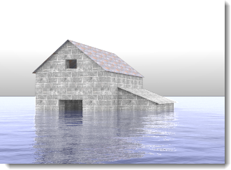

# {{page.title}}
{: #ground-plane}

地平面は、指定する高度で、水平方向のあらゆる方角に伸びて、画像を配置する無限に広い台のような役割をします。土台に大きな平面サーフェスを使用するより、地平面を使用した方がレンダリングの速度がずっと速くなります。

### オン
{: #groundplane-enabled}
地平面をオンにします。

*地平面オフ（左）、地平面オン（右）*

### アルファ
{: #groundplane-alpha}
透明アルファチャンネルを地平面に適用し、影のある画像を別の画像と合成できるようにします。[Wikipediaの記事: Alpha compositing](http://en.wikipedia.org/wiki/Alpha_compositing)を参照してください。

 *イメージで地平面が影を表示（それ以外は透明）*

### 高度
{: #groundplane-elevation}
0を基準に地平面の高さを指定します。

*0より上の高度の地平面*

### マテリアル
{: #groundplane-material}
[マテリアル](simple-material-properties.html)を地平面に割り当てます。

*高度を上げて水のマテリアルを用いた地平面*
