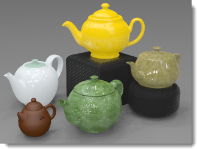

#  {{page.title}}
イメージを作成するに当たって、一番大切でありながら、重要視されていないのが照明です。照明は単にモデルに光を当てる手段というだけではありません。 照明はムードを決め、全体の構成を左右する重要な鍵でもあります。

*イメージ: Christopher Soto Gutiérrez*

#### Flamingo照明コントロールの位置

* メニュー > Flamingo nXt 5.0プルダウン > コントロールパネルを表示 > Flamingo nXt
* 任意のタブを右クリックしてFlamingo nXtにチェックマークを付ける

モデルの照明を行う際は、次の点に気をつけてください。

* 照明プリセットから開始してください。
* Flamingo nXtは実世界の照明をシミュレートするので、できるだけ正確な情報を設定してください。
* 光源を現実的ではない強さに設定することを避けてください。
* モデルに単位を正しく設定してください。単位が正しくないと、照明も正確にはなりません。モデルがミリメートルを用いている場合は、モデル単位をミリメートルに設定してください。
* レンダリングの全体の明るさを調整するには、レンダリング表示の[明るさ](render-window.html#brightness)コントロールを使用してください。すべての光源の強度を変更することでシーン全体の明るさを調整するのは避けてください。自動[露出](render-window.html#brightness)調整がこれを無効化してしまいます。

照明テクニックを向上するためには、光源に気を配り、それがいろいろなサーフェスにどのような影響を与えるかを注意する必要があります。マテリアルは影や反射の効果の一部を隠すことがあります。そのため、レンダリングのエキスパートの中にはマテリアルを適用する前にモデルに照明を適用する人もいます。カメラのような客観的な目で光を確認するようにしてください。

## 照明プリセット
{: #lighting-presets}
照明の設定は、実世界の照明の設定に対応する照明プリセットを用いると便利です。Flamingo nXtはモデルの照明をすぐに始められるような照明プリセットを備えています。照明のオプションは自由に設定できますが、プリセットを使えば多くの異なるレンダリングを簡単に設定できます。シーンに一番似ているプリセットスキームを選択してください。

Flamingo nXtの照明は、4つのプリセットの方法のカテゴリを使用します。

> [スタジオ照明](lighting-tab.html#studio-lighting)
> [屋外昼光](lighting-tab.html#exterior-daylight)
> [屋内昼光](lighting-tab.html#interior-daylight)
> [人工照明](lighting-tab.html#artificial-lighting)

### スタジオ照明
{: #studio-lighting}
このスキームは、写真館（フォトスタジオ）で用いられるような照明を模倣します。スタジオ照明は小さいまたは中くらいのサイズの単体のオブジェクトのレンダリングに最も便利です。スタジオ照明はまた、HDRi環境を通してきれいに照らされるどのようなシーンにも使用できます。

{: .float-img-left} 主な照明は、ハイ・ダイナミック・レンジ（HDR）画像ファイルによってもたらされます。HDR画像からの光は、スタジオの屋内照明と同じようなレベルに似ています。HDRの設定は、[空タブ](sun-and-sky-tabs.html#sky)にあります。光源タブを用いて人工の光をシーンに追加することもできます。スタジオプリセットに表示される背景は黒です。

スタジオ照明は、ジュエリーやプロダクトデザインなどの小さい品物の卓上設定に最適化されています。プリセットスキームでは、太陽はオフで、光沢のあるオブジェクトの反射にHDR画像の空が用いられます。

照明をよりよく演出するには、光源を用いてシーンを照らすとよいでしょう。スタジオでのセッティングの照明の際は、印象的な照明を用いることが重要です。コントラストをはっきりさせると、印象的な照明が行えます。つまり、暗いところは明るいところと同様に重要であるということです。印象的な照明には、暗いところと明るいところを作り出すため、いくつかのライトを配置することが必要です。

レンダリングのための照明テクニックは写真撮影のための照明テクニックと大体同じなので、写真撮影のための照明の本から勉強し始めるとよいでしょう。スタジオ照明を設定する詳しい情報については、 [スタジオ照明の基礎](../guides/studio-lighting-basics.html)を参照してください。

### 屋外昼光
{: #exterior-daylight .clear-img}
このスキームは、自然の太陽および空を用いて建築物の屋外の昼光を模倣します。

{: .float-img-right} 設定は[太陽](sun-and-sky-tabs.html#sun)と[空](sun-and-sky-tabs.html#sky)のタブで指定します。[太陽の角度](sun-and-sky-tabs.html#set-azimuth-and-altitude)を直接指定するか、[地理的な位置](sun-and-sky-tabs.html#set-location-on-earth)と日付および時刻を使用します。このプリセットのデフォルトの表示背景はシミュレートされた空です。

建物の外の照明は、最も簡単なモデル照明です。 ほとんどの屋外照明は、デフォルトの[太陽](sun-and-sky-tabs.html#sun)光源で十分です。

[太陽](sun-and-sky-tabs.html#sun)がオンの場合、シーンを[屋内](#interior)または[屋外](#exterior)に指定しなければいけません。これは、天空光、地面からの反射光、そして他のサーフェスから反射して来る光の貢献度が屋内と屋外では異なるからです。[屋内/屋外](#indirect)の設定を正しく使うことは、非常に効果的なリアルな照明につながります。

シーンが屋内であるか屋外であるかを決定するのは簡単な場合があります。 視点が建物の外であれば、それは屋外のシーンです。 視点が建物の中であれば、それは屋内のシーンです。 しかし、シーンが屋内か屋外かを決めるのは難しい場合があります。 中庭、ガゼボ（あずまや）、分解図、断面図がこれに当たります。 中庭が高さよりも地面部分が広く、天空光を多く取り入れる場合は、屋外シーンとして照明を設定してみてください地面部分よりも高さが高い場合は、屋内としてシーンを照明してみてください この場合、技として、昼光ポータルを中庭の上の部分に追加し、シーンに天空光を入れるようにするとよいでしょう。

光源は、景色の照明もシミュレートすることができます。 建築物のフィーチャや木などをハイライトするには、スポット光源を使用するとよいでしょう。 これは、夜や夕暮れのシーンに向いています。 日中は、戸外のシーンでは実際の世界と同じく、太陽がどのような人工の照明よりも力が勝ります。

分解図、断面図、上からの不等角投影図も、屋外か屋内かを決めるのが困難です。 この場合、どのような結果を得たいのかを基準に決めるとよいでしょう。 屋外シーンの高速なレンダリングには、屋外のレンダリング方法を取ります。 この方法で希望するような効果を得られない場合、屋内レンダリングを試してみてください。 この方法では、屋内によい効果が出ることがありますが、照明の設定により時間がかかります。

### 屋内昼光
{: #interior-daylight .clear-img}
このスキームは、自然の光によって照らされた屋内シミュレートします。

{: .float-img-left} 昼光照明には2つの要素があります。 [太陽](sun-and-sky-tabs.html#sun)から直接放射される太陽光と、[空](sun-and-sky-tabs.html#sky)や地面やその他屋外のオブジェクトから発される間接太陽光です。

[太陽](sun-and-sky-tabs.html#sun)と[空](sun-and-sky-tabs.html#sky)の設定は、[屋外](lighting-tab.html#exterior-daylight)プリセットと似ています。
昼光照明の直接太陽光要素の計算はあまり複雑ではなく、たいていの場合、太陽をオンにして、日付と時刻と場所だけ設定すれば、正確な結果が期待できます。

屋内レンダリングに関するメモ:
{: .clear-img}

* [光源](lights-tab.html)、[空の設定](sun-and-sky-tabs.html#sky)窓ガラスのマテリアルにはできるだけ正確な値を使用してください。
* 太陽や空は他の光源よりも明るいので、太陽がオンの場合人工照明を追加してもあまり効果は見られないでしょう。これは通常のことです。光源の強度を人為的に上げることは避けてください。
* [太陽](sun-and-sky-tabs.html#sun-intensity)または[空](sun-and-sky-tabs.html#sky-intensity)の設定は澄んだ空を模倣するので、これらの強度を下げると曇ったまたは暗めの昼の光をシミュレートすることができます。
* [マルチチャンネル](lights-tab.html#channel)レンダリングを行うと、正確なデータを維持したまま希望するイメージになることがあります。

### 人工照明
{: #artificial-lighting}
{: style="float: right; padding-left: 25px;"} このスキームは、夜の照明器具によって照らされた建築物の屋内をシミュレートします。モデルに光源オブジェクトを挿入する、または管理するには、[光源タブ](lights-tab.html)または[Rhinoの光源のコマンド](lights-tab.html#rhino-light-commands)を使用してください。

間接光（サーフェスからの反射による光）は、2つの屋内プリセットのうちの1つが選択されている場合はオンに、スタジオまたは屋外プリセットが選択されている場合はオフになります。このタイプの照明は、屋内シミュレーションには重要な要素です。屋外そしてスタジオのモデルには、間接照明の効果はほとんど見られません。よって、間接光はデフォルトではオフに設定されています。

### カスタム照明
{: #custom  style="clear:both;"}
カスタムタブでは、照明設定を組み合わせて、照明をカスタム化することができます。例えば、シーンが屋外昼光で、HDRi環境照明も用いたい場合、カスタムタブを使用して照明モデルの部分、部分でオン、オフを設定できます。プリセットの値をデフォルトから変更すると、スキームはカスタムスキームに変更されます。

####  [太陽](sun-and-sky-tabs.html#sun)
{: #sun}
ドロップダウンで太陽タブをオン、オフにできます。[太陽タブ](sun-and-sky-tabs.html#sun)には、太陽の位置のパラメータを変更できるコントロールが含まれています。

*太陽がオンとオフの状態*
太陽は、モデルから無限に離れた非常に明るい平行光源です。太陽のコントロールは、その方向を球座標を用いて指定します。詳細については、[太陽タブ](sun-and-sky-tabs.html#sun)のトピックを参照してください。

####  [空](sun-and-sky-tabs.html#sky)
{: #sky}
空のチャンネルは、下の4つのオプションの1つに設定します。

> 自動
> HDRI
> 色
> 画像

詳細については、[空タブ](sun-and-sky-tabs.html#sky)のトピックを参照してください。
モデルから無限に離れた半球の光源を定義します。

#### オフ
{: #off}
空をオフにします。

#### 自動
{: #auto}
実際の世界の空の状態に基づいて分析モデルを供給します。[太陽](sun-and-sky-tabs.html)タブの設定が空の状況と光の質をコントロールします。

#### HDRi
{: #hdri}
HDR画像は光るオブジェクトによって反射で用いられます。

#### 色
{: #color}
空を[環境: 色やグラデーションを用いた背景](environment-tab.html#color-and-gradient-backgrounds)に似たコントロールを用いて単色または2色または3色のグラデーションに設定します。

#### 画像
{: #image}
[環境: 画像](environment-tab.html#image)に似た平面、円柱、または球投影を用いた画像背景を使用します。

### スタジオの明るさ
{: #studio-brightness}
[太陽](sun-and-sky-tabs.html)と空の明るさを抑え、写真館（フォトスタジオ）の屋内照明のレベルを模倣するようにします。

*スタジオの明るさオフ（左）、スタジオの明るさオン（右）*

### 光源
{: #lights}
人工照明のオン、オフを切り替えます。

*光源オン（左）、光源オフ（右）*

### 間接光
{: #indirect}
サーフェスから反射される照明を定義します。デフォルトでは、屋内照明プリセットスキームではオンに、屋外およびスタジオ照明プリセットスキームではオフになっています。屋外のレンダリングに間接光をオンにすることも可能です。

#### 方法
間接光の計算方法を設定します。

#### オフ
間接光の計算をオフにします。

#### 屋内
{: #interior}
屋内用に間接光を最適化します。

#### 屋外
{: #exterior}
屋外用に間接光を最適化します。

他のサーフェスから反射された間接光は屋外照明に細やかさと現実味を付け加えることができます。特に軒やベランダなど張り出した部分の下側は、間接光を用いるとより正確にレンダリングできます。

#### バウンス
{: #bounces}
間接光によって起こる反射の回数を指定します。

### 環境光
{: #ambient}
環境光は、レンダリングに加えられる一定の光です。これらの設定は、シーン中の環境光全体の推定量の何パーセントかを指定して、環境光の強度をコントロールします。

一般的に、環境光の量を少なくすると、イメージのコントラストは高くなります。 環境光の量が多すぎるとレンダリングに深みがなく面白みがなくなり、少なすぎればコントラストが過度に強くなります。

#### なし
環境光を使用しません。

#### 屋外
屋外シーン用に環境光を最適化します。

#### 屋内
屋内シーン用に環境光を最適化します。

#### スタジオ
スタジオシーン用に環境光を最適化します。

## カスタム照明の保存

### 照明スキームを保存
{: #save-lighting-scheme}
 現在の照明スキームを保存します。

### 照明スキームを開く
{: #open-lighting-scheme}
 保存されているスキームを開きます。
