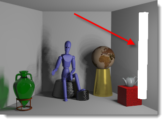

#  {{page.title}}
人工光源は、配光をコントロールするためのFlamingoのプロパティが追加された通常のRhinoの光源を使用します。光源を用いる際は、モデリングする実世界の照明器具を最もよく表現するタイプを選択してください。

## 光源タブ
{: #light-tab}
光源タブは、シーンのすべての人工光源の一覧を表示します。このトピックでは、Flamingo特有の光源タブについて説明します。[Rhinoの光源タブ](http://docs.mcneel.com/rhino/5/help/ja-jp/index.htm#commands/lights.htm)もあります。FlamingoとRhinoは、これらの2つのタブの間で光源設定を同期化します。Flamingoの光源タブではより多くの[光源のプロパティ](#light-properties)が使用できるので、Rhinoの光源タブよりもフレキシブルです。

<!-- TODO: There should be some mention that the Lights tab only is available for some of the Lighting presets -->
<!-- TODO: #### Is this supposed to be a code? It's showing up as #### -->
#### Flamingo照明コントロールの位置
光源タブは、[照明プリセット](lighting-tab.html#lighting-presets)または[カスタム照明設定](lighting-tab.html#sun)を通してアクティブにします。

 1. ツールバー >Flamingo nXtツールバー
 1. メニュー > Flamingo nXt 5.0プルダウン > コントロールパネルを表示 > Flamingoタブ > 光源

光源タブでは、それぞれの光源の挿入や表示のオフ/オン、そして強度やチャンネルの変更などが行えます。

Flamingoは次の光源タイプをサポートします。

> [オブジェクトに光源としてタグ付け](#tag-objects-as-lights)
> [スポット光源](#spotlight)
> [点光源](#pointlight)
> [矩形光源](#rectangularlight)
> [線光源](#linearlight)

**メモ:** Rhinoの指向性光源  はサポートされません。光源リストには表示されず、Flamingo nXtのプロパティも所有しません。

光源のプロパティのいくつかは、光源タブの列に表示されます。これによって、よく使われるプロパティに素早くアクセスして編集することができます。

列に表示されるプロパティは次のとおりです。

 >[オン/オフ](#on)
 >[名前](#name)
 >[配光](#light-distribution)
 >[方向](#aim-light)
 >[ワット](#watts)
 >[チャンネル](#channel)

光源タブを右クリックすると、[より多くのオプション](#additional-options)を表示するメニューが表示されます。

[光源のプロパティ](#light-properties)は、光源をピックし、 [オブジェクトのプロパティパネル](http://docs.mcneel.com/rhino/5/help/ja-jp/commands/properties.htm)の光源のプロパティアイコン  をクリックしてアクセスできます。

## 光源のタイプ
{: #light-types}
光源は、Rhinoのツールバーから、またはFlamingoの光源タブから挿入できます。オブジェクトはFlamingoを使用して光源としてタグ付けすることができます。

####  オブジェクトに光源としてタグ付け
{: #tag-objects-as-lights}
レンダリング可能なオブジェクト（サーフェス、ソリッドなど）はすべて光源としてのタグを付加し、光源のプロパティを持たせることができます。[配光](#light-distribution)、[方向](#aim-light)、および[強度](#watts)などのその他のプロパティの割り当てることができます。光源としてタグ付けされたオブジェクトには、光源の中心の位置と向きを示すプレビューウィジェットを表示することができます。

*光源としてタグ付けされたLEDドライビングライトとヘッドライト*

####  スポット光源
{: #spotlight}
スポット光源は、特定の方向に円錐形の配光を行う光源です。光源のプロパティには、[光源半径](#radius)、[ビーム角](#beam-angle)、フォールオフ半径、および方向が含まれます。光源の半径が大きいほど、ライトからの影は柔らかくなります。デフォルトでは、光源の位置にディスク形状が表示されます。グリップを使用した画面上での位置、方向、ビーム角の編集については、[Rhinocerosのスポット光源](http://docs.mcneel.com/rhino/5/help/ja-jp/commands/lights.htm#Spotlight)のヘルプトピックを参照してください。

*赤い箱に向いているスポット光源*

####  点光源
{: #pointlight}
点光源は、すべての方向に均等に光を配分する小さな球です。この光源のプロパティには、[光源の半径](#radius)が含まれます。半径が大きいほど、ライトから投げかけられる影が柔らかくなります。デフォルトでは、レンダリング時に光源の位置に光の球が表示されます。オブジェクトによって点光源の光が部分的に遮られた場合、普通とは違う効果が発生することがあることを覚えておいてください。

*右側の壁に近い位置にある小さな点光源*

####  矩形光源
{: #rectangularlight}
ディフューザーまたはバッフルがあるダウンライトを近似します。光源は、矩形の向きに基づいて光を拡散して分配します。光源の中心点には、方向矢印が表示されます。光の強度は、矩形の真正面で最大で、それから矩形からオブジェクトへの角度によって減少します。デフォルトでは、レンダリング時に白い四角形が表示されます。天井に矩形光源を使用する場合は、天井面とまったく同じ高さではなく、少し下に挿入するようにしてください。一貫した結果を得ることができます。グリップを使用した画面上での位置、方向、ビーム角の編集については、[Rhinocerosの矩形光源](http://docs.mcneel.com/rhino/5/help/ja-jp/commands/lights.htm#RectangularLight)のトピックを参照してください。

*天井のすぐ下の矩形光源*

####  線光源
{: #linearlight}
蛍光灯を模倣した円柱パターンで光を配分します。このライトの光源のプロパティには、[光源の半径](#radius)と長さが含まれます。半径が大きいほど、ライトから投げかけられる影が柔らかくなります。デフォルトでは、レンダリング時に光源の位置に光の円柱が表示されます。オブジェクトによって線光源の光が部分的に遮られた場合、普通とは違う効果が発生することがあることを覚えておいてください。画面上で編集できるように光源上のグリップをアクティブにするには、Rhinoの制御点を使用してください。

## 光源のプロパティ
{: #light-properties}
FlamingoがRhinoの現在のレンダリングアプリケーションである場合、光源にはより多くのプロパティを設定できます。光源のプロパティはいくつかは共通していますが、すべてが共通している訳ではありません。

#### 名前
{: #name}
光源オブジェクトの名前です。モデルに同じタイプの光源がある場合、名前があると違いが分かり便利です。

####  オン/オフ
{: #on}
光源のオンとオフを切り替えます。光源テーブル（表）で電球アイコンが黄色の場合、光源はオンです。電球アイコンがグレーの場合は、レンダリングで光源はオフになります。アイコンをダブルクリックすると、オン/オフを切り替えられます。プロパティダイアログにはオン/オフのチェックボックスが表示されます。

#### 表示
{: #visible}
デフォルトでは、光源はレンダリングに表示されますが、この表示プロパティのチェックマークを外すと、それが表示されなくなります。光源が投げかける光はシーンで表示されます。

#### 配光 *([タグ付けされたオブジェクトのみ](#tag-objects-as-lights))*
{: #light-distribution}
オブジェクトを光源としてタグ付けした場合、配光を使用して、シーンへの光の投影方法を指定することができます。配光の列のセルをダブルクリックすると、オプションドロップダウンが表示されます。配光タイプには、[全方向](#pointlight)、[スポット](#spotlight)、[拡散](#rectangularlight)があります。スポットと拡散は、[方向](#aim-light)の指定が必要です。

#### 方向 *([タグ付けされたオブジェクトのみ](#tag-objects-as-lights))*
{: #aim-light}
スポットまたは拡散の配光が指定されたタグ付けされた光源には、方向の指定をしてください。「方向 >>」オプションをダブルクリックし、コマンドラインのプロンプトに従ってください。

#### ワット
{: #watts}
光源の電力を指定します。シーンに適した現実的な値から始めることをお勧めします。光源テーブル（表）でセルをダブルクリックすると値を変更できます。

#### ビーム角 *([スポット光源のみ](lights-tab.html#spotlight))*
{: #beam-angle}
光源から発する光の幅をコントロールする角度（度で）です。これは画面上でグリップを使用して変更することもできます。グリップを使った編集の詳細については、[Rhinocerosのスポット光源](http://docs.mcneel.com/rhino/5/help/ja-jp/commands/lights.htm#Spotlight)のヘルプトピックを参照してください。

#### 半径
{: #radius}
表示される光源の大きさです。小さい光源はよりシャープな影を投げかけます。

#### 色
{: #color}
光源が発する光の色です。

#### マテリアル色を使用 *([タグ付けされたオブジェクトのみ](#tag-objects-as-lights))*
光源オブジェクトによって作り出される光に、光源オブジェクトに割り当てられたマテリアルの色を用います。

#### チャンネル
{: #channel}
光源は8つのチャンネルの1つに割り当てることができます。この機能を用いると、レンダリングの生成後にリアルタイムでレンダリングイメージの照明を調整できます。これはレンダリングで複数の光源のバランスを調整するのにとても便利です。

#### IESファイル
{: #iesfile}
IES（Illuminating Engineering Society）ファイルは、光源からの配光を定義する測光ファイルです。これらのファイルは照明器具の製造業者が提供している場合が多く、IESファイルを使用して配光を定義することによって光源をより正確に表現することができます。タグ付けされた光源オブジェクトの形状は、配光には関連がありません。配光の定義には、測光ファイルのみが用いられます。

メモ:

* Flamingo nXtは、IESファイルの大半を含むタイプC測角ファイルをサポートします。ヘッドライトを定義するのに自動車産業によって用いられることがあるタイプA、および投光照明を定義するのに時折用いられるタイプBのファイルはサポートされません。
* IESの分配は、照明器具のバッフル、リフレクター（反射板）、ディフューザー（拡散板）などの構成要素の効果を含みます。
* IESの分配は非対称であることが多いため、光源を当てるプロセスにはターゲットだけではなく回転角度も含めます。

#### ファイルからの明るさ
IESファイルに保存されている強度を用います。これがチェックされていない場合、[ワット](lights-tab.html#watts)設定が用いられます。

## より多くのオプションを表示するメニュー
{: #additional-options}
光源テーブル（表）の光源を右クリックすると、メニューが表示され、その他のオプションが使用できます。

####  オン
光源の[オン/オフ](#on)を切り替えます。

#### 削除
選択された光源を削除します。

#### 光源のタグを削除
オブジェクトを光源にする[タグ](#tag-objects-as-lights)を削除します。

#### プロパティ
光源の[プロパティ](#light-properties)にアクセスできます。

#### オブジェクトと一致するアイテムを選択
ビューポートの光源を選択します。
