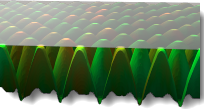

#  {{page.title}}

マテリアルは画像から作成することができます。写真や、壁紙やカーペット等の実際のマテリアルをスキャンしたり、ペイントプログラムでパターンを作成したり、他の方法で作成したビットマップからの画像などを用いたりしてください。

マテリアルが空間のすべての方向に無限に伸びていくことを想像してみてください。 マテリアルは、オブジェクトがそれを通る際のみ目に見えます。 パターンは、指定されたスケールで4方向に無限に繰り返されます（タイル）。

継ぎ目なくタイルできる小さい画像を使うと、比較的きれいです。 ビットマップがきれいにタイルしない場合、タイルをミラーするオプションを使用してください。 ミラーするオプションを使うと、エッジがきれいに合います。

**メモ:** ビットマップ画像をオブジェクトの一部のみを覆うように表示したい（ワインボトルのラベルや製品のロゴ等）場合は、[デカール](properties-decal.html)機能を代わりに使用してください。

画像マップは、いろいろな方法で使用することができます。 一般的な方法は、現実の世界のマテリアルの写真をマテリアル色として使用する方法です。

## 名前
画像テクスチャには名前を付けることができます。この名前は、RDKのテクスチャライブラリによって使用され、Flamingoには実質的な影響はありません

## Flamingoの画像

### 画像のプレビュー
{: #image-preview}
選択された画像ファイルのプレビューを表示します。画像にカーソルを重ねると画像ファイルの名前がポップアップされます。別の画像を選択したい場合は、画像をクリックします。

#### 画像の解像度
{: #image-resolution}
現在の画像ファイルのピクセルでの解像度を表示します。

### タイル
{: #tiles}
マテリアルの定義に使われる画像マップは、常に繰り返され（タイルされ）ます。 これらの設定では、現在のモデル単位でのそれぞれのインスタンス（タイル）の大きさを指定します。

#### 幅/高さ
{: #width-height}
タイルのサイズをモデル単位で設定します。




### マッピングのタイプ
{: #mapping-type}
画像は通常、色チャンネルに適用されますが、他の使用方法もあります。画像は次の形式で設定できます。

> [標準](#standard)
> [法線](#normal)
> [ディスプレイスメント](#displacement)

### 標準
{: standard}
画像はマテリアルに色と視覚的バンプを与えます。強弱とバンプの値を使用して、ビットマップのマテリアルへの影響方法をコントロールします。

#### 色の強弱
{: #color}
画像マップがマテリアルの表示にどのくらい影響するのかを決定します。下の例では、基底のマテリアルにはマゼンダ色が付けられています。色の強度が、下の色が完全に白黒のテクスチャでマスクされるまで上げられています。

*色の強度0.2、0.5、1.0*

#### バンプの強弱
{: #bump}
オブジェクトのサーフェス法線を乱すことで、オブジェクトのサーフェス上のバンプとしわを模倣します。下にあるオブジェクトは変わりません。イメージでは、左のマテリアルはディスプレイスメントマッピングを用い、右側のマテリアルは値を最高に設定したバンプマッピングを用いています。負のバンプ値を用いると、効果が反転します。バンプマップされたマテリアルはエッジと影が滑らかです。[Wikipediaの記事: Bump mapping](http://en.wikipedia.org/wiki/Bump_mapping)を参照してください。

*バンプの強度=0.5（左）、1.0（右）*

### 法線
{: #normal}
メッシュをレンダリングするのにより多くのポリゴンを用いずに、凹凸の明暗を模倣します。[Wikipediaの記事: Normal mapping](http://en.wikipedia.org/wiki/Normal_mapping)を参照してください。

法線マップはサーフェスの法線を変化させるという点においてバンプマップと非常に似ています。効果は基本的にバンプと同じですが、法線マップではバンプよりも法線をよりよくコントロールできます。バンプマップはビットマップのRGBのグレーの平均を使用します。法線マップでは、RGBが法線のXYZの変化に対応します。画像の青チャンネルが法線のZ方向をコントロールするので、法線マップはかなりの青色を保持します。

### ディスプレイスメント
{: #displacement}
この画像マップは、サーフェスのレンダリングメッシュを画像の色値に基づいてディスプレイスします。それにより、サーフェスの実際の幾何学的位置が変更された効果を生み出します。ディスプレイスメントは、多くの場合ローカルサーフェスの法線に沿って行われます。[Wikipediaの記事: Displacement mapping](http://en.wikipedia.org/wiki/Displacement_mapping)を参照してください。

 **メモ:** ディスプレイスメントマッピングを小さなオブジェクトに用いる場合には注意してください。ディスプレイスメントはレンダリングの時間を大幅に増加させます。

#### 高さ
{: #height}
ディスプレイスメントの最高点での高さです。

#### オフセット
{: #offset}
サーフェス法線を基準にしたディスプレイスメントの開始点を設定します。ディスプレイスメントは、パーツの外側、内側、または部分的に内側および外側に行うことができます。

*Zオフセット = -1.0*

*Zオフセット = -0.5*

*Zオフセット = 0.0*

#### ファセットサイズ
{: #facet-size}
ディスプレイスメントメッシュのファセットのサイズです。これによってディスプレイスメントの詳細さを上げることができます。しかし、レンダリングのサイズやメモリ使用量も増加します。

## Flamingoの画像 - 詳細
{: #advanced}
通常、Flamingoの画像はマテリアルの主チャンネルに適用されます。Flamingoの詳細ダイアログは、ビットマップが影響できる他のチャンネルを指定します。それらは、非常に特殊な効果に使用されます。

####  ベース色
これはデフォルトの設定です。画像はマテリアルの[色](advanced-material-properties-main.html#color)に影響します。

####  鏡面反射色
これは、その時点での画像の色に基づいて[反射チャンネル](advanced-material-properties-main.html#highlight-color)の色に影響します。

####  鏡面反射強度
これは、その時点での画像のグレースケールに基づいて[反射の量](advanced-material-properties-main.html#intensity)を変更します。これは鏡面反射マップとしてテクスチャセットでよく用いられます。

####  ハイライトシャープネス
これは、その時点でのマップのグレースケール値に基づいて[ハイライト](advanced-material-properties-main.html#intensity)のシャープネス対ブラーの度合を調整します。

#### ハイライト形状
{: #advanced-highlight-shape}
ハイライトの形状に影響します。

####  透明度
これは、画像のグレースケールに基づいてマテリアルの[透明度](advanced-material-properties-main.html#intensity)の量に影響します。

####  半透明度
これは、画像のグレースケールに基づいてマテリアルの[半透明度](advanced-material-properties-transparency.html#translucency)の量に影響します。

####  減衰
これは、画像のグレースケールに基づいてマテリアルの[減衰](advanced-material-properties-transparency.html#attenuation)の量に影響します。

#### オフセット X/Y
{: #advanced-x-y-offset}
XおよびY軸からマテリアルをオフセットします。

####  回転
画像マップを回転します。画像の向きをデフォルトの回転状態から変更する必要がある場合に、画像を90または180度回転するのに用います。
