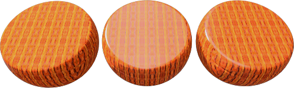
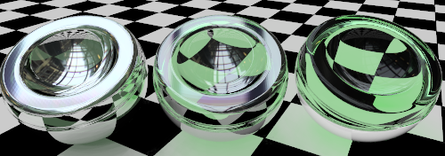
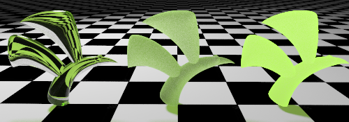
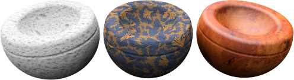
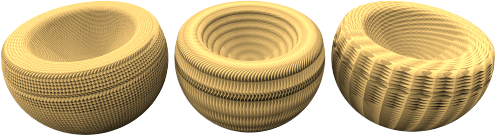

#  {{page.title}}

Flamingoには、[シンプルなマテリアル](material-type-simple.html)のタイプと詳細なマテリアルのタイプがあります。詳細なマテリアルには、マテリアルのすべてのプロパティグループが含まれます。マテリアルをフレキシブルに最大にコントロールしたい場合は、詳細マテリアルタイプを使用してください。

詳細マテリアルのすべてのプロパティグループは次のとおりです。

> [名前](#name)
> [マテリアルプロシージャ](#procedures)
> [詳細マテリアルのプロパティ](#advanced-materials-properties)
> [反射仕上げ](#reflective-finish-and-highlight)
> [透明度のプロパティ](#transparency)
> [プロシージャルテクスチャ](#bump-patterns)
> [ビットマップテクスチャ](#textures)
> [注記](#notes)

## マテリアルの名前
{: #name}
Rhinoのモデルにあるマテリアルの名前です。マテリアルはRhinoのモデルに格納されます。これは、ライブラリや異なるモデルの同じ名前のマテリアルは現在のモデルのマテリアルの編集によって影響されないということを意味します。他のモデルのマテリアルを使用する場合、そのマテリアルはまず[ライブラリ](libraries.html)にエクスポートする必要があります。マテリアル名は、それをエクスポートする際のファイル名にも使用されます。

## マテリアルプロシージャ
{: #procedures}
プロシージャツリーは、マテリアル同士がどのようにお互いに影響し合うかの一式のルールを用いてマテリアルが1つまたは複数のマテリアルを組み合わせます。ツリーは、マテリアルを作成するのに用いられたコンポーネントを表示します。ここではコンポーネントを追加することができます。標準のマテリアルの場合、リストにはベースという1つのコンポーネントしか表示されません。

それぞれのプロシージャは、特定の方法を使って2つの「子」マテリアルを組み合わせます。 それぞれの子マテリアルも、それぞれ独自の子マテリアルを2つ組み合わせて、プロシージャで構成することができます。 このように、単純な構成要素から、非常に複雑なマテリアルを作り出すことができます。 マテリアルを組み合わせるためのプロシージャには、[角度ブレンド](procedural-materials.html#angular-blend)、[ブレンド](procedural-materials.html#blend)、[大理石](procedural-materials.html#marble)、[花崗岩](procedural-materials.html#granite)、[タイル](procedural-materials.html#tile)、および[木目](procedural-materials.html#wood)が含まれます。

例えば、[大理石](procedural-materials.html#marble)プロシージャは、ベースマテリアルと石目マテリアルを渦を巻くように組み合わせます。

##### プロシージャを追加するには
1. プロシージャウィンドウのベースで右クリックします。
1. メニューでプロシージャのタイプをクリックします。
  * [ベース](procedural-materials.html#base)
  * [角度ブレンド](procedural-materials.html#angular-blend)
  * [ブレンド](procedural-materials.html#blend)
  * [花崗岩](procedural-materials.html#granite)
  * [大理石](procedural-materials.html#marble)
  * [タイル](procedural-materials.html#tile)
  * [木目](procedural-materials.html#wood)

##### プロシージャを削除するには
 1. プロシージャウィンドウで、プロシージャ名を右クリックします。
 2. メニューで削除をクリックします。

## マテリアルの詳細プロパティ
{: #advanced-materials-properties}



#### 反射仕上げとハイライト
{: #reflective-finish-and-highlight}
これらの設定は、マテリアルが光やオブジェクトを反射する方法を変更します。ハイライト効果は通常、光沢のあるマテリアルが割り当てられているオブジェクトの光で照らされている部分に表示されます。反射効果は通常、残りのシーンのオブジェクトを反射するより鏡のような反射で定義されます。クロムおよび他の反射性マテリアルは、何も反射するものがない場合、あまり金属らしいイメージには仕上がらないことを覚えておいてください。反射性マテリアルを用いる際はまた、環境、そして反射性マテリアルが反射するその他のオブジェクトのことを考慮してください。
 メモ: これらの設定をアクティブにする（使用する）には、強度の値を0より大きくする必要があります。

#### ハイライト色
{: #highlight-color}
ハイライト色とは、マテリアルが反射に加える色のことです。このコントロールには、白、金属、カスタムの3つの設定があります。

#### 白
白のハイライトのあるマテリアルは、反射に色を加えません。白のハイライトのあるマテリアルは一般的で、普通のペンキ、プラスティック、または鏡面仕上げにどちらかというと似ています。

#### 金属
{: #metallic}
ハイライトの色をベースの色と同じにします。多くのメタリック仕上げは通常ベースの色を反射の色として使用します。この金属オプションは、マテリアルに基づいた色を反射色として使用します。

#### カスタム
非常に特殊な仕上げには、オブジェクトからの反射の色はマテリアルのベース色と異なります。これは、通常複数のレイヤで作成されたマテリアルで見られます。ハイライト色を任意の色に設定するのにカスタムを使用してください。[カラーセレクタ](select-color.html) を使用して、反射色を選択します。

#### 強度
{: #intensity}
ハイライトの強度を調整します。低い値は周囲のオブジェクトでは反射られない光を反射する艶のあるオブジェクトにする傾向があります。高い値を設定すると、ハイライトや反射のサイズと強度が大きくなります。一番高い値は、他のオブジェクトやシーンの環境を映すマテリアルを鏡のようにします。

#### フレネル
{: #fresnel}
[導体のフレネル反射](http://en.wikipedia.org/wiki/Fresnel_equations)として知られている現象である不透明マテリアルの反射をコントロールします。フレネル設定は、垂直の視覚ではよりくすんだ特性を維持し、視射角では多くのマテリアルがより鏡のように反射するようになる傾向を模倣します。

極度の反射を避けるために、非常に暗い色のマテリアルの場合は値を下げてください。フレネル反射がより顕著なニスを塗った木材のようなマテリアルの場合は、値を上げてください。

#### シャープネス
{: #sharpness}
ハイライトのサイズを設定します。低い値を設定すると、より広いハイライトが指定されます。高い値を設定すると、ハイライトはより小さい領域に集中します。より高い強度の反射率に適用された場合、反射はぼやけた（焦点の合っていない）、またはシャープ（焦点の合った）状態になります。

#### タイプ
{: #type}
人工の光源が反射される際の反射の計算方法を変更します。反射は*レイキャスティング*と*ハイライト*の2つの方法を用いて計算されます。これらの2つの方法は最終的には同じ結果を生み出しますが、場合によってはどちらか1つの方法がより速くより良い結果を生み出すことがあります。例えば、光源の反射によってマテリアルがよく見えなくなる場合があります。

下のイメージではタイプがバランスに設定されています。左のオブジェクトでは反射が強すぎて（そこが白くなってしまい）マテリアルの効果が弱くなっています。

屋内のレンダリングで、光源が小さい場合、サーフェスに むらのあるアーチファクトが現れる場合があります。アーチファクトが表示されるサーフェスは、多くの場合ぼやけた反射が原因です。タイプを[光沢](advanced-material-properties-main.html#glossy)、[光源反射なし](advanced-material-properties-main.html#no-light-source-reflection)、または[モンテカルロ](advanced-material-properties-main.html#monte-carlo)を用いるとこの問題をある程度解決できる場合があります。

#### バランス
{: #balanced}
シャープネス設定に基づいて、レイキャスティングとハイライトのバランスを自動的に取ります。実際の光の反射および人工のハイライトの両方が計算されます。

#### 光沢
{: #glossy}
ハイライトのぼかしを強くし、レイキャスティングを抑えます。オブジェクトや光の反射は計算されないので、スピードが上がり、非常にぼやけた反射があるマテリアルのアーチファクトが避けられます。反射の微かな効果が失われる可能性があります。

#### モンテカルロ
{: #monte-carlo}
レイキャスティングのみが使用され、光源の反射が計算されます。レイキャスティングは初めノイズを伴って表示されますが、次第に正しい結果に収束します。ハイライトがぼやけていない場合に最も便利です。

#### ハイライトなし
{: #no-highlight}
レイキャスティングのみを用いて光源の反射が計算されます。光源が大きくマテリアルがぼやけていない場合に（ハイライトの計算に時間がかかるので）便利です。光源の反射は次第に収束します。

#### 光源の反射またはハイライトなし
{: #no-light-source-reflection-and-no-highlight}
人工の光源の反射と人工のハイライト効果をすべて除外します。オブジェクトの反射は計算されます。

#### 光源の反射なし
{: #no-light-source-reflection}
光源のレイキャスト反射を除外し、ハイライトだけを用います。マテリアルがぼやけており、シーンに小さい、明るい光源が含まれている場合に、便利であることがあります。

## 透明度
{: #transparency}
透明度の設定は、マテリアルを通過する光に関連したプロパティをコントロールします。

#### 透明度の強度
マテリアルを不透明から透明の状態の間で自由に設定できます。 透明なマテリアルを使用すると、レンダリングの時間が増します。

#### IOR
{: #index-of-refraction}
マテリアルの向こう側のオブジェクトを見ている時の光線の屈折の度合いを決定します。

次の表は、屈折率のいくつかの例です。

 | マテリアル      |     | IOR（屈折率）         |
 |:--------------|:---:|:------------|
 | 真空        |     | 1.0         |
 | 空気           |     | 1.0029      |
 | 氷           |     | 1.309       |
 | 水         |     | 1.33        |
 | ガラス         |     | 1.52 to 1.8 |
 | エメラルド       |     | 1.57        |
 | ルビー/サファイア |     | 1.77        |
 | ダイアモンド       |     | 2.417       |
{: .grided-table}

#### 半透明度
{: #translucency}
拡散の度合いです。不透明度が高い場合、より多くの光がマテリアルでランダムに拡散されるので、「サンドブラスト」効果が生まれます。これは非常に「繊細」定な効果で、少しの調整が大きな違いを生み出します。

#### スキャタリング
{: #scattering}
単位長さ当たりの光が粒子に衝突する確率をコントロールします。この効果には[パストレーサー](render-tab.html#path-tracer)が必要です。

サブサーフェススキャタリング（表面下散乱）は、光がオブジェクトのサーフェスを透過し、あらゆる方向に散乱することを可能にします。多くの半透明のマテリアルはこの効果を用いてモデリングすることができます。石や皮膚などのサーフェスは、光を短い距離を透過させることを可能にすることで、現実的に「柔らかく」見せることができます。

サブサーフェススキャタリングの効果を有効にするには、マテリアルにある程度の透明度がなければなりません。これは体積効果なので、このマテリアルが割り当てられるオブジェクトは、ソリッドか「空間を包括している」状態である必要があります。

#### 減衰
{: #attenuation}
光がオブジェクトを通る際にどのくらい吸収されるかを決定します。この値が大きいほど、より濁った効果を表現することができます。減衰は、液体をモデリングする時に役に立ちます。透き通った液体は減衰が低く、不透明な液体は減衰の値が高くなります。

#### 分散
{: #dispersion}
光が成分の波長ごとに分離される度合いをコントロールします。

#### 彩度
{: #saturation}
分散の量を決定します。

#### ブラー透明度
{: #blurry-transparency}
マテリアルがある程度透明な場合に、少しの「ノイズ」が与えられ、マテリアルがより自然に見えるようになります。

#### ブラーの度合
追加するノイズの量をコントロールします。

#### グロー
{: #glow}
照明効果を生み出します。

## テクスチャ
{: #textures}
マテリアルには、画像テクスチャとバンプパターンの2種類のテクスチャが追加できます。画像テクスチャは、ビットマップ、写真、またはスキャンされたイメージを基にします。バンプパターンは、Flamingoによって生成されるランダムなまたは繰り返されるパターンです。

### 画像
{: #images}
最大4つまでのビットマップ画像がマテリアルに詳細を加えるのに使用できます。画像マップは、 サーフェスの色や3次元サーフェスの表示特性（バンプ）を含む多くの目的で使用できます。画像マップは、ラスタベースのペイントプログラムを使って、写真やその他のマテリアルをスキャンして作成された2次元のパターンです。 一般的な方法は、現実の世界のマテリアルの写真をマテリアル色として使用する方法です。画像は最大4つの単体の画像で構成することができます。1つの画像が色をコントロールし、もう1つの画像がテクスチャのバンププロパティをコントロールすることなどができます。画像のマテリアルへの影響方法をコントロールするには、[画像のプロパティ](material-image-properties.html)ダイアログを使用してください。



### バンプパターン
{: #bump-patterns}
バンプパターンは、ディスプレイスメントマップを用いたり、他のマップを用いたりする必要なしに、特定の種類のサーフェスの外観を表現します。バンプは、マテリアルのサーフェスの凹凸を、数式を使って表現します。 パターンには次のものがあります:

> [サンドペーパー](#sandpaper)
> [砕石](#rubble)
> [ピラミッド](#pyramid)
> [しわ](#wrinkled)
> [大理石](#marbled)

例えば、漆喰、コンクリート、そして粘土のようなマテリアルは、きめが細かいマテリアルです。このようなマテリアルは、クローズアップして見ることがない限り、マテリアルをスキャンしてそのビットマップを作成する意味はあまりないでしょう。このようなきめの細かいパターンは、サンドペーパープロシージャルバンプを[ベース色](advanced-material-properties-main.html#color)上で使うことで模倣することができます。マテリアルの色で[ベース色](advanced-material-properties-main.html#color)を作成してください。そして、マテリアルにプロシージャルバンプを追加します。きめを細かくするには、サンドペーパーを、きめを粗くするには砕石を使用します。

バンプマップを選択してチェックマークを付けると、詳細コントロールが有効になります。マテリアルには、1つまたはそれ以上のバンプパターンを追加することができます。

#### サンドペーパー
{: #sandpaper}
ランダムできめの細かいでこぼこを表現します。サンドペーパーを編集するには、[スケール](#scale)、[強弱](#strength)、[回転](#rotation)を変更します。

*[スケール](#scale)および[強弱](#strength)を増加させたサンドペーパーの例*

#### 粗石
{: #rubble}
波だった、くぼみのあるサーフェスを表現します。 これは、スケールを上げて水、土、サーフェスのにじみなどに使用することができます。にじみは、粗石を使って[スケール](#scale)を大きくし、[強弱](#strength)を非常に小さくして表現することができます。砕石バンプはサンドペーパーよりも大きなサイズを表現します。

*[スケール](#scale)および[強弱](#strength)を増加させた砕石の例*

#### ピラミッド
{: #pyramid}
刻みパターンのような複数の小さいピラミッド型の突出を表現します。[スケール](#scale)は、XとYのピラミッドのベースサイズのみをコントロールします。[強弱](#strength)は、ピラミッドの「高さ」効果をコントロールします。

*[スケール](#scale)を増加させたピラミッドの例*

#### しわ
{: #wrinkled}
しわくちゃな様子を表現します。しわを編集するには、[スケール](#scale)、[強弱](#strength)、[回転](#rotation)を変更します。

*[スケール](#scale)を増加させたしわの例。[強弱](#strength)は一定に保たれています。*

#### 大理石
{: #marbled}
大理石のような模様を表現します。これは渦を巻くパターンです。大理石を編集するには、[スケール](#scale)、[強弱](#strength)、[回転](#rotation)を変更します。

*[スケール](#scale)を増加させた大理石の例。[強弱](#strength)は一定に保たれています。*

### スケール
{: #scale}
バンプの比例サイズをコントロールします。

#### X/Y/Z
それぞれの方向のスケールを別々に指定します。

#### ロック
縦横比を維持します。

### 強弱
{: #strength}
奥行きの表現をコントロールします。

### 回転
{: #rotation}
パターンの回転角度を設定します。向きの変更は通常、プロシージャルマップにはっきりとしたパターンがあるか、バンプマップスケールのX、Y、Z要素に異なる値を設定して方向性のあるパターンを作っている場合のみによく分かります。

