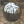
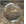
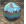
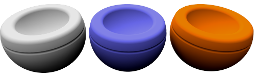
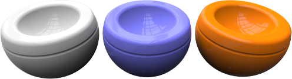
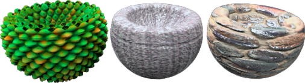

#  {{page.title}}
Flamingoのマテリアルは、一連のプロパティのグループで定義されます。これらは一般的に使用されるシンプルなマテリアルのタイプの数々です。これらのマテリアルは、非常にシンプルなコントロールセットを提供します。それによって、多数の複雑なコントロールを設定することなく、プロパティを簡単に編集して、マテリアルの外見を変えることができます。ほとんどのシンプルなマテリアルは、単に色を変更するだけで希望する効果が得られます。

#### シンプルなマテリアルのタイプ

> [単色](#solid-color)
> [プラスチック](#plastic)
> [金属](#metal)
> [ガラス](#glass)
> [光沢](#glossy)
> [クリアフィニッシュ](#clearfinish)
> [Flamingoテクスチャ](#flamingo-textured)
> [テクスチャセット](#texture-set)

マテリアルはすべて詳細マテリアルに変換することができます。詳細マテリアルは、Flamingo nXtでマテリアルの編集を行うためのすべての可能なコントロールを提供します。マテリアルの幅広いコントロールを利用するには、詳細マテリアルを使うか、既存のマテリアルを詳細マテリアルに変換してください。

#### 詳細マテリアルは、これらのプロパティグループから構成されています:

> [名前](material-type-advanced.html#name)
> [マテリアルプロシージャ](material-type-advanced.html#procedures)
> [詳細マテリアルプロパティ](material-type-advanced.html#advanced-materials-properties)
> [反射仕上げ](material-type-advanced.html#reflective-finish-and-highlight)
> [透明度のプロパティ](material-type-advanced.html#transparency)
> [プロシージャルテクスチャ](material-type-advanced.html#bump-patterns)
> [ビットマップテクスチャ](material-type-advanced.html#textures)
> [注記](material-type-advanced.html#notes)

マテリアルはRhinoのモデルに保存、格納されます。異なるマテリアルが別々のRhinoのモデルで同じ名前を持つことができます。

## 単色
{: #solid-color}
単色マテリアルは、[名前](material-type-advanced.html#name)と[色](material-type-advanced.html#color)だけを所有します。





## プラスチック
{: #plastic}
プラスチックマテリアルには、白い[ハイライト](material-type-advanced.html#highlight-color)、わずかな反射性があります。



 予め設定されている[ハイライト色](material-type-advanced.html#highlight-color)、[強度](material-type-advanced.html#intensity)、[フレネル](material-type-advanced.html#fresnel)、[シャープネス](material-type-advanced.html#sharpness)を変更したい場合は、詳細エディタを使用します。

## 金属
{: #metal}
金属マテリアルには、[色](material-type-advanced.html#color)の設定と一致する色でハイライトが設定されています。反射の[シャープネス](material-type-advanced.html#sharpness)をコントロールすることもできます。



#### シャープネス
反射のシャープネス対ブラーの度合をコントロールします。詳細については、詳細プロパティの[シャープネス](material-type-advanced.html#sharpness)のトピックを参照してください。

 予め設定されている[ハイライト色](material-type-advanced.html#highlight-color)、[強度](material-type-advanced.html#intensity)、[フレネル](material-type-advanced.html#fresnel)、[タイプ](material-type-advanced.html#type)を変更したい場合は、詳細エディタを使用します。

## ガラス
{: #glass}
ガラスマテリアルには、[色](material-type-advanced.html#color)と[屈折率](advanced-material-properties-main.html#index-of-refraction)（IOR）があります。



#### IOR
マテリアルを通過する際の光の屈折量をコントロールします。詳細については、詳細プロパティの[屈折率](advanced-material-properties-main.html#index-of-refraction)を参照してください。

 予め設定されている[ハイライト色](material-type-advanced.html#highlight-color)、[強度](material-type-advanced.html#intensity)、[フレネル](material-type-advanced.html#fresnel)、[シャープネス](material-type-advanced.html#sharpness)、[透明度](material-type-advanced.html#transparency)を変更したい場合は、詳細エディタを使用します。

## 光沢
{: #glossy}
光沢マテリアルには通常ハイライト[強度](material-type-advanced.html#intensity)と[シャープネス](material-type-advanced.html#sharpness)が低く設定されています。



#### 強度
サーフェス上の光源からのハイライトの強度をコントロールします。詳細については、詳細プロパティの[強度](material-type-advanced.html#intensity)のトピックを参照してください。

#### ハイライトシャープネス
サーフェス上の光源からのハイライトスポットのシャープネス対ブラーの度合コントロールします。詳細については、詳細プロパティの[ハイライトシャープネス](material-type-advanced.html#sharpness)のトピックを参照してください。

 予め設定されている[フレネル](material-type-advanced.html#fresnel)と[タイプ](material-type-advanced.html#type)を変更したい場合は、詳細エディタを使用します。

## クリアフィニッシュ
{: #clearfinish}
クリアフィニッシュマテリアルは、車の塗料（ペイント）、磁器（ポーセリン）、陶磁器（セラミック）、ニスを塗った木材、その他のプラスチックまたはクリアコーティング層のあるマテリアルをシミュレートします。クリアフィニッシュは、視点に基づいたマテリアルの色の変化に[フレネル](material-type-advanced.html#fresnel)設定を用います。これらのマテリアルの色は、正面から見た場合、濃くなる傾向があります。しかし、サーフェスの曲面に沿って視点をずらしていくと、反射が強くなっていきます。クリアコーティング、またはクリアラッカー仕上げのあるカーペイントが、よい例です。



 予め設定されている[ハイライト色](material-type-advanced.html#highlight-color)、[強度](material-type-advanced.html#intensity)、[フレネル](material-type-advanced.html#fresnel)、[シャープネス](material-type-advanced.html#sharpness)を変更したい場合は、詳細エディタを使用します。

## Flamingoテクスチャ
{: #flamingo-textured}
テクスチャマテリアルは、画像を用いて色やパターンを作成します。このシンプルなマテリアルからは、画像名、解像度、タイルのサイズ、そしてハイライトの強度とシャープネスをコントロールすることができます。



#### 強度
サーフェスの鏡のような反射の強度をコントロールします。詳細については、詳細プロパティの[強度](material-type-advanced.html#intensity)のトピックを参照してください。

#### シャープネス
反射のシャープネス対ブラーの度合をコントロールします。詳細については、詳細プロパティの[シャープネス](material-type-advanced.html#sharpness)のトピックを参照してください。

#### 画像
マテリアルの画像マップとプロパティを設定します。多くのオプションがあります。詳細については、詳細プロパティの[画像](material-type-advanced.html#texture)を参照してください。


 マテリアルに予め設定されている内容を変更したい場合は、詳細エディタを使用します。

## テクスチャセット
{: #texture-set}
[テクスチャセットマテリアル](texture-set-materials.html)は、ディスプレイスメント、法線、バンプマップなどの情報を含むサードパーティのテクスチャマップをサポートします。ディスプレイスメントマップは、マテリアルに深さを与えます。これらのテクスチャマップをセットとして組み合わせると、非常にリアルなマテリアルを作成することができます。[PixPlant software](http://www.pixplant.com/)は、標準ビットマップを使って、これらのテクスチャのセットを作成できる製品です。
<!-- TODO: This dialog Needs a page.-->


#### 幅と高さ
セットのすべてのテクスチャのサイズをコントロールします。すべてのビットマップのサイズを同じに、整列するようにするには、このコントロールを使用します。

#### 強度
サーフェスの鏡のような反射の強度をコントロールします。詳細については、詳細プロパティの[強度](material-type-advanced.html#intensity)のトピックを参照してください。

#### シャープネス
反射のシャープネス対ブラーの度合をコントロールします。詳細については、詳細プロパティの[シャープネス](material-type-advanced.html#sharpness)のトピックを参照してください。

#### タイプ
これは、サーフェス上の反射のタイプをコントロールします。詳細については、詳細プロパティの[タイプ](material-type-advanced.html#type)のトピックを参照してください。

 マテリアルに予め設定されている内容を変更したい場合は、詳細エディタを使用します。 **メモ:** これは、様々なデフォルトを用いて多くの重なり合ったテクスチャセットを使用する複雑なマテリアルです。詳細エディタを使用するとすべてのプロパティの同期性を保つことができなくなります。

## 詳細マテリアル
[Flamingo 詳細](material-type-advanced)マテリアルは、Flamingoのマテリアルのすべてのプロパティのセットを含んでいます。シンプルなマテリアルが用途に合わない場合、この[Flamingo 詳細](material-type-advanced)マテリアルを使用して、フレキシブルにマテリアルを作成することができます。
