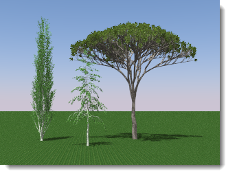

<!-- TODO: Is this  about trees or plants? I can see some confusion on the page. Lots of mentions of "trees" where I think we actually want to say "plant". -->

#  {{page.title}}
Flamingo nXtには、レンダリングの際に複雑な植物形状を効率的に生成する、簡単でパワフルな植物ジェネレータが含まれています。モデルにはプレースホルダーのみが置かれるので、植物はモデルのサイズにあまり影響を与えません。

*Flamingo nXtの樹木*

### nXtの植物を挿入する
{: #insert:}
Flamingoの植物は、ブロックとして挿入されます。これらのブロックは、樹木の一般的な形状を表す点を含んでいます。

1. Flamingo nXtメニューの植物 > 植物を挿入をクリックします。
1. Flamingo nXt植物ダイアログボックスで、植物名をクリックし、開くをクリックします。
1. プロンプトで、モデルの中の植物の位置をピックします。

メモ:

* モデルに正しい単位が設定されていることを確認してください。
* 植物は、スケール変更、コピー、回転することができます。

### 植物を編集する
{: #edit}
植物は一度挿入すると、移動、コピー、スケーリングが行えます。樹木は適切にサイズ変更されます。樹木の構造をより詳細に編集したい場合は、植物の編集コマンドを使用してください。樹木の構造にに小さな変更を加えるのは、比較的簡単に行えます。樹木のアルゴリズムに大きな変更を加えるのは、いろいろな試行が必要な場合もあります。

1. Flamingo nXtメニューの植物 > 植物を編集をクリックします。
1. 編集する植物を選択します。
1. 植物を正しく編集します。
1. 植物を保存し、エディタを閉じます。Rhinoの植物が自動的に更新されます。

### Flamingo 2の植物を使用する
{: #using-flamingo-2-plants}
1. Flamingo nXtメニューの植物 > Flaming 2の植物を挿入をクリックします。
1. Flamingo nXt植物ダイアログボックスで、植物名をクリックし、開くをクリックします。
1. プロンプトで、モデルの中の植物の位置をピックします。

メモ:

* Flamingo 2の植物が既に挿入されているモデルは、いくつかの制限はありますが動作するはずです。
* Flamingo 2の植物は、新しい植物とは異なります。Flamingo 2の植物は今のところ編集やFlamingo nXtの植物への変換は行えません。

### 植物エディタ
{: tree-editor}
Flamingoには、カスタムの樹木を作成できる樹木エディタが搭載されています。新規の植物タイプを簡単に作成できるための基本的な樹木テンプレートがいくつか用意されています。詳細については、[植物エディタ](tree-editor.html)のトピックを参照してください。
