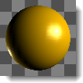
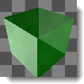
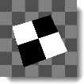

# {{page.title}}
プレビューサムネイルのイメージと、サムネイルイメージの間の背景領域には両方、コンテクストメニューが表示されます。

#### サムネイルプレビューの操作

>ビューを変更するには、右クリックしてドラッグします。

プレビューオブジェクトが球の場合、これはあまり効果がありませんが、立方体、円錐体、または他の形状の場合、ビューまたはオブジェクトを回転すると異なる視点からプレビューオブジェクトを表示することができます。

>コンテクストメニューを表示するには、右クリックします。
>サムネイルの下に大きなプレビューウィンドウを表示するには、ダブルクリックします。
>リストの順序を変えるには、プレビューサムネイルをドラッグします。
>マテリアルを複製するには、Ctrlキーを押しながらドラッグします。
>大きなプレビューをダブルクリックすると、フローティングウィンドウが開き、サイズ変更してプレビューのより高い解像度のビューを表示することができます。

このウィンドウは、コンテクストメニューやモデルの他のマテリアルやオブジェクトにドラッグアンドドロップできる機能など、元のプレビューイメージと同じ機能をすべて備えています。

### ジオメトリ

#### マテリアル
マテリアルは、いろいろなジオメトリのタイプを使うことができます。
 *球*
 *ピラミッド*
 *立方体*
 *トーラス*
 *円錐体*
 *平面*

#### 環境
環境は、円錐体と球のみを使うことができます。
 *円錐体と球*

#### テクスチャ
テクスチャは、2次元の、カメラに向いた平らなサーフェスとしてのみ表示されます。

#### サイズ
サムネイルの単位サイズを設定します。

### ビュー
右マウスボタンによるオブジェクトまたはカメラの回転をコントロールします。

#### オブジェクトを回転
右マウスドラッグでオブジェクトを回転します。

#### カメラを回転
右マウスドラッグでカメラを回転します。

#### X角度
オブジェクトまたはカメラの水平回転角度を設定します

#### Y角度
オブジェクトまたはカメラの垂直回転角度を設定します。

### 背景
サムネイルの背景の表示をコントロールします。

#### なし
デフォルトのグレーの環境を使用します。

#### チェッカー
グレーのチェッカーの背景を使用します。

#### カスタム
マテリアルまたはテクスチャをカスタム背景として使用します。

####  **デフォルトとして保存**
サムネイルのプロパティをデフォルトの設定として保存します。

####  **デフォルトから読み込み**
サムネイルのプロパティをデフォルト設定から読み込みます。
