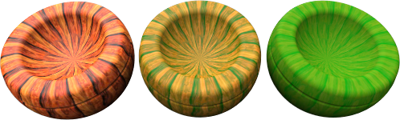
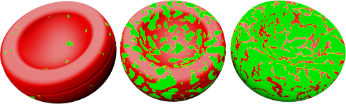
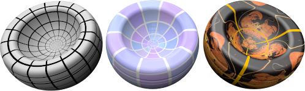

#  {: .inline} {{page.title}}
プロシージャツリーは、マテリアル同士がどのようにお互いに影響し合うかの一式のルールを用いて1つまたは複数のマテリアルを組み合わせます。ツリーは、マテリアルを作成するのに用いられたコンポーネントを表示します。ここではコンポーネントを追加することができます。単純なマテリアルの場合、リストにはベースという1つのコンポーネントしか表示されません。

それぞれのプロシージャは、特定の方法を使って2つの「子」マテリアルを組み合わせます。 それぞれの子マテリアルも、それぞれ独自の子マテリアルを2つ組み合わせて、プロシージャで構成することができます。 このように、単純な構成要素から、非常に複雑なマテリアルを作り出すことができます。 マテリアルを組み合わせるためのプロシージャには、次のものが含まれます。

* [ベース](#base)
* [角度ブレンド](#angular-blend)
* [ブレンド](#blend)
* [大理石](#marble)
* [花崗岩](#granite)
* [タイル](#tile)
* [木目](#wood)

##### プロシージャを追加するには
1. プロシージャウィンドウ上で右クリックします。
1. メニューでプロシージャのタイプをクリックします。

##### プロシージャを削除するには
 1. プロシージャウィンドウで、プロシージャ名を右クリックします。
 2. メニューで削除をクリックします。

## ベース
{: #base}
これはレイヤのない基本のシンプルなマテリアルです。これがデフォルトのプロシージャです。

## 角度ブレンド
{: #angular-blend}
多くのマテリアルは、色、反射、または透明度をマテリアルが表示される角度に基づいて変化させます。角度ブレンドプロシージャは、2つのマテリアルをオブジェクトのサーフェスへの視点角度に基づいてブレンドします。

角度ブレンドプロシージャは、2つの異なるコンポーネントをブレンドして、特殊効果を作り出します。プロシージャには、内側と外側の2つの層があります。

#### 内側
視点から0度から開始角度までは、内側コンポーネントが完全に見える状態になります。これはベースマテリアルだと考えてください。

#### 外側
終了角度から視点から90度までの間では、外側コンポーネントのマテリアルだけが見える状態になります。これはコーティングだと考えてください。

#### 開始角度
外側コンポーネントマテリアルが開始する視点からの角度です。

#### 終了角度
外側コンポーネントマテリアルが終了する視点からの角度です。
開始角度と終了角度の間では、内側と外側コンポーネントがブレンドされます。

下のイメージでは、開始角度{: .inline}が30度（右のレンダリングで緑の円）で、終了角度{: .inline}が60度（右のレンダリングで赤の円）です。

右のイメージで、内側マテリアルは白、外側マテリアルは黒で示されています。

 

* 視点から0と30度の間では、白が見える状態です。
* 視点から30から60度の間では、白から黒へのグラデーションが見えます。
* 視点から60と90度の間では、黒が見える状態です。

## ブレンド
{: #blend}
ブレンドプロシージャは、2つのベースコンポーネントを組み合わせ、それぞれの割合をコントロールします。標準ライブラリの木材マテリアルはすべて、木材の仕上げを透明の艶なし（クリアマット）から濃い艶ありの間でコントロールするために、ブレンドプロシージャを使います。

ブレンドは、パターンのあるベースマテリアルに全体色を加えることによってマテリアル全体の定義を変更すると、よい効果を得ることができます。

#### ブレンド
最終のマテリアルでのそれぞれのコンポーネントマテリアルの使用割合をコントロールします。例えば、下のマテリアルは、縞模様のマテリアルと緑の単色のブレンドです。左のイメージは、スライダが左に設定されており、縞模様のマテリアルが強く、緑が弱く表示されています。中央のイメージは、スライダが中央に設定されており、縞模様が50%、緑が50%のブレンドです。右のイメージは、縞模様が弱く、緑のマテリアルが強く表示されています。これは、スライダがブレンドスライダの右に設定されています。

#### 画像を使用
画像を使用して、2つのマテリアルの関わり方をコントロールすることができます。ビットマップ画像を使用する際、ピクセルのグレースケール値がどこで2つのコンポーネントマテリアルがブレンドされるのかを定義します。コンポーネント1と2の間の調整をグレースケールの画像マップを用いて行います。コンポーネント1は、ビットマップパターンの黒い部分に配置されます。 コンポーネント2は、ビットマップパターンの白い部分に配置されます。

下のイメージではコンポーネント1と2にはそれぞれ共通のマテリアルが使用されていますが、ブレンドは3つの異なるビットマップによってコントロールされています。

マスクビットマップの解像度は、マテリアルの質に影響します。 ビットマップの解像度が高くなると、マテリアルを近くで見ても問題がありませんが、より多くのメモリが必要になります。

#### アルファチャンネルを使用
画像にアルファチャンネルがある場合、色のブレンド位置を決定するのにビットマップのグレースケールの代わりに用いることができます。

#### 反転
コンポーネント1がビットマップパターンの白い部分に、コンポーネント2がビットマップパターンの黒い部分に配置されます。

#### タイル
マテリアルのスケールは、それを定義するビットマップの解像度とは関係がありません。 マテリアルの正しいスケールを得るには、1つのビットマップが表現する領域が実際の単位でどのくらいの大きさを表しているのかを計算します。 ビットマップが4単位の6個のタイルの高さ、4単位の12個のタイルの長さを表す場合、スケールはX方向に48単位、Y方向に24単位となります。 これで、ビットマップがパターンに適切なサイズに伸ばされます。

#### 幅
画像の1つのインスタンスのピクセルでの幅です。

#### 高さ
画像の1つのインスタンスのピクセルでの高さです。

## 花崗岩
{: #granite}
ベースコンポーネントに2つ目のマテリアルが詰まった嚢（小袋）を埋め込み、3Dマテリアルを作り出します。花崗岩プロシージャは、ランダムに分配される斑点コンポーネントをベースコンポーネントに組み込みます。花崗岩プロシージャは、ベースと斑点コンポーネントをどのように組み合わせるのかを定義します。 花崗岩プロシージャは、さび、キラキラ光るプラスティック、ランダムな斑点のあるその他のマテリアルを含む、いろいろなマテリアルに使用することができます。

#### ベース/斑点
ベースと斑点コンポーネントは2つのマテリアルです。これらのプロパティは、他のどのマテリアルとも共通の方法で指定されています。



#### 密度
パターン全体の割合です。この値を上げると、斑点の相対的なサイズが大きくなります。



## 大理石
{: #marble}
ベースと石目コンポーネントの「厚板」が交互に現れるマテリアルを作り出します。大理石プロシージャは、ベースと石目コンポーネントをどのように組み合わせるのかを定義します。「厚板」は無限に大きく、オブジェクトの向きがオブジェクトに対する厚板の方向に影響します。

オブジェクトのテクスチャ[マッピング](properties-object.html#mapping)がオブジェクトのマテリアルの向きをコントロールします。

*テクスチャマッピングがない状態（左）、テクスチャマッピングがある状態（右）*

#### ベース/石目
ベースと石目コンポーネントは2つのマテリアルです。これらのプロパティは、他のどのマテリアルとも共通の方法で指定されています。


#### 石目の幅
「厚板」のお互いに対する相対的なサイズをコントロールします。石目の幅は、1つのベースの縞から次の縞までの距離の割合です。値は、0（石目コンポーネントなし）から1（ベースコンポーネントなし）の間で設定することができます。




*ベニア（左）、通常（右）*

## タイル
{: #tile}
タイルは2Dマテリアルです。オブジェクトのテクスチャ[マッピング](properties-object.html#mapping)がオブジェクトのマテリアルの向きをコントロールします。タイルマテリアルは、ベースコンポーネントと目地コンポーネントを組み合わせます。これらのマテリアルはそれぞれ、また別のマテリアルを含むことができます。

特別な効果には、それぞれの方向でタイルのスケールを変えます。例えば、1方向に極端に長いタイルマテリアルを使うと、サイディング（羽目板）マテリアルを作成することができます。

#### タイル
タイル全体のサイズを設定します。幅と高さのサイズは、別々に設定することが可能です。

#### 幅/高さ
タイルの幅と高さを指定します。


#### 目地
目地マテリアルのサイズを指定します。

#### 水平目地/垂直目地
目地マテリアルの幅と高さを指定します。

#### ロック
水平と垂直目地のサイズの比率を維持します。

#### オフセット
垂直のタイル毎に、相対水平オフセットを設定します。例えば、標準長手積みを作るには、この値を0.5に設定してください。大理石タイルなどのマテリアルをモデリングする時に、床のすべてのタイルが同じパターンを持つ、同じ石板から切り出されたような効果を避けてモデリングできます。

#### タイル変化
それぞれのタイルのマテリアルの色にランダムさを加えます。この機能を使うことで、一様でないれんが等のマテリアルをモデリングすることができます。

#### R/G/B
赤、緑、青の色成分を変更します。これは、それぞれのタイルのベースマテリアルにランダムにわずかな変化を加えます。

#### X/Y/Z
ワールド原点からそれぞれのタイルのマテリアルをランダムにオフセットします。 マテリアルの開始位置を示すシームが適切な位置に現れない場合、これを行ってください。

## 木目
{: #wood}
木目は、ベースと年輪コンポーネントが交互に現れる同心円柱で構成されます。木目の設定は、ベースと年輪コンポーネントをどのように組み合わせるのかを定義します。

オブジェクトに近づいて見ることがない場合に、この方法を使用して木目マテリアルを作成してください。きめ細かい木目が必要な場合は、[テクスチャマテリアル](material-type-simple.html#textured)を使用してください。視点が木目から離れている場合、イメージの質を犠牲にせずに、単色を木目の代わりに使えます。この方法を使うと、レンダリングの速度が速くなります。木目マテリアルを使う利点は、オブジェクトの異なる面をレンダリングする際に、木目が正しく表示されることです。木口はオブジェクトの端の面に、平行な木目はオブジェクトの側面に表示されます。

#### ベース/年輪
ベースと年輪コンポーネントは2つのマテリアルです。これらのプロパティは、他のどのマテリアルとも共通の方法で指定されています。


#### 年輪の幅
1つのベースの縞と次の縞の間の距離の割合です。値は、0（年輪コンポーネントなし）から1（ベースコンポーネントなし）の間で設定することができます。




ベニア（左）、通常（右）
