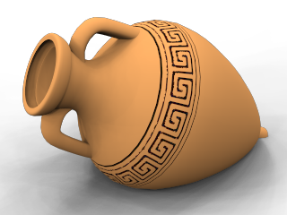
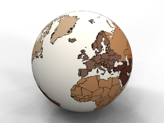

# {{page.title}}
デカールは、オブジェクトにマテリアルを用いて間接的にではなく直接適用できるタイリングしない画像マップです。デカールは、オブジェクトの色、反射、またはバンプの一部に変更を加えるのに用います。
画像は[マテリアル定義](materials-tab.html)で用いられる時はタイリングされますが、デカールでは1つのインスタンスだけが使われます。
デカールは次のように使うことができます。

>室内の壁に掛かっている芸術作品（絵等）を作成する。
>製品にラベルやロゴを配置する。
>モデルに署名を付ける。
>ステンドグラス窓を作成する。

 **メモ:** ワイヤフレームモードにOpenGLを使用している場合、デカールのプレビューはワイヤフレームビューでしか表示されません。**パイプライン**の設定は、**OpenGL**である必要があります（**オプション**  &gt; **ビュー**  &gt; **表示モード**  &gt; **ワイヤフレーム**  &gt; **その他の設定**  &gt; **使用する表示パイプライン**）。

## デカールの配置
{: #decal-list}
{: #decal-placement}

###  **追加**
{: #add-decal}
1. 1つまたは複数のオブジェクトを選択します。
1. **編集**メニューの**オブジェクトのプロパティ**をクリックします。
1. **プロパティ**リストの**Flamingo nXtデカール**をクリックします。
1. **追加**ボタンをクリックします。
1. **ビットマップを開く**ダイアログボックスで、ビットマップの名前を選択し、**開く**をクリックします。
1. **デカールのプロパティ**ダイアログボックスで、オプションを選択し、**配置**をクリックします。
1. プロンプトの表示に沿って、モデル上のデカールを配置する点をピックします。
プロンプトの内容は、選択するデカールのタイプ（[平面](#decal-planarmapping)、[円柱](#decal-cylindricalmapping)、[UVマップ](#decal-uvmapping)）によって異なります。

###  **配置を編集**
{: #decal-edit-placement}
1. **配置を編集**ボタンをクリックします。
1. **制御点を選択**のプロンプトで、グラフィカルエディタを使ってデカールの配置を変更します。
1. 作業が終わったら、**Enter**を押します。

###  **プロパティ**
{: #decal-properties}
1. **プロパティ**ボタンをクリックします。
1. **デカールのプロパティ**ダイアログボックスで、コントロールを使用してデカールのプロパティを変更します。

###  **削除**
{: #decal-delete}

>**削除**ボタンをクリックします。

###  **上へ移動** / **下へ移動**
{: #decal-movedown}
{: #decal-moveup}
1つのオブジェクトに複数の重なるデカールを適用した場合、その順序が重要になる場合があります。デカールは、リストに表示される順序で適用されます。 リストの一番最後のデカールは、一番上に表示されます。

>リストのデカールの位置を変更するには、**上へ移動**または**下へ移動**をクリックします。

##### 平面デカールを配置するには
1. プロンプトの表示に従って、デカールの**幅**、**高さ方向**をピックします。
1. **制御点を選択...**のプロンプトで、制御点を選択し、イメージのサイズ、回転、位置を調整します。
または**Enter**を押してデカールの配置を終了します。

### オプション

#### 移動
デカールを移動します。移動の基点となる制御点を選択および移動先の点のプロンプトで、RhinoのMoveコマンドを使用する時の要領で位置を指定します。

#### 画像の縦横比を使用
伸縮したデカールを元のビットマップの縦横比に戻します。

##### 円柱デカールを配置するには
1. プロンプトに従って、円柱の**中心点**をピックします。
1. **制御点を選択...**のプロンプトで、制御点を選択し、イメージのサイズ、回転、位置を調整します。
または**Enter**を押してデカールの配置を終了します。

## コントロールウィジェットを使用してデカールの配置を設定または編集する
メモ: 曲面状のオブジェクトに平面マッピングを使用する場合、ビットマップ全体がオブジェクトのサーフェスの後ろに位置している必要があります。 ビットマップのサーフェスの前に位置する部分は見えません。

#### デカールの幅と高さを同時に変更するには

>コントロールウィジェットの角の制御点をドラッグします。

#### デカールの高さを変更するには

>コントロールウィジェットの上下のエッジ中央の制御点をドラッグします。

#### デカールの幅を変更するには

>コントロールウィジェットの左右のエッジ中央の制御点をドラッグします。

#### デカールを移動するには

>コントロールウィジェットの中心の制御点をドラッグします。

#### デカールを回転するには

>ウィジェット軸アイコンのX、Y、Z制御点をドラッグします。

## デカールのプロパティ
{: #dialogbox-editdecal}
ビットマップからの情報によって、オブジェクトの色がデカールの色と置き換わったり、オブジェクトの色がデカールの色とブレンドされたりします。これは、デカールの使い方として最も一般的です。

##  投影
{: #projection}
マッピングスタイルは、どのようにオブジェクト上にデカールを投影するのかを決定します。デカールを正確に配置するには、補助線をシーンに作成しておくとよいでしょう。サーフェスのすぐ後ろに作成された長方形は、標準デカールの配置の目安となります。正確に配置するために、オブジェクトスナップを使用するとよいでしょう。

### 円柱
{: #decal-cylindricalmapping}
円柱マッピングタイプは、ワインボトルのラベルのような、1方向に曲がるオブジェクトにデカールを配置するのに便利です。
ビットマップの垂直軸を円柱の軸に合わせ、水平軸を円柱の回りに合わせる円柱状投影で、円柱上にビットマップがマップされます。

### 平面
{: #decal-planarmapping}
平面マッピングは、一番一般的なマッピングスタイルです。このタイプは、平面状、または緩やかに曲がったオブジェクトのマッピングに適しています。
角（コーナー）は、ビットマップの位置と位置と範囲を定義します。長方形がビットマップと同じサイズでない場合、ビットマップはフィットするように拡大または縮小されます。
曲面状のオブジェクトに平面マッピングを使用する場合、ビットマップの投影全体がオブジェクトのサーフェスの後ろに位置している必要があります。ビットマップのサーフェスの前に位置する部分は見えません。

### UVマップ
{: #decal-uvmapping}
UVマッピングは、髪の毛や木の皮等、サーフェスにデカールを流れるように伸ばしてフィットさせたいオブジェクトをマッピングするのに便利です。
デカールはオブジェクト全体を覆います。デカールの配置をコントロールすることはできません。
UVマッピングは、サーフェスのUとVのパラメタリゼーションを使用してイメージを曲げたり伸ばしたりします。したがって、手作業で配置する必要はありません。

### 参照
{: #file-browse}
画像ファイルを変更します。



## 強弱
{: #decalmappingstrength}

### 色
{: #decal-color}
画像の色のマテリアルに対する相対強度を設定します。[マテリアル-テクスチャのプロパティ-強弱-色](texture-properties-main.html#color)も参照してください。

### バンプ
{: #decalmappingbump}
バンプマップはサーフェスに影とハイライトのシミュレーションを作成します。[マテリアル-テクスチャのプロパティ-強弱-バンプ](texture-properties-main.html#bump)も参照してください。

## 反射仕上げ
{: #reflective-finish-and-highlight}
マテリアル定義がコントロールするのと同じプロパティをコントロールします。これらのプロパティをデカールによって影響されるオブジェクトの特定の部分に適用してください。デフォルトでは、デカールは光沢のない仕上げになっています。

### 強度
ハイライトの強度を調整します。高い値を設定すると、ハイライトのサイズと強度が大きくなります。[マテリアルのプロパティ - 詳細の強度](advanced-material-properties-main.html#intensity)を参照してください。

### シャープネス
ハイライトのサイズを設定します。低い値を設定すると、より広いハイライトが指定されます。高い値を設定すると、ハイライトはより小さい領域に集中します。[マテリアルのプロパティ - 詳細のシャープネス](advanced-material-properties-main.html#sharpness)を参照してください。

### 金属
ハイライトの色をベースの色と同じにします。[マテリアルのプロパティ - 詳細の金属](advanced-material-properties-main.html#metallic)を参照してください。


## 形式
{: #advanced}

### 両面
{: #double}
デカールを、サーフェスの表と裏に表示します。

### ミラー
{: #mirror}
デカール画像をミラーします。

## 投影方向
{: #projection-direction}

### 後方
デカールを後方に投影します。
前面（左）、背面（右）

### 前方
デカールを前方に投影します。
前面（左）、背面（右）

### 前方 &amp; 後方
デカールを前方と後方に投影します。
前面（左）、背面（右）

### 透明度
デカールの透明度を設定します。[透明度](advanced-material-properties-transparency.html)を参照してください。
IOR
透明なデカールの屈折率を設定します。[屈折率](advanced-material-properties-transparency.html#index-of-refraction)を参照してください。
