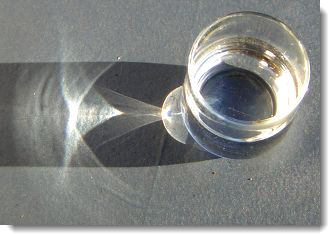

#   {{page.title}}
Flamingo nXtのオブジェクトのプロパティは、Flamingo nXtでのオブジェクトのレンダリング方法のみに影響します。

###  マテリアル
{: #material-source}
マテリアルは、レイヤ、オブジェクト、そしてブロックに割り当てることができます。マテリアルの割り当てについての詳細は、[マテリアルの割り当て](material_assignment.html)のトピックを参照してください。マテリアルがオブジェクトの設定になっている場合、マテリアルのプロパティもこのダイアログに表示されます。マテリアルの編集についての詳細は、[マテリアルのプロパティ](material-type-simple.html)を参照してください。

###  テクスチャマッピング
{: #texture-mapping}
マッピングは、特定のオブジェクトにどのようにマテリアルが配置（マップ）されるのかをコントロールします。マテリアルを割り当てる方法（レイヤに、またはオブジェクトに）は、マッピングには影響しません。目立ったパターンがないマテリアルの場合、マッピングをコントロールする必要は通常ありません。マテリアルに方向がある場合、またはマテリアルにはっきりとしたパターンがある場合はマッピングを使用してください。このような場合でも、デフォルトのマッピングで十分なこともあります。マッピングはオブジェクトに付随し、オブジェクトを移動、回転、サイズ変更すると、それに従います。マッピングタイプの詳細については、[テクスチャマッピング](http://docs.mcneel.com/rhino/5/help/ja-jp/index.htm#properties/texturemapping.htm)のトピックを参照してください。

 
*2つの異なるマッピング方向*

###  デカール
{: #decals}
デカールは、マテリアルを用いて間接的にではなく直接オブジェクトに適用できる、タイリングされない画像マップです。デカールは、オブジェクトの色、反射、またはバンプの一部に変更を加えるのに用います。デカールの作成、配置についての詳細は、[Rhinoのデカール](http://docs.mcneel.com/rhino/5/help/ja-jp/index.htm#properties/decal.htm)を参照してください。

 
 
*4つの異なるデカールの例*

###  カスタムメッシュ
{: #custom-meshes}
いくつかのカスタムメッシュのモディファイアーをRhinoでレンダリングモデルの詳細化に使用できます。これらのモディファイアーを用いると、エッジを丸めたり、パネルのシャットラインを加えたり、曲線からケーブル線を作成することができます。

詳細については、次のトピックを参照してください。

>[ソフトエッジ](http://docs.mcneel.com/rhino/5/help/ja-jp/index.htm#commands/applyedgesoftening.htm)
>[曲線パイプ](http://docs.mcneel.com/rhino/5/help/ja-jp/index.htm#commands/applycurvepiping.htm)
>[シャットライン](http://docs.mcneel.com/rhino/5/help/ja-jp/index.htm#commands/applyshutlining.htm)
>[ディスプレイスメント](http://docs.mcneel.com/rhino/5/help/ja-jp/index.htm#commands/applydisplacement.htm)

###  Flamingoのプロパティ
{: #flamingo-properties}

#### アルファチャンネル
{: #alpha-channel}
オブジェクトを表示させなくします。投げかけられた、そしてオブジェクト上にある影はレンダリングされます。そのイメージを他のイメージに重ねると、合成イメージに影を表示することができます。

上の例では、単純な平面サーフェスをいくつか作成し、木で影を投影しました。それを別のイメージと合成し、建物に投げかけられる影を表現しました。平面はアルファチャンネルプロパティがオンになっているので、レンダリングの際には表示されず、影だけが表示されました。この部分的に透明なイメージが建物のイメージに重ねられ、右のイメージが完成しました。

#### コースティックス
{: #caustics}
曲面によって反射または屈折された光線、またはこれらの光線の他のサーフェス上への投影です。コースティックスは、非常に特殊な状況に用います。コースティックスは、[パストレーサー](render-tab.html#path-tracer)エンジン、または[ハイブリッド](render-tab.html#hybrid)レンダリングエンジンのみを用いてレンダリングされます。コースティックスの計算は、収束するのに多くのパスを用います。詳細については、[Wikipediaの記事: Caustic (optics)](http://en.wikipedia.org/wiki/Caustic_(optics))を参照してください。

*ガラスのコップに入った水によるコースティックス*

*コースティックスなし（左）、コースティックスあり（右）*

#### 薄面
{: #thin}
空間を包括した透明なオブジェクトは透明な屈折には通常、ソリッド（固体）として扱われます。薄面プロパティを設定した場合、屈折でそれぞれのサーフェスは両面（表裏）のあるオブジェクトとして扱われます。これはガラスなどの単一のサーフェスを建築モデルに用いる際に使用する設定です。

 
*ベースのRhinoモデル（左）、通常（中）、薄面（右）*

#### 昼光ポータル
{: #daylight-portal}
昼光ポータルは、屋内レンダリングの[太陽や空照明](lighting-tab.html#interior-daylight)の入口です。昼光ポータルは、太陽、空、そして地面の光を自然な形で屋内空間に引き込みます。昼光ポータルは、[太陽](sun-and-sky-tabs.html#sun)がオンの場合のみに効果があります。照明スキームが[屋内昼光](lighting-tab.html#interior-daylight)に設定されている場合、すべての透明なサーフェスは自動的に昼光ポータルとして機能します。照明スキームがスタジオまたは屋外昼光に設定されている場合のみ、外の太陽や空の光を屋内空間に取り入れたい場合は、手動で窓に昼光ポータルを設定しなければなりません。

*昼光ポータルがオン（左）、昼光ポータルがオフ（右）*
