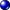

---
---

# {:height="75px" width="75px"} Channels
{: #channel}
A very useful feature in Flamingo nXt 5 is the ability to set lights on one of eight channels. Each light source in the drawing, including the sun and sky, can be assigned to a channel. At render time, the light from each channel is put on its own layer.  Then after the rendering is finished, the channels can be adjusted in strength.  The change is real time without the need to re-render.  

Channels are very effective when:

* Trying to balance an HDRI Environment and the Sunlight.  Not all HDRI environments are calibrated.  It is useful to set the HDRi Sky on one channel and the Sun on another.  Then adjust the relative strength of the Sky light vs the sun after rendering.
* Studio renderings that use a key, fill, and backlight setup. Set each light on a different channel, then adjust their strength real-time in the rendering using channels.
* When using different banks of lights in an exterior or interior rendering.  Each bank of lights can be set on a channel and effectively have their own dimmer to control their strength.
* Rendering with all the lights on, then turning off and on certain lights. No need to render an interior to create a night shot and a daytime rendering.

Once this image is rendered, each channel can be individually scaled either in the Render Window before saving or it can be saved to an .nXtImage file for later editing.

Use channels to adjust the strength of lights relative to each other, not to brighten the whole image.  If you need to brighten the whole image at once, use the Adjust Image controls.

<!-- TODO: Find original video clip.It is probably best to embed it from Vimeo.-->
Click to play video clip.
<!-- TODO: Is this supposed to link to a video? -->

The following conditions are necessary to produce and manipulate a multi-channel image:

 1. All participating lights must be on.
 2. Each light source must be assigned to a channel. By default, Sun and Sky are set to channel 0, artificial lights are set to 1.
 3. Immediately after rendering, use the Channel controls in the render window.
 3. The only saved format that preserves this channel information is the .nXtImage format. Lighting can be adjusted there and then the image is saved to a bitmap format.

## Setting Channels
{: setting}
The first step in setting up a muti-channel rendering is to set each light to channel. The channel number is usually set in each light property.  For information on setting specific lights to a channel see:

>[Sun Channel](sun-and-sky-tabs.html#sun-channel)
>[Sky Channel](sun-and-sky-tabs.html#sky-channel)
>[Artificial Light Channel](lights-tab.html#channel)
>[Material Glow](documentproperties-flamingo.html#channel)

Any number of lights can be grouped onto the same light channel.  The channel adjustment is a multiplier. Lights on the same channel will keep their relative strengths to each other while being adjusted.

## Adjusting Channels
{: adjusting}
Lighting channels can be adjusted immediately after rendering, or in the Flamingo image editor if the rendering is saved as an nXtImage file.  Channels can be adjusted while Flamingo continues to render, but we recommend that you stop the rendering before making major adjustments.

#### Where can I find Flamingo Lighting control?
The channel controls are found on the Flamingo nXt tab in the [render window](render-window.html) under Channels.

There are eight channel controls 0-7. Only the channels that have lights on them will activate.

Each channel has a slider and a spinner value.  The spinner value represents the maximum value of the slider. If the slider is all the way to right, then the full value of the spinner is used to multiply the lighting amounts on that channel.  It follows that the slider at 50% will multiply all the lighting on that channel layer by half the spinner amount.  A slider slid all the way to the left will turn off all the lighting on that channel.

The value of the spinner can be very important.  Because Sun and Sky can be many times brighter then artificial lights, the spinner value on artificial lights  might need to be increased to 20 or 50 to see any difference.

After adjusting the channels correctly, then save the image as a JPG or PNG file as the final rendering.
