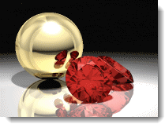
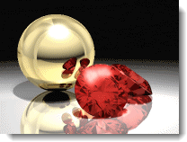

---
---

<!-- TODO: This is a combination of the old information here and the Rhino render Windows.  These two still need to be combined. -->

# レンダリングウィンドウ
レンダリングウィンドウは、露出調整やポストプロセッシング効果を追加するオプションを提供します。レンダリングウィンドウのメインフレームは、Rhinoのレンダリングフィレームワークの一部です。レンダリングウィンドウのメニューとアイコンの詳細については、[レンダリングウィンドウのトピック](http://docs.mcneel.com/rhino/5/help/en-us/index.htm#information/renderwindowpostprocess.htm)を参照してください。

### プルダウンメニュー
レンダリングメニューとアイコンの詳細については、[レンダリングウィンドウのトピック](http://docs.mcneel.com/rhino/5/help/en-us/index.htm#information/renderwindowpostprocess.htm)を参照してください。

### ツールバー

### 保存（背景アルファチャンネルを含める）
{: #save-with-alpha-channel}
32ビットのPNG、TIF、BMPイメージをアルファチャンネル背景を含めて保存します。ファイル形式のアルファチャンネルバージョンが高品質の合成に用いられます。レンダリングがアルファチャンネルを含めて保存されると、背景は黒で表示されます。

### ネイティブFlamingo nXtファイルにエクスポート（.nXtImage）
{: #export-to-nxtimage}
非圧縮の輝度および色情報を保存します。[アルファ](environment-tab.html#alpha)を含むすべてのレンダリングチャンネルを保存します。nXtImageファイルは、[イメージエディタ](image-editor.html)で開くことができ、[露出](#adjust-image)や[ポストプロセッシング効果](#effects)を適用してイメージを別のビットマップ形式で保存することができます。
.nXtImage形式は、nXtレンダラーのネイティブのイメージ形式です。レンダリングのほとんどの情報を保存するので、推奨する保存形式です。この形式で保存されたイメージは、[nXtイメージエディタ](image-editor.html)で操作することができ、特殊効果を追加できます。このエディタからは、nXtでサポートされているすべての形式を含む多くのよく使用されている標準形式に保存ができます。[Piranesi EPixファイル（.epx）](http://www.piranesi.co.uk/)形式に保存することもできます。

### HDRファイルにエクスポート
{: #export-to-hdr}
非圧縮の輝度および色情報を保存します。.hdr形式は、輝度データを直接ハイ・ダイナミック・レンジ形式に保存します。通常の写真のような輝度のない背景は、これらの形式で保存すると黒で表示されます。

### EXRファイルにエクスポート
{: #export-to-exr}
フリーソフトウェアライセンスの下でリリースされた、インダストリアル・ライト&マジック（ILM）によって作られたソフトウェアツールのセットと共にオープン標準としてリリースされたハイ・ダイナミック・レンジ画像ファイル形式です。このファイル形式は、符号1ビット、指数5ビット、仮数10ビットの16ビット/チャンネルの浮動小数点値（半精度）をサポートします。これは、30を超える値の露出のダイナミックレンジを可能にします。[Wikipediaの記事: OpenEXR](http://en.wikipedia.org/wiki/OpenEXR)を参照してください。
.exr形式は、輝度データを直接ハイ・ダイナミック・レンジ形式に保存します。通常の写真のような輝度のない背景は、これらの形式で保存すると黒で表示されます。

## 閉じる
レンダリングウィンドウを閉じます。

##  [Flamingoタブのレンダリングウィンドウ](render-window.html#help)

## 進行状況
{: #progress}

### 動作

### パス

### スキャンライン

### 経過時間

### レイ/秒

### ピクセル/秒

## レンダリング停止条件
{: #number-of-passes}
{: #time}
{: #render-constraints}

## イメージの調整
{: #adjust-image}
画面表示をコントロールする設定は、その表示から作成されたどのようなイメージファイルもコントロールします。1つのレンダリングから異なる露出設定の複数のイメージファイルが保存できます。1つのレンダリングイメージのために指定された露出設定は、引き続き次のイメージに適用されます。
この調整処理は、*トーンマッピング*と呼ばれます。トーンマッピングは、Flamingo nXtによって使用される輝度データを、表示または印刷される赤、緑、青（RGB）のピクセルに変換する処理です。

### 明るさ
{: #brightness}
イメージの全体の明るさを調整します。例えば、モデルの中の白いサーフェスがグレーにレンダリングされている場合は、サーフェスが白く見えるまで明るさの度合いを上げることができます。反対に、屋外のシーンが露出オーバーになっているような場合、これでよいと感じるまでシーンの明るさの度合いを下げることができます。

*デフォルトの明るさ（左）、値を上げた状態*

### 焼き込み
{: #burn}
イメージの白い点を調整します。これはイメージの中で最も明るい白色です。焼きこみは、暗い部分とのコントラストを付ける白い部分をより追加することでレンダリングを印象的に、よりはっきりさせます。
[Wikipediaの記事: White point](http://en.wikipedia.org/wiki/White_point)を参照してください。

*デフォルト設定で焼き込み（左）、値を上げた状態*

### 彩度
{: #saturation}
彩度は、イメージの色の量をコントロールします。彩度が0.0の場合、グレースケールのイメージになります。彩度を1.00よりも大きくすると、色がより鮮やかになります。

*デフォルトの彩度（右）、3程値を上げた状態（左）*

### ヒストグラム
{: #histogram}
イメージの明るいそして暗い部分の分布を図（グラフ）で表示します。
[Wikipediaの記事: Histogram](http://en.wikipedia.org/wiki/Histogram)を参照してください。インターネットには、デジタル写真の露出を確認するのにヒストグラムを用いることに関する多くの情報があります。原理はレンダリングも同じです。

*ヒストグラム*

#### ヒストグラムのオプション

>ヒストグラムのイメージを右クリックするとオプションが表示されます。

#### フィット

#### 中央値

#### 平均値

#### 並べ替えたグラフを表示

#### スケールを表示

#### グラフの色

#### 輝度値を表示

### 露出を固定
{: #lock-exposure}
露出設定を固定すると、照明を変更しても補正のための露出調整はされません。

## 情報
{: #information}

### 解像度
[レンダリング解像度](render-tab.html#resolution)を表示します。

### 面
モデルをレンダリングするのに使用されたメッシュ面の数を表示します。

### 見掛けの面
モデルにブロックがある場合、Flamingo nXtはそれぞれのインスタンスのメッシュを再生成しなくても、ブロック定義を用いてブロックインスタンスをレンダリングすることができます。**見掛けの面**は、追加で生成された一時メッシュの数を表示します。

## ピクセルの情報
ウィンドウの点
イメージの点
イメージYアップ
ピクセルの色
輝度
距離

## 照明の情報

###  [プリセット](lighting-tab.html)

###  [太陽](sun-and-sky-tabs.html#sun)

###  [空](sun-and-sky-tabs.html#sky)

###  [光源](lights-tab.html)

###  [間接光](lighting-advanced-tab.html#indirect)

###  [環境光　オン/オフ](lighting-advanced-tab.html#ambient)

## チャンネル
{: #channels}
照明チャンネルの状態を表示します。

## エフェクト
{: #post-process-effects}
{: #effects}
ポストプロセッシング効果は、イメージのレンダリング後に適用されます。これらはオン、オフを切り替えられ、リストで順序を変えることもできます。設定はそれぞれの効果によって変わります。

## エフェクトオプション
これらのオプションはコンテクストメニューからも選択できます。

>コンテクストメニューを表示するには、効果を右クリックしてください。

選択された効果のオン/オフ状態を切り替えます。
リストで選択された効果を1つ上に移動します。
リストで選択された効果を1つ下に移動します。
選択された効果のプロパティを表示します。
現在の効果のリストの順序とプロパティをデフォルトして保存します。
現在のエフェクトリストを名前の付いたリストとして保存します。
名前の付いたエフェクトリストをインポートします。

## 被写界深度
{: #postprocessingdof}
被写界深度効果は、カメラからの距離によってイメージをぼやけさせます。

## 被写界深度のプロパティ
{: #depth-of-field-properties}

### 視覚のプロパティ
{: #dofvisualproperties}

#### ブラーの強度
{: #dofblurringstrength}
ぼかしの量を決定します。この値は任意のもので、イメージによって異なる値が適切です。

#### 最大ブラー
{: #dofmaxblurring}
最大ぼかし半径を決定します。 ぼかしの強い部分は効果を遅くする場合があるので、これで効果を制限します。

### 効果の範囲
{: #dofareaofeffect}

#### 焦点距離
{: #dofocaldistance}
イメージがはっきりと見える（焦点があってぼやけていない）カメラからの距離です。

#### ピック
イメージの位置をピックして焦点距離を設定します。

#### 背景のブラー
{: #dofblurbackground}
背景をぼやけさせるかどうかを決定します。 背景は、最大の効果でぼやけさせられます。

## フォグ
{: #postprocessingfog}
フォグ効果は、イメージに奥行きによる色付けを行います。深い霧の効果からかすかな奥行きの効果まで様々な効果を付けることができます。

*ポストプロセッシング効果がない状態*

### グラデーション背景としてのフォグ
フォグは、グラデーション背景を作り出すのに使用できます。
この例での背景を作成するための設定は次の通りです。
強弱 = 1ノイズ = .1フォグの色 = 黒終了距離 = 約110開始距離 = 約90Fog 背景のフォグ = オンフェザリング = 80

*グラデーション背景としてのフォグ*

## フォグのプロパティ
{: #fogsettings}

### 視覚のプロパティ
{: #fogvisualproperties}
フォグ効果の表示方法を決定します。

#### 強弱
{: #fogstrength}
フォグの最大量を決定します。 強弱が0.0の場合、効果はなしになります。1.0の場合、完全なフォグとなります。 1.0より高い値も使用できますが、**ノイズ**と一緒に使用しない限り意味はありません。

#### ノイズ
{: #fognoise}
フォグの**強弱**にランダムな変化を付けます。

#### 色
{: #fogcolor}
フォグの色を指定します。

>色見本をクリックし、[色の選択](select-color.html)ダイアログボックスから色を選択します。
>レンダリングイメージから色を選択するには、**ピック**ボタンをクリックします。

### 効果の範囲
フォグ効果の範囲を決定します。

#### 開始距離
{: #fogstartdistance}
フォグの表示が開始するカメラからの距離を指定します。

>レンダリングイメージから奥行きをピックするには、**ピック**ボタンをクリックします。

#### 終了距離
{: #fogenddistance}
フォグが最大量になるカメラからの距離を指定します。

>レンダリングイメージから奥行きをピックするには、**ピック**ボタンをクリックします。

### 境界（左、右、上、下）
{: #fogbounds}
フォグによって影響されるイメージの領域を指定します。 これは、低くたなびく霧の効果を作り出すのに使用できます。
レンダリングイメージから境界領域をピックするには、**範囲をピック**ボタンをクリックします。

### フォグ

#### 背景のフォグ
背景イメージにもフォグを適用するのか決定します。 背景は、最大の強度でフォグが適用されます。

#### フェザリング
{: #fogfeathering}
フォグを徐々に適用する際の境界領域の外のピクセルの数を決定します。

### プレビュー
値を変更した後にこのボタンをクリックすると、イメージ上の効果をプレビューできます。

## グレア
{: #postprocessingglare}
グレアとグローはとても似ています。グローは選択された色を使用しますが、グレアは色を白にします。グレアは、イメージの非常に明るい部分を光らせます。これは、明るい部分の周囲の部分をより明るくすることで行われます。この非常に微妙な効果は、ライトがよりリアルに見える夜のシーンに通常使われます。

*グレアがオフの状態（左）、グレアがオンの状態（右）*

## グレアのプロパティ
{: #glaresettings}

### 白点範囲
{: #glarewhitepointbound}
色調範囲のグレアの始まる場所を決定します。 この値は、ヒストグラムに示され、それを用いても調整できます。**白点範囲**よりも明るいピクセル（輝度またはグレースケール値で）が光ります。

### グレアのサイズ
{: #glaresize}
明るいピクセルの周りのグレアの半径です。

### ゲイン
{: #glaregain}
グレアの明度の乗数です。デフォルト値の1.0で、通常のグレア効果が得られるはずです。非常に明るいグレアには、より高い値を使用してください。

### フォトメトリック情報を使用
{: #glareusephotometric}
フォトメトリック情報を使用する際、グレアの量はピクセルがどれくらい「白より白い」かでコントロールされます。そうでない場合は、効果はイメージの一番白いピクセルを使用します。

### ヒストグラム
{: #glarehistogram}
明るいそして暗い部分の分布を図（グラフ）で表示します。

#### ヒストグラムのオプション

>ヒストグラムのイメージを右クリックするとオプションが表示されます。

#### フィット

#### 中央値

#### 平均値

#### 並べ替えたグラフを表示

### プレビュー
値を変更した後にこのボタンをクリックすると、イメージ上の効果をプレビューできます。

## グロー
{: #postprocessingglow}
グロー効果は、指定の色の周囲に明るい部分を作り出します。これは、色の付いたライトやネオンライトが光って見える効果を生み出します。10色までを選択してイメージに効果を与えることができます。
イメージでは、ルビーからの赤い色がゲインを設定して使用されており、色が白に近くなっています。

*輝きを表現するグロー*

*グローがオフの状態（左）、グローがオンの状態（右）*

## グローのプロパティ
{: #glowsettings}

### オン
対応する色のグローをオンにします。

### 色
{: #glowcolor}
グローの色を指定します。

>色見本をクリックし、[色の選択](select-color.html)ダイアログボックスから色を選択します。
>レンダリングイメージから色を選択するには、**ピック**ボタンをクリックします。

### 感度
{: #glowsensitivity}
選択されている色に近いピクセルのグローを計算する際の（選択された色からの）変化の量を設定します。

### グローのサイズ
{: #glowsize}
明るいピクセルの周りのグローの半径です。

### ゲイン
{: #glowgain}
グローの明度の乗数です。デフォルト値の1.0で、通常のグロー効果が得られるはずです。非常に明るいグローには、より高い値を使用してください。

### プレビュー
値を変更した後にこのボタンをクリックすると、イメージ上の効果をプレビューできます。

## ワイヤ &amp; テキスト
{: #postprocessingwireframe}
曲線、テキスト、寸法、アイソカーブ、メッシュエッジ、および点オブジェクトをレンダリングイメージに重ねます。

*ワイヤ &amp; テキストを表示（左）、ワイヤ &amp; テキストを非表示（右）*

## ワイヤとテキストのプロパティ

### 曲線
曲線オブジェクトを表示します。

### 寸法とテキスト
寸法とテキストオブジェクトを表示します。

### アイソカーブ
サーフェスのアイソパラメトリック曲線を表示します。

### メッシュエッジ
メッシュのエッジを表示します。

### 点
点オブジェクトを表示します。

### プレビュー
値を変更した後にこのボタンをクリックすると、イメージ上の効果をプレビューできます。
