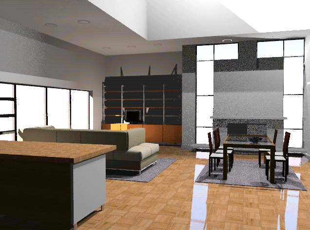

#  {{page.title}}
レンダリングウィンドウには、露出調整やポストプロセッシング効果を追加するオプションが表示されます。レンダリングウィンドウのメインフレームは、Rhinoのレンダリングフィレームワークの一部です。レンダリングメニューとアイコンの詳細については、[レンダリングウィンドウのトピック](http://docs.mcneel.com/rhino/5/help/ja-jp/commands/render.htm#The_Render_Window)を参照してください。このトピックは、Flamingo特有のレンダリングプロセスに追加された機能を説明します。

## アクティブなレンダリングの管理
レンダリングを始めると、[レンダリングウィンドウ](http://docs.mcneel.com/rhino/5/help/ja-jp/commands/render.htm#The_Render_Window)が起動し、レンダリングが開始されます。Flamingoは、段階によってレンダリングイメージを更新する、マルチパスシステムです。Flamingoはまず内部モデルに変更があるかどうかを確認し、初期化プロセスを開始します。このプロセスには、数秒から数分かかる場合があります。この初期プロセスでは、モデルがインポートされ、ハードドライブからマテリアルビットマップが集められ、レンダリングイメージバッファが作成されます。レンダリングを管理するプロセスには、いくつかのキーになるステップがあります。

>[マルチパスレンダリング](#multi-pass)
>[レンダリングを停止する](#stop-render)
>[イメージを調整する](#adjusting)
>[イメージを保存する](#saving)

### マルチパスレンダリング
{: #multi-pass}
Flamingo nXtは、まったく新しいレンダリングエンジンです。マルチパスのリファインメント方法を用いることで、複雑なインターフェイスに時間や労力を取られることなく、より高度なレンダリング効果を可能にします。最初の数回のレンダリングパスでは、変わったアーチファクトが見られます。例えば、影が非常にシャープで直線的であるなどです。しかし、パスを重ねるにつれ、影はブレンドされて柔らかみを帯びて行きます。同じく各レンダリングパスで向上していく他の多くの効果もあります。レンダリングプロセスを確認するには[Flamingoタブ](#flamingo-tab)を使用してください。

このように、nXtのレンダリングには「終り」がなく、レンダリングをいつ停止するのかを決定するだけになります。レンダリングを続けてより良くすることも、変更や保存のために好きな時にいつでも停止することもできます。

それぞれのパスで向上される効果には次のものが含まれます。

>照明（有効な場合、グローバルイルミネーションなど）
>ソフトシャドウ
>反射（不鮮明な)
>屈折
>アンチエイリアシング
>被写界深度

### レンダリングを停止する
{: #stop-render}
レンダリングは複数の方法で停止することができます。

 すぐにレンダリングを停止して、レンダリングウィンドを閉じるには、ウィンドウの右上にある「X」ボタンをクリックします。素早くモデルに戻って変更を加えたい場合に最適の方法です。

 現在のパスの最後でレンダリングを停止したい場合は、レイトレースを停止ボタンをクリックします。これはイメージを保存する前に使用するのに最適です。

 すぐにレンダリングを停止して、レンダリングウィンドウを開いたままの状態にしておきたい場合は、レイトレースを停止ボタンをダブルクリックします。

### レンダリングを調整する
{: #adjusting}
レンダリングを停止後、[Flamingoタブ](#flamingo-tab)のコントロールを使用して、イメージと照明を調整します。これらのツールはハイエンドのイメージを作り出そうとしている場合に非常に大切です。

イメージの調整に使用できるコントロールには次が含まれます。

>[イメージ調整](#adjust-image)
>[チャンネル](#channels)
>[ポストエフェクト](#post-process-effects)

### イメージを保存する
{: #saving}
イメージの使用目的によって、保存方法をいろいろと帰ることができます。通常、ほとんどのイメージはJPGまたはPNG画像ファイルとして保存するのがお勧めですが、他のオプションもあります。

####  イメージを保存
イメージを調整した後は、JPGまたはPNG 画像ファイルを保存するのが通常のプロセスです。  

JPG画像は、とても効率的で、サイズの小さいファイル形式です。Webに載せるまたはメールで送信する画像に適しています。しかし、効率的な代わりに、いくつかの色はイメージから取り除かれます。

PNGは、100%の色情報とアルファチャンネル情報を持つ圧縮された形式です。高品質のイメージに適した形式です。

#### 保存（背景アルファチャンネルを含める）
{: #save-with-alpha-channel}
32ビットのPNG、TIF、BMPイメージをアルファチャンネル背景を含めて保存します。質の高い合成に用いてください。レンダリングはアルファチャンネルを含めて保存されると、背景が黒で表示されます。[Flamingoタブ](#flamingo-tab)と[保存ダイアログ](#saving)ボックスには、アルファチャンネルを保存するためのチェックボックスがあります。PNG形式がアルファ情報を保存するのに適した形式です。

#### ネイティブFlamingo nXtファイルにエクスポート（.nXtImage）
{: #export-to-nxtimage}
非圧縮の輝度および色情報を保存します。[アルファ](environment-tab.html#alpha)を含むすべてのレンダリングチャンネルを保存します。nXtのイメージファイルは[イメージエディタ](image-editor.html)で開くことができ、[露出](#adjust-image)や[ポストプロセッシング効果](#effects)を適用して別のビットマップ形式で保存することができます。

nXtImage形式は、nXtレンダラーのネイティブのイメージ形式です。レンダリングのほとんどの情報を保存するので、推奨する保存形式です。この形式で保存されたイメージは、[nXtイメージエディタ](image-editor.html)で操作することができ、特殊効果を追加できます。このエディタでは、nXtでサポートされているすべての形式を含む、一般的によく使用されている多くの標準形式に保存ができます。[Piranesi EPixファイル（.epx）](http://www.piranesi.co.uk/)形式に保存することもできます。

#### HDRファイルにエクスポート
{: #export-to-hdr}
非圧縮の輝度および色情報を保存します。.hdr形式は、輝度データを直接ハイ・ダイナミック・レンジ形式に保存します。通常の写真のような輝度のない背景は、これらの形式の1つで保存すると黒で表示されます。

#### EXRファイルにエクスポート
{: #export-to-exr}
フリーソフトウェアライセンスの下でリリースされた、インダストリアル・ライト&マジック（ILM）によって作られたソフトウェアツールのセットと共にオープン標準としてリリースされたハイ・ダイナミック・レンジ画像ファイル形式です。このファイル形式は、符号1ビット、指数5ビット、仮数10ビットの16ビット/チャンネルの浮動小数点値（半精度）をサポートします。これは、30を超える値の露出のダイナミックレンジを可能にします。[Wikipediaの記事: OpenEXR](http://en.wikipedia.org/wiki/OpenEXR)を参照してください。
.exr形式は、輝度データを直接ハイ・ダイナミック・レンジ形式に保存します。通常の写真のような輝度のない背景は、これらの形式の1つで保存すると黒で表示されます。

####  閉じる
レンダリングウィンドウを閉じます。

#### プルダウンメニュー
レンダリングウィンドウのメニューとアイコンの詳細については、[レンダリングウィンドウのトピック](http://docs.mcneel.com/rhino/5/help/ja-jp/commands/render.htm#The_Render_Window)を参照してください。

## Flamingoタブ
{: #flamingo-tab}
レンダリングウィンドウのFlamingoタブは、Flamingoレンダリングエンジン特有の多くの追加コントロールを表示します。これらのコントロールを理解しておくことは、アクティブなFlamingoのレンダリングを管理するのに重要です。

#### 保存（背景アルファチャンネルを含める）
32ビットのPNG、TIF、BMPイメージをアルファチャンネル背景を含めて保存します。これらのファイルは質の高い合成に用いられます。レンダリングはアルファチャンネルを含めて保存されると、背景が黒で表示されます。アルファイメージを保存するには、このチェックボックスや[保存ダイアログ](#saving)ボックスを使用します。PNG形式がアルファ情報を保存するのに適した形式です。

## 進行状況
{: #progress}
Flamingoのレンダリングの状態と進行状況を確認するのに、この情報を用います。

#### 動作
モデルで進行中のレンダリングの現在の状況を表示します。

状況のメッセージには次のものが含まれます。

* レンダリング開始 - レンダリングが開始されると、モデルの変換とレンダリングのためのメモリのセットアップを含むいくつかのセットアップ作業が行われます。
* 操作完了 - 停止ボタンをクリックし、レンダリングエンジンがパスを終了すると、操作が完了されます。
* パス完了 - 1つのパスが完了する度にこのメッセージが表示されます。
* レンダリングを再開 - 再開が可能な場合に、このメッセージが表示されます。
* 更新中 - レンダリングエンジンがパスを処理中です。レンダリングが更新中です。

#### パス
現在Flamingoがレンダリング中のパスです。Flamingoは、マルチパスレンダリングエンジンです。それぞれのパスは、レンダリングをリファインし、照明効果や複雑なレンダリング効果を加えていきます。

#### スキャンライン
パスは、水平方向のピクセルに沿って進行します。ピクセルのそれぞれの行がスキャンラインです。この部分は、レンダリングエンジンから返された現在のスキャンラインを表示します。

#### 経過時間
レンダリング開始時からの経過時間です。これにはレンダリングのセットアップ時間は含まれません。

#### レイ/秒
シーンで処理される秒毎のレイの数です。

#### ピクセル/秒
イメージで処理される秒毎のピクセルの数です。

## イメージ調整
{: #adjust-image}
これはFlamingoで最も重要なコントロールの1つです。このコントロールを使えば、カメラのように、イメージの露出を調整できます。これは、レンダリングを明るくまたは暗くする、またはコントラストを付け加える、または色の彩度を上げる最良の方法です。この調整処理は、[トーンマッピング](https://en.wikipedia.org/wiki/Tone_mapping)と呼ばれます。Flamingoは、画面やプリンタで表示できるよりもより広い範囲の色や明るさを扱える輝度空間でレンダリング処理を行います。トーンマッピングは、輝度データを画面に表示または印刷される赤、緑、青（RGB）のピクセルに変換する処理です。これらの設定は、イメージの保存方法もコントロールします。

  
*デフォルトイメージ（左）。明るさ（0.20）、焼き込み（0.16）、彩度（1.20）を適用して補正したイメージ。*
再レンダリングしないでイメージの明るさと全体の色を素早く調整したい場合にこのプロセスを使用します。

### 明るさ
{: #brightness}
イメージの全体の明るさを調整します。例えば、モデルの中の白いサーフェスがグレーにレンダリングされている場合は、サーフェスが白く見えるまで明るさの度合いを上げることができます。反対に、屋外のシーンが露出オーバーになっているような場合、これでよいと感じるまでシーンの明るさの度合いを下げることができます。

*デフォルトの明るさ（左）、値を上げた状態*



### 焼き込み
{: #burn}
イメージの白点を調整します。これはイメージの中で最も明るい白色です。少量の焼きこみは、白い部分をより追加して暗い部分とのコントラストを加えることで、レンダリングをより印象的に、はっきりさせます。
[Wikipediaの記事: White point](http://en.wikipedia.org/wiki/White_point)を参照してください。

*デフォルト設定で焼き込み（左）、値を上げた状態*

### 彩度
{: #saturation}
彩度は、イメージの色の量をコントロールします。彩度が0.0の場合、グレースケールのイメージになります。彩度を1.00よりも大きくすると、色がより鮮やかになります。

*デフォルトの彩度（右）、3程値を上げた状態（左）*

### ヒストグラム
{: #histogram}
イメージの調整コントロールが適用された後に、イメージの明るいそして暗い部分の分布を図（グラフ）で表示します。ヒストグラム表示の左端は真っ暗な状態（黒）です。右端は一番明るい状態（白）を表示します。これはイメージの重点を置きたい部分を決定するのにとても良い方法です。イメージにあらゆる範囲の値があるように調整するのがよい目標でしょう。 例えば、ヒストグラムがグラフの右端に達する前に止まっている場合、明るさや焼き込みををより高い値にすると右端（白、一番明るい）まで値が分布されるようになります。[Wikipediaの記事: Histogram](http://en.wikipedia.org/wiki/Histogram)を参照してください。インターネットには、デジタル写真の露出を確認するのにヒストグラムを用いることに関する多くの情報があります。原理はレンダリングも同じです。

*イメージの色の分布を表示しているヒストグラムの例。灰色のグラフが、暗い部分が少なく（左側）、広い範囲の明るい色がある（右側）ことを表しています。（しかし、右端（白、一番明るい）に達する前にグラフが下がることから完全な白のピクセルは少ししかないことが分かります。）*

#### ヒストグラムのオプション
ヒストグラムのイメージを右クリックすると、下のオプションが表示されます。これらのオプションは、ヒストグラムの情報の表示方法を変更します。（ヒストグラムの値は変更されません。）

* **フィット** - 縦方向の一番高い部分をグラフにフィットさせます。
* **中央値** - 縦方向の中央値をフィットさせます。これは、ヒストグラムの両端の詳細を確認するのによい方法です。
* **平均値** - 縦方向の平均値をフィットさせます。
* **並べ替えたグラフを表示** - すべての値をイメージにある量に基づいて並べ替えます。
* **スケールを表示** - ヒストグラムの一番下に沿って、対応する値を表示します。
* **グラフの色...** - グラフの色を設定します。

### 露出を固定
{: #lock-exposure}
露出設定を固定すると、照明を変更しても補正のための露出調整はされません。

## レンダリング停止条件
{: #number-of-passes}
{: #time}
{: #render-constraints}


## 情報
{: #information}

#### 解像度
現在の[レンダリング解像度](render-tab.html#resolution)を表示します。

#### 面
モデルをレンダリングするのに使用されたメッシュ面の数を表示します。この値はRhinoでの様々な[レンダリングメッシュの設定](http://docs.mcneel.com/rhino/5/help/ja-jp/index.htm#documentproperties/mesh.htm)を比較するのに便利です。

#### 見掛けの面
モデルにブロックがある場合、Flamingo nXtはそれぞれのインスタンスのメッシュを再生成しなくても、ブロック定義を用いてブロックインスタンスをレンダリングすることができます。見掛けの面は、ブロックインスタンスがなかった場合に、後どのくらいの一時面が生成されるかを表示します。

#### 照明の情報
レンダリングの現在の照明設定に関するいくつかの情報が表示されます。表示される情報は次のとおりです。

>[プリセット](lighting-tab.html)
>[太陽](sun-and-sky-tabs.html#sun)
>[空](sun-and-sky-tabs.html#sky)
>[光源](lights-tab.html)
>[間接光](lighting-tab.html#indirect)
>[環境光　オン/オフ](lighting-tab.html#ambient)

## チャンネル
{: #channels}
リアルタイムで光源チャンネルを変更する場合に、これらのコントロールを使用します。8つのチャンネルの1つに光源を割り当てます。レンダリングが表示されたら、レンダリングイメージの照明を調整します。これはレンダリングで複数の光源のバランスを調整するのにとても便利です。詳細については、[レンダリングチャンネル](render-channel.html#adjustng-channels)のトピックを参照してください。

## ポストエフェクト
{: #post-process-effects}
イメージがレンダリングされたら、ポストプロセッシング効果を適用できます。これらはオン、オフを切り替えられ、リストで順序を変えることもできます。設定はそれぞれの効果によって変わります。次のエフェクトがあります。

>フォグ
>グロー
>グレア
>被写界深度
>点
>曲線
>アイソカーブ
>注釈

それぞれのフィルタの詳細については、[イメージのポストプロセス](http://docs.mcneel.com/rhino/5/help/ja-jp/commands/render.htm#The_Render_Window)のトピックを参照してください。
