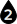

#  {{page.title}}
カラーセレクタは、多くのマテリアルのグループやプロパティに使用されます。すべての場合で、操作は同じ方法で行います。

セレクタには2つの部分があります。

1. [色見本](#swatch) - 色をクリックすると、メインカラーセレクタが表示されます。
1. [オプションメニュー](#options) - 矢印をクリックすると、その他のカラーユーティリティが表示されます。

## 色見本 
{: #swatch}
色見本をクリックし、色の選択ダイアログボックスから色を選択します。

##### 名前の付いた色リストから選択する
* 左側の名前のリストから色を選択します。

##### カラーホイールセレクタ（色の輪）から選択する
1. 色の輪（ホイール）でマーカーをドラッグして、色相を決めます。
1. 内側にある正方形でマーカーを上下にドラッグして、彩度のレベルを決めます。
1. 内側にある正方形でマーカーを左右にドラッグして、明度を決めます。

##### 色相、彩度、明度ボックスで設定する
1. 色相は、0度から359度で計測することができます。これは、円状に60度の増分で虹の色相とほぼ同一になります（赤、オレンジ、黄色、緑、青、バイオレット）。彩度と明度と組み合わせて最終の色を作るためのベースの色相を選択してください。
1. 彩度は、色の濃度を0から100のスケールで表現します。彩度が0の場合、色の明度によって黒から白の間で変化する中間グレー色が表示されます。彩度要素が0の色には、色相は何も影響しません。彩度が100の場合は、色相の最も濃いものが表示されます。
1. 明度は、色の光の値（つまり白）の知覚量を表します。明度要素は、0から100の間で変化します。明度は、輝度または明るさとも呼ばれます。

#### 赤、緑、青（RGB)
{: #rgb}
この方法は、コンピュータが画面に色を投影する際に使用されます。それぞれのピクセルは、濃度の異なる3つの色の組み合わせからなっています。純色の赤は、緑や青の混じっていない完全な赤です。純色の黒は、赤、緑、青が0に、また、純白は、赤、緑、青が255に設定されています。

## メニューオプション 
{: #options}

#### カラーピッカー
上で説明した[色見本](#swatch)ダイアログボックスを開きます。これは、色見本をクリックするのと同じです。

#### スポイト
スポイトツールを使用して色を画面のどこからでもピックできます。

#### コピー
色見本から色をコピーします。ペーストオプションを使用して別のカラーセレクタで使用するためです。

#### ペースト
1つの色見本から別の色見本へ色をペーストします。上のコピー機能を使用した後に、このペーストオプションを使用してください。
