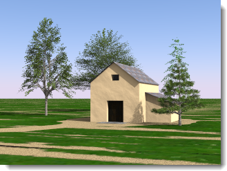
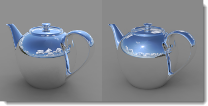

#  {{page.title}}
[太陽](#sun)と[空](#sky)は、お互いに密接な関係があります。太陽は自動モードで空の明るさを変更することができます。太陽がオンで、空がHDRIの場合、この2つの強弱の釣り合いを取るのが重要です。

## 太陽
{: #sun}
太陽表示されない強い平行光源です。太陽の方向と明るさは実世界の状況をシミュレートする緯度と経度、その日の時刻、季節などの要素でコントロールされます。

このヘルプトピックは、Flamingoの太陽コントロールについて詳しく述べます。[Rhinocerosの太陽](http://docs.mcneel.com/rhino/5/help/ja-jp/commands/sun.htm)コントロールも太陽を配置するのに用いることができます。Flamingoは、これら2つの太陽コントロールを同期させます。

##### Flamingo太陽コントロールの位置

太陽は、[照明プリセット](lighting-tab.html#lighting-presets)または[カスタム照明設定](lighting-tab.html#sun)を通してアクティブにします。

* ツールバー >Flamingo nXtツールバー
* メニュー > Flamingo nXt 5.0プルダウン > コントロールパネルを表示 > Flamingo nXtタブ > 太陽

**メモ:** 照明プリセットで太陽がオンになっている場合のみ、太陽タブが表示されます。

太陽光の計算を行うためには太陽の角度が必要です。太陽の方向を指定するには2つの方法があります。日付と時刻、場所で指定する方法と、直接角度で指定する方法です。モデルの位置のシミュレーションで、実際の太陽の効果を確かめたい場合、日付と時刻、位置を用いるとよいでしょう。直接角度を指定する方法は、実世界の太陽と関係なく光の角度をコントロールします。照明効果を試すには、直接角度を指定する方法を使用してください。

  
*6月21日の午前9時半、オーストラリアのシドニー（左）、6月21日の午前9時半、スウェーデンのストックホルム（右）*

### 方位角と高度を設定
{: #set-azimuth-and-altitude}
太陽の方向を手動で設定するのに太陽の角度を使用します。[方位角](#azimuth)と[高度](#altitude)のコントロールが使用できるようになります。

#### 方位角
{: #azimuth}
水平面の北（0）からの角度で太陽の方向を設定します。円形の図は、平面図でのワールドを表示します。

#### 高度
{: #altitude}
赤道（0）からの角度で太陽の空での高度を設定します。半円形の図は、ワールド座標の垂直方向を通る断面をシミュレートします。

### 地球上の位置を設定
{: #set-location-on-earth}
太陽角度計算機を使用して、日付、時刻、位置に基づいて太陽を配置します。  **メモ:** どの太陽計算機とも同じように、太陽の配置の精度は変わることがあります。絶対精度が必要な場合、太陽の位置を確認するようにしてください。  

#### 日付
{: #date}
日付を指定します。

#### 時刻
{: #time}
現地時刻を指定します。

#### 夏時間
{: #daylight-savings-time}
1時間進めた時刻を設定します。

#### 緯度/経度
{: #latitude-longitude}
緯度と経度を入力するか、地図で位置をピックします。
緯度と経度の値は、マウスカーソルで地図をクリックした位置の値に更新されます。

#### タイムゾーン
{: #time-zone}
緯度と経度に基づいて現在の位置のタイムゾーンを表示します。

#### 都市のリスト
{: #city-list}
このリストの都市を選択して位置を設定します。

#### 地図
{: #map}
地図をクリックして位置を指定します。地図をパンする場合は、左マウスボタンでドラッグします。

### 太陽の強度
{: #sun-intensity}
昼光光源の太陽光（直射光）要素の明るさを変更します。太陽の角度と空の状況に基づいて、太陽光の強度は自動的に計算されますが、他の光源とバランスを取るため変更することもできます。

### 太陽のハイライト
{: #sun-highlight}
太陽のハイライトのシャープさの度合いです。

*太陽のハイライト=0（左）、1（右）*

**メモ:** 太陽のハイライト設定を用いると、時として屋外のレンダリングに日光のハイライトのアーチファクトが見られることがあります。このアーチファクトを軽減、もしくはなくすには、太陽のハイライトを小さな値に設定します。
{: #speckle-artifacts}



#### 北の方向
{: #north}
**メモ:** 北はワールドY方向です。

## 空
{: #sky}
空は、照明に使用できるレンダリングの周りの大きな球です。空は環境とは非常に異なります。空は照明をコントロールします。環境は何が背景に表示され、映されるのかをコントロールします。空と環境を異なる設定にするケースは多くあります。

#### Flamingo空コントロールの位置
空は、[照明プリセット](lighting-tab.html#lighting-presets)または[カスタム照明設定](lighting-tab.html#sky)を通してアクティブにします。

 1. ツールバー >Flamingo nXtツールバー
 1. メニュー > Flamingo nXt 5.0プルダウン > コントロールパネルを表示 > Flamingo nXtタブ > 空

[屋外](lighting-tab.html#exterior-daylight)と[屋内](lighting-tab.html#interior-daylight)昼光の照明プリセットスキームは、デフォルトで自動設定の空を使用します。[スタジオ](lighting-tab.html#studio-lighting)照明プリセットスキームは、HDR画像照明をデフォルトで使用します。

空は5つの方法で設定できます。

>[オフ](lighting-tab.html#off)
>[自動設定](#automatic-sky)
>[ハイ・ダイナミック・レンジ・イメージ（HDRI）](#high-dynamic-range-image-sky)
>[色](#color-sky)
>[画像](#image-sky)

2つの最良の空照明のタイプの設定は、[HDR画像](#high-dynamic-range-image-sky)の空と[自動設定の空](#automatic-sky)です。HDR画像の空は、光と反射を表現する、それぞれのピクセルに照明値を格納する画像を使用します。自動設定の空は、実世界の太陽の位置と雲量を用いて空を模倣します。これらの設定は、最もダイナミックなレンダリングを作り出します。

### 空の自動設定
{: #automatic-sky}
空の自動設定は、[太陽タブ](sun-and-sky-tabs.html)の設定を用いて、スカイライト（天空光）の色の範囲と強度を指定します。例えば、太陽が空の高い位置にある場合、空の明るさや色は太陽が空の低い位置にある場合ととても異なります。

*自動設定の空: 空の高い位置にある太陽（左）、空の低い位置にある太陽（右）*

#### 雲量
{: #sky-cloudiness}
雲量がオフの場合、空は晴れ渡っていると考えられ、強い影が作り出されます。雲量が高ければ高いほど、明るいところと影の部分のコントラストが低くなります。また、影は薄くなり、均等な照明効果が作り出されます。雲量設定は、直接光と間接光の相対量、間接光の計算方法、空の自動設定が選択された場合の背景色など、昼光の計算のいろいろな要素に影響します。雲量は、0（晴天）から1（完全に雲に覆われた空）の間の値で設定できます。雲量が約0.35 - 0.50では、非常に繊細でダイナミックな範囲です。

*雲量0（左）、雲量1（右）*

#### 空の強度
{: #sky-intensity}
昼光光源の天空光（間接光）要素の明るさを変更します。太陽の角度と空の状況に基づいて、天空光の強度は自動的に計算されますが、変更することもできます。 **メモ:** この設定は、シーンに他の光源があり、そのために補正しなければならない場合のみに関係します。他に光源がない場合、トーンマッピングが露出を補正し、レンダリングイメージはこの設定によって明るくなったり暗くなったりすることはありません。



### ハイ・ダイナミック・レンジ画像の空
{: #high-dynamic-range-image-sky}
[ハイ・ダイナミック・レンジ（HDRまたはHDRI）](https://en.wikipedia.org/wiki/High-dynamic-range_imaging)画像は、特殊な2D画像ファイルです。これらの画像は、各ピクセルで.jpgや.pngなどといった標準の画像ファイルよりもより広範囲の値を含みます。このより多くのデータはモデルの照明に用いられます。HDRに含まれた値が正確であれば、照明も正確です。これは非常にダイナミックな照明をシーンに作り出します。プリセットのスタジオ照明スキームは、空にHDR画像を使用します。スタジオ照明を屋内ですることと考えると、HDR画像は画像の色を基準に光を発する天井として考えるとよいでしょう。

*HDRi照明*

HDR画像は通常ワットの単位で表された放射輝度値を含んでいますが、それが含まれていない場合、HDR画像の強度は適切な照明レベルを達成するために調整が必要なこともあります。

空に加え、異なるHDR画像を[表示](environment-tab.html#advanced-background)、[反射](environment-tab.html#advanced-background)、そして[屈折](environment-tab.html#advanced-background)の3つの表示背景のそれぞれに用いることもできます。

#### HDRI画像
HDR（HDRとHDRIは同じファイル形式）画像ファイルを指定します。異なるHDRIを選択するには、画像をクリックします。

*正距円筒図法*

HDR画像は、画像を適切に球体の空に巻き付ける2種類の投影方法で提供されます。最も人気があるのは正距円筒図法です。これらの画像は、縦横比2:1の長方形です。正距円筒図法の画像の解像度は、画像全体に渡って似通っています。2つ目の投影は、球状投影です。球状のHDRI画像は、正方形で、画像は大きな曲率を表示します。球状投影は、解像度がつなぎ目（シーム）で 低くなります。

#### 強度
HDR画像光源の明るさを変更します。この設定は、シーンに他の光源があり、そのために補正しなければならない場合のみに関係します。他に光源がない場合、トーンマッピングが露出を補正し、レンダリングイメージはこの設定によって明るくなったり暗くなったりすることはありません。

*HDR強度を低く設定（左）、HDR強度を高く設定（右）*

下のイメージでは、画像は太陽がオブジェクトに映るように回転されています。回転角度を入力するか、回転ウィジェットインジケータをインタラクティブに移動してください。

*オブジェクトに太陽が映るように画像を回転。*

#### 彩度
光の彩度です。HDR画像からの光は、画像のピクセルの色なので、望まないような色効果が出る場合があります。色ではなく画像からの光を必要としている場合は彩度を低く設定してください。

*彩度を低く設定（左）、彩度を高く設定（右）*





### 色
{: #color-sky}
色や色のグラデーションを使ってシーンを照らすことも可能です。空の色は、強度の値で乗算され、照明値を色に与えます。

#### 強度
強度の値は、空の色を乗算し、結果を照明値にするために使用されます。色の範囲はチャンネル毎に0 - 256です。強度は、これらの値を乗算します。

#### 色のタイプ
空の色をコントロールする方法には、3通りあります。これらは、色環境のコントロールに似ています。詳細については、[色背景](environment-tab.html#environment-color-and-gradient-backgrounds)コントロールを参照してください。

### 画像
{: #image-sky}
画像を使ってシーンを照らすことも可能です。画像の色は、強度の値で乗算され、照明値を色に与えます。

#### 強度
強度の値は、空の色を乗算し、結果を照明値にするために使用されます。色の範囲はチャンネル毎に0 - 256です。強度は、これらの値を乗算します。

#### 画像の投影
画像を空にマップする方法は、何通りもあります。これらは、画像背景コントロールに似ています。詳細については、[画像背景](environment-tab.html#environment-image)を参照してください。
