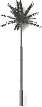

<!-- TODO: This could use an update. -->

#  {{page.title}}
{: #tree-editor}

### ファイルプルダウン

#### 新規作成
テンプレートに基づいて新規植物の定義を作成します。

 |  |  |  |
 |:-------------------------------------------:|:-----------------------------------------:|:-------------------------------------:|
 | **標準**                                |   **コニファー**                             | **広い樹冠**                       |
 |          |  |  |
 | **ヤシ**                                    |  **グランドカバー**                          | **複雑形状**                                  
{: .plant-table}

#### 開く
既存の樹木定義を開きます。

#### 上書き保存
現在の樹木定義を保存します。

#### 名前を付けて保存
現在の樹木定義を異なる名前で保存します。

### レイトレースプルダウン
プレビューイメージをレンダリングします。

*デフォルト（左）、レイトレース（右）表示*

#### 開始
プレビューイメージのレンダリングを開始します。

#### 終了
プレビューイメージのレンダリングを終了します。

### 表示プルダウン
ターゲットを中心にビューカメラを回転するには、左マウスボタンを使ってドラッグします。
カメラを中心にターゲットを回転するには、右マウスボタンを使ってドラッグします。
ズームイン、アウトするには、マウスホイールを使ってスクロールします。

#### デフォルトに戻す
デフォルトのシェーディング表示に戻します。

#### 葉を表示
樹木プレビューに葉を表示します。

*葉がない状態（左）、葉を表示した状態（右）
*

### 設定プルダウン
エディタの単位を作業単位に合うように設定します。
