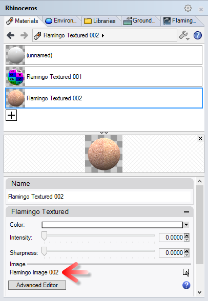

<!-- TODO: Make sure to update this page and get working in the guides section of the documentation. -->

# {{page.title}}
일반적인 Rhino 모델을 nXt에서 렌더링하는 방법을 소개합니다. nXt에서 렌더링하는 기본적인 과정은 다음과 같습니다:

1. 모델 열기
1. 재질 만들기
1. 재질 편집
1. 지반면 추가

우선 튜토리얼 압축 파일을 다운로드하여 압축을 풉니다. 압축 파일을 다운로드하려면 [이 Fishing Reel.zip 링크를 클릭](files/nxt5%20fishing.zip) 하세요. 다운로드한 파일의 압축 해제 위치를 사용자의 컴퓨터에서 기억하기 쉬운 폴더로 지정하여 압축을 풉니다. Rhino에서 Fishing Reel.3dm 파일을 엽니다. 렌더링 메뉴에서 현재 렌더러가 Flamingo nXt 로 설정되어 있는지 확인합니다.

## 현재 렌더링 엔진 확인하기
{: #check-current}
Rhino에 여러 렌더링 엔진이 설치되어 있을 수 있습니다. Flamingo nXt 5가 현재 렌더링 엔진인지 확인하려면 렌더링 메뉴 > 현재 렌더러 > Flamingo nXt 5 로 갑니다. Flamingo nXt 5 옆에 확인 표시가 있으면 Flamingo nXt 5가 현재 렌더링 엔진입니다.

## 렌더링 프로세스
{: #render_controls}
{: .float-img-right} 모델을 처음으로 렌더링하기 위해 렌더링 단추를 클릭합니다. 이미지가 오른쪽 이미지처럼 보여야 합니다. nXt 는 이제까지의 Flamingo와는 다르게 실행됩니다. 새 모델에는 기본 HDRI 조명 설정이 포함됩니다. 새 모델은 모든 개체에 흰색 재질을 기본값으로 사용합니다. 또한, 그림자가 처음에는 매우 선명하고 직선적입니다. 패스가 지나갈수록 그림자가 점점 부드러워지고 블렌드되어 갑니다. 렌더링 패스가 진행됨에 따라 다른 많은 효과도 점차 향상됩니다.

패스를 향상시키는 효과 중 일부는 다음과 같습니다.

* 조명 (전역 발광을 사용할 때)
* 부드러운 그림자
* 반사 (흐림)
* 굴절
* 앤티앨리어싱
* 피사계 심도 (DOF)

이에 따라, nXt 렌더링은 절대로 "끝나지 않습니다". 사용자가 언제 멈춰야 좋은지 결정할 뿐입니다. 더 좋은 이미지를 원한다면 계속 렌더링을 진행할 수 있습니다. 변경이나 저장하려면 언제든지 이미지 렌더링을 멈출 수 있습니다. 렌더링을 중단하는 방법에는 다음과 같은 몇 가지 방법이 있습니다:
{: .clear-img}

* 현재 패스의 끝에 렌더링을 중지하려면 광선 추적 중지 단추를 클릭합니다.
* 렌더링을 즉지 중지하려면 광선 추적 중지를 두 번 클릭합니다.
* 렌더링을 즉시 중지하고 렌더링 창을 닫으려면 렌더링 창의 오른쪽 위에 있는 “X” 단추를 클릭합니다.

## 라이브러리의 재질 적용
{: #materials}
기본 조명은 nXt에 이미 탑재되어 있으므로, 대부분의 렌더링 설정이 적합한 재질을 만드는 데서 시작합니다. 재질은 각각의 모델에 직접 저장됩니다. 재질 세트를 만들기 위해, 쉽게 새 재질을 만드는 데 도움이 되는 재질 템플릿을 사용할 수 있습니다.

  1. Rhino의 Flamingo nXt 메뉴에서 Flamingo nXt 제어 패널을 엽니다.
  1. 기존 재질을 적용하려면 제어 패널의 라이브러리 탭에 갑니다.
  1. 재질이 폴더별로 정리되어 있습니다. Flamingo 재질 폴더로 갑니다.
  
  1. Flamingo 재질 > 금속 폴더로 갑니다.
  {: .wide-img}
  1. 크롬 재질을 마우스로 끌어 Handle과 Metal Parts 레이어에 놓습니다.
  1. 결과를 렌더링합니다. Handle과 Metal Parts 레이어의 파트가 크롬 재질로 마무리되어 렌더링됩니다.
  
  1. 다음 재질을 지정된 레이어에 적용합니다:

 | 라이브러리 | 재질 | 레이어 |
 |:-------|:------|:------|
 | 선박 | 검정 고무 | Bushing & Washer |
 | 선박 | 검정 고무 | Grips |
 | 선박 | 검정 고무 | Rod Grips |
 | 자동차 페인트 | 자동차 페인트 빨강 | External Body |
 | 금속 > 골드 | 골드 Satin-Plain | Internal Body |
 | 금속 > 아노다이즈 | 알루미늄 - 아노다이즈 Red | Spool |
 | 플라스틱 > 검정 > Smooth | Plastic Black - Smooth | Rod |
 | 플라스틱 > 검정 > Smooth | Plastic Black - Smooth | Rod Handle |
 | 플라스틱 > 검정 > Smooth | Plastic Black - Smooth | Wire Guide |
{: .grided-table}

##### 이 결과를 보려면 렌더링:
 

## 새 재질 만들기
{: #new-material}
라이브러리에 미리 만들어져 있지 않은 재질이 필요한 경우가 자주 있을 것입니다. 예를 들어, 낚싯대는 코르크로 덮혀있어야 하는데, 이 경우 새 재질을 만드는 것만이 유일한 방법입니다. 코르크 재질을 만들기 위해 새로운 텍스처 재질 유형을 만들 것입니다.

 1. 재질 탭으로 갑니다.
 1. 재질 목록의 아래쪽으로 스크롤합니다.
 1. 새 재질 단추를 선택합니다 (+기호)
  
 1. 새로운 Flamingo 텍스처 재질을 선택합니다.
 1. 텍스처를 선택해야 합니다.
 1. 튜토리얼 파일의 압축을 풀었던 폴더로 가서 Cork.jpg를 클릭하고 열기를 클릭합니다.
 1. 간단한 텍스처 재질이 있는 것을 알 수 있습니다. 비트맵의 타일 크기는 대부분의 경우에 중요합니다. 타일 크기를 변경하려면 비트맵 이름을 클릭합니다.

 1. 타일의 너비를 100으로 조정합니다.

 1. 이름 필드에 "코르크"를 입력하고 확인을 누릅니다.

 1. 일단 만들어지면, 코르크 재질을 마우스로 끌어 Cork Handle 레이어에 놓습니다.

## 지반면 켜기
{: #groundplane}
지반면을 추가하면 개체를 장면에 설정할 때 도움이 됩니다.

1. 지반면 패널로 갑니다. 지반면 패널이 보이지 않는다면 다른 패널 탭을 오른쪽 클릭하여 지반면을 선택합니다.
1. 지반면을 활성화하기 위해 사용을 클릭합니다. 여기서는 기본 지반면 높이를 사용합니다.
1. 여기에서는 지반면에 사용할 새로운 재질을 만들어야 합니다. 재질 목록의 아래로 스크롤하여 플러스(+) 기호를 클릭합니다.

1. 새로운 Flamingo 텍스처 재질을 선택합니다.
1. 텍스처를 선택해야 합니다.
1. 튜토리얼 파일의 압축을 풀었던 폴더로 가서 Deckwood.jpg를 클릭하고 열기를 클릭합니다.
1. 간단한 텍스처 재질이 있는 것을 알 수 있습니다. 비트맵의 타일 크기는 대부분의 경우에 중요합니다. 타일 크기를 변경하려면 비트맵 이름을 클릭합니다.
1. 타일의 너비를 125로 조정합니다.
1. 이름 필드에 "Floor" 를 입력하고 확인을 누릅니다.
1. 렌더링이 다음과 같아야 합니다:

## 렌더링 이미지 조정
{: #image-adjust}
렌더링이 끝난 후, 렌더링된 이미지를 조정하는 것이 Flamingo의 활용도를 최대화하는 방법입니다. 이미지를 저장하기 전에 실시간으로 이미지를 조정할 수 있습니다. 많은 경우, 약간의 번과 밝기를 추가하는 것을 권장합니다.

1. 렌더링 창에서 Flamingo 탭으로 갑니다.
1. 중지 아이콘을 클릭하여 렌더링이 멈추는지 확인합니다.
1. 이미지 조정 아래의 번을 0.1 로 변경합니다.
1. 이미지 조정 아래의 밝기를 0.1 로 변경합니다.

1. 결과는 다음과 같아야 합니다:

*흰색(번)과 전체적인 밝기(밝기)가 더욱 밝아졌음을 알 수 있습니다. 번은 더욱 동적인 이미지를 만드는 데 특히 효과적입니다.*

여기가 튜토리얼의 끝입니다. 이 자료가 도움이 되셨기를 바랍니다.
