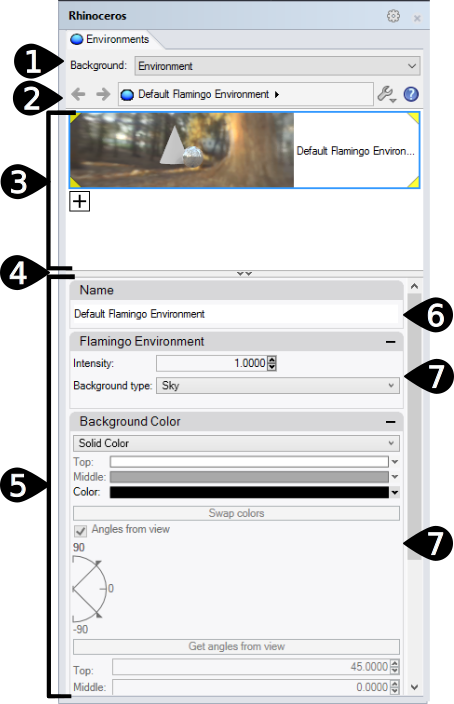

#  {{page.title}}
{: #environment-tab}
환경은 렌더링 배경으로 보일뿐 아니라, 모델을 둘러싼 무한한 구를 제어합니다. 장면의 개체는 환경을 반사하고 굴절합니다. 환경 구는 사용자가 선택할 수 있는 개체가 아니라, 배경 효과를 위한 참조 서피스입니다.

환경은 배경에서 보이는 부분과 반사에 영향을 미칩니다. 장면의 조명에 영향을 미치는 효과에 대한 자세한 정보는 [하늘](sun-and-sky.html) 도움말 항목을 참조하세요.

Flamingo에는 특별한 환경인 *[기본 Flamingo 환경](environment.html)*이 있습니다. 이 환경은 현재 [조명 기본 설정](lighting-tab.html)과 동기화합니다. [조명 기본 설정](lighting-tab.html)을 사용하면 조명과 환경이 그에 적합한 장면 기본값으로 설정됩니다.

{:  #panel_map height="600px" style="float: right"}

##### 이 명령은 어디에서 찾을 수 있습니까?
 1. 환경 탭
 1. 렌더링 도구 도구모음 >  환경 편집기
 1. 메뉴 > 렌더링 메뉴 > 환경 편집기
 1. 명령 > EnvironmentEditor

환경 편집기 패널은 별개의 섹션으로 나뉘어져 있습니다. 환경 유형에 따라 고급 패널이 달라질 수 있습니다.

색과 텍스처는 색 견본에서 원하는 색을 마우스로 선택하여 재질 편집기, [텍스처 팔레트](texturepalette.html), 또는 [환경 편집기](environmenteditor.html)의 색 견본/제어에 놓을 수 있습니다.
환경 패널

 1. [배경 유형](#type)
 1. [설정 막대](#settings)
 1. [환경 목록](#environment_list)
 1. [창 구분](#divider)
 1. [환경 속성 섹션](#properties)
 1. [이름](#name)
 1. [환경 속성 패널](#panels)

## [배경 유형](#panel_map) 
{: #type style="clear: both;"}
모델의 배경 유형을 선택합니다. [환경](#flamingo-environment)은 모든 것이 포함된 렌더링 환경이며 Flamingo의 기본 설정입니다. 다른 세 개의 설정에는 기존의 배경을 정의하는 방식을 반영한 훨씬 간단한 설정이 있습니다. 자세한 정보는 [Rhinoceros 간단한 배경](http://docs.mcneel.com/rhino/5/help/ko-kr/commands/environmenteditor.htm#Basic_settings) 항목을 참조하세요.

이 도움말 항목에서 환경 유형에 대해 상세하게 설명합니다.

## [설정 막대](#panel_map) 
{: #settings}
이 막대를 사용하여 환경 목록을 탐색하세요.

####  뒤로 화살표
현재 환경 또는 이전에 선택된 환경에서 뒤로 갑니다. 예를 들어, 반사 또는 굴절 레이어가 있는 환경의 경우, 이 화살표를 사용하여 반사 또는 굴절 디테일에서 부모 환경으로 되돌아갑니다.

####   앞으로 화살표
이전에 선택된 환경을 통해 앞으로 갑니다. 예를 들어, 반사 또는 굴절 레이어가 있는 환경의 경우, 이 화살표를 사용하여 반사 또는 굴절 디테일에서 부모 환경을 향해 앞으로 갑니다.

####  현재 선택된 환경 이름
현재 환경의 이름과 편집 레벨을 표시합니다. 예를 들어, 반사 또는 굴절 레벨이 있으면 ">" 기호가 표시됩니다. 현재 환경을 보기에 좋은 위치입니다.

####  도구 메뉴
[도구 메뉴](#tools-menu)를 표시합니다. 이것은 환경과 관련된 명령, 설정, 유틸리티의 확장된 메뉴입니다.

####  도움말

## [환경 목록](#panel_map) 
{: #environment_list}
이 모델에 있는 모든 환경의 목록입니다. 하나의 환경이 현재 환경으로 선택됩니다. 렌더링에는 현재 환경이 사용됩니다. 현재 환경을 둘러싸는 노란색 모서리가 표시됩니다.

이 목록에서:

* 환경을 클릭하여 현재로 지정합니다. 일단 환경을 선택하면 환경의 속성이 아래의 패널에 표시됩니다. 자세한 정보는 [렌더링 재질 속성](#properties)을 참조하세요.
* 목록에서 위/아래로 스크롤하여 모델의 모든 환경을 봅니다.
* 목록의 아래쪽에 있는 새 환경 추가 단추  를 사용하여 새로운 환경을 추가합니다.
* 썸네일을 오른쪽 클릭하면 환경 관련 메뉴가 표시됩니다.
* 비어 있는 공간을 오른쪽 클릭하면 새로운 환경 관련 메뉴가 표시됩니다.

###   새 환경 추가
{: #add_environment}
추가 아이콘을 보려면 환경 목록의 아래로 스크롤합니다.

환경의 렌더링 콘텐츠 [라이브러리](libraries.html)를 엽니다.
라이브러리의 환경은 모델에 환경을 만들 때 템플릿처럼 실행됩니다.

### 환경 상황에 맞는 메뉴
{: environment_context}
이 메뉴는 환경 목록에서 오른쪽 클릭하여 사용할 수 있습니다. 이 메뉴의 다양한 옵션에 대한 자세한 정보는 [도구 메뉴](#tools_menu)를 참조하세요.

### 새로운 환경 상황에 맞는 메뉴
{: new_envrionment_context}
이 메뉴는 환경 목록에서 비어 있는 공간을 오른쪽 클릭하여 사용할 수 있습니다.

####  새로운 환경 만들기
새로운 Flamingo 환경을 만듭니다.

####  파일에서 환경 가져오기...
이 명령을 사용하여 이전에 내보낸 환경을 선택합니다.

####  붙여넣기
클립보드의 콘텐츠를 바탕으로 새로운 환경을 만듭니다.

####  인스턴스로 붙여넣기
인스턴스 작업을 통해 원래 환경과 연결되어 있는 클립보드의 콘텐츠를 기준으로 새로운 환경을 만듭니다.

####  그리드
미리보기를 썸네일 그리드로 표시합니다.

####  목록
미리보기를 썸네일 목록으로 표시합니다.

####  나무
미리보기를 중첩된 트리로 표시합니다.

####  가로 레이아웃
제어의 왼쪽으로 미리보기를 표시합니다.

####  미리보기 창 표시
현재 선택된 썸네일의 미리보기 속성을 표시합니다. 미리보기 지오메트리, 크기. 배경, 회전 동작을 설정합니다.

####  플로팅
조정 가능한 창에서 미리보기 이미지를 플로팅(floating)으로 설정합니다.

#### 썸네일

#####  작게
썸네일 크기를 가장 작은 크기로 설정합니다.

#####  중간
썸네일 크기를 중간 크기로 설정합니다.

#####  크게
썸네일 크기를 큰 크기로 설정합니다.

#####  레이블 표시
썸네일 이름 레이블을 그리드 모드에서 표시합니다.
목록 모드는 항상 레이블을 표시합니다.

#####  단위 표시
크기를 모델 단위로 표시합니다.

#####  미리보기 자동 업데이트
설정이 변경되면 그에 따라 자동으로 모든 미리보기를 업데이트합니다.

#####  모든 미리보기 업데이트
미리보기 자동 업데이트가 꺼져 있을 때 수동으로 미리보기를 업데이트합니다.

## [창 구분](#panel_map) 
{: #divider}
이 구분선을 마우스로 끌어 환경 속성 섹션에 대한 환경 목록 길이를 변경합니다.

## [환경 속성 섹션](#panel_map) 
{: #properties}

### [환경 이름](#panel_map) 
{: #name}
환경의 이름입니다. 환경 이름은 환경을 라이브러리로 내보낼 때 파일 이름으로도 저장됩니다. 안내: 환경은 Rhino 모델에 보관됩니다. 서로 다른 Rhino 모델에서 고유한 환경의 이름은 동일할 수 있습니다.

### [환경 패널](l#panel_map) 
{: #panels}
환경 속성 섹션은 몇 가지 직접적인 환경 패널로 구성되어 있습니다. 회색 제목 표시줄을 클릭하면 환경 패널이 접히고 해당 패널의 콘텐츠가 숨김 상태가 됩니다. 제목 표시줄을 다시 클릭하면 콘텐츠가 다시 표시됩니다.

환경 패널은 환경의 유형과 현재 활성인 환경의 레벨에 따라 달라집니다. 특정 환경 패널에 대한 자세한 정보는 [Flamingo 환경](environment.html)을 참조하세요.

## 도구 메뉴 
{: tools_menu}
이 설정은 썸네일 미리보기와 썸네일 배경을 오른쪽 클릭하여 표시되는 메뉴에서도 선택할 수 있습니다.

####  현재 환경으로 설정
대상 환경을 현재로 설정합니다. 현재 환경이 다음 렌더링에 사용됩니다.

####  새로운 환경 만들기
새로운 Flamingo 환경을 만듭니다.
<!-- This comes from the page http://docs.mcneel.com/rhino/5/help/en-us/popup_moreinformation/materialthumbnail_contextmenu.htm -->
이 설정은 썸네일 미리보기와 썸네일 배경을 오른쪽 클릭하여 표시되는 메뉴에서도 선택할 수 있습니다.

####  파일에서 환경 가져오기
저장된 Rhino .renv 파일에서 환경을 가져옵니다.

####  파일에 저장
환경을 Rhino .renv 파일로 저장합니다.

####  유형 변경
환경을 다른 유형으로 변경합니다.

####  유형 변경 (유사한 설정 복사)
환경을 다른 유형으로 변경합니다.
기본 동작은 [렌더링 옵션](http://docs.mcneel.com/rhino/5/help/ko-kr/options/rendering.htm) > [콘텐츠 형식이 변경되면 시슷한 설정 복사](http://docs.mcneel.com/rhino/5/help/ko-kr/options/rendering.htm#Copy_similar_settings_when_content_type_is_changed) 상자의 현재 상태에 따라 결정됩니다. 이 확인란을 선택하면 기존 콘텐츠에서 호환되는 설정이 새로운 설정으로 복사됩니다.

####  기본값으로 다시 설정
모든 환경 설정을 기본 단색 배경 (검정), 반사된 배경, 하늘과 굴절된 배경 보임으로 변경합니다.

####  복사
선택된 환경을 Windows 클립보드로 복사합니다. 클립보드는 편집기로 붙여넣기 실행되어 새 환경이 되거나, 폴더로 바로 붙여넣기 되어 [라이브러리](libraries.html) 파일이 됩니다.

####  붙여넣기
클립보드의 콘텐츠를 바탕으로 새로운 환경을 만듭니다.

####  인스턴스로 붙여넣기
인스턴스 작업을 통해 원래 환경과 연결되어 있는 클립보드의 콘텐츠를 기준으로 새로운 환경을 만듭니다.

####  삭제
선택된 환경을 삭제합니다.

####  이름 바꾸기...
선택된 환경의 이름을 바꿉니다.

####  복제
선택된 환경을 동일한 설정으로 새 환경에 복사합니다.

####  인스턴스 제거
[인스턴스 실행된](#paste-as-instance) 환경 간에 연결을 제거합니다.



####  콘텐츠 필터
[콘텐츠 필터](content_filters.html) 대화상자를 엽니다.

####  속성
[미리보기 속성](previewproperties.html) 대화상자를 엽니다.
