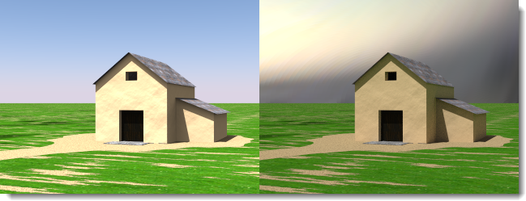
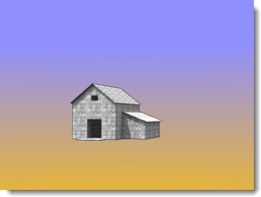
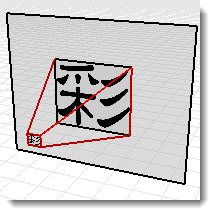
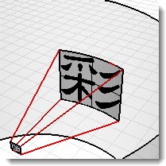
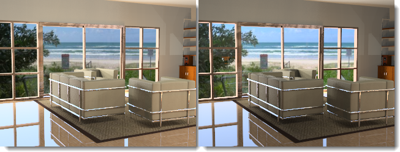

#  {{page.title}}
<!-- TODO: Is it "... environments in Rhino" or "in Flamingo" in the following sentence? -->
Rhino에는 다양한 유형의 환경이 있습니다. 이 항목에서는 Flamingo의 기본 환경에 대해 설명합니다.

환경은 배경에서 보이는 부분과 반사에 영향을 미칩니다. 장면의 조명에 영향을 미치는 효과에 대한 자세한 정보는 [하늘](sun-and-sky-tabs.html) 도움말 항목을 참조하세요.

Flamingo에는 특별한 환경인 **기본 Flamingo 환경**이 있습니다. 이 환경은 현재 [조명 기본 설정](lighting-tab.html)과 동기화합니다. [조명 기본 설정](lighting-tab.html)을 사용하면 조명과 환경이 그에 적합한 장면 기본값으로 설정됩니다.

Flamingo 환경의 속성 그룹은 다음과 같습니다

> [이름](#name)
> [Flamingo 환경](#environment)
> [배경색](#color-backgrounds)
> [고급 배경](#advanced-background-reflected-sky)

## 환경 이름
{: #name}
Rhino 모델의 환경 이름입니다. 환경은 Rhino 모델에 저장됩니다. 즉, 현재 모델에서 환경을 편집한다고 해도 다른 모델 또는 라이브러리의 이름이 같은 환경에 영향을 미치지 않음을 뜻합니다. 다른 모델의 환경을 사용하려면 해당 환경은 [라이브러리](libraries.html)로 먼저 내보내야 합니다. 내보낸 파일 이름으로는 해당 환경의 이름이 사용됩니다.

## Flamingo 환경
{: #environment}
렌더링에서 환경은 세 가지 측면에서 크게 영향을 미칩니다:

>보이는 배경
>[반사된 배경](#advanced-background-reflected-sky)
>[굴절된 배경](#advanced-background-refracted-sky)

<!-- TODO: Does the following sentence make sense? Is there something missing? -->
보이는 배경이 기본 일반 속성 패널이고, 보이는 환경입니다. [반사](#advanced-background-reflected-sky)와 [굴절](#advanced-background-refracted-sky) 배경은 서로 다를 수 있으며, 고급 배경 섹션에서 사용할 수 있습니다.

#### 강도
{: #background-intensity}
<!-- TODO: Color range normally is from 0-255... -->
배경의 상대적인 밝기를 수정합니다. 강도 값은 환경의 색과 라이트 밸류의 결과를 곱하는 데 사용됩니다. 색의 범위는 채널당 0에서 256까지입니다. 강도는 이 값을 증가시킵니다. 배경이 렌더링된 모델에 비교했을 때 매우 어둡게 보이는 경우, 이 설정이 매우 중요해집니다.

#### 배경 유형
{: #background-type}
렌더링 이미지에서 배경을 채울 색 구성표를 지정합니다. 배경의 유형은 다음과 같습니다:

> [하늘](#environment-sky)
> [단색과 그라데이션](#color-backgrounds)
> [이미지](#environment-image)
> [HDR과 평면형 HDR 이미지](#hdr-background)

## 하늘 배경
{: #environment-sky}
하늘 환경은 [조명](lighting-tab.html) 탭의 태양과 하늘 설정을 사용합니다. 렌더링에 태양이 보이는 렌더링에서 이 설정이 기본 설정입니다.

*자동 (왼쪽), HDR 이미지와 태양 (오른쪽).*

## 컬러 배경
{: #color-backgrounds}
배경색 제어는 항상 있습니다. 이미지, HDRi 또는 하늘 배경이 색을 완전히 가리는 경우에도 컬러 배경이 항상 존재합니다.

#### 단색
{: #solid-color}
단색 배경은 배경이 하나의 색으로 채워져 있습니다.

*단색 배경.*
단색 편집에 대한 자세한 정보는 아래의 [색 제어](#enviroment-sky-color-controls)를 참조하세요.

#### 2색 그라데이션
{: #two-color-gradient}
2색과 3색 그라데이션 배경은 투시 뷰에서만 적용됩니다. 2색 그라데이션 배경은 선택된 2색의 단계적 변화로 배경을 표시합니다.

*2색 그라데이션 배경: 파랑과 노랑.*
2색 그라데이션에 대한 자세한 정보는 아래의 [색 제어](#enviroment-sky-color-controls)를 참조하세요.

#### 3색 그라데이션
{: #three-color-gradient}
3색 그라데이션 배경은 선택된 3색의 단계적 변화로 배경을 표시합니다.

*3색 그라데이션 배경: 파랑, 흰색, 노랑.*
3색 그라데이션에 대한 자세한 정보는 아래의 [색 제어](#enviroment-sky-color-controls)를 참조하세요.

### 색 제어
{: #enviroment-sky-color-controls}
사용 가능한 제어의 수는 현재 선택된 컬러 배경 유형에 따라 잘라질 수 있습니다. 그라데이션 배경에서는 위, 가운데, 아래 색을 선택할 수 있도록 최대 3개의 색을 선택할 수 있습니다.



#### 색 바꾸기
그라데이션의 색을 위에서 아래로 다시 조정하려면 이 단추를 사용합니다.

#### 그라데이션 매핑 제어
{: #gradient-mapping}
그라데이션 색 배경의 색은 환경 구에 매핑되어야 합니다. 매핑하려면 그라데이션 매퍼를 사용합니다. 그라데이션 매핑 제어는 2색 또는 3색 그라데이션을 선택한 경우에만 사용할 수 있습니다. 그라데이션은 투시 뷰에서만 매핑될 수 있습니다.

#### 뷰로부터의 각도
{: #angle-from-views}
뷰로부터의 각도가 선택된 경우, 현재 색 그라데이션은 현재 렌더링된 투시 뷰에 동기화합니다. 위의 색은 뷰의 위에 매핑되며, 아래 색은 뷰의 아래에 매핑됩니다. 모든 다른 색은 위와 아래의 사이에 균일하게 분배됩니다.

#### 뷰 고도 매퍼
{: #colorrange}
현재 뷰포트가 투시 투영인 경우, 위 아래 색과 뷰와 관련된 그라데이션의 범위는 제어할 수 있습니다.

{: style="float: left; padding-right: 25px;padding-bottom: 15px;padding-top:15px;"}

* 이 제어는 섹션 뷰에서 환경을 표시합니다. 90도 마커는 Z의 위쪽 좌표입니다. 0 좌표는 수평인 지반면을 나타냅니다. -90도 마커는 Z아래쪽 좌표입니다. 
* 시야를 나타내는 회색 원뿔은 현재 투시 뷰의 마지막 좌표를 나타냅니다.
* 빨간색 화살표는 위쪽 색 위치를 나타냅니다. 이 각도와 그 위가 위쪽 색이 됩니다.
* 녹색 이중 화살표는 위쪽 색과 아래쪽 색 사이의 그라데이션 블렌드 가운데를 나타냅니다. 3색 그라데이션에서는 이 위치가 가운데 색의 위치를 나타냅니다.
* 파란색 화살표는 아래쪽 색의 위치를 나타냅니다. 이 각도의 아래에 아래쪽 색이 위치합니다.

####  뷰와 일치하는 각도 설정 단추
이 단추를 사용하여 그라데이션 매핑을 현재 투시 뷰 좌표로 다시 설정합니다.

#### 위/가운데/아래 각도
이 값은 현재 그라데이션에서 위, 가운데, 아래 색의 각도값입니다. 뷰 고도 매퍼의 빨강, 녹색, 파랑의 위치에 대응합니다.

## 이미지 배경
{: #environment-image}
<!-- TODO: "A digital photograph, a scanned artwork, or an image created with an electronic paint program may be used as the image." doesn't sound very 2015-ish... -->
배경 이미지는 배경에 투영됩니다. 많은 경우, 기존 콘텍스트에 모델을 배치하거나, 창에 뷰를 설정하는 데 사용됩니다. 디지털 사진, 스캔한 이미지, 이미지 편집 소프트웨어에서 만든 이미지를 사용할 수 있습니다. 가장 좋은 결과를 얻으려면 고해상도 이미지를 배경에 사용하세요. 자연스런 초점과 원근감을 표현하기 위해 선명한 이미지를 조금 흐리게 처리하는 것도 좋은 생각이라고 할 수 있습니다.

*배경으로 설정된 평면 이미지*

### 이미지 파일
{: #image-properties}
*(비어 있음- 여기를 클릭하여 지정)* 부분을 클릭하고 비트맵을 선택하여 배경 이미지를 설정합니다. 다른 이미지를 적용하려면 단추 썸네일 이미지를 클릭합니다.

### 투영
{: #backgroud-image-projection}
드롭 다운 제어에서 세 개의 이미지 투영 중 하나를 선택합니다:

>[평면형](#planar)
>[원통형](#cylindrical)
>[구형태](#spherical)

각 투영 방식에는 이미지의 위치를 제어하는 설정이 각각 있습니다.

<!-- TODO: The hierarchy of the following section is inconsistent. "Planar Projection", "Cylindrical Projection" and "Spherical Projection" should be parent elements of the  respective following topics like "Angle from View", "Image Placement Control" etc. -->

#### 평면 투영
{: #planar}
현재 뷰에서 평면 배경에 이미지를 투영합니다. 평면 투영 좌표는 항상 현재 뷰에 상대적입니다.

#### 뷰로부터의 각도
뷰로부터의 각도 확인란은 현재 뷰와 이미지의 동기화를 유지합니다. 이미지가 현재 뷰에 맞춰져 늘어납니다.

#### 이미지 배치 제어
배치 제어를 사용하여 현재 뷰에 상대적으로 이미지를 배치합니다. 뷰포트 형태가 진한 회색 직사각형으로 표시됩니다. 분홍색 직사각형을 마우스로 끌거나 수치 제어를 사용하여 배경 이미지를 뷰에 맞춰 이동하거나 크기 조정합니다.

*현재 뷰포트 영역 (1), 이미지 크기와 형태 (2).*

#### X 방향 크기 / Y 방향 크기
뷰 너비와 높이의 0 ~1.0 비율로 배경 이미지의 크기를 지정합니다. 예를 들어, 1.0 값은 뷰 크기의 100%이고, 0.5 값은 뷰 너비의 50%를 나타냅니다.

#### X 간격띄우기 / Y 간격띄우기
뷰 너비와 옾이의 0~1.0 비율로, 뷰포트 왼쪽 아래 모서리로부터 배경 이미지의 간격띄우기를 지정합니다. 예를 들어, 0.25 값은 뷰 크기의 25%로 간격띄우기 실행하며, 0.5 값은 뷰 너비의 50% 간격띄우기 실행됩니다.

#### 이미지 배치 제어
배치 제어를 사용하여 현재 뷰에 상대적으로 이미지를 배치합니다. 뷰포트 형태가 진한 회색 직사각형으로 표시됩니다. 분홍색 직사각형을 마우스로 끌거나 수치 제어를 사용하여 배경 이미지를 뷰에 맞춰 이동하거나 크기 조정합니다.

*현재 뷰포트 영역 (1), 이미지 크기와 형태 (2).*

#### X 방향 크기 / Y 방향 크기
뷰 너비와 높이의 0 ~1.0 비율로 배경 이미지의 크기를 지정합니다. 예를 들어, 1.0 값은 뷰 크기의 100%이고, 0.5 값은 뷰 너비의 50%를 나타냅니다.

#### X 간격띄우기 / Y 간격띄우기
뷰 너비와 옾이의 0~1.0 비율로, 뷰포트 왼쪽 아래 모서리로부터 배경 이미지의 간격띄우기를 지정합니다. 예를 들어, 0.25 값은 뷰 크기의 25%로 간격띄우기 실행하며, 0.5 값은 뷰 너비의 50% 간격띄우기 실행됩니다.

#### 원통형 투영
{: #cylindrical}
원통형 투영은 모델을 둘러싸고 있는 상상 속의 원통에 이미지를 매핑합니다. 이 투영 방법은 실제로 원통형인 이미지에 가장 적합하지만, 사진을 기반으로 구성된 일반적인 파노라마에도 잘 적용됩니다.

이미지 맵의 높이와 너비 각도의 크기 및 위치를 지정합니다. 그래픽 도구와 마우스를 사용하여 이미지의 위치와 크기를 지정합니다. 현재 원뿔형 표시기는 옅은 회색으로 음영 처리된 영역으로 표시됩니다.

#### 뷰로부터의 각도
뷰로부터의 각도 확인란은 현재 뷰와 이미지의 동기화를 유지합니다. 이미지가 현재 뷰에 맞춰져 늘어납니다.

#### 평면 제어
이미지 맵의 각도 너비를 지정합니다. 각도를 입력하거나, 제어 위젯에서 플래그를 끌어 너비를 지정합니다. 파란색 영역은 각도 너비 범위를 나타냅니다.

{: .float-img-left}
<!--TODO: Image doesn't show up in file. -->

* 이 제어는 환경을 평면 뷰에 표시합니다.
* 시야를 나타내는 진한 회색 원뿔은 현재 투시 뷰의 마지막 좌표를 나타냅니다.
* 파란색 원뿔은 이미지가 보이는 각도 범위를 나타냅니다.
* 파란색 화살표는 이미지 맵의 왼쪽 좌표를 나타냅니다.
* 빨간색 도트는 배경 이미지의 가운데를 나타냅니다.
* 보라색 화살표는 이미지 맵의 오른쪽 좌표를 나타냅니다.

#### 세로 제어
{: .clear-img}
원통형 투영의 세로 범위를 지정합니다. 각도를 입력하거나, 제어 위젯에서 플래그를 끌어 위 아래 각도를 설정합니다. 원통형 투영은 수평선을 기준으로 45도 초과 또는 미만으로 제한됩니다.

{: .float-img-left}

* 이 제어는 섹션 뷰에서 원통을 나타냅니다.
* 시야를 나타내는 회색 원뿔은 현재 투시 뷰의 마지막 좌표를 나타냅니다.
* 파란색 화살표는 이미지 맵의 아래쪽 테두리를 나타냅니다.
* 빨간색 화살표는 이미지 맵의 위쪽 테두리를 나타냅니다.

#### 회전
{: .clear-img}
이미지의 회전을 지정합니다. 빨간 점은 이미지의 중심을 나타냅니다.

#### 너비
평면 뷰에 상대적인 이미지의 너비(도 단위)를 지정합니다.

#### 위/아래
모델의 가로 지반면 방향을 기준으로 이미지의 세로 각도를 지정합니다.

####  뷰와 일치하는 각도 설정 단추
현재 투시 뷰포트에 일치하는 회전 각도를 설정합니다. 투영의 값을 다시 설정할 때 유용합니다.

#### 구형태 투영
{: #spherical}
구(球) 형태 투영은 이미지를 완전한 구체로 매핑합니다. 이 방식은 일반적으로 등장방형인 구 형태 이미지를 사용할 때 좋은 결과물을 만들어냅니다. 등장방향 이미지는 2:1 직사각형 종횡비를 갖습니다.

#### 뷰로부터의 각도
뷰로부터의 각도 확인란은 현재 뷰와 이미지의 동기화를 유지합니다. 이미지가 현재 뷰에 맞춰져 늘어납니다.

#### 구형태 제어
이미지 맵의 방향을 지정합니다. 각도를 입력하거나, 제어 위젯에서 플래그를 끌어 너비를 지정합니다. 빨간색 도트는 배경 이미지의 가운데를 나타냅니다.

#### 회전
{: .clear-img}
이미지의 회전을 지정합니다. 빨간 점은 이미지의 중심을 나타냅니다.

####  뷰와 일치하는 각도 설정 단추
현재 투시 뷰포트에 일치하는 회전 각도를 설정합니다. 투영의 값을 다시 설정할 때 유용합니다.

## HDRi 배경
{: #hdr-background}
HDR 이미지를 환경으로 사용하면 조명과 배경의 관계 그리고 이미지에 있는 다른 조명을 보다 상세하게 설정할 수 있습니다. 이 옵션은 밝은 실외가 창으로 보이는 실내 공간을 표현할 때 특히 유용합니다. HDR 환경 이미지는 일반적인 비트맵 이미지보다 훨씬 넓은 범위의 빛 정보를 가지고 있으며, 채널을 적용할 수 있어 [다중 채널](lights-tab.html#channel) 렌더링에서 명암을 관리할 수 있습니다.

#### 이미지 파일
{: #hdri-image}
*(비어 있음- 여기를 클릭하여 지정)* 부분을 클릭하고 비트맵을 선택하여 배경 HDRi 이미지를 설정합니다. 다른 이미지를 적용하려면 단추 썸네일 이미지를 클릭합니다.






## 평면형 HDRi 옵션
{: #planar-hdr-options}

평면형 하이 다이내믹 레인지 이미지(HDRi)는 거의 사용되지 않지만 매우 유용합니다. HDRi을 사용하면 보다 광범위하게 색이 허용됩니다. 배경이 지나치게 밝거나 어두운 건축용 렌더링에서 창의 바깥쪽에 HDRi 파일을 사용하는 것이 좋은 예입니다. 평면형 HDRi 파일은 항상 평면으로 매핑됩니다.

*배경 이미지 (왼쪽)와 평면형 HDR (오른쪽)을 비교하면 배경에서의 은은한 조명의 차이를 알 수 있습니다.*

#### 이미지 파일
{: #hdri-planar-image}
*(비어 있음- 여기를 클릭하여 지정)* 부분을 클릭하고 비트맵을 선택하여 배경 HDRi 이미지를 설정합니다. 다른 이미지를 적용하려면 단추 썸네일 이미지를 클릭합니다.



## 고급 배경
{: #advanced-background}
고급 배경 설정은 렌더링에 보이지 않지만 개체의 반사와 굴절에 보이는 환경을 제어합니다. 보이는 환경 외에도, 반사와 굴절을 통해 다른 환경을 사용할 수 있습니다. 예를 들어, 다음 그림의 배경은 검정색이지만, 반사되는 환경으로 빌딩 인테리어 HDRi 이미지가 사용되었습니다.

*보통 환경 (왼쪽), 반사된 HDR 하늘 환경 (오른쪽).*

### 반사됨
{: #advanced-background-reflected-sky}
반사된 환경은 렌더링된 이미지에는 보이지 않으나 반짝거리는 개체에 반사되어 보입니다.

#### 하늘
[조명: 태양과 하늘](sun-and-sky-tabs.html) 설정에서 지정된 대로 개체에 하늘이 비춰집니다.

#### 사용자 지정
개체가 [색 또는 그라데이션](#color-backgrounds), [이미지](#environment-image), 또는 [HDR](#hdr-background) 배경을 반사시킵니다.

#### 보이는 배경
[환경](environment-tab.html) 설정에서 지정된 상태로 보이는 배경이 개체에 비춰집니다.

### 굴절됨
{: #advanced-background-refracted-sky}

#### 하늘
[조명: 태양과 하늘](sun-and-sky-tabs.html) 설정에서 지정된 대로 개체가 하늘을 굴절시킵니다.

#### 사용자 지정
개체가 [색 또는 그라데이션](#color-and-gradient-backgrounds), [이미지](#image), 또는 [HDR](#hdr-background) 배경을 굴절시킵니다.

#### 보이는 배경
[환경](environment-tab.html) 설정에서 지정된 상태로 보이는 배경이 개체에 굴절됩니다.

#### 투명한 개체 알파 없음
{: #no-transparent-alpha-objects}
투명한 개체를 통해 알파 채널이 보이는 것을 방지하고, 투명한 개체를 통해 알파 채널이 합성되는 것도 방지합니다.
이미지가 알파 채널로 붙여넣기 실행이 된다면 이 설정을 끕니다.
