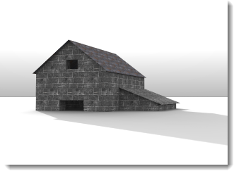

# {{page.title}}
{: #ground-plane}

지반면은 모든 방향에서 정의된 고도로 위치가 지정된 이미지가 가로로 스트레치되는, 무한대의 가로 플랫폼을 제공합니다. 넓은 평면 서피스를 베이스로 사용하는 것보다 지반면을 사용할 때 렌더링 속도가 더욱 빨라집니다.

### 사용
{: #groundplane-enabled}
지반면을 켭니다.

*지반면이 꺼진 상태 (왼쪽), 켜진 상태(오른쪽).*

### 알파
{: #groundplane-alpha}
지반면에 투명한 알파 채널을 적용하여 다른 이미지로 그림자를 투사하여 합성할 수 있습니다. 참조: [Wikipedia 항목: Alpha compositing](http://en.wikipedia.org/wiki/Alpha_compositing).

 *지반면에는 그림자가 보이지만, 이미지에서는 투명하게 보입니다.*

### 고도
{: #groundplane-elevation}
지반면의 높이를 0보다 높게 설정합니다.

*0보다 높은 지반면 고도.*

### 재질
{: #groundplane-material}
[재질](simple-material-properties.html)을 지반면에 적용합니다.

*높은 고도와 물 재질이 적용된 지반면.*
