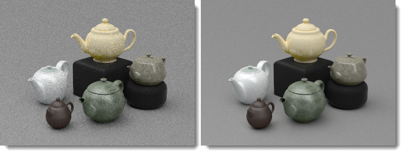
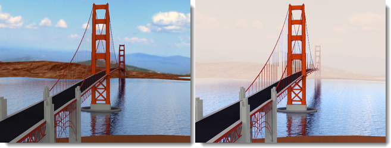
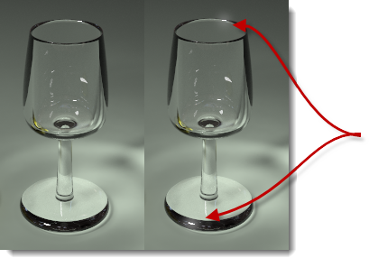
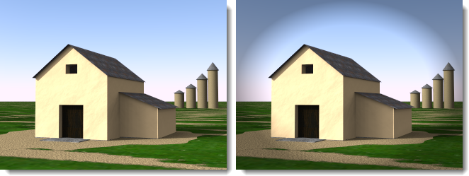

# {{page.title}}
nXt 이미지 편집기는 nXt 플랫폼에서 만들어진 원시 이미지 파일 (.nXtImage)을 편집할 수 있습니다. 이 원시 파일에는 렌더링이 실행되는 동안 수집된 모든 정보가 담겨 있습니다.
nXt 이미지 편집기를 사용하여 다음과 같은 기능을 실행할 수 있습니다:

> [톤 연산자](image-editor.html#tone-mapping) 설정을 조정합니다.
> 조명 채널의 강도를 변경합니다.
> 이미지 기반 특수 효과를 추가합니다: [옅은 안개](image-editor.html#haze), [깊이 흐림](image-editor.html#depth-blur), [글레어](image-editor.html#glare).
>톤 매핑된 이미지를 .jpg 또는 .png와 같은 비트맵 형식으로 [저장](image-editor.html#save-tonemapped-image-as)합니다.
> 휘도 정보를 [HDR 형식](image-editor.html#save-hdr-image-as)으로 저장합니다.
> 좀 더 높은 수준의 합성에 사용하기 위해 추가적인 마스크 ( [알파](image-editor.html#alpha-channel), [거리](image-editor.html#distance-channel), [재질](image-editor.html#material-channel) )을 보고 저장합니다.
> 포토리얼리스틱 렌더링이 아닌 렌더링을 만들 때 사용할 수 있는 [Piranesi©](http://www.piranesi.co.uk/) 파일 형식(*.epx)으로 저장합니다.
> 렌더 팜에서 별도의 노드로 생성된 이미지를 짜집기하는 등의 작업을 할 때는 이미지를 산술로 설정하여 사용하십시오.
> 이 렌더링을 생성하는 데 사용된 [조명 설정](image-editor.html#save-lighting-settings-as)을 저장합니다. 이 조명 설정을 사용하여 더 많은 렌더링을 만들 수 있습니다.

편집기를 시작하려면

> **Flamingo nXt 5.0** 메뉴에서 **기타 도구 &gt; Flamingo nXt 이미지 편집기**.

## 파일 메뉴
{: #file-menu}

### 열기
nXtImage 형식으로 저장된 파일을 편집용으로 엽니다.

### 원본 이미지 저장
nXtImage 파일을 저장합니다.

### 원본 이미지를 다른 이름으로 저장
nXtImage 파일을 다른 이름으로 저장합니다.

### 톤맵 이미지를 다른 이름으로 저장
{: #save-tonemapped-image-as}
편집된 이미지를 비트맵 이미지 파일로 저장합니다.

 * JPEG (.jpg)
 * TIFF (.tif)
 * TIFF - 알파 채널 포함 (.tif)
 * PNG (.png)
 * PNG - 알파 채널 포함 (.png)
 * [Piranesi EPix 파일 (.epx)](http://www.piranesi.co.uk/)

Piranesi는 손으로 그린 것처럼 표현된 이미지를 만드는 3D 페인팅 도구입니다.

### HDR 이미지를 다른 이름으로 저장
{: #save-hdr-image-as}

 * HDR 파일 (.hdr)
 * EXR 파일 (.exr)
 * EXR - 알파 채널 포함 (.exr)

### 마스크 저장
{: #save-mask}
nXtImage 파일에 있는 3개의 추가적인 채널은, 대부분의 비트맵 편집기에서 높은 수준의 합성 작업을 할 때 사용할 수 있습니다. 이러한 채널의 각 픽셀에는 알파, 거리, 재질 정보가 담겨 있으며, 회색조 이미지로 인코딩됩니다. 이 채널은 png 파일로 보고 저장할 수 있습니다.

##### 안내:

 1. 톤맵 처리된 이미지를 저장할 때 알파를 포함하도록 파일 형식을 선택하면 톤맵 처리된 이미지에 알파 채널이 포함될 수 있습니다.
 1. 거리와 재질 채널은 앤티 앨리어싱되지 않으며, 가장자리가 각진 아티팩트가 일부 표시될 수 있습니다. 사용하기 전에 마스크에 가우스 흐림을 조금 추가하면 이 가장자리가 부드러워질 수 있습니다.
 1. 재질 채널은 고유하게 255개의 서로 다른 재질로 인코드됩니다. 모델에 그 보다 많은 재질이 있다면 일부 마스크 색이 반복될 것입니다.

#### 재질 채널
{: #material-channel}
재질 채널 마스크를 저장합니다.

#### 알파 채널
{: #alpha-channel}
알파 채널 마스크를 저장합니다.

#### 거리 채널
{: #distance-channel}
거리 채널 마스크를 저장합니다.

### 조명 설정을 다른 이름으로 저장
{: #save-lighting-settings-as}
[조명 구성표](lighting-tab.html#open-lighting-scheme)를 저장합니다.

## 이미지 메뉴
{: #renderwindowimage}

### 정보
{: #info}
이미지에 대한 정보를 표시합니다.

### 산술
{: #arithmetic}
렌더링된 이미지 조각들을 [렌더 팜 단일 이미지 기능](automate-rendering.html#single-images)을 사용하여 하나로 합치거나 오버레이합니다.

##### 이미지 조각을 모으려면:

 1. **파일** 메뉴에서 **열기**를 클릭합니다.
 1. 시퀀스의 첫 번째 이미지를 선택합니다. (예: 000000.nXtImage)
 1. **이미지** 메뉴에서 **산술**을 클릭하고 **추가**를 클릭합니다.
 1. 시퀀스의 모든 다른 이미지를 선택합니다.

**안내:** 첫 번째 이미지 (000000.nXtImage)를 다시 선택하지 않습니다. 그렇지 않으면 첫 번째 이미지가 2번 추가됩니다.

#### 추가
한 레이어의 픽셀값을 다른 레이어에 추가합니다. 값이 255를 넘으면 (RGB의 경우), 흰색이 표시됩니다.

#### 빼기
다른 레이어에서 한 레이어의 픽셀 값을 뺍니다. 값이 음수인 경우, 검정색이 표시됩니다.

#### 차이
항상 양(+)의 값을 얻기 위해 아래 레이어에서 위 레이어를 (또는 그 반대로) 뺍니다. 모든 색의 값은 0 이므로 검정과 블렌드하면 변화가 없습니다. 흰색과 블렌드하면 그림이 반전됩니다.

#### 마스크 추가
블렌드할 때 투명한 알파 채널 마스크를 적용시킵니다.

#### 경로 추적 결합
경로 추적기 엔진을 사용하여 렌더링된 이미지를 결합합니다. 예를 들어, 20번의 패스로 렌더링된 10개의 이미지를 결합하면 200번의 패스를 거쳐 렌더링된 이미지와 마찬가지가 됩니다.

*20번의 패스로 렌더링된 이미지 (왼쪽), 20번의 패스로 렌더링된 10개의 이미지로 만든 200 번 패스 이미지 (오른쪽).*

### 패치 적용
{: #apply-patch}
선택된 부분만 렌더링된 이미지를 이미 렌더링된 이미지에 삽입합니다.

### 애니메이션
이미지 정보를 변경하며 애니메이션 실행할 수 있습니다.

##### 이미지 효과를 애니메이션 실행하려면

 1. 첫 번째 이미지를 설정합니다. **프레임** 편집 상자 옆에 있는 **플러스 (+)** 단추를 클릭합니다.
 1. 이미지를 편집하고 프레임을 추가합니다.
 1. **이미지 &gt; 애니메이션**을 클릭하고 대화상자에서 **미리보기**를 클릭합니다.
 1. 모두 잘 설정되었으면 **애니메이션**을 클릭합니다.

### 폴더를 만듭니다.
만들어진 이미지 시퀀스로, 애니메이션 제작 용도 소프트웨어를 사용하여 애니메이션을 만들 때 사용할 수 있습니다.

## 뷰 메뉴
{: #view-menu}
이미지에서 무엇이 표시되는지를 지정합니다.

### 이미지
원래 렌더링된 이미지를 표시합니다.

### 이미지와 알파 마스크
이미지와 알파 채널 마스크를 함께 표시합니다.

### 재질 마스크
[재질 마스크](image-editor.html#material-channel)를 표시합니다.

### 거리 마스크
[거리 마스크](image-editor.html#distance-channel)를 표시합니다.

## 이미지 편집기 사용

##### 이미지 로드

 1.  렌더링 결과를 **.nXtImage** 파일로 [저장](render-window.html#export-to-nxtimage)합니다.
 1. **Flamingo nXt** 메뉴에서 **유틸리티 &gt; Flamingo nXt 이미지 편집기**를 클릭합니다.
 1. **nXt 이미지 편집기**의 파일 메뉴에서 **열기**를 클릭하여 이미지를 편집기에 로드합니다.

## 톤 매핑
{: #tone-mapping}
톤 매핑은 nXt에서 사용된 휘도 데이터를 디스플레이나 인쇄가 가능한 RGB 픽셀로 변환하는 과정입니다.

#### 밝기
{: #brightness}
[렌더링 창: 밝기](render-window.html#brightness)를 참조하세요.


#### 번
[렌더링 창: 번](render-window.html#burn)을 참조하세요.

#### 채도
[렌더링 창: 채도](render-window.html#saturation)를 참조하세요.

#### 히스토그램
[렌더링 창: 히스토그램](render-window.html#histogram)을 참조하세요.

## 상태 필드
상태 필드는 화면의 아래쪽에 위치합니다. 커서를 이미지에서 움직이면 이 필드에 각 픽셀에 대한 정보가 표시됩니다.

#### 픽셀
{: #pixel}
왼쪽 아래 모서리를 기준으로 측정된 픽셀 좌표.

#### 색
{: #color}
처음 필드 3개는 톤매핑 이후에 이미지에 표시되는 RGB 컬러를 나타냅니다. 4번째 필드는 합성에 사용되는 알파 (투명도) 채널을 나타냅니다.

#### 값
{: #value}
빨강, 초록, 파랑 하위 채널의 휘도값입니다.

#### 휘도
{: #lum}
각 픽셀에 저장된 휘도값의 가중 평균.

#### 깊이
{: #depth}
보는 이로부터 각 픽셀이 떨어져 있는 거리를 미터 단위로 표시합니다. 음의 값은 배경 픽셀을 나타냅니다.

#### 재질
{: #material}
픽셀을 렌더링하는 데 사용된 재질의 이름.

## FX 설정
이미지에 특수 효과를 추가할 수 있습니다. NXTimage 형식에서 저장되는 추가 정보들이 특수 효과에 사용됩니다. 예를 들어, 글레어는 실제 빛 값에 휘도 공간을 사용하고, 옅은 안개는 이미지에서의 거리를 사용합니다.

### 옅은 안개
{: #haze}
카메라에서 멀리 떨어져 있는 픽셀에 색을 더합니다. 이 효과는 장면에 옅은 안개 또는 안개를 추가하거나, 배경을 색으로 마스크 처리, 배경색을 변경할 때 사용할 수 있습니다.

*원래 이미지 (왼쪽), 옅은 안개 효과 (오른쪽).*

#### 세기
옅은 안개 색의 강도를 지정합니다.

#### 가까이
옅은 안개가 각 픽셀에 색을 추가하기 시작하는 카메라로부터의 거리.

#### 지정
거리를 지정하기 위해 이미지 상에서 한 점을 지정합니다.

#### 멀리
옅은 안개 효과가 최대치인 거리입니다. 이 지점을 넘는 모든 픽셀은 각 픽셀에 최대 옅은 안개 효과가 더해집니다.
가까이와 멀리 사이에 있는 픽셀은 가까이에서 멀리 있는 픽셀 선상으로 옅은 안개 효과가 더해집니다.

#### 지정
거리를 지정하기 위해 이미지 상에서 한 점을 지정합니다.

#### 색
옅은 안개의 색.

#### 지정
색을 지정하기 위해 이미지 상에서 한 점을 지정합니다.

### 깊이 흐림
{: #depth-blur}
이미지의 각 픽셀은 거리값을 가지고 있으므로 지정된 거리 사이의 이미지를 흐리게 처리하는 데 사용할 수 있습니다.

*원래 이미지 (왼쪽), 깊이 흐림이 적용된 이미지 (오른쪽).*

#### 세기
흐린 정도를 지정합니다.

#### 초점
{: #depthblurfocus}
이미지에서 초점이 되는 거리를 지정합니다.

#### 지정
초점 거리를 설정하기 위해 이미지에서 한 점을 지정합니다.

#### 정초점 영역
{: #in-focus-zone}
**초점**을 중심으로 선명하게 보이는 거리입니다. 이 값은 미터 단위입니다. 이 거리 안에 있는 모든 픽셀은 선명하게 보이며, 흐림 필터에서 무시됩니다. 이 거리보다 멀리 있는 픽셀은 이웃하고 있는 픽셀과 함께 점점 흐리게 처리되어 피사계 심도(DOF)를 표현합니다.

#### 흐리게
흐리게 필터가 실행되는 방향을 제어합니다. 기본값은 **배경**입니다. 이것은 카메라에서 정초점 영역**(In-Focus Zone)**보다 멀리 있는 모든 픽셀이 흐리게 처리되는 것을 뜻합니다.

*흐린 전경 (왼쪽), 배경 (오른쪽).*

#### 배경
카메라에서 **정초점 영역**의 범위보다 먼 곳의 픽셀을 흐리게 표시합니다.

#### 전경
카메라에 **정초점 영역** 범위보다 가까이 있는 픽셀을 흐리게 처리합니다.

#### 모두
**정초점 영역** 범위의 앞과 뒤에 있는 픽셀을 흐리게 처리합니다. 이 옵션을 사용하면 피사계 심도 (depth-of-field) 효과를 빠르게 얻을 수 있습니다. 기본 탑재된 사전 렌더링 [피사계 심도](render-tab.html#depthoffieldoption)를 사용하는 것만큼 정확하지 않습니다.

### 글레어
{: #glare}
글레어(Glare)는 주변 픽셀에 후광(Halo) 효과를 만들어 루멘이 임계값보다 더 밝은 픽셀에 영향을 줍니다. 이미지에서 가장 밝은 픽셀만 영향을 받습니다.
커서를 픽셀 위에 잠시 두면 글레어가 표시되며, 해당 픽셀의 전체 루멘을 알 수 있습니다.

*원래 이미지 (왼쪽), 글레어 효과 (오른쪽).*

#### 세기
주변 픽셀에 영향을 주는 후광의 양을 조정합니다.

#### 임계값
글레어 필터의 영향을 받는 값의 낮은 한계. 이 값보다 밝은 모든 픽셀이 영향을 받습니다.

#### 지정
명도를 지정하기 위해 이미지에서 한 점을 지정합니다.

### 배경 흐리게
{: #vignette}
후광 같은 효과를 만들기 위해 이미지의 가장자리 색을 흐리게 처리하고 블렌드합니다.

*원래 이미지 (왼쪽), 배경 흐리게 효과 (오른쪽).*
