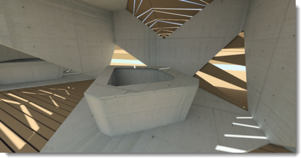
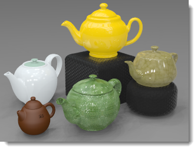
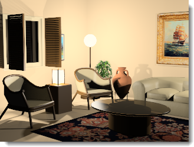
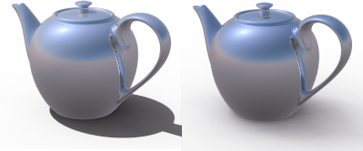

#  {{page.title}}
조명은 이미지를 만들 때 가장 중요하지만 도외시된 부분입니다. 조명은 단순하게 모델을 비추는 한 방법이 아닙니다. 조명 설정은 분위기를 설정하고, 이미지 작업하는 데 가장 중요한 요소입니다.

*이미지 제공: Christopher Soto Gutiérrez.*

#### Flamingo 조명 제어는 어디에 있습니까?

* 메뉴 > Flamingo nXt 5.0 메뉴 > 제어 패널 표시 > Flamingo nXt.
* 어느 한 탭을 오른쪽 클릭하고 Flamingo nXt를 선택합니다.

모델의 조명을 설정할 때 다음의 가이드라인을 사용하세요:

* 조명 기본 설정값으로 시작합니다.
* Flamingo nXt는 현실 세계에서의 빛을 시뮬레이션하므로, 가능한한 항상 정확한 정보를 입력합니다.
* 광원을 비현실적인 강도로 사용하는 것을 피합니다.
* 모델에 맞는 정확한 단위를 설정합니다. 단위가 정확하지 않으면 조명이 올바르게 설정되지 않습니다. 예를 들어, 모델이 밀리미터 단위로 만들어졌다면, 모델 단위를 밀리미터로 설정하십시오.
렌더링의 전반적인 [밝기](render-window.html#brightness)는 렌더링 표시의 밝기 제어로 조정하십시오. 위에 언급된 모든 광원의 강도를 모두 변경하는 방법으로 전체적인 장면의 밝기를 조정하려고 하지 마십시오. 자동 [노출](render-window.html#brightness) 조정이 우선시됩니다.

조명 능력을 향상시키려면 빛을 이해하고 빛이 다양한 표면에 어떤 영향을 미치는지 알아야 합니다. 재질로 인해 그림자와 반사 효과가 가려질 수 있으므로, 일부 렌더링 전문가들은 재질을 적용하기 전에 모델의 조명을 설정합니다. 카메라에서 처리되는 방식처럼 객관적으로 조명을 보도록 노력하십시오.

## 조명 기본 설정
{: #lighting-presets}
실제 조명 환경에 맞춰 Flamingo에 포함되어 있는 기본 설정 조명은 조명 설정 작업시 좋은 출발점이 됩니다. Flamingo nXt에는 모델의 조명 설정에 도움이 되는 조명 기본 설정이 있습니다. 많은 조명 옵션이 있지만, 다양한 렌더링에 기본 설정만으로도 충분한 경우가 많습니다. 사용자가 원하는 장면과 가장 비슷한 기본 설정 구성표를 선택하세요.

Flamingo nXt의 기본 조명에는 네 가지 방식이 있습니다:

> [스튜디오 조명](lighting-tab.html#studio-lighting)
> [실외 주광](lighting-tab.html#exterior-daylight)
> [실내 주광](lighting-tab.html#interior-daylight)
> [인공 조명](lighting-tab.html#artificial-lighting)

### 스튜디오 조명
{: #studio-lighting}
이 기본 설정은 포토그래퍼의 스튜디오에서 볼 수 있는 조명을 표현합니다. 소규모~중간 규모의 개체를 단독으로 렌더링할 때 가장 유용합니다. 또한 HDRi 환경을 통해 조명이 잘 비춰진 장면에도 사용합니다.

{: .float-img-left} 이 기본 설정은 포토그래퍼의 스튜디오에서 볼 수 있는 조명을 표현합니다. 소규모~중간 규모의 개체를 단독으로 렌더링할 때 가장 유용합니다. HDR (high-dynamic-range) 이미지 파일이 주요 조명을 제공합니다. HDR 이미지의 조명은 스튜디오의 실내 조명 수준과 유사합니다. HDR 설정은 [하늘 탭](sun-and-sky-tabs.html#sky)에 있습니다. 조명 탭을 사용하여 인공적인 조명을 추가할 수 있습니다. 스튜디오 기본 설정에서 보이는 배경은 검정입니다.

스튜디오 조명은 주얼리와 제품 디자인과 같은 작은 디자인 물품용 테이블탑 설정에 최적화되어 있습니다. 이 기본 설정에서 태양은 꺼진 상태이며, HDR 이미지 하늘은 반짝거리는 개체에 반사되는 형상을 제공합니다.

전체적으로 제어하기 위해 광원을 사용하여 장면을 비춥니다. 스튜디오 설정 조명에서는 극적인 조명이 중요합니다. 명암을 짙게 만들면 조명을 극적으로 만들 수 있습니다. 이것은 어두운 부분도 밝은 부분만큼 중요하다는 것을 의미합니다. 극적인 조명에는 아주 밝고 아주 어두운 부분을 만들도록 설치된 일정 수의 조명이 필요합니다.

사진 조명 기법은 일반적으로 렌더링용 조명과 같습니다. 사진 조명을 주제로 하는 많은 책들을 보는 것이 렌더링 공부의 좋은 출발점이 될 것입니다. 스튜디오 조명 설정에 대한 보다 자세한 정보는 [스튜디오 조명 기초](../guides/studio-lighting-basics.html).를 참조하세요.

### 실외 주광
{: #exterior-daylight .clear-img}
이 기본 설정은 자연적인 태양과 하늘을 사용한 건축물 외부를 위한 주광(daylight)을 표현합니다.

{: .float-img-right} [태양](sun-and-sky-tabs.html#sun)과 [하늘](sun-and-sky-tabs.html#sky) 탭의 설정을 지정합니다. [태양 각도](sun-and-sky-tabs.html#set-azimuth-and-altitude)를 직접 설정하거나 [지리적 위치](sun-and-sky-tabs.html#set-location-on-earth), 날짜, 시간을 사용합니다. 기본 설정에서 보이는 배경은 시뮬레이션된 하늘입니다.

건물 외부를 비추는 것은 가장 간단한 조명입니다. 실외 조명은 기본적인 [태양](sun-and-sky-tabs.html#sun) 광원 이외에는 필요하지 않습니다.

[태양](sun-and-sky-tabs.html#sun)이 켜지면 장면은 [실내](#interior) 또는 [실외](#exterior)로 지정되어야 합니다. 이것은 천공광의 기여, 지표면에서 반사된 빛, 다른 표면에서 반사된 빛이 실내와 실외일 때 매우 다르기 때문입니다. 정확한 [실내/실내](#indirect) 설정은 효과적이고 사실적인 조명 결과를 만들어냅니다.

때로는 장면이 실내인지 실외인지 쉽게 알 수 있습니다. 시점이 건물 바깥에 있다면, 실외 장면입니다. 시점이 방 안이라면 실내입니다. 어떤 장면들은 그렇게 명확하지 않기도 합니다. 건물에 둘러싸인 안뜰, 정원의 정자, 분해도, 단면이 여기에 속합니다. 안뜰의 높이보다 너비가 더 넓다면 많은 천공광이 들어오게 되므로, 실외 장면으로 조명을 설정해 보세요. 너비보다 높이가 더 높다면 실내 조명 설정을 시도해 보세요. 이 경우, 한 가지 트릭은 안뜰의 높은 곳에 데이라이트 포털을 추가하여 직사일광이 장면을 비추게 하는 것입니다.

조명은 경관 조명도 시뮬레이션할 수 있습니다. 집중 조명으로 건축물과 나무에 하이라이트를 줍니다. 이것은 야간이나  황혼 무렵의 장면에 적합한 방법입니다. 주간 야외 장면에서는, 현실 세계와 마찬가지로 어떤 인공 조명보다 태양빛이 압도적인 조건이 됩니다.

분해도, 단면, 위에서 아래 방향을 보는 엑소노메트릭 도면도 쉬운 대상이 아닙니다. 어떤 결과를 원하는가에 따라 결정이 달라집니다. 실외 장면을 속성으로 렌더링하려면 실외 렌더링 방법을 사용합니다. 이 방법으로 흥미로운 이미지를 얻지 못했다면 실내 조명을 사용해 보세요. 실내를 더 흥미롭게 표현할 수 있으나, 조명을 설정하는 데 시간이 더 많이 걸립니다.

### 실내 주광
{: #interior-daylight .clear-img}
이 기본 설정은 자연광이 비춰진 실내를 시뮬레이션합니다.

{: .float-img-left} 두 가지 구성 요소로 이루어져 있습니다. [태양](sun-and-sky-tabs.html#sun)의 직사일광과 지면, 실외 개체, [하늘](sun-and-sky-tabs.html#sky)을 통해 전달된 간접 태양광이 그 두 가지입니다.

[태양](sun-and-sky-tabs.html#sun)과 [하늘](sun-and-sky-tabs.html#sky) 설정은 [실외](lighting-tab.html#exterior-daylight) 기본 설정과 유사합니다.
주광의 직사일광 구성 요소 계산법은 간단합니다. 단순히 시간, 날짜, 장소를 지정하는 것만으로 충분히 정확한 결과를 얻을 수 있습니다.

실내 렌더링에 대한 안내:
{: .clear-img}

* 가능한 한 [조명](lights-tab.html), [하늘 설정](sun-and-sky-tabs.html#sky), 창의 유리 재질에 정확한 값을 사용하십시오.
* 태양과 하늘은 다른 조명보다 훨씬 밝기 때문에 태양이 켜진 상태에서 인공 조명을 추가하는 것으로 큰 효과를 볼 수 없을 수도 있으며, 이것은 일반적인 현상입니다. 광원을 인공적으로 강화하지 않도록 하십시오.
* 보다 낮은 값으로 [태양](sun-and-sky-tabs.html#sun-intensity) 또는 [하늘](sun-and-sky-tabs.html#sky-intensity) 강도를 설정할 수 있습니다. 이 설정은 맑은 하늘을 표현하므로 강도를 낮추면 흐리거나 어두운 날의 조명 조건으로 표현할 수 있습니다.
* 정확한 데이터를 보존하면서 원하는 이미지를 얻는 데 [다중 채널](lights-tab.html#channel) 렌더링이 도움이 될 수 있습니다.

### 인공 조명
{: #artificial-lighting}
{: style="float: right; padding-left: 25px;"} 이 기본 설정은 야간에 램프 조명이 비춰진 건축물의 실내를 시뮬레이션합니다. [조명 탭](lights-tab.html) 또는 [Rhino 조명 관련 명령](lights-tab.html#rhino-light-commands)을 사용하여 모델에 조명 개체를 삽입하고 관리합니다.

두 가지 실내 기본 설정 중 하나를 선택하면 간접 조명과 표면에 반사된 조명이 켜지고, 스튜디오와 실외 조명에서는 꺼집니다. 이러한 조명 유형은 실내 시뮬레이션에서 매우 중요한 구성요소입니다. 실외와 스튜디오 모델의 경우, 간접 조명 효과가 좀 더 은은하게 표현되므로, 기본적으로 꺼짐 상태가 됩니다.

### 사용자 지정 조명
{: #custom  style="clear:both;"}
사용자 지정은 조명 설정값을 다양하게 조합하여 사용하는 탭입니다. 예를 들어, 실외 주광인 장면이지만 추가적인 HDRi 환경이 조명으로 사용된 경우, 사용자 지정 탭을 사용하여 모델에서 조명의 일부를 켜고 끌 수 있습니다. 값이 기본 설정 기본값에서 다른 값으로 바뀌면, 해당 구성표가 사용자 지정 구성표가 됩니다.

####  [태양](sun-and-sky-tabs.html#sun)
{: #sun}
드롭다운 메뉴에서 태양 탭을 켜고 끕니다. [태양 탭](sun-and-sky-tabs.html#sun)에는 태양 위치를 변경하는 매개변수 제어가 있습니다.

*태양이 켜진 상태, 꺼진 상태.*
태양은 매우 밝은 직사광선의 광원이며 모델로부터 무한하게 멀리 떨어져 있습니다. 태양의 제어는 구 형태 좌표를 사용하여 태양의 방향을 지정합니다. 자세한 정보는 [태양 탭](sun-and-sky-tabs.html#sun) 항목을 참조하세요.

####  [태양](sun-and-sky-tabs.html#sky)
{: #sky}
다음 네 가지 옵션으로 하늘 채널을 설정합니다:

> 자동
> HDRI
> 색
> 이미지

자세한 정보는 [하늘 탭](sun-and-sky-tabs.html#sky) 항목을 참조하세요.
모델로부터 끝없이 떨어져 있는 반구형의 광원을 정의합니다.

#### 끄기
{: #off}
하늘을 끕니다.

#### 자동
{: #auto}
실제 하늘 조건을 기준으로 분석적인 모델을 제공합니다. [태양](sun-and-sky-tabs.html) 탭 설정에서 하늘의 표현과 광질(Light Quality)을 제어합니다.

#### HDRi
{: #hdri}
HDR 이미지는 반짝거리는 이미지에 반사되는 형상을 제공합니다.

#### 색
{: #color}
하늘을 단색 또는 2~3개의 그라데이션 색으로 설정합니다. [환경: 색과 그라데이션 배경](environment-tab.html#color-and-gradient-backgrounds) 설정과 유사합니다.

#### 이미지
{: #image}
이미지 배경을 평면형, 원통형, 구 형태 투영으로 사용합니다. [환경: 이미지](environment-tab.html#image) 설정과 유사합니다.

### 스튜디오 밝기
{: #studio-brightness}
[태양](sun-and-sky-tabs.html)과 하늘의 밝기를 낮춰 실제 사진 스튜디오의 실내 조명 수준을 표현합니다.

*스튜디오 밝기를 끈 상태 (왼쪽), 켠 상태 (오른쪽).*

### 조명
{: #lights}
인공 조명을 켜거나 끕니다.

*조명이 켜진 상태 (왼쪽), 꺼진 상태 (오른쪽).*

### 간접
{: #indirect}
서피스로부터 반사된 조명을 정의합니다. 기본적으로 실내 조명에는 켜져 있는 상태이며, 실외 및 스튜디오 조명 기본 설정에서는 꺼져 있는 상태입니다. 실외 렌더링에 간접 조명을 켜고 사용할 수 있습니다.

#### 방식
간접 조명의 계산 방식을 설정합니다.

#### 끄기
간접 조명 계산을 끕니다.

#### 실내
{: #interior}
실내 상황에 맞는 간접 조명으로 최적화합니다.

#### 실외
{: #exterior}
실외 상황에 맞는 간접 조명으로 최적화합니다.

다른 표면에서 반사된 간접 조명은 실외 렌더링에 보다 섬세하고 사실적인 느낌을 부여합니다. 특히, 간접 조명과 함께, 지붕의 처마, 발코니처럼 돌출된 부분의 아래쪽을 더욱 정확하게 렌더링할 수 있습니다.

#### 바운스
{: #bounces}
간접 조명으로 인해 반사되는 횟수를 지정합니다.

### 주변광
{: #ambient}
주변광은 렌더링에 더해지는 일정한 빛입니다. 이 설정은 장면에서 예상되는 총 주변광을 퍼센트로 지정하여 주변광의 강도를 제어합니다.

주변광의 양을 줄이면 이미지의 명암이 더욱 짙어집니다. 주변광을 지나치게 높이면 렌더링된 이미지가 단순하고 재미없어 보일 수 있습니다. 주변광이 너무 낮으면 명암이 과도하게 표현됩니다.

#### 없음
주변광 없음.

#### 실외
주변광을 실외 설정에 맞춰 최적화합니다.

#### 실내
주변광을 실내 설정에 맞춰 최적화합니다.

#### 스튜디오
주변광을 스튜디오 설정에 맞춰 최적화합니다.

## 사용자 지정 조명 저장

### 조명 구성표 저장
{: #save-lighting-scheme}
 현재 조명의 구성표를 저장합니다.

### 조명 구성표 열기
{: #open-lighting-scheme}
 저장된 조명 구성표를 엽니다.
