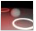
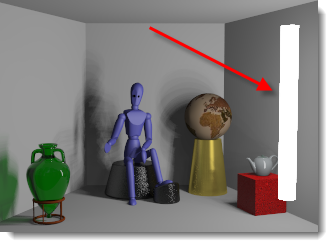

#  {{page.title}}
인공 광원은 몇 가지 Flamingo 속성이 추가된 일반적인 Rhino 조명을 사용하여 배광을 제어합니다. 광원을 사용할 때 실제 램프와 가장 유사한 유형을 선택하십시오.

## 조명 탭
{: #light-tab}
조명 탭에는 장면의 모든 인공 조명의 목록이 표시됩니다. 이 항목은 Flamingo의 조명 탭에 대해 설명합니다. [Rhino에도 조명 탭](http://docs.mcneel.com/rhino/5/help/ko-kr/index.htm#commands/lights.htm)이 있습니다. Flamingo와 Rhino의 조명은 두 탭에서 서로 동기화됩니다. Flamingo 조명 탭은 추가적인 [조명 속성](#light-properties)을 통해서 더욱 유연하게 사용할 수 있습니다.

<!-- TODO: There should be some mention that the Lights tab only is available for some of the Lighting presets -->
<!-- TODO: #### Is this supposed to be a code? It's showing up as #### -->
#### Flamingo 조명 제어는 어디에 있습니까?
조명 탭은 [조명 기본 설정](lighting-tab.html#lighting-presets) 또는 [사용자 지정 조명 설정](lighting-tab.html#sun)에서 활성화해야 합니다.

 1. Toolbars >Flamingo nXt 도구모음
 1. Menus > Flamingo nXt 5.0 메뉴 > 제어 패널 표시 > Flamingo 탭 > 조명

조명 탭에서 조명을 삽입, 켜기/끄기, 각 조명의 채널과 강도를 변경할 수 있습니다.

Flamingo는 다음과 같은 조명 유형을 지원합니다:

> [개체를 조명으로 태그](#tag-objects-as-lights)
> [집중 조명](#spotlight)
> [점 조명](#pointlight)
> [직사각형 조명](#rectangularlight)
> [선형 조명](#linearlight)

**안내:** Rhino 방향 조명  은 지원되지 않습니다. 방향 조명은 조명 목록에 표시되지 않으며, Flamingo nXt 속성을 지정할 수 없습니다.

일부 조명 속성은 조명 탭 테이블에 표시되므로 간단하게 공통 속성을 편집할 수 있습니다.

테이블에 포함된 속성:

 >[켜기/끄기](#on)
 >[이름](#name)
 >[배광](#light-distribution)
 >[조준](#aim-light)
 >[와트](#watts)
 >[채널](#channel)

조명 탭 테이블을 오른쪽 클릭하여 [추가 옵션](#additional-options) 메뉴를 엽니다.

조명을 클릭하거나 [개체 속성 패널](http://docs.mcneel.com/rhino/5/help/ko-kr/commands/properties.htm)의 조명 속성 아이콘  을 클릭하여 [조명 속성](#light-properties)에 액세스합니다.

## 조명 유형
{: #light-types}
Rhino 도구모음 또는 Flamingo 조명 탭을 통해 조명을 삽입할 수 있습니다. 개체는 Flamingo에서 조명으로 태그할 수 있습니다.

####  개체를 조명으로 태그
{: #tag-objects-as-lights}
서피스, 솔리드를 비롯해 렌더링 가능한 개체는 광원으로 태그하여 조명의 속성을 부여할 수 있습니다. [배광](#light-distribution), [방향](#aim-light), [세기](#watts)도 적용할 수 있습니다. 조명으로 태그된 개체는 조명의 방향과 중심 위치를 나타내는 미리보기 위젯을 표시할 수 있습니다.

*광원으로 태그된 LED 라이트와 헤드라이트*

####  집중 조명
{: #spotlight}
집중 조명은 특정 방향을 향해 원뿔 형태도 배광됩니다. 조명 속성에는 [소스 반지름](#radius), [빔 각도](#beam-angle), 폴오프 반지름, 방향이 포함됩니다. 소스 반지름이 클수록 빛으로 인한 그림자는 더 부드러워집니다. 기본적으로, 조명 위치에 디스크가 보입니다. 그립을 사용하여 위치, 방향, 화면에서의 빔 각도를 편집하는 방법에 대한 정보는 [Rhinoceros 집중 조명](http://docs.mcneel.com/rhino/5/help/ko-kr/commands/spotlight.htm) 도움말 항목을 참조하세요.

* 빨간 상자를 향하는 집중 조명*

####  점 조명
{: #pointlight}
점 조명은 조명을 모든 방향으로 균일하게 배광하는 작은 구입니다. 이 조명의 조명 속성에는 [소스 반지름](#radius)이 포함됩니다. 반지름이 클수록 빛으로 인한 그림자가 부드러워집니다. 기본적으로 렌더링할 때 조명 위치에 조명 구가 보입니다. 조명과 교차하는 개체가 점 조명을 일부 가리는 경우, 흔치 않은 효과가 발생할 수 있습니다.

* 오른쪽 벽에 가까운 작은 점 조명*

####  직사각형 조명
{: #rectangularlight}
산광기(디퓨저) 또는 칸막이(배플)를 사용한 매입등과 유사하게 표현됩니다. 직사각형 방향을 기준으로, 조명을 산광 패턴으로 배광합니다. 조명의 중심점에 방향을 나타내는 화살표가 표시됩니다. 빛의 강도는 직사각형의 정면에서 최대치를 나타내고, 직사각형에서 개체로의 각도에 따라 빛이 감소합니다. 기본적으로 렌더링할 때 하얀 직사각형이 보입니다. 이러한 직사각형을 천장 평면과 완전히 동일한 높이로 삽입하는 실수가 일반적입니다. 일정한 결과를 얻기 위해, 조명을 천장보다 약간 아래에 배치해야 합니다. 그립을 사용하여 화면에서 위치, 방향, 빔 각도를 편집하는 방법은 [Rhinoceros 직사각형 조명](http://docs.mcneel.com/rhino/5/help/ko-kr/commands/rectangularlight.htm) 도움말을 참조하세요.

*천장 바로 아래의 직사각형 조명*

####  선형 조명
{: #linearlight}
형광등과 같은 원통형 패턴으로 조명을 배광합니다. 이 조명의 속성에는 [소스 반지름](#radius)과 길이가 포함됩니다. 반지름이 클수록 빛으로 인한 그림자가 부드러워집니다. 기본적으로 렌더링할 때 조명 위치에 조명 원통이 보입니다. 조명과 교차하는 개체가 원통 조명을 일부 가리는 경우, 흔치 않은 효과가 발생할 수 있습니다. 화면에서 편집하려면 Rhino 제어점을 사용하여 조명의 그립을 활성화합니다.

## 조명 속성
{: #light-properties}
Flamingo가 Rhino의 현재 렌더링 응용 프로그램일 때, 조명에 추가 속성을 설정할 수 있습니다. 조명의 일부 속성은 공통적이지만, 모든 속성이 그러한 것은 아닙니다.

#### 이름
{: #name}
조명 개체의 이름입니다. 모델에 동일한 유형의 조명이 있을 때 이름을 지정하면 구분하기 쉽니다.

####  켜기/끄기
{: #on}
조명을 켜거나 끕니다. 조명 테이블에서 전구 아이콘이 노란색이면 해당 조명이 켜져 있음을 뜻합니다. 전구가 회색이면 해당 조명을 렌더링에서 꺼져 있습니다. 아이콘을 두 번 클릭하여 켜기/끄기 상태를 전환합니다. 속성 대화상자에 켜기/끄기 확인란이 있습니다.

#### 보임
{: #visible}
기본적으로 조명은 렌더링에서 밝은 광원으로 표시됩니다. 이 항목을 선택 해제하면 조명 개체가 렌더링에 보이지 않게 됩니다. 조명 개체는 보이지 않아도, 빛은 장면을 비춥니다.

#### 배광 *([태그된 개체만](#tag-objects-as-lights))*
{: #light-distribution}
개체를 조명으로 태그할 때, 배광을 사용하여 조명 개체가 장면을 비추는 패턴을 지정합니다. 조명 패널에서 배광 셀을 두 번 클릭하면 드롭 다운 옵션을 사용할 수 있습니다. 배광 유형에는 [모든 방향](#pointlight), [집중](#spotlight), [확산](#rectangularlight)이 있습니다. 집중과 확산은 모두 [방향](#aim-light)이 지정되어야 합니다.

#### 조명 조준 *([태그된 개체만](#tag-objects-as-lights))*
{: #aim-light}
집중 또는 확산이 배광 유형인, 조명으로 태그된 개체는 방향을 지정해야 합니다.  "조준 >>" 옵션을 두 번 클릭하고 명령행 프롬프트를 따릅니다.

#### 와트
{: #watts}
조명의 전력을 지정합니다. 장면에 사용할 때 현실적인 값에서 시작하는 것을 권장합니다. 값을 변경하려면 조명 테이블에서 셀을 두 번 클릭합니다.

#### 빔 각도 *([집중 조명만 해당](lights-tab.html#spotlight))*
{: #beam-angle}
광원으로부터 빛이 나오는 너비를 제어하는 각도(도 단위)입니다.화면에서 그립을 사용하여 각도를 변경할 수 있습니다. 그립을 사용한 편집 방법은 [Rhinoceros 집중 조명](http://docs.mcneel.com/rhino/5/help/ko-kr/commands/spotlight.htm) 도움말 항목을 참조하세요.

#### 반지름
{: #radius}
보이는 광원의 크기입니다. 조명이 작을수록 더 선명한 그림자가 생깁니다.

#### 색
{: #color}
광원이 발하는 색입니다.

#### 재질색 사용 *([태그된 개체만 해당](#tag-objects-as-lights))*
조명에서 나오는 빛에 조명 개체에 적용된 재질의 색을 사용합니다.

#### 채널
{: #channel}
조명은 8개의 채널 중 하나에 배정할 수 있습니다. 렌더링 작업이 완료된 후 렌더링된 이미지에서 실시간으로 조명을 조정할 수 있습니다. 여러 개의 광원이 있는 렌더링에서 빛을 균형을 맞출 때 이 기능이 강력한 힘을 발휘합니다. 자세한 정보는 [렌더링 채널](render-channel.html) 항목을 참조하세요.

#### IES 파일
{: #iesfile}
IES (Illuminating Engineering Society) 파일은 광원의 배광을 정의하는 광도 측정 파일입니다. 조명 기구 제조사들이 이런 파일을 제공하는 경우가 많습니다. IES 파일로 배광을 정의하여 광원을 보다 정확하게 묘사할 수 있습니다. 조명으로 태그된 개체 지오메트리는 배광과 무관합니다. 배광의 정의는 광도 측정 파일에서만 지정됩니다.

안내:

* Flamingo nXt는 Type C 고니오메트리 파일을 지원합니다. IES 파일의 대부분이 여기에 속합니다. 자동차 산업에서 헤드라이트를 정의하는 데 가끔 사용되는 Type A 파일, 투광 조명에 때때로 사용되는 Type B 파일은 지원되지 않습니다.
* 칸막이(배플), 반사판(리플렉터), 산광기(디퓨저)와 같은 조명 기기 효과가 IES 배광에 포함됩니다.
* IES 배광은 비대칭인 경우가 많아 광원을 조준하는 과정에 대상체와 회전 각도도 들어갑니다.

#### 파일로부터의 밝기
IES 파일에 저장된 강도를 사용합니다. 이 항목이 선택되어 있지 않으면 [와트](lights-tab.html#watts) 설정이 사용됩니다.

## 추가 옵션 메뉴
{: #additional-options}
조명 테이블에서 조명을 오른쪽 클릭하여 조명 관련 옵션에 액세스합니다.

####  보임
조명의 [켜짐/꺼짐](#on) 상태를 전환합니다.

#### 삭제
선택된 조명을 삭제합니다.

#### 조명 태그 제거
개체를 조명으로 만드는 [태그](#tag-objects-as-lights)를 제거합니다.

#### 속성
해당 조명의 [조명 속성](#light-properties)에 액세스합니다.

#### 개체와 일치하는 항목 선택
뷰포트에서 조명을 선택합니다.
