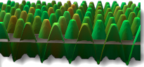

# {: .inline} {{page.title}}

이미지를 가지고 재질을 만들 수 있습니다. 사진과 실제 재질(벽지, 카펫 등)을 스캔하여 페인트 프로그램에서 패턴을 만들거나 다른 비트맵 소스로 이미지를 사용합니다.

재질이 모든 방향에서 무한대로 늘어난다고 상상해보십시오. 개체가 이를 통과하는 지점에서만 재질이 보이게 됩니다. 패턴은 지정된 비율로 네 방향에서 끝없이 반복 (타일) 됩니다.

작은 이미지는 타일처럼 사용하기 가장 좋습니다. 비트맵으로 타일 처리가 잘 되지 않으면 타일을 미러(거울) 실행하는 옵션을 사용합니다. 이 옵션은 가장자리 일치를 보장합니다.

**안내:** 비트맵 이미지가 개체의 일부에서만 보이게 하려면(와인병의 레이블 또는 제품 로고의 경우), 이 기능 대신 [데칼](properties-decal.html)을 사용하세요.

이미지 맵은 다양한 방식으로 사용될 수 있습니다. 일반적인 방식은 실제 재질의 사진을 재질색으로 사용하는 것입니다.

## 이름
이미지 텍스처는 이름을 지정할 수 있습니다. 이 이름은 RDK의 텍스처 라이브러리에서 사용되며, Flamingo 자체에 실제로 미치는 영향은 없습니다.

## Flamingo 이미지

### 이미지 미리보기
{: #image-preview}
선택된 이미지 파일의 미리보기를 표시합니다. 이미지 위에 마우스를 잠시 두면 이미지 파일 이름이 팝업으로 표시됩니다. 다른 이미지를 선택하려면 해당 이미지를 클릭합니다.

#### 이미지 해상도
{: #image-resolution}
현재 이미지 파일의 해상도(픽셀 단위)를 표시합니다.

### 타일
{: #tiles}
재질 정의에 사용되는 이미지 맵은 항상 반복됩니다 (타일 처리). 이 설정은 각 인스턴스(타일)의 크기가 현재 모델 단위에서 얼마나 큰지를 지정합니다.

#### 너비/높이
{: #width-height}
타일 크기를 모델 단위로 설정합니다.




### 매핑 유형
{: #mapping-type}
색 채널에 적용되는 이미지입니다. 이미지를 사용하는 다른 방법도 있습니다. 이미지는 다음과 같이 설정할 수 있습니다:

* [표준](#standard)
* [법선](#normal)
* [변위](#displacement)

### 표준
{: standard}
이미지는 재질에 색과 시각적인 울퉁불퉁함(범프)을 표현합니다. 강도와 범프값을 사용하여 비트맵이 재질에 미치는 영향의 정도를 제어합니다.

#### 색 세기
{: #color}
이미지 맵이 얼마나 재질 표현에 영향을 미치는지를 결정합니다. 다음의 예에서 아래에 있는 재질은 자홍색입니다. 아래에 있는 색이 완전히 검정색과 흰색 텍스처로 마스크 처리될 때까지 색의 세기가 증가합니다.

*색의 세기는 0.2, 0.5, 1.0 입니다.*

#### 범프 세기
{: #bump}
개체의 서피스 법선을 흔들어 개체 표면의 범프와 주름을 시뮬레이션합니다. 기본 개체는 바뀌지 않습니다. 그림에서 왼쪽의 재질은 변위 맵핑이 사용되였고, 오른쪽 재질은 가장 높은 값으로 설정된 범프 매핑이 사용되었습니다. 음의 범프 값을 사용하면 효과가 반전됩니다. 범프 맵핑된 재질에서 가장자리와 그림자는 부드럽게 처리됩니다. 참조: [Wikipedia 항목: Bump mapping](http://en.wikipedia.org/wiki/Bump_mapping).

*범프의 세기는 0.5 (왼쪽), 1.0 (오른쪽)입니다.*

### 법선
{: #normal}
렌더링 메쉬에 더 많은 다각형을 사용하지 않고도 범프와 움푹 들어간 부분의 음영을 가짜로 만들어냅니다. 참조: [Wikipedia 항목: Normal mapping](http://en.wikipedia.org/wiki/Normal_mapping).

법선 맵(Normal Map)은 범프 맵과 유사하지만, 법선 맵의 경우 서피스의 법선을 수정합니다. 효과는 범프와 기본적으로 동일합니다. 그러나 법선 맵은 범프보다 법선을 훨씬 제어하기 쉽습니다. 범프 맵은 비트맵에서 RGB의 회색 평균을 사용합니다. 법선 맵의 RGB는 법선의 XYZ 수정에 대응합니다. 이미지의 파란색 채널이 법선의 Z방향을 제어하기 때문에, 법선맵에서 파란색이 확연하게 보입니다.

### 변위
{: #displacement}
이 이미지 맵은 이미지에서 색의 값을 기준으로 서피스 렌더링 메쉬를 변위(變位:displacement) 실행합니다. 그 결과, 서피스의 실제 지리적 위치 변경에 영향을 줍니다. 대개, 서피스 법선을 따라 변위가 실행됩니다. 참조: [Wikipedia 항목: Displacement mapping](http://en.wikipedia.org/wiki/Displacement_mapping).

 **안내:** 작은 개체에 변위 맵핑을 사용하실 때 주의하세요. 변위를 사용하면 렌더링 시간이 상당히 증가합니다.

#### 높이
{: #height}
변위의 가장 높은 지점의 높이.

#### 간격띄우기
{: #offset}
서피스 법선를 참조하며, 변위가 시작하는 지점을 설정합니다. 변위는 특정 부분의 완전한 외부/내부, 또는 일부 내부/외부에서 실행될 수 있습니다.

*Z간격띄우기 = -1.0*

*Z간격띄우기 = -0.5*

*Z간격띄우기 = 0.0*

#### 패싯 크기
{: #facet-size}
변위 메쉬의 패싯 크기. 변위의 디테일뿐만 아니라,렌더링 크기와 메모리 사용도 증가시킵니다.

## Flamingo 이미지 고급
{: #advanced}
일반적으로 Flamingo 이미지는 재질의 주요 색 채널에 적용됩니다. Flamingo 고급 대화상자에서 해당 비트맵이 영향을 미치는 다른 채널을 지정합니다. 이 기능은 매우 특수한 효과를 내기 위해 사용합니다.

####  기본색
기본색이 기본 설정입니다. 이미지가 재질의 [색](material-type-advanced.html#color)에 영향을 미칩니다.

####  정반사 색
정반사 색은 해당 시점에서의 이미지 색을 기준으로 [반사 채널](material-type-advanced.html#highlight-color) 의 색에 영향을 미칩니다.

####  정반사 강도
정반사 강도는 해당 시점에서의 이미지 회색조를 기준으로 [반사의 정도](material-type-advanced.html#intensity)를 변경시킵니다. 이는 텍스처 세트에서 정반사 맵으로 자주 사용됩니다.

####  하이라이트 선명도
해당 시점에서 맵의 회색조 값을 기준으로 [하이라이트](material-type-advanced.html#intensity) 의 선명도와 흐린 정도를 조정합니다.

#### 하이라이트 형태
{: #advanced-highlight-shape}
하이라이트 형태에 영향을 줍니다.

####  투명도
이미지의 회색조를 기준으로, 재질에서의 [투명도](material-type-advanced.html#intensity) 정도에 영향을 줍니다.

####  반투명도
이미지의 회색조를 기준으로, 재질에서의 [반투명도](material-type-advanced.html#translucency) 정도에 영향을 줍니다.

####  감쇠
이미지의 회색조를 기준으로, 재질에서의 [감쇠](material-type-advanced.html#attenuation) 정도에 영향을 줍니다.

#### X/Y 간격띄우기
{: #advanced-x-y-offset}
재질과 X축, Y축과의 간격을 띄웁니다.

####  회전
이미지 맵을 회전시킵니다. 이미지의 기본 회전을 변경해야 할 경우, 이미지를 90도 또는 180도로 회전시키는 데 사용합니다.
