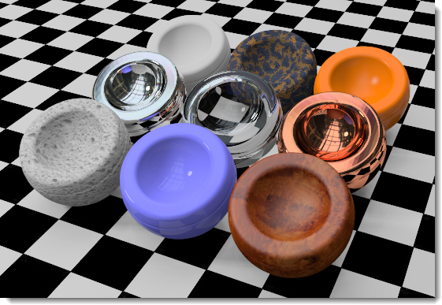
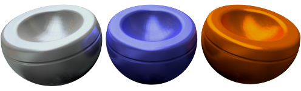
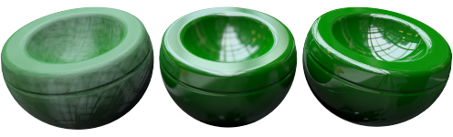
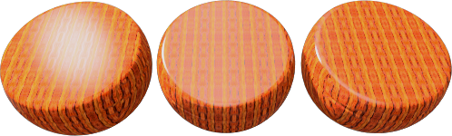
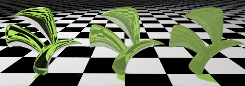
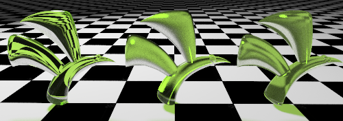
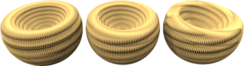

#  {{page.title}}

Flamingo has both [Simple Material](material-type-simple.html) Types and an Advanced Material type.  The Advanced Material contains the complete series of property groups for a material.  Use the Advanced Material type for the maximum flexibility and control of a material.

The complete set of property groups in the Advanced Material are:

> [이름](#name)
> [Material Procedure](#procedures)
> [Advanced Material Properties](#advanced-materials-properties)
> [Reflective Finish](#reflective-finish-and-highlight)
> [Transparency Properties](#transparency)
> [Procedural Textures](#bump-patterns)
> [Bitmap Textures](#textures)
> [노트](#notes)

## 재질 이름
{: #name}
This is the name of the material in the Rhino model.  Materials are stored in the Rhino model. That means a with the same name in the library or a different model will not be affected by edits to the material in the current model. To use any material in another model it must be exported to the [Library](libraries.html) first. The Name of the material will also serve as its exported file name.

## 재질 절차
{: #procedures}
The Procedures tree combines one or more materials using a set of rules for how the materials interact. The tree displays the components used to create the material and lets you add components. For standard materials, there will be only one component in the list: Base.

Each procedure combines two "child" materials using a specific method. Each of these child materials can in turn consist of a procedure, combining two children of its own. In this way, extremely elaborate materials can be built from simpler constituents. Procedures for combining materials include [Angular Blend](procedural-materials.html#angular-blend), [Blend](procedural-materials.html#blend), [Marble](procedural-materials.html#marble), [Granite](procedural-materials.html#granite), [Tile](procedural-materials.html#tile), and [Wood](procedural-materials.html#wood).

As an example, the [Marble](procedural-materials.html#marble) Procedure combines a Base material and Vein Material in a swirling pattern.

##### 절차를 추가하려면
1. Right-click on Base the Procedures window.
1. On the menu, click a procedure type.
  * [Base](procedural-materials.html#base)
  * [Angular Blend](procedural-materials.html#angular-blend)
  * [블렌드](procedural-materials.html#blend)
  * [화강암](procedural-materials.html#granite)
  * [대리석](procedural-materials.html#marble)
  * [타일](procedural-materials.html#tile)
  * [나무](procedural-materials.html#wood)

##### To remove a procedure
 1. In the Procedures window,right-click the procedure name.
 2. 메뉴에서 제거를 클릭합니다.

## 고급 재질 속성
{: #advanced-materials-properties}



#### 반사 마무리와 하이라이트
{: #reflective-finish-and-highlight}
These settings vary the way a material reflects light and objects. The highlight effect is normally associated with light areas on glossy materials where the light hits the object. The reflective effect normally defined with a more mirror like reflections that reflects the objects in the rest of the the scene. It is important to now that chrome and other reflective materials do not make an interesting image unless they have something to reflect. When working with reflective materials, also think about an interesting environment and other objects for the reflective materials to reflect.
 Note : To activate these settings, the Intensity value must be greater than zero.

#### 하이라이트 색
{: #highlight-color}
Highlight color is the color that material adds to reflections. There are three settings for this control, White, Metallic and Custom

#### White
Materials with a white highlight will not add any color to reflections.  Materials with a white highlight are common and tend to resemble standard paint, plastics or a mirror finish.

#### Metallic
{: #metallic}
Sets the highlight color to match the base color. Many metal finishes normally use the base color as the reflective color.  This metallic options use the material based color as a reflective color.

#### 사용자 지정
In some very specialized finishes, the reflection off the object will be a different color then the base color fo the material.  This is normally in materials that are actually made of multiple layers. Use Custom to specify any color for the highlight. Use the [Color Selector](select-color.html)  to select a reflective color.

#### Intensity
{: #intensity}
Adjusts the strength of the highlight. Lower values tend to make glossy objects that reflect light, but not surrounding objects. Larger values increase the size and strength of the highlight and reflections.  The highest values will make the material mirror-like, reflecting other objects and the environment in the scene.

#### Fresnel
{: #fresnel}
Pronounced (fray-NELL) Controls the reflectivity of opaque materials, a phenomenon known as [Fresnel reflection of conductors](http://en.wikipedia.org/wiki/Fresnel_equations) .The Fresnel setting  models the tendency of many materials to become more specular (mirror-like) at glancing angles while retaining more matte properties at perpendicular viewing angles.
Reduce the value for very dark materials to prevent too much reflection. Increase the value for materials like varnished wood, where the Fresnel reflectivity is more pronounced.

#### 선명도
{: #sharpness}
Sets the size of the highlight. Lower numbers specify a broader highlight; higher numbers focus the highlight in a smaller area.  When applied to higher intensity reflectivity, it will make reflections blurry (out of focus) or sharp (in focus).

#### Type
{: #type}
Changes how reflections are calculated when artificial light sources are reflected. Reflections are calculated using two methods: *raycasting* and *highlight*. These two methods will eventually produce identical results; however, in certain situations, you will find that one method gets a good result more quickly. For example, objects might not look good because a light source reflection hides the material's appearance.

In the illustration below for Balanced type, the object on the left has a bright white reflection that overpowers the material's appearance.

Sometimes interior renderings where the light sources are small can have a spotty artifact on surfaces. The surfaces exhibiting the artifact typically have blurry reflections. Changing the reflective type to [Glossy](advanced-material-properties-main.html#glossy), [No Light Source Reflections](advanced-material-properties-main.html#no-light-source-reflection), or [Monte Carlo](advanced-material-properties-main.html#monte-carlo) can help alleviate this problem.

#### Balanced
{: #balanced}
Automatically balances raycasting and highlight based on the Sharpness setting. Both the actual reflection of the light source and the artificial highlight are calculated.

#### Glossy
{: #glossy}
하이라이트의 흐린 정도를 증가시키고 레이캐스팅을 방지합니다. 개체 또는 빛의 반사가 계산되지 않으므로 따라서 성능이 향상되고 매우 흐리게 반사되는 재질의 아티팩트도 방지됩니다. 은은한 반사는 일부 손실될 수 있습니다.

#### 몬테카를로
{: #monte-carlo}
오직 레이캐스팅만이 광원 반사 계산에 사용됩니다. 레이캐스팅 초기에는 매우 노이즈가 많으며 점차 올바르게 수렴됩니다. 하이라이트가 흐리지 않을 때 가장 유용합니다.

#### 하이라이트 없음
{: #no-highlight}
오직 레이캐스팅만이 광원 반사 계산에 사용됩니다. 광원이 크고 재질이 흐리지 않아 하이라이트 계산에 시간이 오래 걸릴 수 있을 때 유용한 방식입니다. 광원 반사는 점차적으로 수렴됩니다.

#### No Light Source Reflection or No Highlight
{: #no-light-source-reflection-and-no-highlight}
인공 광원의 모든 반사와 인공 하이라이트 효과가 제외됩니다. 개체 반사는 여전히 계산됩니다.

#### No Light Source Reflections
{: #no-light-source-reflection}
광원의 레이캐스트 반사가 제외되고, 하이라이트만 사용됩니다. 재질이 흐리고, 장면에 작고 밝은 광원이 있을 경우, 스펙클 아티팩트를 방지하는 데 종종 유용하게 사용됩니다.

## Transparency
{: transparncy}
The Transparency settings control properties associated with light passing through a material.

#### Transparency Intensity
불투명한 재질을 투명한 재질로 변경합니다. 투명한 재질은 렌더링 시간을 증가시킵니다.

#### 굴절률(IOR)
{: #index-of-refraction}
재질을 통해 그 너머에 있는 개체를 볼 때 굴절이 얼마나 발생하는지를 결정합니다.

다음 표는 굴절률의 일부 예를 나타냅니다.

 | 재질      |     | IOR         |
 |:--------------|:---:|:------------|
 | 진공        |     | 1.0         |
 | 공기           |     | 1.0029      |
 | 얼음           |     | 1.309       |
 | 물         |     | 1.33        |
 | 유리         |     | 1.52 to 1.8 |
 | 에메랄드       |     | 1.57        |
 | 루비/사파이어 |     | 1.77        |
 | 다이아몬드       |     | 2.417       |
{: .grided-table}

#### 반투명도
{: #translucency}
A measure of diffusion. High translucency produces a “sandblasted” effect, since more light is scattered randomly through the material. This is a very sensitive effect, small adjustments can make a big difference.

#### Scattering
{: #scattering}
Controls the probability of the light encountering a particle per unit length. The [Path Tracer](render-tab.html#path-tracer) is required for this effect.
표면하 확산(Subsurface scattering)은 빛이 개체의 표면을 관통하고 어떤 방향으로든 확산되는 것을 가능하게 합니다. 많은 반투명 재질들은 이 효과를 사용하여 모델링될 수 있습니다. 빛이 짧은 거리를 통과하도록 설정하면, 돌이나 피부같은 특정한 표면을 현실성 있게 “부드럽게 처리”할 수 있습니다.
재질이 어느 정도 반투명해야 표면하 확산이 발생할 수 있습니다. 이것은 체적을 나타내는 효과(volumetric effect)입니다. 이 효과가 올바르게 실행되려면 이 재질이 적용되는 개체가 솔리드 또는 "폐쇄된 공간"이어야 합니다.

#### Attenuation
{: #attenuation}
Determines how much light is absorbed as it passes through the object— greater values produce a more cloudy appearance. Use Attenuation to model liquids. Clear liquids have low Attenuation ; murky liquids have higher Attenuation values.

#### Dispersion
{: #dispersion}
빛이 얼마나 많이 구성 요소 파장으로 분할되는지를 제어합니다.

#### 채도
{: #saturation}
굴절 분산의 양을 결정합니다.

#### Blurry Transparency
{: #blurry-transparency}
재질이 부분적으로 투명할 때 재질이 더욱 자연스럽게 보이도록 적은 양의 노이즈가 투명도에 더해집니다.

#### Blurriness
노이즈가 추가되는 정도를 제어합니다.

#### 글로우
{: #glow}
마치 빛이 비추고 있는 것과 같은 착각을 불러일으킵니다.

## 텍스처
{: #textures}
Two types of textures can be added to a material: Image Textures and Bump Patterns. Image textures are based on bitmaps, photographs or scanned images.  Bump Patterns are random or repeating patterns generated by Flamingo.

### 이미지
{: #images}
Up to four bitmap images can be used to add detail to a material. Image maps can be used many ways including the surface color and apparent three-dimensional surface quality. Image maps are two-dimensional patterns created using raster-based paint programs, by scanning photographs or other materials. A common method is to use a picture of a real-world material as the materials color. Images can consist of up to four images. Sometimes one image controls the color and another images may control the bump properties of the texture. To control how an image effects a material, go to the [Image Properties](material-image-properties.html) Dialog



### Bump Patterns
{: #bump-patterns}
Bumps Patterns create the appearance of a specific kind of surface without using displacement maps or requiring additional maps. Bumps use mathematical rules to provide the illusion of surface bumpiness in the material. Patterns include:

> [사포](#sandpaper)
> [자갈](#rubble)
> [각뿔](#pyramid)
> [주름](#wrinkled)
> [대리석](#marbled)

As and example materials like stucco, concrete, and clay have a fine texture. It is probably not worth scanning a piece of the material to make a bitmap for it unless it will be viewed at close range. Using a Sandpaper procedural bump on a [Base Color](advanced-material-properties-main.html#color) emulates this kind of fine pattern. Create a [Base Color](advanced-material-properties-main.html#color) that is the color of the material. Then add a procedural bump to the material. Use Sandpaper for a fine texture and Rubble for a coarser texture.

When one of the bump maps is checked, additional controls become available. More than one bump pattern can be added to a material.

#### Sandpaper
{: #sandpaper}
Provides a random, finely textured appearance. Change the [Scale](#scale), [Strength](#strength) and [Rotation](#rotation) to edit sandpaper.

*Sandpaper progressing from smaller to larger [Scale](#scale) and [Strength](#strength).*

#### Rubble
{: #rubble}
Gives the appearance of a lumpy, pitted surface. It can be scaled up and used for water, dirt, and smudges on surfaces. Smudges can be made with a large [Scale](#scale) and a very small [Strength](#strength) using Rubble. Rubble bump has a larger size range than Sandpaper.

*Rubble progressing from smaller to larger [Scale](#scale) and [Strength](#strength).*

#### Pyramid
{: #pyramid}
Gives the appearance of small pyramidal protrusions like a knurl pattern.  [Scale](#scale) will control only the X and Y pyramid base size. [Strength](#strength) will effect the "height" effect of the pyramid.

*Pyramid showing a larger and larger [Scale](#scale).*

#### Wrinkled
{: #wrinkled}
Gives a wrinkled appearance. Change the [Scale](#scale), [Strength](#strength) and [Rotation](#rotation) to edit wrinkled.

*Pyramid showing a larger and larger [Scale](#scale). [Strength](#strength) is held constant.*

#### Marbled
{: #marbled}
Gives a marbled appearance.  This is swirling pattern. Change the [Scale](#scale), [Strength](#strength) and [Rotation](#rotation) to edit wrinkled.

*Marbled showing a larger and larger [Scale](#scale). [Strength](#strength) is held constant.*

### Scale
{: #scale}
비율은 범프의 비례적 크기를 제어합니다.

#### X/Y/Z
각 방향에서의 비율을 별도로 지정합니다.

#### 잠금
종횡비를 유지합니다.

### Strength
{: #strength}
깊이 표시를 제어합니다.

### Rotation
{: #rotation}
패턴의 회전 각도를 설정합니다.
절차적 맵에 분명한 패턴이 있거나, 범프맵이 방향성 패턴을 만들기 위해 서로 다른 X, Y, Z 구성 요소를 기준으로 크기 조정된 경우에만 방향을 바꾸는 것이 분명하게 보입니다.

