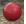
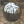
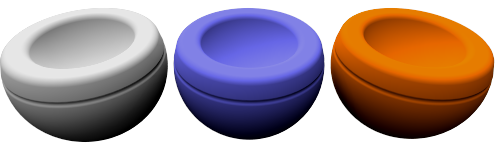
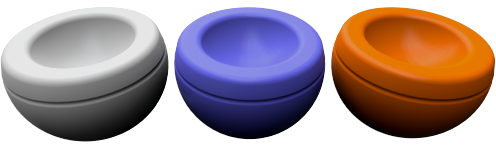
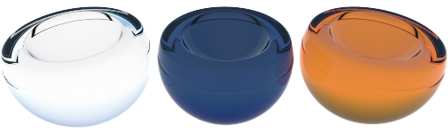
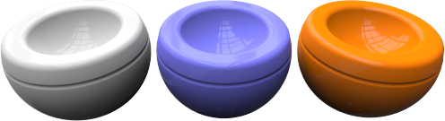
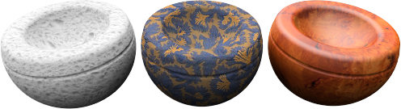
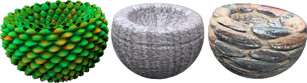

#  {{page.title}}
Flamingo 재질은 속성 그룹 시리즈로 정의됩니다. 자주 사용되는 재질로 구성된 간단한 재질 속성 시리즈가 있습니다. 이들 재질에는 아주 간단한 제어로 변경이 가능하며, 복잡하게 많은 설정을 변경할 필요 없이 간단한 제어만으로도 원하는 대로 설정을 변경하여 재질을 다르게 표현할 수 있습니다. 가장 간단한 재질의 경우, 재질의 색만 바꾸면 다르게 표현이 됩니다.

#### 간단한 재질 속성:

> [단색](#solid-color)
> [플라스틱](#plastic)
> [금속](#metal)
> [유리](#glass)
> [광택](#glossy)
> [클리어_피니시](#clearfinish)
> [Flamingo 텍스처](#flamingo-textured)
> [텍스처 세트](#texture-set)

Any material can be converted to an advanced material.  Advanced materials present all the possible controls to edit a material in Flamingo nXt.  For the most extensive control of a material, use Advanced Materials or convert your existing material to an advanced material.

#### 고급 재질은 다음 속성 그룹으로 구성되어 있습니다:

> [이름](material-type-advanced.html#name)
> [재질 절차](material-type-advanced.html#procedures)
> [고급 재질 속성](material-type-advanced.html#advanced-materials-properties)
> [반사 마무리](material-type-advanced.html#reflective-finish-and-highlight)
> [투명도 속성](material-type-advanced.html#transparency)
> [절차적 텍스처](material-type-advanced.html#bump-patterns)
> [비트맵 텍스처](material-type-advanced.html#textures)
> [노트](material-type-advanced.html#notes)

재질은 Rhino 모델에 저장되고 보관됩니다. Rhino 모델이 서로 다르더라도, 고유한 재질의 이름은 동일할 수 있습니다.

## 단색
{: #solid-color}
Solid Color materials have only a [name](material-type-advanced.html#name) and a [color](material-type-advanced.html#color).





## 플라스틱
{: #plastic}
Plastic materials are slightly reflective with a white [highlight](material-type-advanced.html#highlight-color).



 Use the Advanced Editor to overwrite the presets of [Highlight color](material-type-advanced.html#highlight-color), [Intensity](material-type-advanced.html#intensity), [Fresnel](material-type-advanced.html#fresnel), and [Sharpness](material-type-advanced.html#sharpness).

## 금속
{: #metal}
Metal materials have a highlight whose color matches the [color](material-type-advanced.html#color). You can also control the [Sharpness](material-type-advanced.html#sharpness) of the reflection.



#### 선명도
Controls the sharpness vs blurriness of the reflection. See Advanced [Sharpness](material-type-advanced.html#sharpness) topic for more details.

 Use the Advanced Editor to overwrite the pre-sets of [Highlight color](material-type-advanced.html#highlight-color), [Intensity](material-type-advanced.html#intensity), [Fresnel](material-type-advanced.html#fresnel) and [Type](material-type-advanced.html#type).

## 유리
{: #glass}
Glass materials have a [color](material-type-advanced.html#color) and an [Index of Refraction](advanced-material-properties-main.html#index-of-refraction) (IOR).



#### 굴절률(IOR)
Controls the amount light bends through the material. See Advanced [Index of Refraction](advanced-material-properties-main.html#index-of-refraction) topic for more details.

 Use the Advanced Editor to overwrite the pre-sets of [Highlight color](material-type-advanced.html#highlight-color), [Intensity](material-type-advanced.html#intensity), [Fresnel](material-type-advanced.html#fresnel), [Sharpness](material-type-advanced.html#sharpness) and [Transparency](material-type-advanced.html#transparency)

## 광택
{: #glossy}
Glossy materials generally have a low Highlight [Intensity](material-type-advanced.html#intensity) and [Sharpness](material-type-advanced.html#sharpness).



#### 강도
Controls strength of the highlight from lights on the surface. See Advanced [Intensity](material-type-advanced.html#intensity) topic for more details.

#### 하이라이트 선명도
Controls sharpness vs blurriness of the highlight spot from lights on the surface. See Advanced [Highlight sharpness](material-type-advanced.html#sharpness) topic for more details.

 Use the Advanced Editor to overwrite the presets of [Fresnel](material-type-advanced.html#fresnel) and [Type](material-type-advanced.html#type).

## 클리어_피니시
{: #clearfinish}
The ClearFinish material simulates car paint, porcelain, ceramics, varnished woods, or any material with a plastic or clear-coat layer. ClearFinish uses the [Fresnel](material-type-advanced.html#fresnel) setting to change the material color based on angle to the view. These materials tend to be a deep color when looked at straight on, but as the surface curves away from the view, they become more and more reflective. Car paints with a clear-coat or clear lacquer finishes are good examples.



 Use the Advanced Editor to overwrite the presets of [Highlight color](material-type-advanced.html#highlight-color), [Intensity](material-type-advanced.html#intensity), [Fresnel](material-type-advanced.html#fresnel) and [Sharpness](material-type-advanced.html#sharpness).

## Flamingo 텍스처
{: #flamingo-textured}
Textured materials use images to create colors and patterns. The image name, resolution, tile size, and highlight intensity and sharpness are controllable from this simple material.



#### 강도
Controls strength of the mirror-like reflection of the surface. See Advanced [Intensity](material-type-advanced.html#intensity) topic for more details.

#### 선명도
Controls the sharpness vs blurriness of the reflection. See Advanced [Sharpness](material-type-advanced.html#sharpness) topic for more details.

#### 이미지
Set the image map and properties of the material. There are many options here. See the Advanced [Images](material-type-advanced.html#texture) topic for more details.


 Use the Advanced Editor to overwrite the presets on this material.

## 텍스처 세트
{: #texture-set}
[Texture set materials](texture-set-materials.html) support third-party texture maps that contain information such as displacement, normal, or bump maps. Displacement maps give the material depth. Combining these texture maps as a set can create very realistic materials. The [PixPlant software](http://www.pixplant.com/) is a product that can take a standard bitmap and create these sets of textures.
<!-- TODO: This dialog Needs a page.-->


#### 너비와 높이
Controls size of all the textures in the set.  Use this control to keep all the bitmaps sized and aligned together.

#### 강도
Controls strength of the mirror-like reflection of the surface. See Advanced [Intensity](material-type-advanced.html#intensity) topic for more details.

#### 선명도
Controls the sharpness vs blurriness of the reflection. See Advanced [Sharpness](material-type-advanced.html#sharpness) topic for more details.

#### Types
This controls the type of reflection on the surface.  See Advanced [Type](material-type-advanced.html#type) topic for more details.

 Use the Advanced Editor to overwrite the presets on this material. **Note:** This is a complex material that uses many overlaid textures set with various defaults.  Using the advanced editor will not keep all the properties in sync.

## 고급 재질
The [Flamingo Advanced](material-type-advanced) material contains a complete set of properties for a Flamingo Material.  If none of these simple materials work, use the [Flamingo Advanced](material-type-advanced) Material to create a material and have the greatest flexibility in creating materials.
