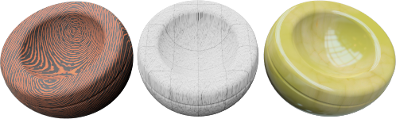
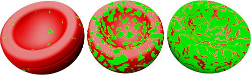
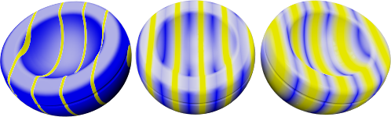
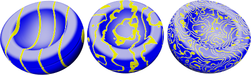
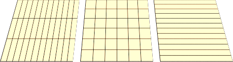
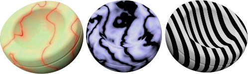
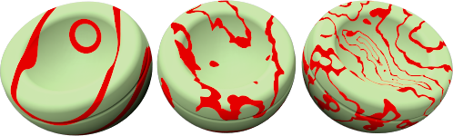

#   {{page.title}}
절차 트리는 재질들이 서로 상호 작용하는 방법을 정하는 규칙을 사용하여 하나 이상의 재질을 결합합니다. 트리에는 재질을 만드는 데 사용된 구성 요소가 표시되며, 직접 구성 요소를 추가할수도 있습니다. 간단한 재질은 베이스 구성 요소만 목록에 표시됩니다.
<!-- TODO: We need an diagram describing the Proceedure Hirarchyarchy. -->

각각의 절차는 두 개의 하위 재질을 특정한 방식을 사용하여 결합합니다. 두 하위 재질이 차례차례 절차가 되어 두 하위 재질 자체를 결합합니다. 이 방식을 사용하여 더욱 간단한 구성 요소를 가지고 매우 정교한 재질을 만들 수 있습니다. 재질을 결합하는 절차에는 다음과 같은 옵션이 있습니다:

> [Base](#base)
> [Angular Blend](#angular-blend)
> [Blend](#blend)
> [Marble](#marble)
> [Granite](#granite)
> [Tile](#tile)
> [Wood](#wood)

##### 절차를 추가하려면
1. Right-click anywhere in the Procedures window.
1. On the menu, click a procedure type.

##### To remove a procedure
 1. In the Procedures window, right-click the procedure name.
 2. On the menu, click Remove.

## Base
{: #base}
This is the basic simple material with no layers. This is the default procedure.

## Angular Blend
{: #angular-blend}
Many materials change color, reflection, or transparency based on the angle the material is viewed. The Angular Blend procedure blends between two materials based on the angle of view to the surface of the object.

The Angular Blend procedure blends between two different materials to create special effects. The two layers in the procedure are the Inner and the Outer Layer.

#### 내부
시점으로부터 0도에서 시작 각도까지, 내부 구성 요소가 완전하게 표시됩니다. 이것을 기본 재질이라고 생각하십시오.

#### 외부
뷰를 기준으로 종료 각도에서 90도까지, 외부 구성 요소가 유일하게 표시되는 재질입니다. 이것을 코팅이라고 생각하십시오.

#### 시작 각도
시점으로부터 외부 구성 요소 재질이 시작하는 각도입니다.

#### 종료 각도
시점으로부터 외부 구성 요소 재질이 멈추는 각도입니다.
시작 각도와 종료 각도 사이에서 내부와 외부 구성 요소가 블렌드됩니다.

In the illustration below, the Start angle is 30 degrees (which in rendering translates to the the green circle on the right) and the Stop angle is 60 degrees (in the rendering that translates to the red circle).
The image at the left shows the the Inner material as white, and the Outer material as black.

 

* 시점으로부터 0에서 30도 사이에서는 흰색이 보입니다.
* 시점으로부터 30에서 60도 사이에서는 흰색에서 검정으로의 그라데이션이 보입니다.
* 시점으로부터 60에서 90도 사이에서는 검정이 보입니다.

## 블렌드
{: #blend}
블렌드 절차는 두 개의 베이스 구성 요소를 결합하고 각 구성 요소의 배율을 제어합니다. 모든 표준 라이브러리 나무 재질은 블렌드 절차를 사용하여 나무의 마감 처리를 투명한 무광에서 어두운 유광으로 변경합니다.

기본 패턴 재질에 전체적인 색을 추가하여 전체 재질 정의를 바꿀 때 블렌드가 잘 실행됩니다.

#### 블렌드
Varies the percentage of each component material used in the final material.  For instance, the material below shows a blend between the striped material and solid green color. The left image shows the slider to the left, showing a strong stripe material and weak green.  The middle image show the slider in the middle and 50% striped and 50% green color blended.  The image to the right shows a weak striped material with a strong green material, so the slider is at the right of the Blend slider.

#### 이미지 사용
대개 회색조 패턴으로 구성된 비트맵 이미지는 어디에 두 개의 구성 요소 재질이 표시되는지를 정의합니다. 재질은 이미지의 회색 픽셀 값을 기준으로 블렌드됩니다. 회색조 이미지 맵을 사용하여 첫 번째와 두 번째 구성 요소 사이를 조정합니다. 첫 번째 구성 요소는 비트맵 패턴에 검정색이 있는 곳에 배치되며, 두 번째 구성 요소는 비트맵 패턴에 흰색이 있는 곳으로 배치됩니다.
<!--TODO: The first sentence needs work. -->

그림에서 처음과 두 번째 구성 요소에 모두 동일한 재질이 사용되었으나, 블렌드는 세 개의 다른 비트맵으로 제어됩니다.

마스크 비트맵의 해상도는 재질의 화질에 영향을 줍니다. 비트맵 해상도가 높을수록 화질 문제도 적어지고 시점이 재질에 가까워질 수 있으나, 더 많은 메모리가 소요됩니다.

#### 알파 채널 사용
색이 블렌드되는 곳을 결정할 때 이미지에 알파 채널이 있으면 비트맵 회색조 대신 알파 채널이 사용될 수 있습니다.

#### Reverse
첫 번째 구성 요소는 비트맵 패턴에서 흰색이 있는 곳으로 배치되고, 두 번째 구성 요소는 비트맵 패턴에서 검정색이 있는 곳으로 배치됩니다.

#### 타일
재질의 크기는 재질 정의에 사용된 비트맵의 해상도와 무관합니다. 재질을 올바르게 크기 조정하려면, 실제 단위를 기준으로 비트맵 1개가 얼마나 큰 영역에 표시되는지를 결정해야 합니다. 비트맵이 여섯 개의 4단위 타일 높이와 열두 개의 4단위 타일 길이를 나타낸다면, 크기는 X 방향으로 48단위 Y 방향으로 24단위가 됩니다. 비트맵이 패턴에 적합한 크기로 스트레치되어 표시됩니다.

#### 너비
이미지의 단일 인스턴스 너비 (픽셀 단위).

#### 높이
이미지의 단일 인스턴스 높이 (픽셀 단위).

## 화강암
{: #granite}
두 번째 재질을 베이스 구성 요소에 포함시켜 3D 재질을 만듭니다. 화강암 절차는 반점을 베이스에 불규칙하게 분산시킵니다. 화강암 절차는 베이스와 반점 구성 요소가 결합하는 방식을 정의합니다. 화강암 절차는 금속의 녹, 반짝거리는 플라스틱을 비롯, 불규칙한 점 무늬가 있는 재질 등에 다양한 용도로 사용될 수 있습니다.

#### 베이스/반점
베이스와 반점 구성 요소는 두 가지 재질입니다. 이들의 속성은 다른 어떤 재질과도 같은 방식으로 지정됩니다.



#### 밀도
전체 패턴의 일부. 이 설정값을 높이면 반점의 상대적 크기도 커집니다.



## 대리석
{: #marble}
Creates alternating slabs of Base and Vein components. The Marble procedure defines how the Base and Vein components combine. The slabs are infinitely large, and the orientation of the object affects the way the slabs are oriented with respect to the object.

Texture [mapping](properties-object.html#mapping) for the objects controls the orientation of the material on the object.

텍스처 매핑 없음 (왼쪽). 텍스처 매핑 적용 상태 (오른쪽).

#### Base/Vein
The Base and Vein components are two materials. Their properties are specified in the same way as any material.


#### Vein Width
베이스와 결이 서로에 대해, 석판에서의 상대적인 크기를 바꿉니다. 결 너비는 하나의 베이스 줄과 다음 줄까지 거리의 일부입니다. 값의 범위는 0 (영)부터 1까지이며, 0 은 결 구성 요소가 없는 상태이고, 1은 베이스 구성 요소가 없는 상태입니다.




베니어 (왼쪽), 일반 (오른쪽).

## 타일
{: #tile}
타일은 2D 재질입니다. 개체의 텍스처 [매핑](properties-object.html#mapping)이 개체에 적용되는 재질 방향을 제어합니다. 타일 재질은 베이스 구성 요소와 이음 구성 요소를 결합합니다. 각각의 재질은 다른 재질도 포함할 수 있습니다.

특수 효과를 주려면 타일 크기를 각 방향마다 다르게 설정합니다. 예를 들어, 한쪽에는 극도로 긴 타일 재질을 사용하여 사이딩 재질로 만듭니다.

#### 타일
전체 타일 크기를 설정합니다. 너비와 높이는 독립적으로 설정할 수 있습니다.

#### 너비/높이
타일의 너비와 높이를 지정합니다.


#### 이음
이음 재질의 크기를 지정합니다.

#### 가로 이음/세로 이음
이음 재질의 너비와 높이를 지정합니다.

#### 잠금
이음의 가로와 세로 크기 비율을 유지합니다.

#### 간격띄우기
세로 타일마다 상대적인 가로 방향 간격띄우기를 설정합니다. 예를 들어, 0.5로 설정하면 일반적인 걸쳐 쌓기 (running bond)가 만들어집니다. 바닥 전체에 동일한 대리석 블록을 잘라 쓰는 효과 없이도, 대리석 타일 등의 재질로 모델링할 수 있습니다.

#### 다른 타일 사용
각각의 타일에 임의의 색상을 가진 재질 색을 더합니다. 불규칙한 벽돌과 같은 재질을 모델링할 수 있습니다.

#### R/G/B
Modifies the red, green, and blue color components.  This will slightly vary the base material of each tile randomly.

#### X/Y/Z
Offsets the material from the world origin for each tile randomly. Do this if a seam that marks the beginning of the material appears an in inappropriate place.

## 나무
{: #wood}
나무는 베이스와 링 구성요소가 번갈아 동심원을 이루는 원통형으로 구성되어 있습니다. 나무 설정은 베이스와 링 구성 요소의 결합 방식을 정의합니다.

Use this method to create wood materials if objects are not closely viewed. If detailed wood is needed, use a [Texture material](material-type-simple.html#textured) to do wood.  If the viewpoint is not close to the wood, a solid color can be used to take the place of wood without sacrificing image quality. This allows faster rendering. An additional advantage of using a wood material is that when rendering different sides of an object, the wood grain will look correct. End grain will show on the ends and parallel grain will show on the sides of an object.

#### 베이스/링
베이스와 링 구성 요소는 두 개의 재질입니다. 이들의 속성은 다른 어떤 재질과도 같은 방식으로 지정됩니다.


#### 링 너비
하나의 베이스 줄과 다음 줄 사이의 거리 일부입니다. 값의 범위는 0 (영)부터 1까지이며, 0 은 링 구성 요소가 없는 상태이고, 1은 베이스 구성 요소가 없는 상태입니다.




베니어 (왼쪽), 일반 (오른쪽).
