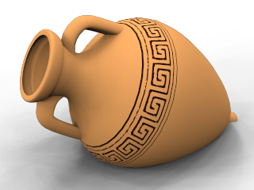
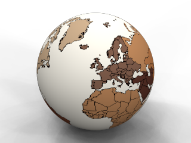

# {{page.title}}
데칼은 재질을 간접적으로 사용하지 않고, 개체에 직접 적용하는 비(非) 타일 방식의 이미지 맵입니다. 개체 색, 반사도 또는 범프에서 제한된 부분을 수정할 때 데칼을 사용합니다.
데칼은 [재질 정의](materials-tab.html)에서 사용되는 것처럼 타일 처리되지 않으며, 이미지 단일 인스턴스로 이루어져 있습니다.
데칼의 용도:

>실내 벽에 그림 걸기.
>제품에 레이블 또는 로고 붙이기.
>모델에 이름 넣기.
>스테인드글래스 창 만들기.

 **안내:** 데칼 미리보기는 OpenGL이 와이어프레임 모드에서만 사용하도록 설정된 경우 와이어프레임 뷰에서만 표시됩니다. **파이프라인** 설정은 **OpenGL** 설정(**옵션**  &gt; **화면표시**  &gt; **고급 설정**  &gt; **와이어프레임**  &gt; **기타 설정**  &gt; **파이프라인과 도관**)에 있습니다.

## 데칼 배치
{: #decal-list}
{: #decal-placement}

###  **추가**
{: #add-decal}
1. 하나 이상의 개체를 선택합니다.
1. **편집** 메뉴에서 **개체 속성**을 클릭합니다.
1. **속성** 목록에서 **Flamingo nXt 데칼**을 클릭합니다.
1. **추가** 단추를 클릭합니다.
1. **비트맵 열기** 대화상자에서 비트맵 이름을 선택하고 **열기**를 클릭합니다.
1. **데칼 속성** 대화상자에서 옵션을 선택하고, **배치**를 클릭합니다.
1. 점 입력 프롬프트에서 데칼을 배치할 위치를 모델에서 지정합니다.
정확한 시퀀스는 선택된 데칼 유형( [평면형](#decal-planarmapping), [원통형](#decal-cylindricalmapping), 또는 [UV맵](#decal-uvmapping) )에 따라 달라집니다.

###  **배치 편집**
{: #decal-edit-placement}
1. **배치 편집** 단추를 클릭합니다.
1. **제어점 선택** 프롬프트에서 그래픽 편집기를 사용하여 데칼의 위치를 변경합니다.
1. 완료되면 **Enter** 키를 누릅니다.

###  **속성**
{: #decal-properties}
1. **속성** 단추를 클릭합니다.
1. **데칼 속성** 대화상자에서 데칼 속성을 변경합니다.

###  **삭제**
{: #decal-delete}

>**삭제** 단추를 클릭합니다.

###  **위로 이동** / **아래로 이동**
{: #decal-movedown}
{: #decal-moveup}
여러 개가 겹쳐진 데칼을 하나의 개체에 적용할 때, 어떤 순서로 적용되는지가 매우 중요합니다. 데칼은 목록에 보이는 순서대로 적용됩니다. 목록에서 마지막 데칼이 가장 위에 적용됩니다.

>목록에서 데칼의 위치를 변경하려면 **위로 이동** 또는 **아래로 이동**을 클릭합니다.

##### 평면 데칼을 배치하려면
1. 프롬프트에서 데칼의 **너비**, **높이 방향** 위치를 지정합니다.
1. **제어점 선택...** 프롬프트에서 이미지 크기, 회전 또는 위치를 제어할 제어점을 선택합니다.
또는 데칼 배치를 완료하려면 **Enter** 키를 누릅니다.

### 옵션

#### 이동
데칼을 움직입니다. "이동의 기준점 새 위치" 프롬프트에서 Rhino Move 명령에서와 마찬가지로 원하는 위치를 입력합니다.

#### 이미지_종횡비_사용
스트레치된 데칼을 원래 비트맵의 종횡비에 맞춰 원래대로 되돌립니다.

##### 원통형 데칼을 배치하려면
1. 프롬프트에서 원통의 **중심점**을 지정합니다.
1. **제어점 선택...** 프롬프트에서 이미지 크기, 회전 또는 위치를 제어할 제어점을 선택합니다.
또는 데칼 배치를 완료하려면 **Enter** 키를 누릅니다.

## 제어 위젯을 사용하여 데칼 배치를 설정 또는 편집
안내: 평면형 매핑을 곡면에 사용할 때 전체 비트맵은 개체 서피스의 뒤에 있어야 합니다. 비트맵 일부가 개체 앞에 있다면 그 부분은 보이지 않습니다.

#### 데칼 너비와 높이를 동시에 크기 조정하려면

>제어 위젯 모서리 위치로 제어점을 끌어옵니다.

#### 데칼 높이를 변경하려면

>제어 위젯의 위와 아래 가장자리 상에서 중간 제어점을 끌어옵니다.

#### 데칼 너비를 변경하려면

>제어 위젯의 왼쪽과 오른쪽 가장자리 상에서 중간 제어점을 끌어옵니다.

#### 데칼을 이동시키려면

>제어 위젯의 중간으로부터 제어점을 끌어옵니다.

#### 데칼을 회전시키려면

>위젯 축 아이콘 상에서 x, y, 또는 z 축 제어점을 끌어옵니다.

## 데칼 속성
{: #dialogbox-editdecal}
비트맵의 정보는 개체의 색을 데칼의 색으로 바꾸거나, 두 가지를 블렌드합니다. 이것이 데칼의 가장 일반적인 사용법입니다.

## 투영
{: #projection}
매핑 스타일은 데칼을 어떤 방식으로 개체에 투영하는지를 지정합니다. 장면에 구성평면을 그려 정확한 데칼 배치에 도움이 되게 하는 것이 좋습니다. 서피스 뒤에 그린 직사각형은 표준 데칼의 안내선 역할을 할 수 있습니다. 개체 스냅을 사용하여 정확하게 배치합니다.

### 원통형
{: #decal-cylindricalmapping}

###  
원통형 매핑 유형은 와인 병에 레이블을 부착할 때처럼, 한 방향으로 곡면인 개체 상에 데칼을 배치할 때 유용합니다.
원통형 투영은 비트맵의 세로축을 원통형의 축에 맞추고 가로축은 원통을 둘러싸이게 하여 비트맵을 원통에 매핑합니다.

### 평면형
{: #decal-planarmapping}

###  
평면 매핑은 가장 일반적인 매핑 스타일입니다. 평면 또는 부드러운 곡면을 이루는 개체에 적합한 매핑입니다.
모서리는 비트맵의 위치와 범위를 정의합니다. 직사각형의 비율이 비트맵과 동일하지 않다면 비트맵이 스트레치되거나 압축되어 직사각형에 맞춰집니다.
평면형 매핑을 곡면에 사용할 때 전체 비트맵 투영은 개체 서피스의 뒤에 있어야 합니다. 비트맵 일부가 개체 앞에 있다면 그 부분은 보이지 않습니다.

### UV 맵
{: #decal-uvmapping}

###  
UV 매핑을 사용하는 데칼은 머리카락이나 나무 껍질 등의 개체처럼 데칼이 서피스에 맞춰 흐르고 늘어나는 경우에 유용합니다.
데칼이 개체 전체를 커버합니다. 데칼의 배치를 제어할 수 없습니다.
UV 매핑은 이미지를 구부리고 늘리기 위해 서피스의 U 방향과 V 방향을 매개변수화하여 사용하므로, 사용자가 직접 배치할 필요가 없습니다.

### 찾아보기
{: #file-browse}
이미피 파일을 바꿉니다.

## 세기
{: #decalmappingstrength}

### 색
{: #decal-color}
아래에 있는 재질에 대한 이미지 색의 상대적 세기를 다르게 설정합니다. [재질 텍스처 속성, 색의 세기](texture-properties-main.html#color)를 참조하십시오.

### 범프
{: #decalmappingbump}
범프 맵은 시뮬레이션된 그림자와 하이라이트 효과를 표면에 나타냅니다. [재질 텍스처 속성, 범프 세기](texture-properties-main.html#bump)를 참조하십시오.

## 반사 마무리
{: #reflective-finish-and-highlight}
재질 정의에서 제어되는 것과 동일한 속성을 제어합니다. 이 속성을 데칼의 영향을 받는 개체의 특정한 영역에 적용합니다. 기본적으로 데칼은 무광 마무리로 처리됩니다.

### 강도
하이라이트의 세기를 조정합니다. 값이 크면 하이라이트 크기와 세기가 증가합니다. [고급 재질 속성, 강도](advanced-material-properties-main.html#intensity)를 참조하십시오.

### 선명도
하이라이트의 크기를 설정합니다. 숫자가 작을수록 더 넓은 하이라이트가 지정됩니다. 숫자가 클수록 더 작은 하이라이트 영역으로 초점이 맞춰집니다. [고급 재질 속성, 선명도](advanced-material-properties-main.html#sharpness)를 참조하십시오.

### 금속
기본색과 일치하도록 하이라이트 색을 설정합니다. [고급 재질 속성: 금속](advanced-material-properties-main.html#metallic)을 참조하십시오.


## 고급
{: #advanced}

### 양면
{: #double}
데칼이 서피스의 앞면과 뒷면에 모두 나타나게 합니다.

### 미러
{: #mirror}
데칼 이미지를 반전시켜 미러(거울) 실행합니다.

## 투영 방향
{: #projection-direction}

### 뒤로
데칼 이미지의 뒤로부터 멀리 데칼을 투영합니다.
앞 (왼쪽), 뒤 (오른쪽).

### 앞으로
데칼 이미지의 앞으로부터 멀리 데칼을 투영합니다.
앞 (왼쪽), 뒤 (오른쪽).

### 앞으로 &amp; 뒤로
데칼을 데칼 이미지의 앞과 뒤로 모두 투영시킵니다.
앞 (왼쪽), 뒤 (오른쪽).

### 투명도
데칼의 투명도를 설정합니다. [투명도](advanced-material-properties-transparency.html)를 참조하십시오.
IOR
투명한 데칼의 굴절률을 설정합니다. [굴절률(index of refraction)](advanced-material-properties-transparency.html#index-of-refraction)을 참조하세요.
