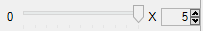

#  {{page.title}}
{: #channel}
8개의 채널 중 하나의 채널에서 조명을 설정할 수 있는 능력은 Flamingo nXt 5의 매우 유용한 기능입니다. 도면에서 태양과 하늘을 비롯한 각각의 광원은 하나의 채널에 지정할 수 있습니다. 렌더링할 때 각 채널의 빛은 그 자체의 레이어에 있게 됩니다. 렌더링을 마친 후에 해당 채널의 세기를 조정할 수 있습니다. 다시 렌더링할 필요 없이, 실시간으로 변경됩니다.  

채널이 매우 효과적인 경우:

* HDRI 환경과 일광 사이의 균형을 잡아야 하는 경우. 모든 HDRi 환경이 교정 가능한 것은 아닙니다. HDRi 하늘과 태양을 각각의 채널에 설정하는 것이 유용합니다. 렌더링을 실행한 후에 하늘과 태양의 상대적 빛의 세기를 조정합니다.
* 주광, 보조광, 후광 설정을 사용하는 스튜디오 렌더링. 각각의 조명을 서로 다른 채널에 설정하고 렌더링에 채널을 사용하며 실시간으로 세기를 조정합니다.
* 실내 또는 실외 렌더링에 다른 조명을 일렬로 사용하는 경우. 각 조명의 열을 하나의 채널에 설정할 수 있으며 그에 따라 효과적으로 조명의 세기를 각각 조정할 수 있습니다.
* 모든 조명을 켜고 렌더링한 후, 조명을 모두 끄고 그 중 일부의 조명을 다시 켜는 경우. 밤과 낮 렌더링을 만들기 위해 실내 장면을 렌더링할 필요가 없습니다.

한 번 이미지를 렌더링하면 각각의 채널은 저장하기 전에 개별적으로 렌더링 창에서 크기 조정이 가능하고, 또는 나중에 편집할 수 있는 .nXtImage 파일로 저장합니다.

전체 이미지를 밝게 하지 않고, 조명의 각각 서로에 대한 상대적인 빛의 세기를 조정할 때 채널을 사용합니다. 전체 이미지를 한 번에 밝게 하려면 이미지 조정 제어를 사용합니다.

<video id="channelsvideo" src="images/flamingo-lights-onoff.mp4" poster="images/flamingo-lights-onoff.jpg" controls preload></video>
*동영상을 재생하려면 클릭합니다.*

다중 채널 이미지를 만들고 조작하려면 다음의 조건들이 필요합니다.

 1. 참여하고 있는 모든 조명은 켜져 있어야 합니다.
 2. 각각의 광원이 채널에 지정되어 있어야 합니다. 기본적으로 태양과 하늘은 채널 0에, 인공적인 조명은 채널 1에 설정됩니다.
 3. 렌더링 직후에 렌더링 창의 채널 제어를 사용합니다.
 3. nXtImage 형식에서만 채널 정보가 저장됩니다. 이 파일 형식에서 조명을 조정하고 이미지를 비트맵 형식으로 저장할 수 있습니다.

## 채널 설정
{: setting}
첫 번째 단계는 각각의 조명을 채널에 지정하기 위해 다중 채널 렌더링을 설정하는 것입니다. 채널 번호는 일반적으로 각 조명 속성에 지정됩니다. 특정 조명을 채널에 설정하는 방법에 대한 안내는 다음 링크를 참조하세요:

>[태양 채널](sun-and-sky-tabs.html#sun-channel)
>[하늘 채널](sun-and-sky-tabs.html#sky-channel)
>[인공 조명 채널](lights-tab.html#channel)
>[재질 글로우](documentproperties-flamingo.html#channel)

원하는 수의 조명을 동일한 조명 채널로 그룹화할 수 있습니다. 채널 조정은 체배기입니다. 같은 채널에 있는 조명은 조정되는 동안에도 서로에 대한 상대적 세기를 유지합니다.

## 채널 조정
{: adjusting}
조명 채널은 렌더링 직후에 조정이 가능하며, 또는 nXtImage 파일로 렌더링을 저장한 경우 Flamingo 이미지 편집기에서 조정이 가능합니다. Flamingo가 계속해서 렌더링하는 동안 채널을 조정할 수 있으나, 크게 수정하려면 렌더링을 중지하고 조정할 것을 권장합니다.

#### Flamingo 조명 제어는 어디에 있습니까?
채널 제어는 [렌더링 창](render-window.html)의 Flamingo nXt 탭에 있는 채널 아래에 있습니다.

0부터 7까지의 8개 채널 제어가 있습니다. 조명이 켜져 있는 채널만이 활성화됩니다.

각 채널에는 슬라이더와 회전자 값이 있습니다. 회전자 값은 슬라이더의 최대값을 나타냅니다. 슬라이더가 오른쪽 끝으로 설정되어 있으면 회전자의 최대값이 해당 채널의 빛의 양을 곱하는 데 사용됩니다. 슬라이더가 50% 위치에 있으면 해당 채널의 모든 빛을 회전자 값의 절반으로 곱합니다. 슬라이더를 왼쪽 끝으로 설정하면 해당 채널의 모든 빛을 끕니다.

회전자의 값이 매우 중요하게 작용하는 경우가 있습니다. 태양과 하늘은 인공적인 조명보다 훨씬 밝을 수 있으므로, 인공 조명에서 차이를 확인하려면 회전자 값을 20 또는 50으로 올려야 할 수 있습니다.

채널을 올바르게 조정한 후, 이미지를 JPG 또는 PNG 파일 형식의 최종 렌더링으로 저장합니다.
