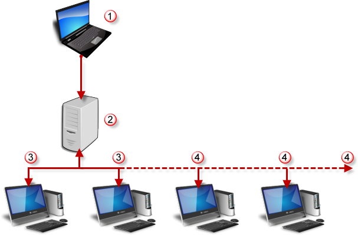

# {{page.title}}
Flamingo nXt 렌더 팜에서는 여러 대의 컴퓨터를 사용하여 하나의 이미지를 렌더링하고, 여러 이미지를 일괄 렌더링하거나, 뷰 기반 애니메이션 작업을 할 수 있습니다. 렌더 팜 클라이언트로만 사용될 컴퓨터에 Rhino 나 Flamingo nXt 가 필요하지 않습니다.

#### 전형적인 팜 레이아웃
{: #render-farm}

{: style="margin-top:25px;"}

>Rhino와 Flamingo nXt가 설치된 컴퓨터.
>네트워크 서버 또는 공유된 팜 폴더.
>두 개의 렌더 팜 클라이언트. (nXt 렌더 팜은 무료로 2 대의 클라이언트에서 사용할 수 있습니다.)
>추가로 구매한 렌더 팜 클라이언트.

Render Farm(렌더 팜)은 2 대의 클라이언트 컴퓨터까지 무료로 사용하실 수 있습니다. 더 많은 클라이언트 컴퓨터를 추가하려면 nXt Render Farm 라이선스를 구입하세요. 구입처:  [https://www2.mcneel.com/commerce/accurender/buy-farm.asp](https://www2.mcneel.com/commerce/accurender/buy-farm.asp).

#### 공유된 팜 폴더
{: farm-folder}
The key to a functional render farm is a shared folder to which the master machine and all the client computers can access.  This is normally a shared network folder.  It can be a folder on the master machine or on a network.  The folder does not have to be assigned to the same name on each client, but each client does need full read/write/delete access to the folder.  The shared folder should have at least 20GB of available storage.

#### nXt 렌더 팜에는 두 가지 응용 프로그램이 있습니다:

##### Farmer render 클라이언트 (nXtFarmer64.exe)
각각의 네트워크 클라이언트에서 실행되는 작은 프로그램으로, 생성되는 작업을 기다립니다. 일반적으로 렌더 팜은 렌더링 진행 상황을 모니터에 표시하지 않고 조용하게 처리합니다. 이 방식으로 렌더링하면, 렌더링이 진행되는 동안 컴퓨터가 이를 간섭하지 않게 하면서 시간이 걸리는 작업에 더 많은 컴퓨터 성능을 활용할 수 있습니다.

##### Farm 모니터 (nXtFarmMonitor64.exe)
렌더링 작업 상태를 보여주고 간단한 제어 기능을 갖춘 애플릿입니다.
고급 설치의 경우, nXt 렌더 팜 소프트웨어를 타사의 렌더링 관리자와 함께 사용할 수 있습니다. 다음의 절차가 Flaming nXt에 포함된 렌더 팜에 적용됩니다. 타사의 렌더 팜 소프트웨어를 사용할 계획이라면 다음 절차 중 일부가 달라집니다.

#### 팜 프로세스
{: #the-farm-process}
 1. To start a rendering using Flamingo nXt farm, instead of using the standard Render command, use the Render Farm *(Flamingo nXt menu &gt; Render Farm)*. This will submit a render job to the [Farm output folder](options-flamingo.html#farm-output-folder). All materials and support information will automatically be submitted along with the job.
 2. Render jobs are split into many different farm tasks. The Render Farm clients continuously check the farm output folder for new tasks. Each client will pick up a task and start to render. The Farm Monitor  *(Flamingo nXt &gt; Utilities &gt; Farm Monitor)* is a good way to keep track of the job's progress.
 3. Each farm client deposits the results in the farm folder under *job name* \Output.
 3. As each client finishes with a job, it will continue to pick up new jobs as they are submitted to the farm.
 4. Farm output will be in the [nXt image format (.nXtImage)](image-editor.html). Images in this format can be edited using the [nXt Image Editor](image-editor.html). The results can also be saved as TGA, PNG, TIF, and JPG files from the [nXt Image Editor](image-editor.html).

## Install and configure the Farm
{: #install}
The Farmer render client and the Farm monitor are installed with Flamingo on the master Rhino machine.  For other client computers that do not have Rhino and Flamingo nXt, the Farmer client needs to be installed.

##### Render Farmer 설치
For machines that do not have Rhino and Flamingo installed, install the Farmer client:

 1. 최신 [Render Farmer 소프트웨어](http://www.rhino3d.com/download/The-Farm/1.0/release)를 다운로드합니다.
 1. 다운로드한 설치 관리자 파일을 각각의 클라이언트 컴퓨터에 실행합니다.
 1. 시작 메뉴에서 Render Farmer를 각 컴퓨터에서 실행합니다.
 1. Render Farmer가 시스템 트레이에 아이콘으로 나타납니다.

##### 렌더 팜을 설정하려면
{: #configure-the-render-farm}
1. 아이콘을 [오른쪽 클릭](mouse-button-right.html)하고 복원을 선택합니다.
1. nXt 파머 창의 옵션 메뉴에서 경로를 클릭하고 렌더 팜 폴더로의 경로를 선택합니다.

On the computer with Rhino and Flamingo nXt set the Zoo folder in Rhino. From the Tools menu, click Options, set the common farm location to the [Farm output folder](options-flamingo.html#farm-output-folder).

렌더 팜이 이제 구성되었습니다.

## 렌더 팜의 사용
{: #using-the-render-farm-from-flamingo-nxt}
현재 팜은 여러 대의 컴퓨터에 세 가지 방식으로 렌더링을 처리할 수 있습니다: 단일 렌더링 작업, 일괄 작업, 애니메이션.

##### To verify that the client workstations are responding
After starting the Render Farmer client on all the client computers:

 1. On any of the computer, in the Windows Start menu, click [Farm Monitor](#render-farm-monitor).
 1. The client machines should appear in the upper list box.
 1. Each Render Farmer client should be listed under the Machine list.  The Status should read Active.

If there is a problem with this, review the [install](#install) and [configuration topics](#configure-the-render-farm).

##### To submit a job to the render farm
1. In Rhino, configure your rendering and view as you would for a normal rendering.
1. On the Flamingo nXt menu, click Start Farm Render.
1. The [Farm Job](#farm-job) dialog should appear.
1. Verify the correct option and hit OK.

##### 팜의 모니터
After submitting a job to the Render Farm, use the [Farm Monitor](#render-farm-monitor).

 1. On the master computer, in the Windows Start menu, click [Farm Monitor](#render-farm-monitor).
 1. A recent job should show up in the Jobs list. This can take a few minutes for large jobs.
 1. The status of the job will change to active.
 1. After a period of time, the machines above should pick up tasks with the same date.
 1. The Percent complete increases as tasks are completed.
 1. Watch for the job status Completed when the job is finished.

## 팜 작업 옵션
{: #farm-job}

#### 이름
{: #job-name}
사용자가 선택한 이름에 자동으로 날짜와 시간이 붙습니다. 작업의 하위 폴더가 렌더 팜 공유 폴더에 만들어집니다. 출력 폴더도 새로운 작업 폴더에 만들어집니다.
각각의 작업이 완료되면 출력 파일은 작업의 출력 폴더에서 찾을 수 있습니다.

#### 작업 시작
Job may be started immediately after submission, at a later time, or manually through the Farm monitor.

#### Now
지금 작업을 시작합니다.

#### Later (Manually)
Start the job later using the nXt [Farm Monitor](#render-farm-monitor) to start the job.

#### After
Start the job at a specified date and time.

#### 렌더링 제한 조건 패스
{: #rendering-constraints}
일괄 작업을 완료하는 데 필요한 패스의 수를 설정합니다. 자세한 안내는 [패스](documentproperties-flamingo.html#number-of-passes) 항목을 참조하세요.

## Render Farm Monitor
{: #render-farm-monitor}
The Render Farm Monitor is a stand-alone program that reports the status of the client workstations and the jobs currently in the Farm. Jobs can be suspended and restarted from the monitor and a client workstation can be excluded from participating in the render farm.

To access the Farm Monitor from Rhino go to the Flamingo nXt 5.0 menu > Render Farm > Farm Monitor.

To access the Farm Monitor from Windows, on the Start menu click **All Programs > nXt Render Farm > Farm Monitor**.

#### 옵션
Right-click a Machine or a Job to access options.

#### 새로 고침
작업 목록을 새로 고칩니다.

#### 컴퓨터 일시 중단
렌더 팜 참여에서 워크스테이션을 제외시킵니다.

#### 컴퓨터 다시 시작
렌더 팜 작업이 실행될 워크스테이션을 다시 시작합니다.

#### 작업 일시 중단
지정된 작업을 잠시 멈춥니다.

#### 작업 다시 시작
지정된 작업을 다시 시작합니다.

#### 작업 제거
목록에서 지정된 작업을 삭제합니다.

## 렌더 팜의 라이선스
{: #licensing-the-render-farm-}
The free version of the Render Farm lets two network computers (nodes) work on jobs simultaneously. If you wish to have more network nodes running simultaneously, you can purchase an unlimited node license from [https://www2.mcneel.com/commerce/accurender/buy-farm.asp](https://www2.mcneel.com/commerce/accurender/buy-farm.asp).

라이선스를 구입하면 제품 키를 가지고 다음 순서로 팜 라이선스를 설정하여 사용하십시오.

##### 노드를 승인하려면
1. Wait for any active farm jobs to complete before beginning your licensing.
1. Save your Product Key to a text file on a network location so you can easily cut and paste it into each node.
1. If the node is currently active, in the Windows system tray (on the taskbar), /mouse_button_right.htm');" id="a16" style="position: relative;">right-click the Render Farm icon, and then click **Close**.
1. **Windows 시작** 단추를 클릭하고 **모든 프로그램**을 클릭합니다.
nXt Render Farm 폴더에서 **Authorize Farm**을 클릭합니다.
1. 편집 상자에서 귀하의 제품 키를 붙여넣고 **확인**을 클릭합니다.

##### 노드를 시작하려면
1. **Windows 시작** 단추를 클릭하고 **모든 프로그램**을 클릭합니다.
nXt Render Farm 폴더에서 **Render Farmer**를 클릭합니다.
1.  트레이 아이콘을 오른쪽 클릭하고 메뉴에서 **복원**을 클릭합니다.
1. 도움말 메뉴에서 **정보**를 클릭합니다.
버전 숫자가 평가판인 경우에는 라이선스를 받을 수 없습니다.
1. 렌더 파머 창을 최소화하여 트레이로 반환합니다.
