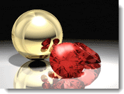

---
---

<!-- TODO: This is a combination of the old information here and the Rhino render Windows.  These two still need to be combined. -->

# 렌더링 창
The render window provides options for exposure adjustment and adding post-processing effects. The mainframe of the render windows is part of Rhino's rednering frameowrk.  For details on the rederwindow menus and icons see the [Render Windows topic](http://docs.mcneel.com/rhino/5/help/en-us/index.htm#information/renderwindowpostprocess.htm)

### 메뉴
렌더링 창 메뉴와 아이콘에 대한 자세한 안내는 [렌더링 창 항목](http://docs.mcneel.com/rhino/5/help/ko-kr/index.htm#information/renderwindowpostprocess.htm) 을 참조하세요.

### 도구모음

### 배경 알파 채널과 함께 저장
{: #save-with-alpha-channel}
알파 채널 배경을 포함한 32 비트 PNG, TIF, BMP 이미지를 저장합니다. 파일 형식의 알파 채널 버전은 높은 수준의 합성에 사용됩니다. 알파 채널과 함께 렌더링을 저장하면 배경이 검정색으로 표시됩니다.

### 원시 Flamingo nXt 파일 (.nXtImage)로 내보내기
{: #export-to-nxtimage}
압축되지 않은 휘도와 색 정보를 저장합니다. [알파](environment-tab.html#alpha) 채널을 포함하여 모든 렌더링된 채널을 저장합니다. nXtImage 파일은 [이미지 편집기](image-editor.html) 에서 열 수 있습니다. [노출](#adjust-image)과 후처리 효과[후처리 효과](#effects)를 이미지 편집기에서 적용할 수 있으며, 이미지를 다른 비트맵 형식으로 다시 저장할 수 있습니다.
.nXtImage 형식은 nXt 렌더러의 원시(기본) 이미지 형식입니다. 이 형식을 사용하면 렌더링과 관련된 가장 많은 정보가 저장되므로, 렌더링을 저장 시 권장되는 형식입니다. 이 형식으로 저장된 이미지는 [nXt 이미지 편집기(image-editor.html)(image-editor.html) 에서 조작할 수 있으며, 특수 효과도 추가할 수 있습니다. 또한 nXt에서 지원되는 모든 형식을 비롯한 많은 표준 형식으로 이미지를 저장할 수 있습니다. [Piranesi EPix 파일 (.epx)](http://www.piranesi.co.uk/) 형식으로도 저장할 수 있습니다.

### HDR 파일로 내보내기
{: #export-to-hdr}
압축되지 않은 휘도와 색 정보를 저장합니다. hdr 형식은 High Dynamic Range 형식에 있는 휘도 데이터를 직접 저장합니다. 일반 사진처럼 휘도가 없는 배경을 이러한 형식으로 저장하면 검정색으로 나타납니다.

### EXR 파일로 내보내기
{: #export-to-exr}
A high-dynamic-range image file format, released as an open standard along with a set of software tools created by Industrial Light and Magic (ILM), released under a free software license. This file format supports 16-bits-per-channel floating-point values (half precision) with a sign bit, five bits of exponent, and a ten-bit mantissa. This allows a dynamic range of over thirty stops of exposure. See: [Wikipedia article: OpenEXR](http://en.wikipedia.org/wiki/OpenEXR).
exr 형식은 High Dynamic Range 형식에 있는 휘도 데이터를 직접 저장합니다. 일반 사진처럼 휘도가 없는 배경을 이러한 형식으로 저장하면 검정색으로 나타납니다.

## 끝내기
렌더링 창을 닫습니다.

##  [Flamingo 탭 렌더링 창](render-window.html#help)

## 진행률
{: #progress}

### 동작

### 패스

### 스캔 라인

### 경과 시간

### 광선 / 초

### 픽셀 / 초

## 렌더링 제한 조건
{: #number-of-passes}
{: #time}
{: #render-constraints}

## 이미지 조정
{: #adjust-image}
화면 디스플레이를 제어하는 설정으로, 해당 디스플레이에서 만들어진 이미지 파일도 제어합니다. 다른 노출이 설정된 여러 개의 이미지 파일도 하나의 렌더링에서 저장할 수 있습니다. 렌더링된 이미지 하나의 노출 설정이 다음 이미지에도 적용됩니다.
This adjustment process is called *tone mapping.* Tone mapping is the process of converting the luminance data used by Flamingo nXt into Red, Green, and Blue (RGB) pixels that can be displayed or printed.

### 밝기
{: #brightness}
이미지의 전체 밝기를 조정합니다. 예를 들어, 모델에서 하얀 서피스가 회색으로 렌더링되면 서피스가 하얗게 보일 때까지 밝기를 증가시킵니다. 또는, 실외 장면에서 노출이 지나치면 장면이 올바르게 보일 때까지 밝기를 낮춥니다.

*기본 밝기 (왼쪽), 밝기 값을 올린 상태.*

### 번
{: #burn}
Adjusts the image white point. This is the brightest white color in the image. Burn can add drama, life, and sharpness to a rendering by adding more areas of white to contrast with the dark areas.
[Wikipedia 항목: White point](http://en.wikipedia.org/wiki/White_point)을 참조하세요.

*기본 설정 상태의 번 효과 (왼쪽), 증가된 상태.*

### 채도
{: #saturation}
채도는 이미지에서 색의 양(量)를 제어합니다. 채도가 0.00이면 회색조 이미지가 됩니다. 1.00을 초과하는 값은 색을 진하게 만듭니다.

*채도가 기본값일 때 (왼쪽), 약 3으로 증가되었을 때 (오른쪽).*

### 히스토그램
{: #histogram}
이미지에서의 배광과 어두운 부분을 그래픽으로 표시합니다.
참조: Wikipedia 항목: [Histogram](http://en.wikipedia.org/wiki/Histogram) 을 참조하세요. 인터넷에는 디지털 사진에서 히스토그램을 사용한 노출 계산에 대한 글이 많이 있습니다. 이 원리는 렌더링에서도 동일합니다.

*히스토그램.*

#### 히스토그램 옵션

>옵션을 보려면 히스토그램 이미지를 오른쪽 클릭

#### 맞춤

#### 중앙값

#### 평균값

#### 분류된 그래프 표시

#### 비율 표시

#### 그래프 색

#### 휘도값 표시

### 노출 잠금
{: #lock-exposure}
노출 설정이 잠겨 있으면, 조명을 변경해도 이에 맞춰 보정되도록 노출이 조정되지 않습니다.

## 정보
{: #information}

### 해상도
[렌더링 해상도](render-tab.html#resolution)를 표시합니다.

### 면
모델을 렌더링하는 데 사용된 메쉬 면의 수를 표시합니다.

### 보이는 면
모델에 블록이 있으면 Flamingo nXt는 각각의 인스턴스를 다시 메쉬 처리 하지 않고도 블록 정의를 사용하여 블록 인스턴스를 렌더링할 수 있습니다. **보이는 면** 표시는 얼마나 많은 임시 면이 추가로 생성되는지를 나타냅니다.

## 픽셀 정보
창의 점
이미지 점
이미지 Y가 위로
픽셀의 색
휘도
Distance

## 조명 정보

###  [기본 설정](lighting-tab.html)

###  [태양](sun-and-sky-tabs.html#sun)

###  [하늘](sun-and-sky-tabs.html#sky)

###  [조명](lights-tab.html)

###  [간접](lighting-advanced-tab.html#indirect)

###  [주변광 켜기/끄기](lighting-advanced-tab.html#ambient)

## 채널
{: #channels}
조명 채널의 상태를 표시합니다.

## 효과
{: #post-process-effects}
{: #effects}
후처리 효과는 이미지가 렌더링된 후에 적용되며, 목록에서 설정/해제하거나 순서를 다시 지정할 수 있습니다. 각 효과별로 설정이 있습니다.

## 효과 옵션
이 옵션은 상황에 맞는 메뉴에서도 사용할 수 있습니다.

>상황에 맞는 메뉴를 표시하려면 효과를 오른쪽 클릭합니다.

선택된 효과의 켜기/끄기 상태를 전환합니다.
선택된 효과를 목록에서 위로 이동시킵니다.
선택된 효과를 목록에서 아래로 이동시킵니다.
선택된 효과의 속성.
Save the current effects list order and properties as default.
Save the current effects list as named list.
Import named effects list.

## Depth of Field
{: #postprocessingdof}
피사계 심도 효과는 카메라로부터의 거리에 따라 이미지에 흐림 효과를 줍니다.

## 피사계 심도 속성
{: #depth-of-field-properties}

### Visual Properties
{: #dofvisualproperties}

#### Blurring strength
{: #dofblurringstrength}
흐림의 정도를 결정합니다. 이 값은 임의의 값이며, 서로 다른 이미지에 다른 값을 적용하는 것이 적합합니다.

#### Max blurring
{: #dofmaxblurring}
사용되는 최대 흐림 반지름을 결정합니다. 극도로 흐린 영역에서는 효과의 속도가 느려지므로, 이 설정으로 효과를 제한합니다.

### Area of Effect
{: #dofareaofeffect}

#### Focal distance
{: #dofocaldistance}
카메라로부터, 이미지에 초점이 맞춰져 있는(흐리지 않은) 지점까지의 거리입니다.

#### Pick
초점 거리를 설정하기 위해 이미지에서 한 점을 지정합니다.

#### Blur background
{: #dofblurbackground}
Determines whether the background is blurry. The background will be blurred at the maximum effect.

## 안개
{: #postprocessingfog}
안개 효과는 심도 의존 색상 (depth-dependent coloration) 을 이미지에 더합니다. 이 효과는 짙은 안개 효과나, 은은하게 깊이를 나타내는 단서(depth cue)로도 사용할 수 있습니다.

*후처리 효과가 없습니다.*

### 안개를 그라데이션 배경으로
안개를 사용하여 그라데이션 배경을 만들 수 있습니다.
이와 같은 경우에 배경을 만드는 설정은 다음과 같습니다:
Strength = 1Noise = .1Fog Color = BlackEnd distance = approximately 110Start distance = approximately 90Fog Background = OnFeathering = 80

*안개를 그라데이션 배경으로.*

## 안개 속성
{: #fogsettings}

### 시각적 속성
{: #fogvisualproperties}
안개 효과의 표시 정도를 결정합니다.

#### 세기
{: #fogstrength}
안개낀 상태의 최대치를 결정합니다. 세기를 0.0으로 설정하면 효과 사용 안 함으로 설정되며, 1.0으로 설정하면 완전히 안개가 낀 상태를 나타냅니다. 1.0보다 높은 값을 사용할 수 있으나, **노이즈**와 함께 사용할 때만 의미가 있습니다.

#### 노이즈
{: #fognoise}
안개의 **세기**에 랜덤한 변화를 추가합니다.

#### 색
{: #fogcolor}
안개의 색을 지정합니다.

>[색 선택](select-color.html) 대화상자에서 색 견본을 클릭하여 색을 선택합니다.
>렌더링된 이미지에서 색을 선택하려면 **지정** 단추를 클릭합니다.

### 효과 영역
안개 효과에 둘러싸이는 영역을 결정합니다.

#### 시작 거리
{: #fogstartdistance}
카메라로부터의 거리(안개가 나타나기 시작하는 위치)를 지정합니다.

>렌더링된 이미지에서 깊이를 지정하려면 **지정** 단추를 클릭합니다.

#### 끝 거리
{: #fogenddistance}
Specifies the distance from the camera at which the maximum amount of fogginess is achieved.

>렌더링된 이미지에서 깊이를 지정하려면 **지정** 단추를 클릭합니다.

### Bounds (Left, Right, Top, Bottom)
{: #fogbounds}
Specifies the area of the image affected by the fog. This can be used to create a low-lying mist effect.
Click the **Pick Area** button to pick bounding area from the rendered image.

### Fog

#### Fog background
배경 이미지에 안개 효과를 주는지를 지정합니다. 배경에도 안개가 최대 강도로 표시됩니다.

#### Feathering
{: #fogfeathering}
Determines the number of pixels outside the bounding area to “fade in” the fogginess.

### 미리보기
값을 변경하면 그에 따라 달라지는 이미지 효과를 미리 봅니다.

## Glare
{: #postprocessingglare}
글레어와 글로우는 매우 비슷합니다. 글로우는 선택된 색을 사용하는 반면에, 글레어는 색을 흰색으로 보이게 합니다. 글레어는 이미지에서 극도로 밝은 부분이 글레어로 나타나게 하며, 밝은 부분을 둘러싼 부분을 더욱 밝게 하는 방법으로 이를 실행합니다. 대개 야간 장면에 매우 은은한 글레어 효과가 사용되며, 빛이 더욱 사실적으로 표현됩니다.

*Glare off (left) and on (right).*

## Glare Properties
{: #glaresettings}

### White point bound
{: #glarewhitepointbound}
Determines where in the tonal range the glare will begin. The value is represented on the histogram and can be adjusted graphically. Pixels lighter than the **White Point Bound** (in either luminance or the grey-scale value) will glare.

### Glare size
{: #glaresize}
밝은 픽셀을 둘러싼 글레어의 반지름.

### Gain
{: #glaregain}
게인이란 글레어 밝기의 승수(乘數:곱하는 수)입니다. 기본값인 1.0은 보통 글레어 효과를 나타냅니다. 그보다 높은 값을 사용하면 극도로 밝은 글레어 효과를 얻을 수 있습니다.

### Use photometric information
{: #glareusephotometric}
When using photometric information, the amount of glare is controlled by how &quot;whiter than white&quot; the pixel is. Otherwise, the effect uses the whitest pixels in the image.

### 히스토그램
{: #glarehistogram}
명암의 분포를 그래픽으로 표시합니다.

#### 히스토그램 옵션

>옵션을 보려면 히스토그램 이미지를 오른쪽 클릭

#### 맞춤

#### 중앙값

#### 평균값

#### 분류된 그래프 표시

### 미리보기
값을 변경하면 그에 따라 달라지는 이미지 효과를 미리 봅니다.

## Glow
{: #postprocessingglow}
글로우 효과는 특정 색 주변에 밝은 부분을 만듭니다. 유색 조명을 만들거나, 네온 조명과 같은 개체를 빛나게 할 때 사용합니다. 이미지에 효과를 주는 10개의 색까지 선택할 수 있습니다.
그림에서 루비의 빨간색이 게인 설정과 함께 사용되어 흰색에 가까운 색이 되었습니다.

*Glow as sparkle.*

*Glow off (left) and on (right).*

## Glow Properties
{: #glowsettings}

### 켜기
해당하는 색상이 글로우에 표시되도록 합니다.

### 색
{: #glowcolor}
글로우의 색을 지정합니다.

>[색 선택](select-color.html) 대화상자에서 색 견본을 클릭하여 색을 선택합니다.
>렌더링된 이미지에서 색을 선택하려면 **지정** 단추를 클릭합니다.

### Sensitivity
{: #glowsensitivity}
Controls how much variation on the selected color is permitted when calculating glow on pixels close to that color.

### Glow Size
{: #glowsize}
밝은 픽셀을 둘러싼 글로우의 반지름.

### Gain
{: #glowgain}
게인이란 글로우 밝기의 승수(乘數:곱하는 수)입니다. 기본값인 1.0은 보통 글로우 효과를 나타냅니다. 그보다 높은 값을 사용하면 극도로 밝은 글로우 효과를 얻을 수 있습니다.

### 미리보기
값을 변경하면 그에 따라 달라지는 이미지 효과를 미리 봅니다.

## Wires &amp; Text
{: #postprocessingwireframe}
렌더링된 이미지 위에 커브, 텍스트, 치수, 아이소커브, 메쉬 가장자리, 점 개체를 오버레이합니다.

*With (left) and without Wires &amp; Text (right).*

## Wires and Text Properties

### 커브
커브 개체를 표시합니다.

### 치수와 텍스트
치수와 텍스트 개체를 표시합니다.

### 아이소커브
서피스 아이소커브를 표시합니다.

### 메쉬 가장자리
메쉬 가장자리를 표시합니다.

### Points
점 개체를 표시합니다.

### 미리보기
값을 변경하면 그에 따라 달라지는 이미지 효과를 미리 봅니다.
