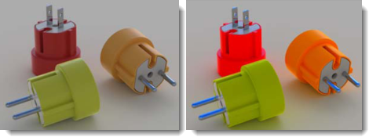

#  {{page.title}}
렌더링 창에는 노출을 조정하고 후처리 효과를 더하는 옵션이 있습니다. 렌더링 창의 메인프레임은 Rhino 렌더링 프레임워크의 일부입니다. 렌더링 창 메뉴와 아이콘에 대한 정보는 [렌더링 창 항목](http://docs.mcneel.com/rhino/5/help/ko-kr/index.htm#information/renderwindowpostprocess.htm) 을 참조하세요. 이 항목은 렌더링 과정에서의 Flamingo 설정을 다룹니다.

## 활성 렌더링의 관리
일단 렌더링이 시작되면 [렌더링 창](http://docs.mcneel.com/rhino/5/help/ko-kr/index.htm#information/renderwindowpostprocess.htm)이 시작하고, 렌더링이 진행됩니다. Flamingo는 렌더링된 이미지를 단계별로 업데이트하는 다중 패스 시스템입니다. Flamingo는 우선 내부 모델에 어떤 변화가 있는지 확인하고, 초기화 프로세스를 시작합니다. 이 프로세스는 몇 초에서 몇 분까지 소요될 수 있습니다. 이 시간 동안 모델을 가져오고, 하드 드라이브에서 재질 비트맵을 수집하며, 렌더링 이미지 버퍼가 생성됩니다. 이 프로세스에는 몇 가지 중요 단계가 있습니다.

>[다중 패스 렌더링](#multi-pass)
>[렌더링 중지](#stop-render)
>[이미지 조정](#adjusting)
>[이미지 저장](#saving)

### 다중 패스 렌더링
{: #multi-pass}
Flamingo nXt는 완전히 새로운 렌더링 엔진입니다. 다중 패스 구체화 방법을 채택하여 복잡한 인터페이스를 익히는 데 시간과 노력을 들이지 않고도 더욱 높은 수준의 렌더링 효과를 만들어낼 수 있습니다. 처음 몇 차례 렌더링 패스로는 일부 아티팩트가 보입니다. 예를 들어, 그림자가 선명하고 직선적일 수 있으나, 패스가 거듭되면서 그림자는 블렌드되어 더욱 부드럽게 표현됩니다. 각 렌더링 패스가 진행되면서 그에 따라 많은 효과도 향상됩니다. 렌더링 프로세스에 대한 자세한 정보는 [Flamingo 탭](#flamingo-tab)을 참조하세요.

이에 따라, nXt 렌더링은 절대로 "끝나지 않습니다". 사용자가 언제 멈춰야 좋은지 결정할 뿐입니다. 더 좋은 이미지를 원한다면 계속 렌더링을 진행할 수 있습니다. 변경이나 저장하려면 언제든지 이미지 렌더링을 멈출 수 있습니다.

패스를 향상시키는 효과 중 일부는 다음과 같습니다:

>조명 (전역 발광을 사용할 때)
>부드러운 그림자
>반사 (흐림)
>굴절
>앤티앨리어싱
>피사계 심도(DOF)

### 렌더링을 중단할 때
{: #stop-render}
렌더링을 중단하는 방법에는 몇 가지가 있습니다:

 렌더링 창의 오른쪽 위에 있는 “X” 단추를 클릭하여 곧바로 렌더링을 중지하고 렌더링 창을 닫습니다. 모델을 변경하기 위해 편집 모드로 금방 돌아오기에 가장 좋은 방법입니다.

 광선 추적 중지 단추를 클릭하여 현재 패스의 끝에 렌더링을 중지합니다. 이미지 저장 전에 사용하기 가장 좋은 방법입니다.

 광선 추적 중지를 두 번 클릭하여 즉시 렌더링을 중지하고 렌더링 창을 열린 상태로 둡니다.

### 렌더링 조정
{: #adjusting}
이미지 렌더링을 중지한 후, [Flamingo 탭](#flamingo-tab)의 제어를 사용하여 이미지와 조명을 곧바로 조정합니다. 최고의 화질로 이미지를 생성하는 데 매우 중요한 설정입니다.

이미지 조정에 사용되는 제어:

>[이미지 조정](#adjust-image)
>[채널](#channels)
>[후처리 효과](#post-process-effects)

### 이미지 저장
{: #saving}
이미지에 대한 계획에 따라 이미지를 저장하는 방법에는 몇 가지가 있습니다. 일반적으로 대부분의 이미지는 JPG 또는 PNG 이미지 파일 형식으로 저장하는 것을 권장합니다. 그 외에 다른 옵션이 있습니다.

####  이미지 저장
이미지를 조정한 후 JPG 또는 PNG 이미지 파일로 저장하는 것이 보통의 작업 과정입니다.  

JPG 이미지는 매우 효율적이면서 크기가 작은 파일 형식입니다. 웹 또는 이메일에 사용하기 좋은 이미지입니다. 하지만 이미지에서 일부 색이 제거되는 단점이 있습니다.

PNG은 색 정보를 100% 담고 있는 압축 형식입니다. 고화질 이미지에 적합한 형식입니다.

#### 배경 알파 채널과 함께 저장
{: #save-with-alpha-channel}
이미지를 알파 채널 배경과 함께 32비트 PNG, TIF, BMP로 저장합니다. 고화질 이미지 작업을 위해 파일 형식의 알파 채널 버전을 사용합니다. 알파 채널과 함께 렌더링을 저장하면 배경이 검정색으로 나타납니다. [Flamingo 탭](#flamingo-tab)에 확인란이 있으며, [저장 대화상자](#saving)에서 알파 채널을 저장할 수 있습니다. PNG 파일 형식은 알파 정보를 저장하기에 적합한 형식입니다.

#### 네이티브 Flamingo nXt 파일 (.nXtImage)로 내보내기
{: #export-to-nxtimage}
압축되지 않은 휘도와 색 정보를 저장합니다. [알파](environment-tab.html#alpha) 채널을 포함하여 모든 렌더링된 채널을 저장합니다. nXt Image 파일은 [이미지 편집기](image-editor.html) 에서 열 수 있습니다. [노출](#adjust-image)과 후처리 효과[후처리 효과](#effects)를 이미지 편집기에서 적용할 수 있으며, 이미지를 다른 비트맵 형식으로 다시 저장할 수 있습니다.

.nXtImage 형식은 nXt 렌더러의 원시(기본) 이미지 형식입니다. 이 형식을 사용하면 렌더링과 관련된 가장 많은 정보가 저장되므로, 렌더링을 저장 시 권장되는 형식입니다. 이 형식으로 저장된 이미지는 [nXt 이미지 편집기(image-editor.html)(image-editor.html) 에서 조작할 수 있으며, 특수 효과도 추가할 수 있습니다. 또한 nXt에서 지원되는 모든 형식을 비롯한 많은 표준 형식으로 이미지를 저장할 수 있습니다. [Piranesi EPix 파일 (.epx)](http://www.piranesi.co.uk/) 형식으로도 저장할 수 있습니다.

#### HDR 파일로 내보내기
{: #export-to-hdr}
압축되지 않은 휘도와 색 정보를 저장합니다. hdr 형식은 High Dynamic Range 형식에 있는 휘도 데이터를 직접 저장합니다. 일반 사진처럼 휘도가 없는 배경을 이러한 형식으로 저장하면 검정색으로 나타납니다.

#### EXR 파일로 내보내기
{: #export-to-exr}
HDR (high-dynamic-range) 이미지 형식은 Industrial Light and Magic (ILM)에서 무료 소프트웨어 라이선스로 개발한 소프트웨어 툴과 함께 오픈 스탠다드로 릴리스되었습니다. 이 파일 형식은 1 비트 부호, 5 비트 지수(指數), 10 비트 가수(假數)로 채널당 16비트 부동 소수점 값 (절반의 정밀도: half precision)을 지원합니다.  30 스톱 노출의 동적 범위(dynamic range)가 허용됩니다. [Wikipedia 항목: OpenEXR](http://en.wikipedia.org/wiki/OpenEXR)을 참조하세요.
exr 형식은 High Dynamic Range 형식에 있는 휘도 데이터를 직접 저장합니다. 일반 사진처럼 휘도가 없는 배경을 이러한 형식으로 저장하면 검정색으로 나타납니다.

####  끝내기
렌더링 창을 닫습니다.

#### 메뉴
렌더링 창 메뉴와 아이콘에 대한 자세한 안내는 [렌더링 창 항목](http://docs.mcneel.com/rhino/5/help/ko-kr/index.htm#information/renderwindowpostprocess.htm) 을 참조하세요.

## Flamingo 탭
{: #flamingo-tab}
렌더링 창의 Flamingo 탭에는 Flamingo 렌더링 엔진 관련 많은 제어가 있습니다. 적극적으로 Flamingo 렌더링을 관리하려면 이 제어를 이해하는 것이 중요합니다.

#### 알파 채널과 함께 저장
알파 채널 배경과 함께 32비트 PNG, TIF, BMP로 저장합니다. 고화질 이미지 작업을 위해 파일 형식의 알파 채널 버전을 사용합니다. 알파 채널과 함께 렌더링을 저장하면 배경이 검정색으로 나타납니다. 이 선택란과 [저장 대화상자](#saving)를 사용하여 알파 채널을 저장할 수 있습니다. PNG 파일 형식은 알파 정보를 저장하기에 적합한 형식입니다.

## 진행률
{: #progress}
진행률 정보를 사용하여 Flamingo 렌더링의 상태와 진행을 확인합니다.

#### 액션
모델에서 진행 중인 렌더링의 현재 상태를 나타냅니다.

상태 안내 메시지는 다음과 같습니다:

* 렌더링이 시작되었습니다 - 일단 렌더링이 시작된 후에는 렌더링을 하기 위해 모델을 전환하고 메모리를 지정하는 일부 설정이 있습니다.
* 액션 완료 - 중지 단추를 클릭하면 렌더링 엔진이 패스를 완료하고 액션 중지가 실행됩니다.
* 패스 완료 - 패스가 완료될 때마다 이 메시지가 표시됩니다.
* 렌더링 다시 시작 - 다시 시작이 가능한 경우, 이 메시지가 표시됩니다.
* 업데이트하는 중 - 렌더링 엔진이 패스를 처리 중이며, 현재 렌더링을 업데이트하는 중입니다.

#### 패스
Flamingo가 렌더링 중인 현재 패스입니다. Flamingo는 다중 패스 렌더링 엔진입니다. 각각의 패스는 조명 효과와 렌더링 효과를 더욱 구체화합니다.

#### 스캔 라인
가로 픽셀의 스트레치를 따라 패스가 처리됩니다. 픽셀의 각 행이 스캔 라인입니다. 이 항목은 렌더링 엔진에서 반환하는 현재 스캔 라인을 보고합니다.

#### 경과 시간
렌더링을 시작한 이후 경과된 시간입니다. 렌더링 준비 시간을 포함하지 않습니다.

#### 광선 / 초
장면에 처리된 초당 광선의 수입니다.

#### 픽셀 / 초
장면에 처리된 초당 픽셀의 수입니다.

## 이미지 조정
{: #adjust-image}
Flamingo에서 가장 중요한 제어 중 하나입니다. 카메라처럼, 이미지 노출을 조정할 수 있습니다. 렌더링을 더 밝게, 더 어둡게 하거나, 대비를 추가하고 색의 채도를 올리기에 가장 좋은 방법입니다. 이러한 조정 과정을 [톤 매핑](https://en.wikipedia.org/wiki/Tone_mapping)이라고 합니다. Flamingo는 화면과 프린터에서 표시되는 것보다 더 넓은 범위에서 색과 밝기를 다루는 휘도 공간에서 렌더링을 처리합니다. 톤 매핑은 휘도 데이터를 화면에 표시 또는 인쇄하는 빨강, 녹색, 파랑 (RGB) 픽셀로 변환하는 처리입니다. 이러한 설정은 이미지 저장 방법도 제어합니다.

  
*기본 이미지 (왼쪽). 밝기 (0.20), 번 (0.16), 채도 (1.20)로 보정한 이미지.*
이 설정을 사용하여 다시 렌더링할 필요 없이 이미지의 밝기와 전체적인 색을 금방 조정합니다.

### 밝기
{: #brightness}
이미지의 전체 밝기를 조정합니다. 예를 들어, 모델에서 하얀 서피스가 회색으로 렌더링되면 서피스가 하얗게 보일 때까지 밝기를 증가시킵니다. 또는, 실외 장면에서 노출이 지나치면 장면이 올바르게 보일 때까지 밝기를 낮춥니다.

*기본 밝기 (왼쪽), 밝기 값을 올린 상태.*



### 번
{: #burn}
이미지의 흰 점을 조정합니다. 이것은 이미지에서 가장 밝은 흰색입니다. 번(Burn)을 조금만 더해도 어두운 곳과 대비되는 흰색이 더 많은 영역에 표시되므로 렌더링에 더욱 생생하고 극적인 느낌을 더하고, 선명하게 만들 수 있습니다.
[Wikipedia 항목: White point](http://en.wikipedia.org/wiki/White_point)을 참조하세요.

*기본 설정 상태의 번 효과 (왼쪽), 증가된 상태.*

### 채도
{: #saturation}
채도는 이미지에서 색의 양(量)를 제어합니다. 채도가 0.00이면 회색조 이미지가 됩니다. 1.00을 초과하는 값은 색을 진하게 만듭니다.

*채도가 기본값일 때 (왼쪽), 약 3으로 증가되었을 때 (오른쪽).*

### 히스토그램
{: #histogram}
이미지의 조정 제어가 적용된 후, 이미지의 밝고 어두운 부분의 분포를 시각적으로 표시합니다. 차트의 왼쪽 끝은 어두운 상태(검정)입니다. 오른쪽 끝은 가장 밝은 상태 (흰색)를 나타냅니다. 이미지에서 중요한 지점을 결정하기에 좋은 방법입니다. 이미지에 범위 전체의 값이 있게 조정하는 것이 목표입니다. 예를 들어, 히스토그램이 그래프 오른쪽 끝에 도달하기 전에 멈추면 밝기 또는 번을 더 사용하여 값이 오른쪽(밝은 끝)에 이르게 만듭니다. [Wikipedia 항목: Histogram](http://en.wikipedia.org/wiki/Histogram)을 참조하세요. 인터넷에는 디지털 사진에서 노출을 확인하는 데 히스토그램을 사용하는 것에 대한 많은 자료가 있습니다. 렌더링에서도 원리는 같습니다.
<!--'Use more brightness or burn will stretch the values' - This needs rewritten.-->

*어두운 부분은 일부분이고, 밝은 색은 넓은 범위를 차지하는 히스토그램의 예. 오른쪽 끝에 도달하기 전에 그래프가 떨어지므로, 완전히 하얀 픽셀이 조금밖에 없음을 알 수 있습니다.*

#### 히스토그램 옵션
히스토그램 이미지를 오른쪽 클릭하여 다음 옵션에 액세스합니다. 이 옵션은 히스토그램이 정보를 표시하는 방식만을 변경합니다. 히스토그램의 값은 변경하지 않습니다.

* **맞춤** - 차트에서 세로 방향으로 가장 높은 부분에 맞춥니다.
* **중앙값** - 세로 방향에서 중앙값에 맞춥니다. 차트의 끝 위치에서 상세한 정보를 확인하기 좋습니다.
* **평균값** - 세로 방향의 평균값에 맞춥니다.
* **분류된 그래프 표시** - 이미지에 존재하는 양을 기준으로 모든 값을 분류합니다.
* **비율 표시** - 차트의 아래쪽을 따라 대응하는 값을 표시합니다.
* **그래프 색...** - 그래프 색을 설정합니다.

### 노출 잠금
{: #lock-exposure}
노출 설정이 잠겨 있으면, 조명을 변경해도 이에 맞춰 보정되도록 노출이 조정되지 않습니다.

## 렌더링 제한 조건
{: #number-of-passes}
{: #time}
{: #render-constraints}


## 정보
{: #information}

#### 해상도
현재 [렌더링 해상도](render-tab.html#resolution)를 표시합니다.

#### 면
모델을 렌더링하는 데 사용된 메쉬 면의 수를 표시합니다. Rhino의 다양한 [렌더링 메쉬 설정](http://docs.mcneel.com/rhino/5/help/ko-kr/index.htm#documentproperties/mesh.htm)과 비교하기 좋습니다.

#### 보이는 면
모델에 블록이 있으면 Flamingo nXt는 각각의 인스턴스를 다시 메쉬 처리 하지 않고도 블록 정의를 사용하여 블록 인스턴스를 렌더링할 수 있습니다. 보이는 면 표시는, 블록 인스턴스가 없었다면 얼마나 많은 임시 면이 추가로 생성되는지를 나타냅니다.

#### 조명 정보
렌더링의 현재 조명 설정에 대한 정보입니다. 다음은 조명 정보 목록입니다:

>[기본 설정](lighting-tab.html)
>[태양](sun-and-sky-tabs.html#sun)
>[하늘](sun-and-sky-tabs.html#sky)
>[조명](lights-tab.html)
>[간접](lighting-tab.html#indirect)
>[주변광 켜기/끄기](lighting-tab.html#ambient)

## 채널
{: #channels}
이 채널을 사용하여 실시간으로 조명 채널을 변경합니다. 조명을 8개의 채널 중 하나에 배정합니다. 렌더링을 만든 후에 렌더링된 이미지에서 조명을 조정합니다. 렌더링에 여러 개의 광원이 있을 때, 빛의 균형을 맞추기에 편리한 기능입니다. 자세한 정보는 [렌더링 채널](render-channel.html#adjustng-channels) 항목을 참조하세요.

## 후처리 효과
{: #post-process-effects}
이미지를 렌더링한 후에 후처리 효과를 적용합니다. 후처리 효과를 켜거나 끄고, 목록에서 순서를 바꿉니다. 각 효과에는 자체적인 설정이 있습니다. 후처리 효과는 다음과 같습니다:

>안개
>글로우
>글레어
>피사계 심도(DOF)
>점
>커브
>아이소커브
>주석

특정 필터에 대한 자세한 정보는 [이미지 후처리](http://docs.mcneel.com/rhino/5/help/ko-kr/index.htm#information/renderwindowpostprocess.htm) 항목을 참조하세요.
