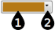

#  {{page.title}}
색 선택기는 많은 재질 그룹과 속성에 사용됩니다. 모든 경우에 유사한 방법으로 실행됩니다.

선택기에는 두 부분이 있습니다:

1. [색 견본](#swatch) - 메인 색 선택기의 색을 클릭합니다.
1. [옵션 메뉴](#options) - 추가 색 유틸리티의 화살표를 클릭합니다.

## 색 견본 
{: #swatch}
색 견본을 클릭하여 색 선택 대화상자에서 색을 선택합니다.

##### 명명된 색 목록에서 선택
* 왼쪽의 이름 목록에서 색을 선택합니다.

##### 색상표 선택기에서 선택
1. 바깥쪽 색상환에서 마커를 마우스로 끌어 색상을 정의합니다.
1. 마커를 색상환의 중간에 있는 사각형에서 수평 방향으로 마우스로 끌어 채도의 수준을 정의합니다.
1. 마커를 색상환 중간에 있는 사각형에서 수직으로 마우스로 끌어 명도의 값을 정의합니다.

##### 색상, 채도, 명도 설정
1. 색상(Hue)은 빛의 가시(可視) 파장에 대응합니다. 색상은 0도에서 359도까지의 값으로 측정되며, 이 값은 대략 60도씩 증분하는 무지개 색상(빨강, 주황, 노랑, 초록, 파랑, 보라)과 대응합니다.
1. 채도(Saturation)는 색의 강도를 0에서 100까지의 값으로 나타냅니다. 채도가 0 이면 검정색에서 흰색 사이에 명도로 구별되는 무채색을 만들어냅니다. 색상(Hue)은 채도가 0인 색에 아무런 영향을 주지 않습니다. 채도를 100으로 설정하면 해당 색상의 가장 강한 색이 만들어집니다.
1. 명도(Value)는 색에서 라이트 밸류(Light Value: 흰색)가 감지되는 정도를 나타냅니다. 명도는 휘도(luminance) 또는 밝기(brightness)를 뜻하기도 합니다.

#### 빨강, 녹색, 파랑 (RGB)
{: #rgb}
이 방법은 컴퓨터에서 화면상에 색상을 투영하기 위해 사용됩니다. 세 가지 색상의 각 픽셀의 강도는 서로 다릅니다. 순수한 빨강은 초록색이나 파란색이 섞이지 않고 완전히 빨간색으로만 이루어져 있습니다. 순수한 검정색은 빨강, 초록, 파랑이 모두 0으로 설정되어 있으며, 순수한 흰색은 빨강, 초록, 파랑의 값이 255로 설정되어 있습니다.

## 메뉴 옵션 
{: #options}

#### 색 선택
위에 설명된 [색 견본](#swatch) 대화상자를 엽니다. 색 견본을 클릭하는 것과 같습니다.

#### 스포이트
스포이트 도구를 사용하여 화면에서 원하는 곳 어디에서나 색을 선택할 수 있습니다.

#### 복사
색 견본의 색을 복사합니다. 붙여넣기 옵션을 사용하여 다른 색 선택기에서도 사용할 수 있습니다.

#### 붙여넣기
하나의 색 견본에서 다른 색 견본으로 색을 붙여넣습니다. 위의 복사 명령을 사용한 후에 붙여넣기 옵션을 사용합니다.
