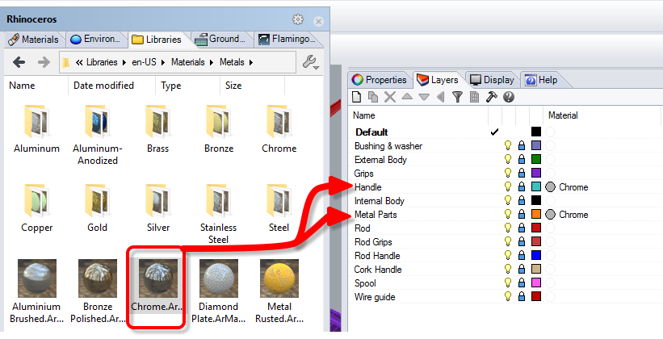
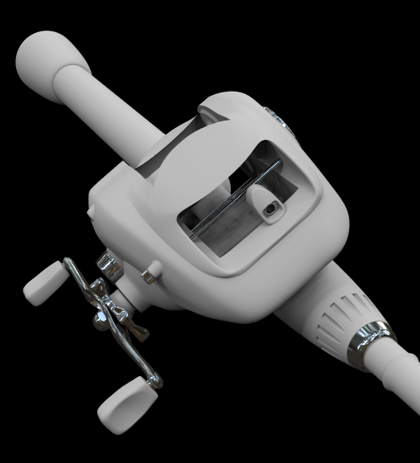
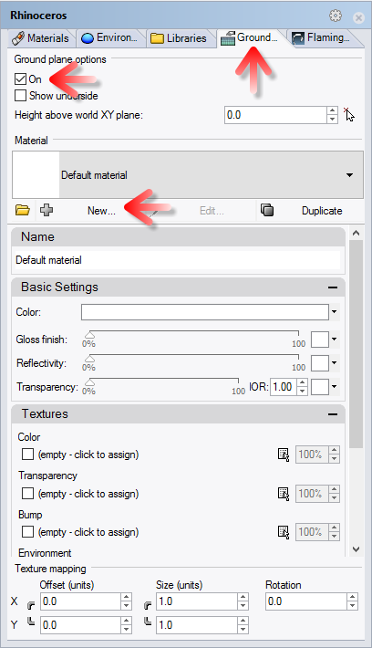
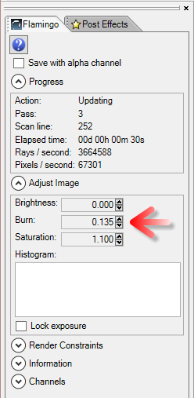
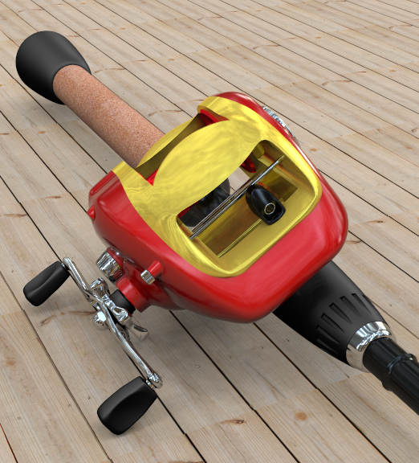

<!-- TODO: Make sure to update this page and get working in the guides section of the documentation. -->

# {{page.title}}
此教學將示範以 Flamingo nXt 5 彩現一個 Rhino 模型，並說明以 Flamingo nXt 5 彩現的基本步驟，包括：

1. 開啟模型
1. 建立材質
1. 編輯材質
1. 使用底平面

第一個步驟是下載並解開教學檔案，請下載 [Fishing Reel.zip](files/nxt5%20fishing.zip)，將它解壓縮至一個資料夾，以 Rhino 開啟 **Fishing Reel.3dm**。

## 檢查目前使用的彩現器
{: #check-current}
Rhino 可能載入了一個以上的彩現器，請至**彩現功能表 > 目前的彩現器**，確定 **Flamingo nXt 5.0** 前面有一個圓點 (代表目前使用的彩現器)。

## 彩現
{: #render_controls}
{: .float-img-right} 按**彩現**按鈕彩現此模型，得到像右圖一樣的彩現影像，Flamingo nXt 5 與舊版的 Flamingo 1.0/2.0 操作方式不同。Flamingo nXt 5 在新建立的模型檔案會使用預設的 HDRI 照明設定，所有物件使用預設的白色材質。彩現一開始會有邊緣銳利相互重疊的許多陰影，這些陰影隨著處理數增加逐漸混合變細緻，有許多其它彩現效果也會隨著處理數增加而改善。

每個處理數改善的項目：

* 照明
* 柔化陰影
* 模糊反射
* 折射
* 反鋸齒
* 景深

除非您設定時間、處理數限制或是在彩現品質達到要求時手動停止，否則 Flamingo nXt 會持續細化彩現影像永不停止，手動停止彩現的方法有：
{: .clear-img}

* 按**停止彩現**按鈕，在目前的處理數完成後停止彩現。
* 按彩現視窗右上角的 "X" 可立即停止彩現並關閉彩現視窗。

## 將材質庫的材質賦予給物件
{: #materials}
Flamingo nXt 5.0 已內建基本照明，如何設定材質通常是彩現模型的首要工作。材質是直接儲存在模型檔案裡，使用內建的材質範本可快速建立不同類型的材質。

  1. 從 **Flamingo nXt 5.0** 功能表選擇**顯示控制面板**。
  1. 開啟**材質庫**面板，裡面的材質可直接套用。
  1. 材質分門別類放在不同的資料夾裡。
  
  1. 請開啟 **Flamingo 材質 > 金屬**資料夾。
  {: .wide-img}
  1. 將**鉻**材質拖放至 Handle (搖臂) 與 Metal Parts (金屬零件) 圖層。
  1. 彩現模型，現在搖臂與其它金屬零件以高反射度的鉻材質彩現。
  
  1. 參考以下列表將材質賦予給圖層：

 | 材質庫 | 材質 | 圖層 |
 |:-------|:------|:------|
 | 海事相關 | 黑色橡膠 | Bushing & Washer |
 | 海事相關 | 黑色橡膠 | Grips |
 | 海事相關 | 黑色橡膠 | Rod Grips |
 | 汽車烤漆 | 汽車烤漆-紅色 | External Body |
 | 金屬 > 黃金 | 黃金-霧面-平板 | Internal Body |
 | 金屬 > 鋁-陽極處理 | 鋁-陽極處理-紅色 | Spool |
 | 塑膠 > 黑色與白色  > 光滑 | 塑膠-黑色-光滑 | Rod |
 | 塑膠 > 黑色與白色  > 光滑 | 塑膠-黑色-光滑 | Rod Handle |
 | 塑膠 > 黑色與白色  > 光滑 | 塑膠-黑色-光滑 | Wire Guide |
{: .grided-table}

##### 彩現看看結果：
 

## 建立新材質
{: #new-material}
有可能材質庫裡沒有適合某個物件的材質，例如：釣魚杆握柄處的軟木塞材質，遇到這種情形必需自行建立新材質。

 1. 開啟材質面板。
 1. 向下捲到材質清單末端。
 1. 按新增材質按鈕 (+)
  
 1. 選取 **Flamingo 貼圖**類型。
 1. 選取一個圖片檔案。
 1. 找到之前解開教學檔案的資料夾，選取 **Cork.jpg**，按**開啟**。
 1. 建立了一個有單一貼圖的材質，貼圖的拼貼尺寸很重要，按圖片名稱修改拼貼尺寸。

 1. 請將寬度與高度都設為 100。

 1. 將材質的名稱改為"軟木塞"。

 1. 將此材質拖放至 Cork Handle 圖層。

## 開啟底平面
{: #groundplane}
您可以將模型置於底平面之上。

1. 開啟**底平面**面板，如果您找不到底平面面板，請在任一面板標籤上按右鍵，選擇**底平面**。
1. 勾選**啟用**開啟底平面，這個例子我們使用預設的底平面高度。
1. 為底平面建立一個材質，請至材質面板，按材質清單的新增材質按鈕 (+)。

1. 選取 **Flamingo 貼圖**類型。
1. 選取一個圖片檔案。
1. 找到之前解開教學檔案的資料夾，選取 **Deckwood.jpg**，按**開啟**。
1. 建立了一個有單一貼圖的材質，貼圖的拼貼尺寸很重要，按圖片名稱修改拼貼尺寸。
1. 請將寬度與高度都設為 125。
1. 將材質的名稱改為"地板"。
1. 彩現看起來像這樣：

## 調整彩現影像
{: #image-adjust}
彩現後對彩現影像進行調整是 Flamingo nXt 5.0 的重要功能特性，通常建議將**加亮**與**亮度**數值提高一些些。

1. 在彩現視窗開啟 **Flamingo** 標籤面板。
1. 請按**停止彩現**按鈕，確定彩現已停止。
1. 在**調整影像**下，將**加亮**設為 **0.1**。
1. 將**亮度**也設為 **0.1**。

1. 最終彩現的結果：

注意，彩現影像亮部的亮度會提高 (加亮)，整體亮度 (亮度) 也會增加。

此教學到此結束，希望對您有幫助。
