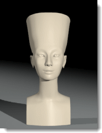
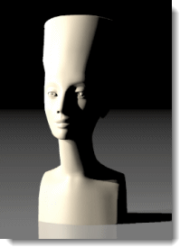

---
---
<!-- TODO: Make sure to update this page and get working in the guides section of the documentation. -->

# 攝影棚照明的基本技巧
{: #studio-lighting-bascis}
模型彩現的攝影棚照明設定與真實的攝影棚類似，使用數盞燈光來照明場景會有比較靈活的控制。

攝影棚照明通常需要較大的明暗對比度，陰暗處與明亮處一樣重要，要達到此目的需要在場景裡加入額外的燈光，並對燈光做特殊安排，讓場景有明顯的陰暗與明亮區域的分別。
基本的攝影棚照明使用三點光源 - 主光源 (1)、輔助光源 (2) 及背光源 (3)，這樣的設定常用於人像或產品攝影，也是攝影的入門技巧。三點光源的燈光通常使用聚光燈，聚光燈可控制照明方向，它的熱點區域可讓觀眾的目光聚焦在場景的某一部分。

## 攝影機的角度
{: #cameraangle}
攝影機的拍攝角度決定場景的照明設定，所以在擺設燈光之前必需先完成攝影機的擺設。使用 **Camera** 或 **NamedView** 指令顯示攝影機，以便調整攝影機的位置與角度，也有助於燈光的擺設。

## 基本的三點光源設定
{: basic-three-light-setup}
基本的攝影棚照明有三個燈光：主光源、輔助光源、背光源。

### 主光源
{: #keylight}
主光源是照亮場景最重要的光源，它可以控制彩現的氣氛、突顯物件表面的細節及投射主要陰影。主光源通常擺放在物件的正面側邊 45 度及仰角 45 度的位置，擺放位置可能因彩現的物件不同而異。
主光源靠近攝影機時，物件表面細節的自體投射陰影較少，細節的深淺度較不明顯；主光源遠離攝影機時，物件表面細節的自體投射陰影較多，細節深淺度會較明顯。主光源的位置通常高於攝影機鏡頭，並向下投射陰影，但不能過高以致於在人像的眼睛部位出現陰影。
如果主光源是柔光燈，輔助光源的亮度可以適當調低，甚至不需輔助光源，這也是小型攝影棚常用的方法。
主光源會投射陰影在物件本體上，例如人像鼻子下方的陰影。

### 輔助光源
{: #filllight}
如果主光源是放在攝影機的右側，輔助光源就必需放在攝影機的左側，輔助光源的高度通常比攝影機鏡頭高一點。輔助光源的目的是打淡主光源投射的陰影濃度，模擬來自其它物件反射的間接照明。主光源與輔助光源的亮度相當時可得到對比度較低的彩現效果，但通常主光源必需較為銳利。輔助光源是場景的第二光源，它投射的陰影必需比主光源投射的陰影淡。
請注意這個圖片中人像的鼻子左側的陰影比只有主光源時為淡，而且較為模糊。

### 背光源
{: #backlight}
背光源的目的是用來突顯物件的邊緣，讓物件與背景分離，使彩現效果更有層次感。背光源通常擺放在攝影機對面，即物件後上方的位置。
背光源在物件邊緣產生的效果與物件材質的反射度有關。
圖片中人像的肩膀上方邊緣因為背光源的關係產生了一些反光，讓人像與背景分離，背光源同時可淡化人像投影在底平面上的陰影。

## 照明品質
{: #lightquality}
彩現影像即使有正確的陰影、反光與反射，照明設定不良時將無法凸顯彩現主題。照明設定必需考慮彩現的目的，且力求簡單，過多的燈光只會造成過多的反光與陰影，徒增彩現影像的複雜度而失去重點。
照明品質的考慮要點：

* 場景的對比度範圍
* 場景的深度 (立體感)
* 物件與背景的區隔
* 照明銳利或柔和
* 照明色調的冷、暖

### 對比度範圍
{: #contrastrange}
對比度範圍是指場景中最亮的區域至最暗的區域之間的範圍，人類的眼睛可以感受的對比度範圍遠高於底片可以記錄的範圍，且具自動調整功能。
所以當場景中有極亮與極暗的區域時，人類的眼睛可以看到這兩個區域的細節，該場景的影像記錄到底片上後會流失這兩個區域的細節，這種現像也可以套用到彩現影像上，因為電腦可以顯示的色彩範圍也有同樣的限制。

對比度範圍較小的影像中的細節比較不會被極亮與極暗區域掩蓋。

### 立體效果的品質
{: #three-dimensional}
以平面影像顯示立體的場景需要有深度感，燈光照射在物件上所產生的明暗區域具有深度感的暗示效果，就像圖中的立方體一樣，因為三個面的明暗度不同，可以讓觀看者產生立體的感受。真實世界的光源通常來自上方，物件朝上的面通常會比較亮，所以燈光擺放的位置會影響彩現影像看起來是否真實。

### 區隔背景
{: #separation}
除了立體感與對比度範圍以外，要在彩現影像裡凸顯主題物件還必需讓它與背景有所區隔，讓主題物件的邊緣比背景稍亮或比背景稍暗可以製造這樣的效果，否則主題物件可能會融入背景而得不到觀看者目光的青睞。
圖片中黑色的蛋因為邊緣有反光，讓它可以與同樣是黑色的背景有所區別，使觀看者有可以看見蛋尖端附近完整輪廓的錯覺。
物件的陰影也可以有類似的效果，例如物件與底平面的顏色相近時，物件的陰影可以讓物件的底部與底平面之間有明顯的區隔。

### 照明的銳利度
{: #hard-soft}
燈光可以使用銳利 (聚光燈) 與柔和 (漫射燈) 做區別。
聚光燈投射的陰影的邊緣會比較"硬"。

漫射燈投射的陰影的邊緣會比較"糊"。
漫射燈因為陰影邊緣的漸層變化讓它比聚光燈的效果好。燈光的面積與距離也會影響陰影邊緣的銳利度，光源面積越大或越靠近物件所投射的陰影邊緣越模糊。大面積的光源可以用來模擬來自窗戶的天光照明。

漫射燈因為面積較大，可以在物件上產生較大的反光，也有助於物件形狀的表達。

攝影棚照明通常需要較大的明暗對比度，陰暗處與明亮處一樣重要，要達到這個目的必需對燈光做特殊安排，讓場景有明顯的陰暗與明亮區域的分別。
彩現的照明設定基本上與真實的攝影沒有什麼不同，所以您可以將討論攝影技術的書籍做為彩現的參考資料。
Flamingo nXt 內建幾種預設的[照明設定組](lighting-tab.html#lighting-presets)，讓您可以快速完成模型的照明安排，[進階](lighting-advanced-tab.html)頁面的設定已針對不同的照明組別最佳化。
