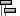

#  {{page.title}}
{: #environment-tab}
環境不只是彩現裡可見的背景，它是一個環繞模型，可供反射與折射的極大球體，此球體無法選取，但有設定可以做調整。

環境是場景背後未被物件擋住的部分，或是出現在反射材質的環境反射影像。要讓環境對場景產生照明效果請參考[天光](sun-and-sky.html)的說明。

Flamingo 內建一種特別的環境 - 預設的 *[Flamingo 環境](environment.html)*，此環境與目前的[照明預設組](lighting-tab.html)同步。每個[照明預設組](lighting-tab.html)都有預設適當的照明與環境。

{:  #panel_map height="600px" style="float: right"}

##### 可以在哪找到這個指令?
 1. 環境標籤
 1. 彩現工具工具列 >  環境編輯器
 1. 功能表 > 彩現 > 環境編輯器
 1. 指令 > EnvironmentEditor

The Environment Editor Panel is split into discrete sections.  Based on the environment type, the advanced panels may vary.

材質編輯器、[貼圖面板](texturepalette.html)、[環境編輯器](environmenteditor.html)的任何顏色方塊都可以相互拖放。
環境面板

 1. [背景類型](#type)
 1. [設定列](#settings)
 1. [環境清單](#environment_list)
 1. [視窗分隔條](#divider)
 1. [環境內容區](#properties)
 1. [名稱](#name)
 1. [環境內容面板](#panels)

## [背景類型](#panel_map) 
{: #type style="clear: both;"}
Select the type of background for the model.  [Environment](#flamingo-environment) is an all inclusive rendering environment and should be the default setting for Flamingo.  The other three settings present a much more simplified set of settings that reflect older ways of defining backgrounds. For more information see the [Rhinoceros Simple Background](http://docs.mcneel.com/rhino/5/help/en-us/commands/environmenteditor.htm#Basic_settings) topic

The reset of this help topic covers the Environment type.

## [設定列](#panel_map) 
{: #settings}
Use this bar to help navigate the Environment list.

####  向後按鈕
Walks back through the current environment or the previously selected environments.  For instance an environment with reflective or refractive layers.  Use this arrow to get back to the parent environment from the reflection or refraction details.

####   向前按鈕
Walks forward through the previously selected environments.  For instance an environment with reflective or refractive layers.  Use this arrow to get forward to the parent environment from the reflection or refraction details.

####  目前選取的環境名稱
Displays the current environment name and edit level.  For instance, if there is a reflective or refractive level a ">" is shown. A good place to see where the environment is current.

####  Tools Menu
Displays the [Tools menu](#tools-menu).  This is an extensive menu of commands, settings and utilities related to environments.

####  Help

## [Environment List](#panel_map) 
{: #environment_list}
This lists all the environments contained in the model. One Environment will be selected as the current environment. The current environment is used in the rendering. Yellow corners will show up surrounding the current Environment.

From this list:

* Click on an Environment to make it current. Once selected the environment's properties will show in the panels below. See [Render Materials Properties](#properties) for more information
* Scroll up and down in the list to see all the environments in the model.
* Add a new Environment using the Add New Button  at the bottom of the list.
* Right-click a thumbnail to display the Environment context menu
* Right-click the blank area to display the New Environment Context Menu

###   Add new environment
{: #add_environment}
Scroll down to the bottom of the Environment list to see the add icon.

Opens the Render Content [library](libraries.html) of environments.
The environments in the library act as templates for creating environments in the model.

### Environment Context Menu
{: environment_context}
This menu is available by right click on a environment listing.  See the [Tools Menu](#tools_menu) for details on the many options in this menu.

### New Environment Context Menu
{: new_envrionment_context}
This menu is available by right-clicking on a blank area of the Environment List.

####  建立新環境
Creates a new Flamingo Environment.

####  Import Environment from File...
Use this command to select a previously exported Environment.

####  Paste
將複製到剪貼簿的環境貼上建立另一個環境。

####  貼上為引例
將複製到剪貼簿的環境貼上建立另一個環境，此環境的設定與來源的環境互相連結。

####  Grid
以預覽縮圖顯示。

####  清單
以有名稱的預覽縮圖顯示。

####  樹狀清單
以樹狀的名稱清單顯示。

####  水平配置
將預覽縮圖或清單顯示在編輯器的左邊。

####  顯示預覽面板
顯示目前所在的項目的預覽縮圖。

####  浮動
以可以改變大小的浮動小視窗顯示預覽縮圖。

#### 縮圖

#####  小
將預覽縮圖設為小圖示。

#####  中
將預覽縮圖設為中圖示。

#####  大
將預覽縮圖設為大圖示。

#####  顯示標籤
當編輯器設為以**圖示**模式檢視時顯示名稱標籤。
以**清單**模式檢視時總是會顯示名稱標籤。

#####  顯示單位
以模型單位顯示尺寸。

#####  自動更新縮圖
設定變更時自動更新所有的縮圖。

#####  更新所有縮圖
**自動更新縮圖**停用時可手動更新所有縮圖。

## [視窗分隔條](#panel_map) 
{: #divider}
Drag on this divider to change the length of the Environment List versus the length of the Environment Properties Section.

## [Environment Properties Section](#panel_map) 
{: #properties}

### [環境名稱](#panel_map) 
{: #name}
This is the name of the environment. The environment name is also saved as the file name when exporting the environment to the library. **Note:** Environments are stored in the Rhino model, unique environments can have the same name in different Rhino models.

### [Environment Panels](l#panel_map) 
{: #panels}
The Environment Properties section is filled with a number of direct Environment panels. Clicking on the grey title bar will rollup the environment panel, hiding the contents of that panel.  Click on the title bar again to show contents.

Environment Panels will vary based on the type of environment and the current active environment level. For more information on specific environment panels see [Flamingo Environment](environment.html)

## Tools Menu 
{: tools_menu}
工具功能表裡的項目也可以在預覽縮圖與縮圖面板空白部分的右鍵快顯功能表裡找到。

####  設定為使用中的彩現環境
This sets the target environment current.  The current environment will be used in the next rendering.

####  建立新環境
Creates a new Flamingo Environment.
<!-- This comes from the page http://docs.mcneel.com/rhino/5/help/en-us/popup_moreinformation/materialthumbnail_contextmenu.htm -->
工具功能表裡的項目也可以在預覽縮圖與縮圖面板空白部分的右鍵快顯功能表裡找到。

####  從檔案匯入環境
從 Rhino 的 .renv 檔案匯入環境。

####  儲存至檔案
將環境儲存為 Rhino 的 .renv 檔案。

####  變更類型
將環境變更為其它的類型。

####  變更類型 (複製類似的設定)
將環境變更為其它的類型。
The default behavior depends on the current state of the [Rendering Options](http://docs.mcneel.com/rhino/5/help/en-us/options/rendering.htm) >  [Copy similar settings when content type is changed](http://docs.mcneel.com/rhino/5/help/en-us/options/rendering.htm#Copy_similar_settings_when_content_type_is_changed)  box. If checked, compatible settings from the old content will be copied to the new one.

####  重設為預設值
Changes all the environment settings to the default Solid color background (Black), reflected background, Sky and Refracted Background visible.

####  Copy
將選取的環境複製到 Windows 剪貼簿，可以在編輯器裡貼上建立另一個環境，或是在 Rhino 外部貼上，將環境匯出為 .renv 檔案。

####  貼上
將複製到剪貼簿的環境貼上建立另一個環境。

####  貼上為引例
將複製到剪貼簿的環境貼上建立另一個環境，此環境的設定與來源的環境互相連結。

####  刪除
刪除選取的環境。

####  重新命名...
重新命名選取的環境。

####  建立複本
以選取的環境建立一個設定相同的複本。

####  移除引例
解除環境引例與來源環境之間的連結關係。



####  彩現內容過濾器
開啟[彩現內容過濾器](content_filters.html)視窗。

####  內容
開啟[預覽設定](previewproperties.html)對話框。
