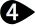

# {: .inline} {{page.title}}
{: #environment-tab}
環境不只是彩現裡可見的背景，它是一個環繞模型，可供反射與折射的極大球體，此球體無法選取，但有設定可以調整。

環境是彩現裡未被物件擋住的背景、反射材質上的非物件反射影像或透明材質的非物件折射影像。要讓環境對場景產生照明效果請參考[天光](sun-and-sky.html)的說明。

Flamingo 內建一種特別的環境 - 預設的 [Flamingo 環境](environment.html)，此環境與目前的[照明預設組](lighting-tab.html)同步。每個[照明預設組](lighting-tab.html)都有預設適當的照明與環境。

{:  #panel_map height="600px" style="float: right"}

##### 可以在哪找到這個指令?
 1. {: .inline} 環境標籤
 1. {: .inline} 彩現工具工具列 > {: .inline} 環境編輯器
 1. {: .inline} 功能表 > 彩現 > 環境編輯器
 1. 指令 > EnvironmentEditor

環境編輯器的選項因環境的類型而異。

材質編輯器、[貼圖面板](texturepalette.html)、[環境編輯器](environmenteditor.html)的任何顏色方塊都可以相互拖放。

**環境面板**

 1. [背景類型](#type)
 1. [設定列](#settings)
 1. [環境清單](#environment_list)
 1. [視窗分隔條](#divider)
 1. [環境內容](#properties)
 1. [名稱](#name)
 1. [環境內容面板](#panels)

## [背景類型](#panel_map) {: .inline}
{: #type style="clear: both;"}
選擇[彩現環境](#flamingo-environment)的背景類型，有天空、顏色、圖片、HDR、平面 HDR 可供選擇，詳細說明請參考 [Rhino 環境編輯器](http://docs.mcneel.com/rhino/5/help/zh-tw/commands/environmenteditor.htm#Basic_settings)主題。

此主題剩餘的部分將說明環境類型。

## [設定列](#panel_map) {: .inline}
{: #settings}
可用來瀏覽環境裡的設定。

#### {: .inline} 向後按鈕
環境可能有許多層的設定頁面，**向後**按鈕可回到上一個使用的頁面，例如：在環境 A 的反射頁面選取環境 B，按**向後**按鈕可回到環境 A 的反射頁面。

####  {: .inline} 向前按鈕
環境可能有許多層的設定頁面，**向前**按鈕可回到下一個使用的頁面，例如：在環境 A 的反射頁面選取環境 B，按**向後**按鈕回到環境 A 的反射頁面，再按**向前**按鈕可再回到環境 B。

#### {: .inline} 目前選取的環境名稱
顯示目前選取的環境的名稱與所在的設定頁面。

#### {: .inline} 工具功能表
顯示[工具功能表](#tools-menu)，工具功能表有與環境相關的許多指令與設定。

#### {: .inline} 說明

## [環境清單](#panel_map) {: .inline}
{: #environment_list}
列出儲存在模型裡的所有環境，四個角有黃色三角形的是目前彩現使用的環境。

清單的操作：

* 選取的環境的內容會顯示在下方的面板，詳細說明請參考[彩現材質內容](#properties)主題。
* 上下捲動檢視所有的環境。
* 按環境清單末端的**新增**按鈕 {: .inline} 可建立新環境。
* 在縮圖上按右鍵可彈出**環境功能表**。
* 在空白的位置按右鍵可彈出**新環境功能表**。

###  {: .inline} 建立新環境
{: #add_environment}
按環境清單末端的**新增**按鈕。

開啟內建的彩現[環境庫](libraries.html)。
內建的環境可做為目前的模型建立新環境的範本。

### 環境功能表
{: environment_context}
在一個環境上按右鍵可彈出此功能表，此功能表提供的功能請參考[工具功能表](#tools_menu)。

### 新環境功能表
{: new_envrionment_context}
在環境清單空白的位置按右鍵可彈出此功能表。

#### {: .inline} 建立新環境
建立一個新的基本環境。

#### {: .inline} 從檔案匯入環境...
把匯出至檔案的環境匯入到目前的模型。

#### {: .inline} 貼上
將複製到剪貼簿的環境貼上建立另一個環境。

#### {: .inline} 貼上為引例
將複製到剪貼簿的環境貼上建立另一個環境，此環境的設定與來源環境互相連結。

#### {: .inline} 圖示
以預覽縮圖顯示。

#### {: .inline} 清單
以有名稱的預覽縮圖顯示。

#### {: .inline} 樹狀清單
以樹狀的名稱清單顯示。

#### {: .inline} 水平配置
將預覽縮圖或清單顯示在編輯器的左邊。

#### {: .inline} 顯示預覽面板
顯示目前所在的項目的預覽縮圖。

#### {: .inline} 浮動
以可改變大小的浮動小視窗顯示預覽縮圖。

#### 縮圖

##### {: .inline} 小
將預覽縮圖設為小圖示。

##### {: .inline} 中
將預覽縮圖設為中圖示。

##### {: .inline} 大
將預覽縮圖設為大圖示。

##### {: .inline} 顯示名稱
當編輯器設為以**圖示**模式檢視時顯示名稱標籤。
以**清單**模式檢視時總是會顯示名稱標籤。

##### {: .inline} 顯示單位
以模型單位顯示尺寸。

##### {: .inline} 自動更新縮圖
設定變更時自動更新所有的縮圖。

##### {: .inline} 更新所有縮圖
**自動更新縮圖**停用時可手動更新所有縮圖。

## [視窗分隔條](#panel_map){: .inline} {: .inline}
{: #divider}
移動視窗分隔條可調整環境清單可同時顯示的環境數目。

## [環境內容](#panel_map) {: .inline}
{: #properties}

### [環境名稱](#panel_map) {: .inline}
{: #name}
此為環境的名稱，也是環境匯出時的檔案名稱。**附註：**環境是儲存在 Rhino 模型裡，不同模型裡相同名稱的環境不會相互影響。

### [環境面板](#panel_map) {: .inline}
{: #panels}
環境內容有許多面板，按面板的標題列可將面板收摺或展開。

環境面板的設定因環境類型而異，詳細說明請參考 [Flamingo 環境](environment.html)主題。

## 工具功能表 {: .inline}
{: tools_menu}
工具功能表的項目也可以在預覽縮圖與縮圖面板空白部分的右鍵功能表裡找到。

#### {: .inline} 設定為使用中的彩現環境
將選取的環境設為使用中，下一次彩現將使用此環境。

#### {: .inline} 建立新環境
建立一個新的 Flamingo 環境。
<!-- This comes from the page http://docs.mcneel.com/rhino/5/help/zh-tw/popup_moreinformation/materialthumbnail_contextmenu.htm -->
工具功能表裡的項目也可以在預覽縮圖與縮圖面板空白部分的右鍵快顯功能表裡找到。

#### {: .inline} 從檔案匯入環境
從 Rhino 的 .renv 檔案匯入環境。

#### {: .inline} 儲存至檔案
將環境儲存為 Rhino 的 .renv 檔案。

#### {: .inline} 變更類型
將環境變更為其它的類型。

#### {: .inline} 變更類型 (複製類似的設定)
將環境變更為其它的類型。
預設的作業方式由 [Rhino 選項  > 彩現](http://docs.mcneel.com/rhino/5/help/zh-tw/options/rendering.htm)頁面的[當彩現內容類型變更時複製類似的設定設定決定](http://docs.mcneel.com/rhino/5/help/zh-tw/options/rendering.htm#Copy_similar_settings_when_content_type_is_changed)。當這個選項開啟時，從一種類型變更至另一種類型時會套用相容的設定。

#### {: .inline} 重設為預設值
重設整個環境，背景=單一顏色 (黑色)、反射=天空、折射=可見的背景。

#### {: .inline} 複製
將選取的環境複製到 Windows 剪貼簿，可以在編輯器裡貼上建立另一個環境，或是在 Rhino 外部貼上，將環境匯出為 .renv 檔案。

#### {: .inline} 貼上
將複製到剪貼簿的環境貼上建立另一個環境。

#### {: .inline} 貼上為引例
將複製到剪貼簿的環境貼上建立另一個環境，此環境的設定與來源環境互相連結。

#### {: .inline} 刪除
刪除選取的環境。

#### {: .inline} 重新命名...
重新命名選取的環境。

#### {: .inline} 建立複本
以選取的環境建立一個設定相同的複本。

#### {: .inline} 移除引例
解除環境引例與來源環境之間的連結關係。



#### {: .inline} 彩現內容過濾器
開啟[彩現內容過濾器](content_filters.html)視窗。

#### {: .inline} 內容
開啟[預覽設定](previewproperties.html)對話框。
