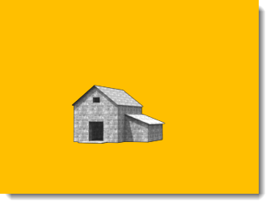

# {: .inline} {{page.title}}
Rhino 有幾種[環境類型](http://docs.mcneel.com/rhino/5/help/zh-tw/commands/environmenteditor.htm)，此主題將說明 Flamingo 的環境類型。

環境是彩現裡未被物件擋住的背景、反射材質上的非物件反射影像或透明材質的非物件折射影像。要讓環境對場景產生照明效果請參考[天光](sun-and-sky-tabs.html)的說明。

Flamingo 內建一種特別的環境 - 預設的 **Flamingo 環境**，此環境與目前的[照明預設組](lighting-tab.html)同步。每個[照明預設組](lighting-tab.html)都有預設適當的照明與環境。

Flamingo 環境的內容群組有：

  * [名稱](#name)
  * [Flamingo 環境](#environment)
  * [背景顏色](#color-backgrounds)
  * [進階背景](#advanced-background-reflected-sky)

## 環境名稱
{: #name}
此為 Rhino 模型裡的環境名稱，環境可儲存在 Rhino 模型檔案裡。編輯目前模型的環境不會影響材質庫與其它模型裡的環境。要在其它模型使用目前模型的環境時，必需先將環境儲存至[材質庫](libraries.html)，環境的名稱即儲存的環境檔案的名稱。

## Flamingo 環境
{: #environment}
環境在彩現模型時有三個重要角色：

  1. 可見的背景
  1. [反射背景](#advanced-background-reflected-sky)
  1. [折射背景](#advanced-background-refracted-sky)

可見的背景是彩現的模型後方直接可見的背景，用於[反射](#advanced-background-reflected-sky)與[折射](#advanced-background-refracted-sky)的背景可與可見的背景不同。

#### 強度
{: #background-intensity}
修改背景的相對亮度，每個顏色通道的數值可以是 0 - 255，背景的照明亮度是顏色數值乘以強度數值，當背景偏暗時強度數值更顯重要。

#### 背景類型
{: #background-type}
設定各種不同的彩現背景，背景有以下幾種類型：

* [天空](#environment-sky)
* [單一顏色與漸層色](#color-backgrounds)
* [圖片](#environment-image)
* [HDR 與平面 HDR 圖片](#hdr-background)

## 天空背景
{: #environment-sky}
環境的背景類型中的天空是使用[照明預設組](lighting-tab.html)的太陽與天空的設定，彩現裡可見天空的場景可用天空做為背景。

自動 (左)、HDR 圖片與太陽 (右)。

## 顏色背景
{: #color-backgrounds}
即使將背景類型設為圖片、HDR 或天空時遮蔽了背景顏色，背景顏色的選項仍然可用。

#### 單一顏色
{: #solid-color}
以一種顏色填滿整個背景。

單一顏色背景。
單一顏色的詳細說明請參考下方的[顏色控制](#enviroment-sky-color-controls)。

#### 雙色漸層
{: #two-color-gradient}
雙色與三色漸層的背景只有在透視圖作業視窗才有作用，雙色漸層背景由選取的一個顏色變化至另一個顏色。

雙色漸層背景：藍、黃。
雙色漸層的詳細說明請參考下方的[顏色控制](#enviroment-sky-color-controls)。

#### 三色漸層
{: #three-color-gradient}
三色漸層背景由選取的一個顏色變化至另一個顏色，再變化至第三種顏色。

三色漸層背景：藍、白、黃。
三色漸層的詳細說明請參考下方的[顏色控制](#enviroment-sky-color-controls)。

### 顏色控制
{: #enviroment-sky-color-controls}
可用的顏色選項因為顏色的型式不同而異，三色漸層可設定上、中、下三種顏色。



#### 對調顏色
將漸層色的上、下兩個顏色對調。

#### 漸層色的對應
{: #gradient-mapping}
漸層色背景的顏色必需對應到環境球體上，當顏色型式設為雙色漸層或三色漸層時才會有漸層色對應的圖形控制界面，漸層色只有在透視圖作業視窗有作用。

#### 從視圖擷取角度
{: #angle-from-views}
**從視圖擷取角度**啟用時，漸層色的上、下顏色會重新對應至視圖的上、下邊緣，顏色從一種顏色漸變為另一種顏色。

#### 視角指示器
{: #colorrange}
如果目前作業視窗是使用透視投影，可以將漸層分布至視圖的整個範圍。

{: style="float: left; padding-right: 25px;padding-bottom: 15px;padding-top:15px;"}

* 視角指示器的 90 度代表 +Z 軸的方向，0 度代表水平面，-90 度代表 -Z 軸的方向。
* 灰色的扇形區域代表透視圖的視野範圍。
* 紅色標記代表"上"顏色的起始角度，此角度之上都以"上"顏色顯示。
* 綠色標記代表純"中"顏色的角度，只有三色漸層才會有此綠色標記，"中"顏色向上漸變至"上"顏色，向下漸變至"下"顏色。
* 藍色標記代表"下"顏色的起始角度，此角度之下都以"下"顏色顯示。

####  從視圖擷取角度按鈕
按此按鈕可自動調整漸層色標記的位置符合使用中的透視視圖。

#### 上/中/下 角度
漸層色對應的紅、綠、藍標記目前的角度數值。

## 圖片背景
{: #environment-image}

以圖片投影做為背景，可讓模型處於適當的情境，或是做為窗外的景色。數位相片、掃描的圖畫作品或是以繪圖軟體製作的圖片都可做為背景圖片。做為環境背景的圖片最好選用高解析度的圖片，將圖片稍微做點模糊處理並提高亮度可模擬真實世界的深度感與瞭闊的場景。背景圖片可使用平面、圓柱體或球體投影。

適用平面投影的背景圖片。

### 圖片檔案
{: #image-properties}
按 **(空白 - 按這裡開始設定)** 大型按鈕可選擇要使用的背景圖片，要重新選擇其它圖片請按相同位置的圖片縮圖。

### 投影
{: #backgroud-image-projection}
從下拉清單選擇三種投影方式之一。

* [平面](#planar)
* [圓柱體](#cylindrical)
* [球體](#spherical)

每一種投影方式都有不同的設定可調整圖片的位置。

### 平面投影
{: #planar}
將圖片投影到目前視圖的平面背景，背景圖片永遠正對視圖。

#### 從視圖擷取角度
此選項可自動調整背景圖片的角度，使背景圖片自動符合視圖角度。

#### 圖片位置控制
灰色矩形代表目前視圖的背景區域，粉紅色矩形代表背景圖片，移動粉紅色矩形或修改下方的數值可調整背景圖片的縮放比例與位置。

背景區域 (1) 與圖片的大小與形狀 (2)。

#### X 縮放 / Y 縮放
設定背景圖片寬度與高度的縮放比例。例如：1.0 (100%) 代表圖片的尺寸符合背景區域的尺寸，0.5 (50%) 代表圖片的尺寸為背景區域的一半。

#### X 偏移 / Y 偏移
設定背景圖片水平與垂直的偏移距離，背景區域的左下角為原點。例如：0.5 代表圖片往右 (或往上) 偏移，偏移距離為背景區域寬度 (或高度) 的一半。

### 圓柱體投影
{: #cylindrical}
將背景圖片投影至環繞模型的圓柱曲面，此投影方式適合使用 360 度環繞拍攝的照片。

以角度值設定圖片出現在彩現裡的大小、位置、寬度與高度，右邊的示意圖形上的角度標記可使用滑鼠移動， 灰色扇形區域代表目前作業視窗的橫向與縱向視野範圍。

#### 從視圖擷取角度
此選項可自動調整背景圖片的角度，使背景圖片自動符合視圖角度。

#### 平面控制
以角度值設定圖片出現在彩現影像裡的寬度，您可以輸入角度值或移動示意圖形上的角度標記，藍色的扇形區域代表圖片的橫向分布範圍。

{: .float-img-left}

* 示意圖形以俯視圖顯示。
* 暗灰色的扇形區域代表透視圖的視野範圍。
* 藍色的扇形區域代表背景圖片可見的角度範圍。
* 藍色角度標記代表背景圖片的左側邊緣。
* 紅色圓點代表背景圖片的中心。
* 紅色角度標記代表圖片的右側邊緣。

#### 垂直控制
{: .clear-img}
以角度值設定圓柱體投影的圖片在彩現影像裡的高度範圍，可輸入角度值或移動示意圖形上的角度標記，上/下角度有正、負 45 度的限制。

{: .float-img-left}

* 示意圖形以剖視圖顯示。
* 灰色的扇形區域代表透視圖的視野範圍。
* 藍色角度標記代表背景圖片的下方邊緣。
* 紅色角度標記代表背景圖片的上方邊緣。

#### 旋轉
{: .clear-img}
設定圖片出現在彩現裡的部分，紅色圓點是圖片的橫向中心點。

#### 寬度
設定背景圖片的水平環繞角度範圍。

#### 上/下
設定背景圖片的垂直角度範圍，底平面為 0 度。

####  從視圖擷取角度按鈕
從透視圖作業視窗取得各項角度值來設定背景圖片的顯示範圍。

### 球體投影
{: #spherical}
以球體投影將圖片分布至整個球體，此投影方式適用全景的環境貼圖，全景環境貼圖的寬高比為 2 : 1。

#### 從視圖擷取角度
此選項可自動調整背景圖片的角度，使背景圖片自動符合視圖的角度。

#### 球體控制
設定背景貼圖顯示的方向，可輸入角度或移動示意圖形上的紅色圓點，紅色圓點代表視圖的中心。

#### 旋轉
{: .clear-img}
設定圖片出現在彩現裡的部分，紅色圓點是圖片的橫向中心點。

####  從視圖擷取角度按鈕
從透視圖作業視窗取得各項角度值來設定背景圖片的顯示範圍。

## HDR 背景
{: #hdr-background}
使用 HDR 圖片做為場景的照明光源可提供更真實、自然的照明效果，尤其是明亮的戶外光源透過窗戶照亮室內場景的情形特別有用。HDR 圖片可記錄的亮度範圍遠大於一般圖片，您可以賦予 HDR 圖片一個獨立的[照明通道](lights-tab.html#channel)，以便在彩現完成後可以再對 HDR 圖片的亮度做調整。

#### 圖片檔案
{: #hdri-image}
按 **(空白 - 按這裡開始設定)** 大型按鈕可選擇要使用的 HDR 背景圖片，要重新選擇其它圖片請按相同位置的圖片縮圖。






## 平面 HDR 選項
{: #planar-hdr-options}

平面的 HDR 圖片較不常用，可做為室內場景窗戶外的景色貼圖。

使用一般圖片 (左) 與平面 HDR (右) 做為窗外景觀貼圖彩現時場景照明的細微差異。

#### 圖片檔案
{: #hdri-planar-image}
按 **(空白 - 按這裡開始設定)** 大型按鈕可選擇要使用的 HDR 背景圖片，要重新選擇其它圖片請按相同位置的圖片縮圖。



## 進階背景
{: #advanced-background}
進階背景設定控制透明物件折射的環境背景與亮面物件反射的環境背景，可讓折射與反射的環境背景不同於可見的環境背景。以下圖為例，可見的環境背景是黑色，但金屬球反射的是一張 HDR 圖片。

可見的背景 (左) 與使用 HDR 圖片 (右) 做為物件反射的環境背景。

### 反射
{: #advanced-background-reflected-sky}
給物件反射的環境背景可與彩現影像裡看到的環境背景不同。

#### 天空
以[照明 > 天空與太陽](sun-and-sky-tabs.html)做為物件反射的環境背景。

#### 自訂
使用[單一顏色或漸層色](#color-backgrounds)、[一般圖片](#environment-image)或 [HDR 圖片](#hdr-background)做為物件反射的環境背景。

#### 可見的背景
以[環境](environment-tab.html)的背景設定做為物件反射的環境背景。

### 折射
{: #advanced-background-refracted-sky}

#### 天空
以[照明 > 天空與太陽](sun-and-sky-tabs.html)做為透明物件折射的環境背景。

#### 自訂
使用[單一顏色或漸層色](#color-and-gradient-backgrounds)、[一般圖片](#image)或 [HDR 圖片](#hdr-background)做為透明物件折射的環境背景。

#### 可見的背景
以[環境](environment-tab.html)的背景設定做為透明物件折射的環境背景。

#### Alpha 通道忽略材質的透明度
{: #no-transparent-alpha-objects}
開啟這個選項時，使用透明材質的物件會被當做不透明的物件處理建立 Alpha 通道。
如果您想在影像合成時保留透明物件裡看到的環境背景，請開啟這個選項。
