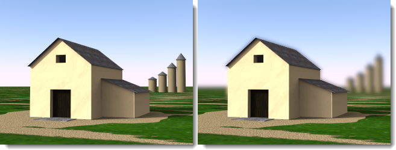

# {{page.title}}
Flamingo nXt 的彩現影像編輯器可以編輯所有 nXt 平台建立的原生影像檔案 (.nXtImage)，這種檔案格式保留了彩現過程收集的資訊。
Flamingo nXt 彩現影像編輯器的功能：

* 調整[色調對應](image-editor.html#tone-mapping)。
* 變更照明通道的亮度。
* 加入特殊的影像後處理效果：[霧氣](image-editor.html#haze)、[景深模糊](image-editor.html#depth-blur)、[光芒](image-editor.html#glare)...等。
* [儲存](image-editor.html#save-tonemapped-image-as)色調對應處理後的圖片格式：JPG、PNG、TIF...。
* 儲存含亮度資訊的 [HDR](image-editor.html#save-hdr-image-as) 圖片。
* 檢視與儲存 [Alpha](image-editor.html#alpha-channel)、[距離](image-editor.html#distance-channel)、[材質](image-editor.html#material-channel)通道資訊，以便進行後續的影像合成處理。
* 可儲存 [Piranesi©](http://www.piranesi.co.uk/) 檔案格式 (*.epx)，用來建立手繪風格的影像。
* 使用影像[運算](image-editor.html#arithmetic)功能將彩現農場分配給客戶端計算得到的彩現切片組合為完整的影像。
* 修改光源的[照明](image-editor.html#save-lighting-settings-as)亮度，儲存不同版本的彩現影像。

執行彩現影像編輯器

> 從 **Flamingo nXt 5.0** 功能表選擇**其它工具 &gt; Flamingo nXt 彩現影像編輯器**。

## 檔案功能表
{: #file-menu}

### 開啟
開啟 nXtImage 檔案格式做編輯。

### 儲存來源影像
儲存修改過的 nXtImage 檔案。

### 另存來源影像
以不同名稱儲存目前的 nXtImage 檔案。

### 另存色調對應處理後的影像
{: #save-tonemapped-image-as}
將 nXtImage 檔案另存為一般的圖片檔案。

 * JPEG (.jpg)
 * TIFF (.tif)
 * TIFF 含 Alpha 通道 (.tif)
 * PNG (.png)
 * PNG 含 Alpha 通道 (.tif)
 * [Piranesi EPix 檔案 (.epx)](http://www.piranesi.co.uk/)

Piranesi 是一種 3D 繪圖程式，可以建立手繪風格的影像。

### 另存 HDR 影像
{: #save-hdr-image-as}

 * HDR 檔案 (.hdr)
 * EXR 檔案 (.exr)
 * EXR 含 Alpha 通道 (.exr)

### 儲存遮罩
{: #save-mask}
nXtImage 檔案內含三種通道資訊，可以在大部分的平面繪圖軟體裡做為影像合成時的遮罩使用，通道是儲存在每一個像素的額外資訊，以灰階值表示，每一個通道都可以獨立檢視或另存圖片。

##### 附註：

 1. Alpha 通道可以儲存至支援 Alpha 通道的圖片格式。
 1. 距離與材質通道並未經過反鋸齒處理，圖片影像邊緣會有鋸齒狀，以這兩個通道輸出的圖片做為遮罩使用時做適度的模糊處理會有比較平滑的遮罩效果。
 1. 材質通道只能儲存 255 種材質，當模型內含超過 255 種材質時，會有部分的材質使用相同的通道。

#### 材質通道
{: #material-channel}
用於儲存材質遮罩。

#### Alpha 通道
{: #alpha-channel}
用於儲存 Alpha 遮罩。

#### 距離通道
{: #distance-channel}
用於儲存距離遮罩。

### 另存照明設定
{: #save-lighting-settings-as}
儲存[照明配置](lighting-tab.html#open-lighting-scheme)。

## 影像功能表
{: #renderwindowimage}

### 資訊
{: #info}
顯示彩現影像的資訊。

### 運算
{: #arithmetic}
類似繪圖軟體裡常見的圖層混合模式。

##### 組合彩現切片：

 1. 從**檔案**功能表選擇**開啟**。
 1. 開啟第一個彩現切片，例如：000000.nXtImage。
 1. 從**影像**功能表選擇**運算** > **相加**。
 1. 開啟所有其它切片。

**附註：**請勿再開啟第一個彩現切片 (000000.nXtImage)，否則它會被再加入一次。

#### 相加
將彩現影像像素的 RGB 值相加，相加後的值大於 255 時都以 255 表示。

#### 相減
將彩現影像像素的 RGB 值相減，相減後的值小於 0 時都以 0 表示。

#### 差異
將彩現影像像素的 RGB 值以大的減去小的，相減後的結果一定是正數，任何顏色與黑色做差異運算時結果不變，與白色做差異運算時結果會相反。

#### 相加 (含遮罩)
除了 RGB 值相加以外，Alpha 通道也相加。

#### 結合路徑追蹤
結合使用路徑追蹤引擎彩現的影像，例如：十張以 20 個處理數彩現的影像可以結合成為一張處理數為 200 的彩現影像。

*20 個處理數的彩現影像 (左) 與十張 20 個處理數的彩現影像結合成為 200 個處理數的彩現影像 (右)。*

### 套用補丁
{: #apply-patch}
將選取的區域的彩現影像加入目前的彩現影像。

### 動畫
建立影像處理效果的漸變動畫。

##### 建立動畫

 1. 按**加號 (+)** 按鈕加入一個新的**圖框**。
 1. 編輯彩現影像，再加入其它圖框。
 1. 從**影像 &gt; 動畫**開啟動畫對話框，按**預覽**按鈕。
 1. 如果預覽的效果符合要求，再按**動畫**按鈕。

### 建立一個資料夾。
產生一連串的圖片，這些圖片可以使用其它程式串成影片。

## 檢視功能表
{: #view-menu}
設定如何顯示彩現影像。

### 影像
顯示完整的彩現影像。

### 影像與 Alpha 遮罩
同時顯示彩現影像與 Alpha 通道遮罩。

### 材質遮罩
顯示[材質遮罩](image-editor.html#material-channel)。

### 距離遮罩
顯示[距離遮罩](image-editor.html#distance-channel)。

## 使用彩現影像編輯器

##### 載入彩現影像

 1.  將彩現影像[儲存](render-window.html#export-to-nxtimage)為 **.nXtImage** 檔案。
 1. 從 **Flamingo nXt 5.0** 功能表選擇**其它工具 &gt; Flamingo nXt 彩現影像編輯器**。
 1. 在**彩現影像編輯器**裡，從檔案功能表選擇**開啟**，將 .nXtImage 檔載入。

## 色調對應
{: #tone-mapping}
色調對應是將亮度資訊轉換為螢幕色彩顯示範圍 (RGB) 的方法。

#### 亮度
{: #brightness}
請參考：[彩現視窗的亮度設定](render-window.html#brightness)。


#### 加亮
請參考：[彩現視窗的加亮設定](render-window.html#burn)。

#### 飽和度
請參考：[彩現視窗的飽和度設定](render-window.html#saturation)。

#### 色階分布圖
請參考：[彩現視窗的色階分布圖](render-window.html#histogram)。

## 資訊列
資訊列位於彩現影像編輯器視窗的下方，當您在彩現影像上移動滑鼠游標時，資訊列會顯示滑鼠游標所在像素的各種資訊。

#### 像素
{: #pixel}
像素座標，原點 (0,0) 為左下角。

#### 顏色
{: #color}
前三個欄位為色調對應處理後的 RGB 值，第四個欄位是用於影像合成的 Alpha (透明) 值。

#### 值
{: #value}
R、G、B 三個通道個別的亮度值。

#### 亮度
{: #lum}
儲存在每個像素的加權平均流明值。

#### 深度
{: #depth}
彩現影像裡一個點距離攝影機遠近的數值，-1.0 代表背景。

#### 材質
{: #material}
滑鼠游標所在位置的物件使用的材質。

## FX 設定
可加入一些特殊效果，這些效果使用儲存在 nXt 彩現影像裡的特殊資訊，例如：光芒使用像素的亮度資訊，霧氣使用像素的距離資訊。

### 霧氣
{: #haze}
依距離遠近將設定的顏色加入像素，產生霧氣的效果。

*原來的 (左) 與加上霧氣的 (右) 彩現影像。*

#### 強度
設定霧氣的濃度。

#### 近
攝影機至霧氣效果起點的距離。

#### 指定
在彩現影像裡指定距離。

#### 遠
霧氣效果濃度停止變化的距離，從這個距離開始霧氣的濃度是固定的。
近、遠兩點之間的霧氣濃度是以線性變化。

#### 指定
在彩現影像裡指定距離。

#### 顏色
霧氣的顏色。

#### 指定
在彩現影像裡指定顏色。

### 景深模糊
{: #depth-blur}
彩現影像裡的每個像素都含有距離通道，該通道的數值代表一個像素距離攝影機的遠近，可以用來產生景深模糊的效果。

*原來的 (左) 與加上景深模糊的 (右) 彩現影像。*

#### 強度
設定模糊的量。

#### 焦點
{: #depthblurfocus}
設定彩現影像聚焦的位置。

#### 指定
在彩現影像裡指定焦點的距離。

#### 清晰範圍
{: #in-focus-zone}
**焦點**前、後影像未做模糊處理的範圍，單位為公尺，超過這個範圍的影像的模糊度會隨著距離提高，模擬真實攝影的景深。

#### 模糊
設定模糊處理的方向，預設值為**背景**，只會對**清晰範圍**之後的影像做模糊處理。

*前景模糊 (左) 與背景模糊 (右)。*

#### 背景
**清晰範圍**之後影像的模糊度隨著遠離的距離逐漸增加。

#### 前景
**清晰範圍**之前影像的模糊度隨著靠近的距離逐漸增加。

#### 兩者
**清晰範圍**前後都做模糊處理，這種後處理效果的景深模糊不如彩現時直接運算的[景深](render-tab.html#depthoffieldoption)模糊精確。

### 光芒
{: #glare}
以像素的亮度值決定是否在該像素周圍產生光芒效果，彩現影像裡只有高亮度的像素會有這種效果。
在彩現影像上移動滑鼠游標可以顯示像素的亮度值。

*原來的 (左) 與加上光芒的 (右) 彩現影像。*

#### 強度
調整光芒的大小。

#### 臨界值
數值越低作用的範圍越大，所有亮度高於臨界值的像素都會產生光芒的效果。

#### 指定
在彩現影像裡指定亮度值。

### 暈映
{: #vignette}
以選取的顏色在彩現影像周圍產生羽化邊框的效果。

*原來的 (左) 與加上暈映 (右) 彩現影像。*
