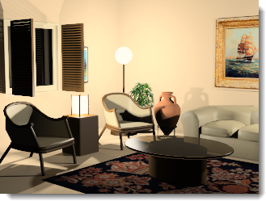
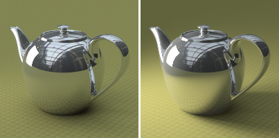

# {: .inline} {{page.title}}
照明是彩現時最重要也是最容易被忽視的部分。照明不只是照亮模型這麼簡單，它可以營造出特殊的氛圍，也是彩現成功與否的關鍵。

*由 Christopher Soto Gutiérrez 提供的圖片。*

#### 可以在哪找到 Flamingo 的燈光設定?

* {: .inline} 功能表 > Flamingo nXt 5.0 > 顯示控制面板 > Flamingo nXt。
* 在標籤面板的標籤上按右鍵，勾選 Flamingo nXt。

請使用下列要點彩現模型：

* 從選擇適當的照明預設組開始。
* Flamingo nXt 模擬真實世界的照明情形，請選擇適當的照明預設組。
* 避免使用非真實的燈光亮度。
* 模型單位要設定正確，模型單位設定不正確照明計算就不可能正確。當您的模型尺寸以公釐計算時，請確定模型單位也是設為公釐。
* 提高場景的整體亮度請使用彩現視窗的[亮度](render-window.html#brightness)設定，提高場景中每一個燈光的亮度不是好方法，因為 Flamingo nXt 的自動[曝光](render-window.html#brightness)功能會讓您對燈光做的調整適得其反。

要提升照明設定的技巧需要注意光線如何影響不同的曲面，物件的材質會干擾眼睛對照明的陰影與反射的判斷，所以有些彩現專家會先把場景照明設定好後再賦予物件材質，並試著從攝影機的角度觀看物件。

## 照明預設組
{: #lighting-presets}
Flamingo nXt 內建了幾組預設的照明配置，讓您可以快速設定場景照明，與照明相關的設定選項眾多，但預設的幾組配置通常可以應付大部分的情形，請選擇與您的場景最相似的照明預設組。

Flamingo nXt 內建的四個照明預設組：

* [攝影棚照明](lighting-tab.html#studio-lighting)
* [戶外日光](lighting-tab.html#exterior-daylight)
* [室內日光](lighting-tab.html#interior-daylight)
* [人工照明](lighting-tab.html#artificial-lighting)

### 攝影棚照明
{: #studio-lighting}
這個照明預設組模擬攝影棚的照明配置，常用於中小型物件單獨攝影的情形，也可用於 HDRi 環境能充分照明的場景。

{: .float-img-left} 它的主要光源來自一張 HDR (高動態範圍) 圖片，HDR 圖片的照明亮度已適當降低，以符合真實攝影棚內的照明亮度。HDR 的設定位於[天空頁面](sun-and-sky-tabs.html#sky)，您也可以在燈光頁面加入其它燈光物件。此外，攝影棚照明的預設背景為黑色。

攝影棚照明預設組是針對中小型物件 (珠寶與產品設計) 桌上攝影最佳化的照明配置。在這個預設組裡，太陽是關閉的，並以一張 HDR 圖片做為表面具反射性質的物件的反射影像。

攝影棚照明通常需要較大的明暗對比度，陰暗處與明亮處一樣重要，要達到這個目的需要在場景裡加入額外的燈光，並對燈光做特殊安排，讓場景有明顯的陰暗與明亮區域的分別。

彩現的照明設定基本上與真實的攝影沒有什麼不同，所以您可以將討論攝影技術的書籍做為彩現的參考資料，更多關於攝影棚照明設定的資訊請參考[攝影棚照明的基本技巧](../guides/studio-lighting-basics.html)。

### 戶外日光
{: #exterior-daylight .clear-img}
這個預設組以太陽與天空模擬建築物外觀彩現適用的場景照明。

{: .float-img-right} 太陽與天空的設定可以在[太陽](sun-and-sky-tabs.html#sun)與[天空](sun-and-sky-tabs.html#sky)頁面裡修改，您可以直接設定想要的[太陽角度](sun-and-sky-tabs.html#set-azimuth-and-altitude)，或以[地理位置](sun-and-sky-tabs.html#set-location-on-earth)、日期及時間計算太陽的角度，這個預設組預設的背景是虛擬的天空。

建築物外觀彩現的戶外照明設定最為簡單，通常只需要預設的[太陽](sun-and-sky-tabs.html#sun)做為光源即可。

當[太陽](sun-and-sky-tabs.html#sun)開啟時，場景設定必需區分[室內](#interior)或[戶外](#exterior)，因為天空的亮度、地面反射的光線與物件反射的光線的對照明的影響在室內與戶外有很大的差別，正確地設定[室內/戶外](#indirect)可以讓彩現較有效率，效果也會較為真實。

通常室內與戶外場景很容易區別，當攝影機位於建築物之外即為戶外場景；攝影機位於建築物之內即為室內場景。但有些場景就不是有那麼明顯的區別，例如：建築物的中庭、建築物的爆炸圖或剖面圖。以建築物的中庭為例，當中庭的面積大，四周建物較低時，這樣的場景會有比較多的天空照明，可以把它當做戶外場景看待。當中庭的面積小，四周較高時，場景會比較類似室內場景，這樣情形可以在中庭上放置"日光入口"物件，將天空的照明導入場景。

戶外場景除了以太陽與天空照明以外，人工照明有時也是不可或缺的角色，尤其是在晚上或傍晚照明不足的場景都需要人工照明的輔助。但人工照明在大白天的戶外場景就像真實世界一樣會被戶外高亮度的環境掩蓋，對場景的影響微乎其微。

爆炸圖、剖面圖、立體正投影圖這類特殊彩現的照明選擇取決於需要的效果，需要較快的彩現速度可使用戶外照明，效果達不到要求時可改用室內照明，室內照明的設定會比較花時間。

### 室內日光
{: #interior-daylight .clear-img}
模擬室內場景以自然光源照明的情形。

{: .float-img-left} 它的照明包含來自[太陽](sun-and-sky-tabs.html#sun)的直接照明與來自[天空](sun-and-sky-tabs.html#sky)、地面及其它物件的間接照明。

它的[太陽](sun-and-sky-tabs.html#sun)與[天空](sun-and-sky-tabs.html#sky)的設定與[戶外日光](lighting-tab.html#exterior-daylight)類似。
白天場景來自太陽的直接照明的設定最為簡單，通常只要提供日期、時間與位置就可以正確計算出太陽的照射角度與方向。

室內彩現的要點：
{: .clear-img}

* 設定[燈光](lights-tab.html)、[天空](sun-and-sky-tabs.html#sky)與窗戶的玻璃材質時請盡可能使用正確的數值。
* 太陽與天空的亮度遠超過燈光的亮度，所以在陽太與天空開啟時燈光對場景的照明不會有明顯的影響，這是與真實世界相仿的正常情形，請忽因此大幅提高燈光的亮度。
* 您可以將[太陽](sun-and-sky-tabs.html#sun-intensity)或[天空](sun-and-sky-tabs.html#sky-intensity)的亮度調低，模擬多雲或陰天的狀況。
* 使用[多通道](lights-tab.html#channel)彩現可以保留各種照明的精確資訊，彩現完成後可以再調整每一個光源的強弱。

### 人工照明
{: #artificial-lighting}
{: style="float: right; padding-left: 25px;"} 模擬夜間室內以人造燈光照明的場景，您可以使用[燈光頁面](lights-tab.html)或 [Rhino 的燈光指令](lights-tab.html#rhino-light-commands)在模型裡加入燈光物件。

室內日光與人工照明的間接照明 (物件表面反射的光源) 預設是開啟的，攝影棚照明與戶外日光的間接照明預設則是關閉的。間接照明對室內場景彩現有很顯著的影響，但對於戶外與攝影棚場景的影響較細微，所以預設是關閉的。

### 自訂照明
{: #custom  style="clear:both;"}
自訂頁面可開啟照明預設組未使用的選項，例如要在**戶外日光**預設組使用 HDRi 圖片做為天空的光源時，可以在**自訂**頁面將**天空**設為 **HDRi**，並選擇一張 HDRi 圖片，此時照明預設組會自動變為**自訂**。

####  [太陽](sun-and-sky-tabs.html#sun)
{: #sun}
開啟/關閉太陽頁面，[太陽頁面](sun-and-sky-tabs.html#sun)有控制太陽位置的設定。

*太陽開啟與關閉。*
太陽是一個位在無限遠而且極亮的平行光源，太陽的位置可以使用經緯度設定，請參考[太陽頁面](sun-and-sky-tabs.html#sun)說明主題。

####  [天空](sun-and-sky-tabs.html#sky)
{: #sky}
天空有以下四種設定可以選擇：

* 自動
* HDRi
* 顏色
* 圖片

詳細說明請參考[天空頁面](sun-and-sky-tabs.html#sky)說明主題。
一個位於無限遠、環繞模型的半球體光源。

#### 關閉
{: #off}
關閉天空。

#### 自動
{: #auto}
以真實天空的分析模型計算天空的光源，[太陽](sun-and-sky-tabs.html)頁面的設定可以控制天空的樣子與照明的品質。

#### HDRi
{: #hdri}
HDR 圖片可以做為表面具反射性質的物件的反射影像。

#### 顏色
{: #color}
將天空設為單一顏色、雙色漸層或三色漸層，設定與[環境背景類型：顏色與漸層色](environment-tab.html#color-and-gradient-backgrounds)類似。

#### 圖片
{: #image}
以圖片做為背景，圖片的投影方式可以有：平面、圓柱體、球體，設定與[環境背景類型：圖片](environment-tab.html#image)類似。

### 攝影棚亮度
{: #studio-brightness}
降低[太陽](sun-and-sky-tabs.html)與天空的亮度，模擬攝影棚的室內照明效果。

*攝影棚亮度關閉 (左) 與開啟 (右)。*

### 燈光
{: #lights}
開啟或關閉人工照明。

*燈光開啟 (左) 與關閉 (右)。*

### 間接照明
{: #indirect}
間接照明是指物體表面反射的光源，間接照明在**室內日光**預設是開啟的，在**戶外日光**與**攝影棚照明**預設是關閉的，但您也可以選擇在使用戶外日光的場景開啟間接照明。

#### 方式
設定間接照明的計算方法。

#### 關閉
關閉間接照明的計算。

#### 室內
{: #interior}
對室內場景的接間照明最佳化。

#### 戶外
{: #exterior}
對戶外場景的接間照明最佳化。

從物件表面反射的光源可以在戶外場景加入細微的照明效果，增加彩現的真實感，尤其是在凸出物件的下方，例如：屋簷與陽台的下方可以受到間接照明照亮，不會有一片死黑、不真實的情形。

#### 反彈數
{: #bounces}
設定光線從物件表面反彈產生間接照明的次數。

### 環境光
{: #ambient}
環境光可以提高場景的整體亮度，這裡的設定可以控制環境光的強弱。

降低環境光的強度可以提高彩現影像的對比度，太強的環境光會讓彩現影像看起來平淡無趣，太弱又會造成對比度過高的問題。

#### 無
沒有環境光。

#### 戶外
使用針對戶外場景最佳化的環境光。

#### 室內
使用針對室內場景最佳化的環境光。

#### 攝影棚
使用針對攝影棚場景最佳化的環境光。

## 儲存自訂的照明

### 儲存照明配置
{: #save-lighting-scheme}
{: .inline} 儲存目前的照明配置。

### 開啟照明配置
{: #open-lighting-scheme}
{: .inline} 開啟已儲存的照明配置。
