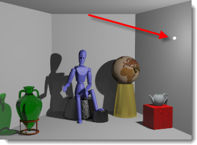

# {: .inline} {{page.title}}
Flamingo nXt 使用 Rhino 的燈光物件，但在燈光內容加入一些 Flamingo 的燈光設定。在場景加入燈光時必需考慮該燈光在真實世界的特性，選擇適合的燈光物件。

## 燈光頁面
{: #light-tab}
燈光頁面會列出場景裡的所有人造燈光，此主題說明的是 Flamingo 的燈光頁面。Rhino 另外有一個[燈光面板](http://docs.mcneel.com/rhino/5/help/en-us/index.htm#commands/lights.htm)，兩者的燈光設定會同步，但 Flamingo 的燈光頁面有較多的[燈光內容](#light-properties)可設定。

[照明預設組](lighting-tab.html#lighting-presets)中只有**攝影棚照明**、**人工照明**、**自訂**有 Flamingo 的燈光頁面。

<!-- #### Is this supposed to be a code? It's showing up as ####. To fix this, there needs to be a new line above the headline for the markdown to work.-->

#### 可以在哪找到 Flamingo 的燈光設定? 
使用有燈光的[照明預設組](lighting-tab.html#lighting-presets)，或[自訂照明](lighting-tab.html#sun)有開啟燈光時，可以在這些位置找到燈光頁面：

 1. {: .inline} 工具列 > {: .inline} Flamingo nXt 工具列
 1. {: .inline} 功能表 > Flamingo nXt 5.0 > 顯示控制面板 > Flamingo 面板 > 燈光

燈光頁面可在模型裡加入燈光、將燈光開啟/關閉、變更燈光的強度與通道。

Flamingo 支援的燈光類型：

* [將物件標記為燈光](#tag-objects-as-lights)
* [聚光燈](#spotlight)
* [點光源](#pointlight)
* [矩形燈光](#rectangularlight)
* [管狀燈](#linearlight)

**附註：**Flamingo nXt 不支援 Rhino 的平行光 {: .inline}，平行光對 Flamingo nXt 彩現的場景沒有照明功能，所以在 Flamingo nXt 控制面板的燈光頁面沒有平行光可選擇。

燈光物件內容的部分設定可以在燈光頁面找到，方便編輯燈光的常用內容。

燈光頁面的燈光內容有：

* [開啟/關閉](#on)
* [名稱](#name)
* [照明方式](#light-distribution)
* [方向](#aim-light)
* [瓦特](#watts)
* [通道](#channel)

在燈光頁面的燈光項目上按滑鼠右鍵有[更多設定](#additional-options)可編輯。

選取燈光物件，按物件[內容面板](http://docs.mcneel.com/rhino/5/help/en-us/commands/properties.htm)的燈光按鈕 {: .inline} 可編輯[燈光內容](#light-properties)。

## 燈光類型
{: #light-types}
燈光可從 Rhino 的工具列按鈕或 Flamingo 的燈光頁面加入模型，Flamingo 可將物件標記為燈光。

#### {: .inline} 將物件標記為燈光
{: #tag-objects-as-lights}
可彩現的物件 (曲面、實體...) 可標記為燈光產生照明效果，標記為燈光的物件會有燈光內容可編輯，並可設定照明[方式](#light-distribution)、[方向](#aim-light)與[亮度](#watts)。

*以物件標記為燈光 LED 晝行燈與大燈*

#### {: .inline} 聚光燈
{: #spotlight}
聚光燈是朝著單一方向照射的圓錐狀燈光，它的燈光內容有[光源半徑](#radius)、[投射角度](#beam-angle)、衰減角度與方向。光源半徑越大，投射的陰影邊緣越模糊。聚光燈預設在光源點的位置有一個可見的小圓盤，如何以燈光的點調整燈光的位置、方向、投射角度請參考 [Rhino 的聚光燈](http://docs.mcneel.com/rhino/5/help/en-us/commands/spotlight.htm)說明主題。

*朝向紅色立方體的聚光燈。*

#### {: .inline} 點光源
{: #pointlight}
點光源是往所有方向平均照射的球形燈光，它的燈光內容有[光源半徑](#radius)，光源半徑越大，投射的陰影邊緣越模糊。請注意，當有物件與點光原交集時可能產生奇怪的照明問題。

*牆壁附近的點光源*

#### {: .inline} 矩形燈光
{: #rectangularlight}
矩形燈光是一個矩形的燈光面板，矩形燈光上有一個箭頭指示照射的方向，矩形燈光預設是彩現裡可見的燈光物件。將矩形燈光設置在天花板時，請讓矩形燈光低於天花板一個小距離，否則會產生照明的問題。如何以燈光的點調整燈光的位置、方向、投射角度請參考 [Rhino 的矩形燈光](http://docs.mcneel.com/rhino/5/help/en-us/commands/rectangularlight.htm)說明主題。

*天花板下的矩形燈光*

#### {: .inline} 管狀燈
{: #linearlight}
管狀燈是像日光燈一樣的圓柱形燈光，它的燈光內容有[光源半徑](#radius)與長度，光源半徑越大，投射的陰影邊緣越模糊。管狀燈預設是彩現裡可見的燈光物件，當有物件與管狀燈交集時可能產生奇怪的照明問題。開啟它的控制點可調整長度與方向。

## 燈光內容
{: #light-properties}
當 Flamingo 是目前的彩現器時，燈光物件會有額外屬於 Flamingo 的內容設定。

#### 名稱
{: #name}
燈光物件的名稱，為燈光命名有助於辨別模型裡的燈光。

#### {: .inline} 開啟/關閉
{: #on}
將燈光開啟或關閉，燈光頁面的燈泡圖示為黃色代表燈光開啟，灰色代表關閉，雙擊燈泡圖示可開啟或關閉燈光，在燈光的物件內容裡有一個開啟/關閉的核取方塊具有相同功能。

#### 可見
{: #visible}
設定彩現影像裡是否可看見燈光的形狀，取消勾選時彩現影像裡看燈光為不可見，但對場景仍然有照明作用。

#### 照明方式 *([只適用標記為燈光的物件](#tag-objects-as-lights))*
{: #light-distribution}
標記為燈光的物件可設定燈光的投影方式，在燈光頁面雙擊**照明方式**欄位，可選擇[所有方向](#pointlight)、[聚光](#spotlight)、[漫射](#rectangularlight)，聚光與漫射可指定[照射方向](#aim-light)。 

#### 設定方向與投射角度 *([只適用標記為燈光的物件](#tag-objects-as-lights))*
{: #aim-light}
標記為燈光的物件的照明方式為**聚光**與**漫射**時，雙擊**設定方向 >>**可指燈光的照射方向。

#### 瓦特
{: #watts}
設定燈光的亮度 (消耗的電力)，建議使用真實世界的瓦數，雙擊瓦特欄位可修改數值。

#### 投射角度 *([只適用聚光燈](lights-tab.html#spotlight))*
{: #beam-angle}
聚光燈照射的廣度範圍，也可經由調整控制點修改，調整燈光控制點請參考 [Rhino 的聚光燈](http://docs.mcneel.com/rhino/5/help/en-us/commands/spotlight.htm)說明主題。

#### 半徑
{: #radius}
設定燈光的大小，越小的燈光投射出的物件的陰影的邊緣越銳利。

#### 顏色
{: #color}
燈光的照明顏色。

#### 使用材質顏色 *([只適用標記為燈光的物件](#tag-objects-as-lights))*
以物件材質的顏色做為燈光的顏色。

#### 通道
{: #channel}
燈光有八個通道可以使用，可在彩現影像直接調整每個通道燈光的亮度，需要改變燈光亮度時不必重新彩現，詳細說明請參考[彩現通道](render-channel.html)說明主題。

#### IES 檔案
{: #iesfile}
IES (Illuminating Engineering Society) 是一種"測光"檔案，用來定義燈光散發的光線，燈具製造業者會使用 IES 檔案對光源做精確的描述。燈光如何散發光線由測光檔案定義，與標記為燈光的物件的幾何圖形無關。

附註：

* Flamingo nXt 支援 Type C 的測光檔案，大部分的 IES 檔案都是屬於 Type C 格式。汽車工業在設計汽車大燈時是使用 Type A 格式，泛光照明燈具的設計是使用 Type B 格式，Flamingo nXt 不支援這兩種格式。
* IES 可模擬羽板、反射板、柔光燈罩...等等各種燈具的照明效果。
* IES 的照明效果常常是不對稱的，所以調整照明時除了調整目標點的位置以外，可能也要對燈光做旋轉。

#### 使用檔案的亮度設定
使用儲存在 IES 檔案裡的亮度設定，未勾選此選項時是使用燈光物件的[瓦特](lights-tab.html#watts)設定。

## 右鍵功能表
{: #additional-options}
在燈光頁面的燈光項目上按滑鼠右鍵彈出的功能表有一些選項可使用。

####  開啟
[開啟/關閉](#on)燈光的照明功能。

#### 刪除
刪除選取的燈光。

#### 移除燈光標記
移除將物件當做燈光的[標記](#tag-objects-as-lights)。

#### 內容
開啟編輯[燈光內容](#light-properties)的對話框。

#### 以物件選取清單中的項目
在作業視窗裡選取燈光物件，用以選取清單中對應的項目。
