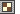

# {: .inline} {{page.title}}
材質有顏色、反射、透明、貼圖、凹凸... 許多設定，預設的材質顏色是白色，光澤度、反射度、透明度皆為 0。以 Flamingo 彩現搭配 Flamingo 材質可得到最好的效果。

材質可賦予給圖層、物件、圖塊引例，材質可用拖放至物件或圖層的方式賦予，詳細說明請參考[賦予材質](material_assignment.html)說明主題。

[彩現選項](http://docs.mcneel.com/rhino/5/help/zh-tw/index.htm#options/rendering.htm)的**將支援的檔案儲存在 3dm 檔案裡**啟用時，材質賦予給物件或圖層後，材質與它使用的圖片會儲存在模型檔案裡。

材質、環境、貼圖的設定都儲存在模型檔案裡，也可以匯出至檔案再匯入其它模型、從 Rhino 裡拖放至外部的資料夾，或是在兩個 Rhino 視窗之間拖放，顏色方塊的顏色也可以如此操作。[材質庫面板](libraries.html)顯示的是預設的材質庫資料夾，這裡的檔案可以拖放到作業視窗裡的物件，材質、環境、貼圖也可以拖放至這裡。

{:  #panel_map .float-img-right}

##### 可以在哪找到這個指令?
材質面板可從三個地方開啟。

* {: .inline} 材質面板
* {: .inline} 彩現工具工具列 > {: .inline} 材質編輯器
* 功能表 > 彩現 > 材質編輯器
* 從指令行執行 MaterialEditor 指令

材質的簡易編輯器的選項因材質的類型而異，切換到進階編輯器可使用所有的選項。

材質編輯器、[貼圖面板](texturepalette.html)、[環境編輯器](environmenteditor.html)的任何顏色方塊與貼圖都可以相互拖放。

##### 材質面板

 1. [設定列](#settings)
 1. [材質清單](#material_list)
 1. [視窗分隔條](#divider)
 1. [材質內容](#properties)
 1. [名稱](#name)
 1. [材質內容面板](#panels)

## [設定列](#panel_map) {: .inline}
{: #settings .clear-img}
可用來瀏覽材質裡的設定。

#### {: .inline} 向後按鈕
材質可能有許多層的設定頁面，**向後**按鈕可回到上一個使用的頁面，例如：在材質 A 的貼圖頁面選取材質 B，按**向後**按鈕可回到材質 A 的貼圖頁面。

####  {: .inline} 向前按鈕
材質可能有許多層的設定頁面，**向前**按鈕可回到下一個使用的頁面，例如：在材質 A 的貼圖頁面選取材質 B，按**向後**按鈕回到材質 A 的貼圖頁面，按**向前**按鈕可再回到材質 B。

#### {: .inline} {: .inline} 目前選取的材質的名稱
顯示目前選取的材質的名稱與所在的設定頁面。

#### {: .inline} 工具功能表
顯示[工具功能表](#tools-menu)，工具功能表有與材質相關的許多指令與設定。

## [材質清單](#panel_map) {: .inline}
{: #material_list}
列出模型使用的所有材質，這裡可以：

* 上下捲動檢視所有的材質。
* 將材質拖放至[圖層面板](http://docs.mcneel.com/rhino/5/help/zh-tw/index.htm#commands/layer.htm)裡的圖層，或直接拖放至物件賦予材質，詳細說明請參考[賦予材質](material_assignment.html)說明主題。
* 按材質清單末端的**新增**按鈕 {: .inline} 可建立新材質。

* 選取的材質的內容會顯示在下方的面板，詳細說明請參考[材質內容](#properties)主題。
* 在材質縮圖上按右鍵可彈出**材質功能表**。
* 在空白的位置按右鍵可彈出**新材質功能表**。

###  {: .inline} 建立新材質
{: #add_material}
按材質清單末端的**新增**按鈕。

從材質類型範本或模型裡已存在的材質建立新材質。
內建的材質類型範本可做為目前的模型建立新材質的範本。

### 材質功能表
{: material_context}
在一個材質上按右鍵可彈出此功能表，此功能表提供的功能請參考[工具功能表](#tools_menu)。

### 新材質功能表
{: new_material_context}
在材質清單空白的位置按右鍵可彈出此功能表。

#### {: .inline} 建立新材質
建立一個基本的平光白色材質。

#### {: .inline} 貼上
將複製到剪貼簿的材質貼上建立另一個材質。

#### {: .inline} 貼上為引例
將複製到剪貼簿的材質貼上建立另一個材質，此材質的設定與來源材質互相連結。

#### {: .inline} 圖示
以預覽縮圖顯示。

#### {: .inline} 清單
以有名稱的預覽縮圖顯示。

#### {: .inline} 樹狀清單
以樹狀的名稱清單顯示。

#### {: .inline} 水平配置
將預覽縮圖或清單顯示在編輯器的左邊。

#### {: .inline} 顯示預覽面板
顯示目前所在的項目的預覽縮圖。

#### {: .inline} 浮動
以可改變大小的浮動小視窗顯示預覽縮圖。

#### 縮圖

##### {: .inline} 小
將預覽縮圖設為小圖示。

##### {: .inline} 中
將預覽縮圖設為中圖示。

##### {: .inline} 大
將預覽縮圖設為大圖示。

##### {: .inline} 顯示名稱
當編輯器設為以**圖示**模式檢視時顯示名稱標籤。
以**清單**模式檢視時總是會顯示名稱標籤。

##### {: .inline} 顯示單位
以模型單位顯示尺寸。

##### {: .inline} 自動更新縮圖
設定變更時自動更新所有的縮圖。

##### {: .inline} 更新所有縮圖
**自動更新縮圖**停用時可手動更新所有縮圖。

## [視窗分隔條](#panel_map) {: .inline}
{: #divider}
移動視窗分隔條可調整材質清單可同時顯示的材質數目。

## [材質內容](#panel_map) {: .inline}
{: #properties}

#### [材質名稱](#panel_map) {: .inline}
{: #name}
此為材質的名稱，也是材質匯出時的檔案名稱。材質是儲存在 Rhino 模型裡，不同模型裡相同名稱的材質不會相互影響。

#### [材質面板](material-editor.html#panel_map) {: .inline}
{: #panels}
材質內容有許多個面板，按面板的標題列可將面板收摺或展開。

材質面板顯示的設定因材質類型而異，詳細說明請參考 [Flamingo 材質](material-type-simple.html)主題。

## 工具功能表 {: .inline}
{: #tools-menu}
<!-- This comes from the page http://docs.mcneel.com/rhino/5/help/zh-tw/popup_moreinformation/materialthumbnail_contextmenu.htm -->
工具功能表裡的項目也可以在預覽縮圖與縮圖面板空白處的右鍵功能表裡找到。

#### {: .inline} 賦予給選取的物件
將選取的材質賦予給選取的物件。

##### 將材質賦予給物件
 1. 選擇**賦予給選取的物件**。
 1. 在 Rhino 的作業視窗選取目標物件 。

##### 預選物件
 1. 在 Rhino 的作業視窗選取目標物件 。
 1. 選擇**賦予給選取的物件**。
賦予材質的目標物件可預選或候選。

##### 拖放材質至物件
 * 將材質的預覽縮圖拖放至目標物件。
拖放的方式一次只能賦予一個物件材質。

#### {: .inline} 賦予給圖層
將選取的材質賦予給選取的圖層。

##### 賦予材質給圖層
 1. 選擇**賦予給圖層**。
 1. 在**選擇圖層**對話框勾選要賦予材質的圖層。

##### 從圖層面板賦予材質
 1. 在[圖層](http://docs.mcneel.com/rhino/5/help/zh-tw/index.htm#commands/layer.htm)面板選取一個或數個圖層，按[材質](http://docs.mcneel.com/rhino/5/help/zh-tw/commands/layer.htm#Material)欄。
 1. 在**圖層材質**對話框選擇一個材質。

##### 拖放材質至圖層
 * 將材質的預覽縮圖拖放至目標圖層。
拖放的方式一次只能賦予一個圖層材質。

#### {: .inline} 選取物件
選取模型中使用選取的材質的物件。

#### {: .inline} 建立新材質
從材質類型範本或模型裡已存在的材質建立新材質。
內建的材質類型範本可做為目前的模型建立新材質的範本。

#### {: .inline} 從檔案匯入材質
從 Flamingo 的材質檔案 .ArMaterial 匯入材質。

#### {: .inline} 儲存至檔案
將材質儲存為 Flamingo 的材質檔案 .ArMaterial。

#### {: .inline} 變更類型
將材質變更為其它的類型。

#### {: .inline} 變更類型 (複製類似的設定)
將材質變更為其它的類型。
預設的作業方式由 [Rhino 選項 &gt; 彩現](http://docs.mcneel.com/rhino/5/help/zh-tw/index.htm#popup_moreinformation/materialpanel_toolsmenu.htm)頁面的[當彩現內容類型變更時複製類似的設定](http://docs.mcneel.com/rhino/5/help/zh-tw/index.htm#popup_moreinformation/materialpanel_toolsmenu.htm)選項決定。當這個選項開啟時，從一種類型變更至另一種類型時會套用相容的設定。

#### {: .inline} 重設為預設值
將所有設定回復為預設值。

#### {: .inline} 複製
將選取的材質複製到 Windows 剪貼簿，可以在編輯器裡貼上建立另一個材質，或是在 Rhino 外部貼上，將材質匯出為 .rmtl 檔案。

#### {: .inline} 貼上
將複製到剪貼簿的材質貼上建立另一個材質。

#### {: .inline} 貼上為引例
將複製到剪貼簿的材質貼上建立另一個材質，此材質的設定與來源材質互相連結。

#### {: .inline} 刪除
刪除選取的材質。

#### {: .inline} 重新命名...
重新命名選取的材質。

#### {: .inline} 建立複本
以選取的材質建立一個設定相同的複本。

#### {: .inline} 移除引例
解除材質引例與來源材質之間的連結關係。


#### {: .inline} 彩現內容過濾器
開啟[彩現內容過濾器](content_filters.html)視窗。

#### {: .inline} 內容
開啟[預覽設定](http://docs.mcneel.com/rhino/5/help/zh-tw/index.htm#popup_moreinformation/materialpanel_toolsmenu.htm)對話框。
