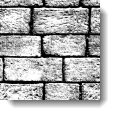
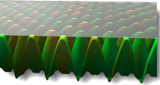

# {: .inline} {{page.title}}

材質使用的貼圖可從照片或真實的材質 (例如：壁紙或氈子) 掃描得到，也可以是繪圖軟體建立的圖片或其它各種來源的圖片。

材質可以在空間中的四個方向重複出現無限延伸 (拼貼)，但只有一部分會出現在物件上。

細碎紋路的圖片通常比較可以拼貼排列而沒有明顯的接縫，如果圖片拼貼有明顯的接縫使紋路看起來不連續，可以使用**鏡射拼貼**選項。

**附註：**如果您不想讓圖片在物件上重複出現 (例如：酒瓶瓶身上的標籤或某個產品上的商標)，請改用[印花](properties-decal.html)功能來做這樣的貼圖。

圖片貼圖有許多用法，常見的用法是以真實世界的材質的照片做為材質的顏色貼圖。

## 名稱
圖片貼圖可加以命名，貼圖的名稱是供 RDK 材質庫使用，對 Flamingo 無實際影響。

## Flamingo 圖片

### 圖片預覽
{: #image-preview}
預覽選取的圖片檔案，將滑鼠游標停留在預覽圖片上可顯示圖片檔案的路徑，按預覽圖片可替換圖片檔案。

#### 圖片解析度
{: #image-resolution}
圖片檔案的像素長寬。

### 拼貼
{: #tiles}
材質使用的貼圖一定會重複拼貼，這裡的設定是指拼貼中的一個單位的尺寸 (模型單位)。

#### 寬度/高度
{: #width-height}
以模型單位設定拼貼單元的大小。




### 貼圖類型
{: #mapping-type}
圖片通常用在顏色通道，但也有其它使用方法，貼圖類型有：

* [標準](#standard)
* [法線向量](#normal)
* [置換](#displacement)

### 標準
{: standard}
此類型的貼圖可做為材質的顏色與產生視覺上的凹凸效果。

#### 顏色強度
{: #color}
設定貼圖的透明度，以這個例子而言，材質的底色是洋紅色，顏色的數值越高，材質的底色透出貼圖的量就越少，數值為 1.0 時，底色完全被貼圖遮蓋。

顏色強度 0.2、0.5、1.0。

#### 凹凸強度
{: #bump}
以貼圖顏色的灰階值在物件上產生視覺上的凹凸效果，使用負值可將凹與凸對調。下圖左邊的球體是使用置換貼圖，因為物件表面真的變形，所以它的陰影邊緣也變的不平滑。右邊的球體是使用凹凸效果，物件並未真的變形，所以它的陰影邊緣並沒有改變，還是非常平滑。請參考：[Wikipedia article: Bump mapping](http://en.wikipedia.org/wiki/Bump_mapping)。

置換貼圖 (左) 與凹凸貼圖 (右)。

### 法線向量
{: #normal}
法線向量貼圖可讓低網格面數的模型有高網格面數的細節。請參考：[Wikipedia article: Normal mapping](http://en.wikipedia.org/wiki/Normal_mapping)。

法線向量貼圖與凹凸貼圖類似，這兩種貼圖都是以改變彩現網格的法線方向增加物件的彩現細節。不同處在於：凹凸貼圖只使用圖片的灰階值，所以凹凸效果只有單一方向 (法線) 的變化；法線向量貼圖是以 RGB 代表 XYZ 三個方向，比起凹凸貼圖更能表現物件形狀變化的豐富細節。

### 置換
{: #displacement}
細分物件網格，對物件網格做真實的凹凸變形，不像凹凸貼圖只是視覺上的效果。請參考：[Wikipedia article: Displacement mapping](http://en.wikipedia.org/wiki/Displacement_mapping)。

 **附註：**置換貼圖會使彩現網格的數目以倍數增加，請小心使用，以免造成記憶體不足。

#### 高度
{: #height}
變形距離的最大限制。

#### 法線向量偏移
{: #offset}
設定置換網格的偏移的百分比，讓置換網格可以完全在原來的曲面之外、之內，或部分在內、部分在外。

Z 偏移 = -1.0

Z 偏移 = -0.5

Z 偏移 = 0.0

#### 細分面大小
{: #facet-size}
置換網格面的大小，越小置換效果越細緻，但彩現時間會拉長，記憶體使用量也會增加。

## Flamingo 貼圖 (進階)
{: #advanced}
Flamingo 通常是將貼圖做為材質的顏色，這裡可將貼圖用於其它表面效果。

####  主要顏色
此為預設值，以貼圖做為材質的[顏色](material-type-advanced.html#color)。

####  反光顏色
此選項會影響[反射通道](material-type-advanced.html#highlight-color)的顏色，以貼圖的顏色控制反光的顏色。

####  反光強度
以貼圖像素的灰階值控制[反光強度](material-type-advanced.html#intensity)，常用於貼圖組材質**反光**貼圖。

####  反光銳利度
以貼圖的灰階值控制[反光](material-type-advanced.html#intensity)的銳例與模糊。

#### 反光形狀
{: #advanced-highlight-shape}
影響反光的形狀。

####  透明
以貼圖的灰階值控制材質的[透明度](material-type-advanced.html#intensity)。

####  混濁
以貼圖的灰階值控制材質的[混濁度](material-type-advanced.html#translucency)。

####  衰減
以貼圖的灰階值控制材質[衰減](material-type-advanced.html#attenuation)的量。

#### 偏移 X/Y
{: #advanced-x-y-offset}
在 X 與 Y 軸上偏移材質。

####  旋轉
將貼圖旋轉某個角度，調整貼圖顯示在物件上的方向。
