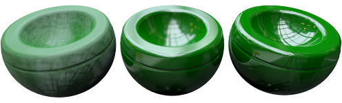
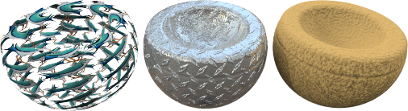

# {: .inline} {{page.title}}

Flamingo 的材質內容有[簡易編輯器](material-type-simple.html)與進階編輯器，簡易編輯器裡的設定因材質類型而異，進階編輯器裡有材質的所有設定，且不因材質類型而異。

材質的進階設定群組有：

* [名稱](#name)
* [材質程序](#procedures)
* [進階材質](#advanced-materials-properties)
* [反射度](#reflective-finish-and-highlight)
* [透明度](#transparency)
* [程序貼圖](#bump-patterns)
* [圖片貼圖](#textures)
* [附註](#notes)

## 材質名稱
{: #name}
此為 Rhino 模型裡的材質名稱，材質可儲存在 Rhino 模型檔案裡。編輯目前模型的材質不會影響材質庫與其它模型裡的材質。要在其它模型使用目前模型的材質時，必需先將材質儲存到[材質庫](libraries.html)，材質的名稱即儲存的材質檔案的名稱。

## 材質程序
{: #procedures}
材質程序可用不同的方式混合數個材質，讓材質有更多變化，您可以在一個材質程序的樹狀分支加入其它材質，標準材質在此通常只有一個底色元件。

每一種材質程序都有兩個元件 (子材質)，一個元件可以再由另一個材質程序的兩個元件組成，Flamingo nXt 的材質程序有：[角度混合](procedural-materials.html#angular-blend)、[混合](procedural-materials.html#blend)、[花崗岩](procedural-materials.html#granite)、[大理石](procedural-materials.html#marble)、[拼貼](procedural-materials.html#tile)、[木紋](procedural-materials.html#wood)。

例如，[大理石](procedural-materials.html#marble)程序是由**底色**與**脈絡**兩個材質組成。

##### 加入程序

1. 在程序面板的**底色**上按右鍵。
1. 在彈出的清單選擇一種程序類型。

  * [底色](procedural-materials.html#base)
  * [角度混合](procedural-materials.html#angular-blend)
  * [混合](procedural-materials.html#blend)
  * [花崗岩](procedural-materials.html#granite)
  * [大理石](procedural-materials.html#marble)
  * [拼貼](procedural-materials.html#tile)
  * [木紋](procedural-materials.html#wood)

##### 移除程序

1. 在程序面板的程序名稱上按滑鼠右鍵。
1. 在彈出的功能表選擇移除。

## 進階材質
{: #advanced-materials-properties}



#### 反射與反光
{: #reflective-finish-and-highlight}
這裡的設定可以改變材質反射光源與物件的特性，反光是材質反射光源的亮點，反射是材質上其它物件的反射影像。金屬與反射材質需要反射場景中的其它物件才會有較好的彩現效果，設定反射材質時請將環境與場景裡的其它物件加入考量。
 **附註：**這些設定要在強度值大於 0 時才能使用。

#### 反光顏色
{: #highlight-color}
反光顏色是在材質反射時加入的顏色，反光顏色的設定有**白色**、**金屬**、**自訂**三種。

#### 白色
塑膠類材質的反光通常是白色的。

#### 金屬
{: #metallic}
將材質的反光顏色設為與材質顏色相同，

#### 自訂
某些特殊材質的反光可能與材質的顏色不同，請從[選取顏色](select-color.html) {: .inline} 對話框選擇反光的顏色。

#### 強度
{: #intensity}
用來調整反光的強度，數值越高使材質越能清晰反射週遭的物件與環境。

#### Fresnel
{: #fresnel}
Fresnel 的發音近似 (fray-NELL)，它是以[菲涅耳原理](http://en.wikipedia.org/wiki/Fresnel_equations)控制物件表面的反射特性，它將物件表面的法線方向加入反射度的計算。例如彩現一個表面光滑、低反射度的球體時，球體正對視圖的部分反射度較低，球體輪廓附近的部分因為法線偏離視圖方向，會產生類似鏡面的高反射效果。

軟性的材質可以將這個數值調低，光滑的材質可以將這個數值調高，因為光滑的材質 (例如：打磨過的木頭) 會有比較明顯的菲涅耳原理的現象。

#### 銳利度
{: #sharpness}
設定物件表面反光的大小，數值越小，反光越大、越模糊，數值越大，反光越小、越銳利。

#### 型式
{: #type}
設定人造光源如何反射在物件表面上，反射的計算使用兩種方式：**光線投射**與**反光**，這兩種方式最終得到的結果很類似，但某些情形下其中一種方式可能可以比較快得到好的效果。物件也可能因為光源的反射太強烈而遮蓋了材質的外觀，影響物件的彩現效果。

下方是使用**平衡**型式的例子，最左邊的物件因為大片的反光掩蓋了材質紋路。

某些光源較小的室內場景在彩現時會有光斑的問題，光斑通常出現在具模糊反射的材質上，將型式設為[模糊](advanced-material-properties-main.html#glossy)、[沒有光源反射](advanced-material-properties-main.html#no-light-source-reflection)或[蒙地卡羅](advanced-material-properties-main.html#monte-carlo)可排除這類的問題。

#### 平衡
{: #balanced}
因**銳利度**的設定而異，自動在反光與光源反射之間取得平衡。

#### 模糊
{: #glossy}
使反光更模糊，並關閉對人造光源與其它物件的反射計算，彩現速度會因此大幅提升，但也會降低彩現的真實感。

#### 蒙地卡羅
{: #monte-carlo}
只使用光線投射法計算光源的反射，彩現一開始時光源的反射會是許多雜點，隨著時間的經過反射效果會逐漸變均勻，這個型式比較適用於光源反射不模糊的形情。

#### 沒有反光
{: #no-highlight}
關閉反光，只計算對人造光源與其它物件的反射。此設定可用在光源面積很大與材質反射不模糊的情形，因為這些情形會讓反光的計算變得很慢。

#### 沒有光源反射或反光
{: #no-light-source-reflection-and-no-highlight}
關閉對人造光源的反射與反光的計算，但仍然計算對其它物件的反射。

#### 沒有光源反射
{: #no-light-source-reflection}
不以光線投射法計算光源的反射，只計算反光，此設定可避免場景有模糊材質與高亮度小光源時可能產生光斑的問題。

## 透明度
{: #transparency}
這些設定可控制光線穿過透明材質的特性。

#### 透明強度
變更材質透明度的高低，透明材質會增加彩現時間。

#### 折射率
{: #index-of-refraction}
設定光線進入透明材質時的轉折角度。

以下是一些透明材質的折射率：

 | 材質      |     | 折射率         |
 |:--------------|:---:|:------------|
 | 真空        |     | 1.0         |
 | 空氣           |     | 1.0029      |
 | 冰           |     | 1.309       |
 | 水         |     | 1.33        |
 | 玻璃         |     | 1.52 to 1.8 |
 | 翡翠       |     | 1.57        |
 | 紅寶石/藍寶石 |     | 1.77        |
 | 鑽石       |     | 2.417       |
{: .grided-table}

#### 混濁度
{: #translucency}
當光線穿過混濁的透明材質時，某些光線會被反射、被吸收或在材質裡產生漫射的情形，使物件看起來呈半透明狀，對此數值做微小的調整就可能造成很大的效果差異。

#### 散射
{: #scattering}
設定光線通過每個單位距離遇到的粒子，此效果必需使用[路徑追蹤](render-tab.html#path-tracer)彩現引擎。

材質內部散射讓光線穿過物件的過程往所有方向擴散，半透光材質 (玉石、蠟蠋、人體皮膚...) 可使用此效果，讓光線進入物件內一小段距離可提高真實感。

一個材質必需有些許的透明度，使用這個材質的物件也必需是封閉的才能產生這種材質內部散射的效果。

#### 衰減
{: #attenuation}
設定光線穿過透明物件時被物件吸收的量，清徹的液體衰減量比較低，濃稠的液體衰減量比較高。

#### 色散
{: #dispersion}
控制白色光線通過透明材質時分離出不同顏色光譜的特性。

#### 飽和度
{: #saturation}
設定色散的量。

#### 模糊透明
{: #blurry-transparency}
當材質不完全透明時，使透過該材質看到的影像有些模糊，用以增加真實感。

#### 模糊度
控制模糊的量。

#### 發光
{: #glow}
產生發光的效果。

## 貼圖
{: #textures}
貼圖有圖片貼圖與凹凸圖案兩種，圖片貼圖可使用照片或掃描得到的圖片，凹凸圖案是由 Flamgino 產生的隨機或重複的紋理圖案。

### 圖片
{: #images}
一個材質最多可加入四張圖片，用以增加材質的細節。加入的圖片可以是平面繪圖軟體製作的圖片、照片或掃描得到的圖片。常見的用法是以真實世界材質的照片做為材質的顏色貼圖。這四張圖片可分別控制材質的不同部分，例如：以一張圖片做為**顏色**貼圖，另一張圖片做為**凹凸**貼圖。圖片如何影響材質請參考[圖片內容](material-image-properties.html)主題。



### 凹凸圖案
{: #bump-patterns}
凹凸圖案內建了幾種以數學運算產生的特殊凹凸效果，不需使用置換貼圖或其它圖片就可以快速製造材質上的凹凸紋路，凹凸圖案有：

* [砂紙](#sandpaper)
* [碎石](#rubble)
* [金字塔](#pyramid)
* [皺紋](#wrinkled)
* [大理石紋](#marbled)

像是灰泥、混泥土、泥土表面的紋理非常細微，除非要做非常近距離的彩現以外，通常不值得用掃描或照像的方式製作這類材質的貼圖，只要選用砂紙凹凸圖案即可模擬這類的材質效果。製作這類材質的方法是先將[底色](advanced-material-properties-main.html#color)設為該材質的顏色，凹凸圖案使用砂紙做為細紋理，使用碎石做為粗紋理。

每種凹凸圖案都有不同的設定，一種凹凸圖案啟用後才可對它的選項做調整，並允許同時使用數種凹凸圖案。

#### 砂紙
{: #sandpaper}
產生不規則的細小顆粒紋理，它的設定有[縮放比](#scale)、[強度](#strength)、[旋轉](#rotation)角度。

[縮放比](#scale)與[強度](#strength)由小至大的效果。

#### 碎石
{: #rubble}
產生坑坑洞洞的凹凸紋理，將比例放大可以產生類似海面、沙洲波浪起伏的效果，[碎石](#scale)與[砂紙](#strength)相較是屬於比較大型的凹凸紋理。

[縮放比](#scale)與[強度](#strength)由小至大的效果。

#### 金字塔
{: #pyramid}
產生菱形的滾花凹凸紋理，[縮放比](#scale)只有 X 與 Y，可用來控制金字塔的大小，金字塔的高度由[強度](#strength)控制。

[縮放比](#scale)由小至大的效果。

#### 皺紋
{: #wrinkled}
產生類似皺紋的凹凸紋理，它的設定有[縮放比](#scale)、[強度](#strength)、[旋轉](#rotation)角度。

*[縮放比](#scale)由小至大，[強度](#strength)固定的效果。*

#### 大理石紋
{: #marbled}
產生類似大理石花紋的凹凸紋理，它的設定有[縮放比](#scale)、[強度](#strength)、[旋轉](#rotation)角度。

*[縮放比](#scale)由小至大，[強度](#strength)固定的效果。*

### 縮放比
{: #scale}
控制凹凸紋理的粗細。

#### X/Y/Z
可以分別設定每一個軸向的比例。

#### 鎖定
維持不同軸向之間的比例。

### 強度
{: #strength}
控制凹凸紋理的深淺。

### 旋轉
{: #rotation}
設定凹凸紋理的旋轉角度，通常只有在 X、Y、Z 軸向的比例不相等或是凹凸紋理有方向性時才會用到此設定。

