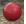
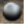

# {: .inline} {{page.title}}
Flamingo 的材質有許多類型，不同類型的材質有不同的簡易設定，讓您可以輕易編輯一個材質類型常用的選項，通常您只要變更材質的顏色即可。

#### 簡易材質類型：

> {: .inline} [純顏色](#solid-color)
> {: .inline} [塑膠](#plastic)
> {: .inline} [金屬](#metal)
> {: .inline} [玻璃](#glass)
> {: .inline} [模糊](#glossy)
> {: .inline} [亮光漆面](#clearfinish)
> {: .inline} [貼圖](#flamingo-textured)
> {: .inline} [貼圖組](#texture-set)

每種貼圖類型都有相同的進階材質設定，需要使用進階材質設定可以選擇建立 **Flamingo 進階**材質，或是在其它類型的材質裡切換到**進階編輯器**。

#### 材質的進階設定群組有：

> [名稱](material-type-advanced.html#name)
> [材質程序](material-type-advanced.html#procedures)
> [進階材質](material-type-advanced.html#advanced-materials-properties)
> [反射度](material-type-advanced.html#reflective-finish-and-highlight)
> [透明度](material-type-advanced.html#transparency)
> [程序貼圖](material-type-advanced.html#bump-patterns)
> [圖片貼圖](material-type-advanced.html#textures)
> [附註](material-type-advanced.html#notes)

材質是儲存在 Rhino 模型裡，不同模型裡相同名稱的材質不會相互影響。

## 純顏色
{: #solid-color}
純顏色材質只有[名稱](material-type-advanced.html#name)與[顏色](material-type-advanced.html#color)。





## 塑膠
{: #plastic}
塑膠是低反射度，[反光](material-type-advanced.html#highlight-color)為白色的材質。



 進階編輯器裡可以修改預設的[反光顏色](material-type-advanced.html#highlight-color)、[強度](material-type-advanced.html#intensity)、[Fresnel](material-type-advanced.html#fresnel) 與[銳利度](material-type-advanced.html#sharpness)。

## 金屬
{: #metal}
金屬材質的反光顏色與金屬的[顏色](material-type-advanced.html#color)一致，並可控制反射與反光[銳利度](material-type-advanced.html#sharpness)。



#### 銳利度
控制反射與反光的銳利與模糊，請參考[銳利度](material-type-advanced.html#sharpness)的說明。

 進階編輯器裡可以修改預設的[反光顏色](material-type-advanced.html#highlight-color)、[強度](material-type-advanced.html#intensity)、[Fresnel](material-type-advanced.html#fresnel) 與[型式](material-type-advanced.html#type)。

## 玻璃
{: #glass}
玻璃材質有[顏色](material-type-advanced.html#color)與[折射率](advanced-material-properties-main.html#index-of-refraction) (Index of Refraction, IOR) 設定。



#### 折射率
控制光線進入透明材質時的轉折特性，請參考[折射率](advanced-material-properties-main.html#index-of-refraction)的說明。

 進階編輯器裡可以修改預設的[反光顏色](material-type-advanced.html#highlight-color)、[強度](material-type-advanced.html#intensity)、[Fresnel](material-type-advanced.html#fresnel)、[銳利度](material-type-advanced.html#sharpness)與[透明度](material-type-advanced.html#transparency)。

## 模糊
{: #glossy}
模糊反射材質通常有較低的反光[強度](material-type-advanced.html#intensity)與[銳利度](material-type-advanced.html#sharpness)。



#### 強度
控制反射與反光的強度，請參考[強度](material-type-advanced.html#intensity)的說明。

#### 反光銳利度
控制反射與反光的銳利與模糊，請參考[銳利度](material-type-advanced.html#sharpness)的說明。

進階編輯器裡可修改預設的 [Fresnel](material-type-advanced.html#fresnel) 與[型式](material-type-advanced.html#type)。

## 亮光漆面
{: #clearfinish}
亮光漆面材質模擬汽車烤漆、瓷器、陶器、上了亮光漆的木頭或任何表面有透明塗層的物件，亮光漆面材質使用 [Fresnel](material-type-advanced.html#fresnel) 設定依據物件表面的法線方向與視圖方向的夾角改變材質的顏色，物件正對視圖的部分的材質顏色比較深，徧離視圖方向的部分的反射度會提高，汽車烤漆就是很好的例子。



 進階編輯器裡可以修改預設的[反光顏色](material-type-advanced.html#highlight-color)、[強度](material-type-advanced.html#intensity)、[Fresnel](material-type-advanced.html#fresnel) 與[銳利度](material-type-advanced.html#sharpness)。

## Flamingo 貼圖
{: #flamingo-textured}
貼圖材質以圖片取代材質的顏色，貼圖材質的簡易材質內容裡有使用的圖片的名稱與解析度資訊及調整拼貼、反光強度與銳利度的設定。



#### 強度
控制反射與反光的強度，請參考[強度](material-type-advanced.html#intensity)的說明。

#### 銳利度
控制反射與反光的銳利與模糊，請參考[銳利度](material-type-advanced.html#sharpness)的說明。

#### 圖片
設定材質使用的貼圖與內容，這裡有許多選項，請參[圖片](material-type-advanced.html#texture)的說明。


 進階編輯器裡可修改材質的許多預設值。

## 貼圖組
{: #texture-set}

貼圖組材質可含有許多張貼圖，以不同的貼圖分別控制材質的顏色、置換、法線向量、凹凸，建立效果逼真的材質，[PixPlant](http://www.pixplant.com/) 可將一般的圖片轉換為置換、法線向量、凹凸需要的圖片。


#### 寬度與高度
設定貼圖每一個拼貼單位的尺寸。

#### 強度
控制反射與反光的強度，請參考[強度](material-type-advanced.html#intensity)的說明。

#### 銳利度
控制反射與反光的銳利與模糊，請參考[銳利度](material-type-advanced.html#sharpness)的說明。

#### 型式
控制反射與反光的型式，請參考[型式](material-type-advanced.html#type)的說明。

### 貼圖
貼圖表可列出貼圖組使用的所有貼圖，在此按右鍵可新增貼圖、移除貼圖或改變貼圖的類型。

#### 新增貼圖...
新增圖片至貼圖表，允許一次選取數個圖片，最多可使用四個貼圖。

#### 移除貼圖
從貼圖表刪除貼圖。

#### 顏色
以圖片做為材質的顏色，詳細說明請見：[標準貼圖](material-image-properties.html#standard)。

#### 凹凸
以圖片像素的灰階值在模型表面模擬凹凸深淺的光影變化，詳細說明請參考：[凹凸貼圖](material-image-properties.html#bump)。

#### 法線向量
利用圖片像素的 RGB (紅、綠、藍) 值代表法線向量，藍色代表 Z 向量，因此法線向量貼圖的色調通常偏藍色, 詳細說明請參考：[法線向量貼圖](material-image-properties.html#normal)。

#### 反光
以圖片像素的灰階值控制材質反射的強度，詳細說明請參考：[反光貼圖](material-image-properties.html#transparency)。

#### 透明
以圖片像素的灰階值控制材質的透明度，詳細說明請參考：[透明貼圖](material-image-properties.html#normal)。

#### 置換
以圖片像素的灰階值控制彩現網格置換的高度，詳細說明請參考：[置換貼圖](material-image-properties.html#displacement)。

### 進階材質
Flamingo 材質的[進階編輯器](material-type-advanced)有材質的所有設定，如果內建的材質類型無法符合您的需要，可以選擇建立 [Flamingo 進階](material-type-advanced)材質，以便直接使用所有的設定。
